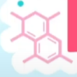

# ベンゼン環の文字コード: ⌬ (U+232C), ⏣ (U+23E3)

[ベンゼン環が髪についてる子](https://twitter.com/hakuikoyori)の Twitter 凍結※が解けた記念。

というわけではないんですけども、[C# 配信](https://www.youtube.com/channel/UCY-z_9mau6X-Vr4gk2aWtMQ)でたびたびネタにしてる Unicode のベンゼン環記号の話。

(※ 開始10分で Twitter 凍結。ものの数分で数万単位でフォロワーが増えるとか言う不自然な動きが何の不正もなく達成されてしまうのが大手企業勢 VTuber の恐ろしいところ…)

## ベンゼン環文字コード

なぜか Unicode にはベンゼン環に文字コードが割当たっています。

* ⌬ (U+232C)
* ⏣ (U+23E3)

なぜか。

マジで、「なぜか」。
しかも2文字あります。

うちの配信でなんでよく出てくるかと言うと、2点変な点があるからでして。

* そもそもなんで Unicode に入ってるのかわからない
* 2文字ある

## 文字なの？？

Unicode にはまあ、変な文字もそこそこたくさんあるんですが。
概ね、変なやつは「出どころが変」。
要するに過去にそういう文字を入れちゃった誰か(Shift_JIS が犯人である率高め)がいて、それとの互換性のために入っています。
分かりやすい例でいうと ♨ (U+2668、温泉マーク)とかですが、これは Shift_JIS の頃からある文字です。

ところが、ベンゼン環の ⌬ が入ったのは Unicode から。
なんなら、Unicode 1.1 からの追加(要するに最初からはいない)です。

本当に変なんですよね、これ。
Unicode に収録されるにあたって1つの基準になるのが、
「現実にある文献(の本文中)で使われている」というのがあります。
要するに電子化以前からあるあらゆる文字を電子的に表したいという目論見。
「本文中」と注釈してるのは、要するに「図表は除く」という意味。

そこで改めて ⌬ という記号について考えてみた時、
「本文中に書く？そりゃ図表として化学式には出てくるけども…」
ということになります。

本当になんで文字コードが割当たってるのかわからない…

Unicode 1.1 の頃のドキュメントってなかなかネットで見つからないので詳しくは僕も知らないんですが、どうも「科学のシンボル的に使うことがある」みたいな感じで入ったみたいです。

使う？図じゃなく文字として？…
絵文字が文字として普及した今となってはこれも文字かも？とは思わなくもないですが、Unicode 1.1 の頃に？
そりゃ ♨ よりはまともかもしれませんけど、わざわざ追加で？

(Unicode で増えた文字を Shift_JIS に逆輸入することがあったりもするんですが、上記のような背景からベンゼン環の ⌬ に関しては[徹底抵抗](http://hp.vector.co.jp/authors/VA000964/html/benzen.htm)があったらしく、無事、逆輸入は阻止されたそうです。)

## 2文字ある

さて、ちょこっと化学の話。

[ベンゼン](https://ja.wikipedia.org/wiki/%E3%83%99%E3%83%B3%E3%82%BC%E3%83%B3)は分子式 C6H6 で、炭素 C が六角形につながった有機化合物です。
この辺りは高校の授業とかでも出てくるので多くの方が知っているかと思います。

で、量子力学が発達して分子中の原子核や電子の配置が具体的に予測できるようになる以前、ベンゼンの C は「1重結合が3個、2重結合が3個で結びついている」と思われていました。それを表したのが ⌬ という記号。

その後、分子中の原子の配置が観測できるようになったり、
量子力学を使って電子軌道を計算できるようになると、
どうもベンゼン中の C は正六角形になっていて、1重・2重の結合の区別はないらしいということがわかってきます。
6個の C の間で6個の電子を共有しているようなモデルの方が正確とされていて、それを表現するのが ⏣ という記号を使うようになった背景。

よく言われるのが、「⌬ という記号は間違った理解を助長してしまうので使うべきではない」という話。
記号通りに ⌬ を解釈するのであれば、[シクロヘキサトリエン](https://ja.wikipedia.org/wiki/1,3,5-%E3%82%B7%E3%82%AF%E3%83%AD%E3%83%98%E3%82%AD%E3%82%B5%E3%83%88%E3%83%AA%E3%82%A8%E3%83%B3)というベンゼンとは違う化学物質になるんですが、ベンゼンと比べて著しく不安定なためもし作れたとしてもすぐに壊れると思われます。

## 文字追加

なぜか ⌬ という記号を追加してしまった Unicode ですが、その後当然こんな話が出ます、「⌬ は間違っている。⏣ に変更すべき。」と。

ところが、まあ、簡単に「変更」とはできなかったわけです。
[Unicode 5.0 の頃の提案](https://www.unicode.org/wg2/docs/n2874.pdf)によれば、

* ⏣ の方がモダンで、多くの人が ⏣ を使うようになっている
* ⏣ の方が実際の物理構造をよく表している
* ⌬ と ⏣ は同じ分子を表しているものの、意図的に使い分けられることがある(上記のシクロヘキサトリエンみたいな)
* したがって、[バリエーション](https://ja.wikipedia.org/wiki/%E7%95%B0%E4%BD%93%E5%AD%97%E3%82%BB%E3%83%AC%E3%82%AF%E3%82%BF)としてではなく、別の文字とすべき

はい。その結果、ベンゼン環が2文字になりました。
ただでさえ使われない文字に文字コード2つ目が発生。

実際どうなんですかね。
少なくとも僕は、僕みたいな人間がネタにするか、批判するか以外の場所でこの文字を見たことがないんですが…

Windows でも Android でも iOS でも IME にこの記号出てきませんし。
ちなみにこのブログはググって出て来た文字をコピペで書いています。
「232c」って打って F5 キーを押すことで変換はできるんですが(Windows 10 以降、文字コードから文字を出せる)、それもしてません。コピペです。

## 意匠としてのベンゼン

ちなみにおまけ。
冒頭で[博衣こより](https://twitter.com/hakuikoyori)さんをネタにしてしまった手前。

こよりさんの配信背景中に以下のようなロゴがあったり。

「あー、確かに、意匠としては2重結合の方が可愛いもんなぁ」、
「⏣ だとナットか何かに見えるもんなぁ」という気持ちに。

ちなみにこのロゴ、よく見るとシクロヘキサトリエンとしても2重結合の位置がおかしくて、これだと「1つの C に対して結合の腕が5本ある」ということでちょっとだけネットがざわついたみたいです。

いや、まあ、そこはデザインだから…
