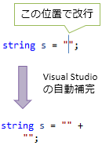
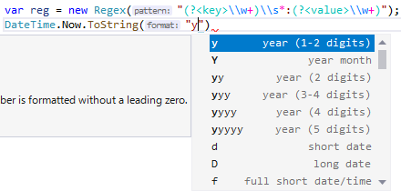

# ピックアップRoslyn: raw string literal

ブログで取り上げたい C# Language Design Meeting 議事録が1か月分くらいたまっているわけですが:

[1/27](https://github.com/dotnet/csharplang/blob/master/meetings/2021/LDM-2021-01-27.md)、[2/3](https://github.com/dotnet/csharplang/blob/master/meetings/2021/LDM-2021-02-03.md)、[2/8](https://github.com/dotnet/csharplang/blob/master/meetings/2021/LDM-2021-02-08.md)、[2/10](https://github.com/dotnet/csharplang/blob/master/meetings/2021/LDM-2021-02-10.md)、[2/22](https://github.com/dotnet/csharplang/blob/master/meetings/2021/LDM-2021-02-22.md)

しばらく、機能ごとに1個1個取り上げていこうかなという感じになっていまして、今日は raw string literal の話から。

## 概要

以下のような書き方で、複数行、かつ、一切のエスケープなしの文字列リテラルを導入したいという話が出ています。

<pre class="source" title="raw string literal">
<code>string xml = &quot;&quot;&quot;
    &lt;a&gt;
        &lt;b c=&quot;abc&quot; /&gt;
    &lt;/a&gt;
    &quot;&quot;&quot;;
 
string json = &quot;&quot;&quot;
    {
        &quot;a&quot; : {
            &quot;b&quot; : {
                &quot;c&quot; : &quot;abc&quot;
            }
        }
    }&quot;&quot;&quot;;
</code></pre>

C# の文字列中に XML、Json/JavaScript とか、さらに言うと C# 自身を書きたいことが多々あって、
結構昔から要望はありました。

近い機能として、C# には 1.0 の頃から [`@""`](../../../../study/csharp/start/st_embeddedtype.md#verbatim-string) という書き方があったりしますし、Visual Studio などの IDE が自動補完で補ってくれたりはしていました。

<pre class="source" title="逐語的文字列リテラル(C# 1.0 からある)">
<code>string s = @&quot;
{
    &quot;&quot;a&quot;&quot; : &quot;&quot;abc&quot;&quot;
}&quot;;
</code></pre>

でも、 `\"` とか `{{` とか `""` とか書くのがめんどくさいのでもっと「生文字列」を書きたいということで出て来た文法案になります。

## 背景: 言語内言語

C# 中に XML とか Json とか SQL を直接リテラルに埋め込もうとして、
外部で編集して来たものをコピペしたら `"` のエスケープで困るということはよくあると思います。

C# の文字列中に何らかの言語を埋め込むこと自体どうなんだという話はあるんですが、
最近の C# は普通に言語内言語を解釈してるんですよね。

今のところ[正規表現](https://docs.microsoft.com/ja-jp/dotnet/api/system.text.regularexpressions.regex?WT.mc_id=DT-MVP-4028921)と[時刻・日付のフォーマット](https://docs.microsoft.com/ja-jp/dotnet/api/system.datetime.tostring?WT.mc_id=DT-MVP-4028921#System_DateTime_ToString_System_String_)だけなんですが、一応、C# コンパイラー内には任意の文字列に対して自作の色付け(highlight)・補完候補(completion)を出すための仕組みを持っていたりします。

- 正規表現用: [RegularExpressions](https://github.com/dotnet/roslyn/tree/master/src/Features/Core/Portable/EmbeddedLanguages/RegularExpressions)
- 時刻・日付用: [DateAndTime](https://github.com/dotnet/roslyn/tree/master/src/Features/Core/Portable/EmbeddedLanguages/DateAndTime)

C# 9.0 世代では [Source Generator](../../../../study/csharp/misc/analyzer-generator.md) も入ったわけで、
言語内言語を書く機会は増えるかもしれません。
というか、[自分は割かし定期的にもくろんでいます](https://github.com/ufcpp/TextTemplateSourceGenerator/blob/main/samples/StringToUtf8Preprocessor/Generator.cs)。

上記の正規表現・時刻・日付の実装は今のところ internal なんですが、
Source Generator によって需要が増えれば、言語内言語の色付け・補完用の機能も public にしてもらえるかもしれません。
(一度 public にすると変更が難しくなるので、結構しっかり作ってあっても需要が上がらないとなかなか public にならない。)

昔から要望がある raw string literal の具体案が今になって本腰が入ったのは、こういう背景からだと思います。
(ちなみに、raw string literal 提案のオーナーになっているのは上記の正規表現・時刻・日付の色付け・補完の実装者の方だったりします。)

## 3個以上、任意個の "

この手の raw string を実装する上で問題になるのは、「自分自身を含む可能性」だったりします。
C# Source Generator で C# から C# をコード生成したりするとき、結構困ります。

C# 1.0 の頃からある `@""` の一番の問題点も `"` 自体を含みにくい(`""` と、2文字並べるエスケープ処理が必要)ことです。
なんせ、XML、Json など含め、たいていのものが文字列の表現に `"` を使います。
物によっては `'` (single quotation) か `"` (double quotation) かを選べたりしますが、両方を含むことも多いです。
まして、Java とか JavaScript とか C# とかは C 言語由来の文法が多くて、`"` とか `{` とかの使い方がほとんど同じです。
これらをそのまま書けないというのが `@""` の使いづらいところです。

そこでまあ、`"""` とか、「`"` を3つ並べた場合、そのあと、再び `"""` が現れるまで `"` をエスケープなしの生の `"` 扱いする」みたいな文法が考えられます。
ところが、「その文法を採用した自分自身」を含もうとすると、`"""` をエスケープできる手段が再び必要になったりします。

ということで、今提案されている raw string literal では「3個以上、任意個の `"` から開始して、同数の `"` で終わる」という仕様にしてあります。`"""` (3個)をエスケープなしで含みたければ `""""` (4個)から開始すればいいじゃない。

<pre class="source" title="C# raw string in C# raw string">
<code>var cs = &quot;&quot;&quot;&quot;
    var s = &quot;&quot;&quot;
        C# in C#
        &quot;&quot;&quot;;
    &quot;&quot;&quot;&quot;;
</code></pre>

## インデント

もう1個、`@""` の嫌なところはインデントがそろわなくなるところです。

以下のような文字列リテラルを書くと、1行目の位置と2行目以降の位置がだいぶ離れるのが結構見づらくなります。

<pre class="source" title="逐語的文字列リテラルでの改行。2行目以降の位置がだいぶずれる">
<code>class Program
{
    static void M()
    {
        const string s = @&quot;1行目
    2行目
3行目
&quot;;
    }
}
</code></pre>

本当は以下のように書けるとだいぶ見やすくなると思います。

<pre class="source" title="整形… した結果余計のスペースが含まれる">
<code>const string s = @&quot;
    1行目
        2行目
    3行目
    &quot;;
</code></pre>

もちろんこれは有効な C# コードなんですが、1行目の前に改行文字が1つ入っちゃうのと、全部の行の行頭にスペースが入っちゃうわけで、空白文字を含めて一字一句一致しないとまずい場合には使えません。

ということで、今回の提案の raw string literal は以下のような仕様になります。

- 開始の `"""` (3個以上の `"`) の後ろには改行必須
- 1行目のインデントを基準にして、それよりも前の空白文字は無視

例えば先ほどの `@""` で書いた文字列リテラルと同じものを新しい raw string literal で書くと以下のようになります。

<pre class="source" title="raw string は開始行の改行必須 ＆ 1行目でインデント量を決定">
<code>const string s = &quot;&quot;&quot;
    1行目
        2行目
    3行目
    &quot;&quot;&quot;;
</code></pre>

### 文字列補間はやらない

まあ一番の目的が「全くエスケープ処理をしないでいい文字列リテラルが欲しい」という点なので、[`$""`](../../../../study/csharp/start/st_string.md#string-interpolation) みたいな特殊なことは一切やらないそうです。

文字列補間には、`$@""` もしくは `@$""` という書き方で、「複数行、かつ、文字列補間が掛かるリテラル」が書けます。

<pre class="source" title="$@">
<code>    static void M(string @namespace, string className)
    {
        string s = $@&quot;
namespace {@namespace}
{{
    class {className}
    {{
    }}
}}
&quot;;
    }
</code></pre>

はい、もうこの時点で何が嫌かわかるかと思います。`{{` が嫌。
実際、「C# 内 C#」みたいなことをやると、上記のコードは以下のように書き直した方がまだマシなんじゃないかと思ったりすることが結構あります。

<pre class="source" title="もう、 + でつなげばいいんじゃ…">
<code>    static void M(string @namespace, string className)
    {
        string s = @&quot;
namespace &quot; + @namespace + @&quot;
{
    class &quot; + className + @&quot;
    {
    }
}
&quot;;
    }
</code></pre>

ものすごく本末転倒…

ということで、とりあえず、raw string literal に関しては `$"""` みたいなものは提供しないとのこと。

### 他の言語の類似機能

似たような複数行・エスケープなし・インデント調整可能なリテラルを導入した言語もちらほらあります。

Java は Java 15 で text blocks という名前でこの機能を導入したみたいですが、開始文字は `"""` (3個)で固定みたいです。
自分自身を含むときにやっぱりエスケープが必要。

Swift は元々あった「`"""` (3個固定)で複数行文字列」(multiline string)という仕様に、
Swift 5 で導入した「任意個の `#` の後ろに `"` (単体行) か `"""` (複数行)でエスケープなし文字列」(raw string)みたいな文法を組み合わせて同様のことができるみたいです。先に `"""` (3個固定)があったから `#` になっちゃった感じ。
