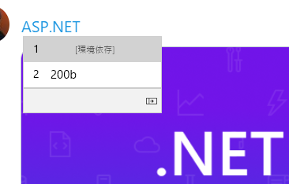

# なんとかしてくれるゼロ幅スペース

<iframe width="560" height="315" src="https://www.youtube.com/embed/ZZyyeuEw9SE" title="YouTube video player" frameborder="0" allow="accelerometer; autoplay; clipboard-write; encrypted-media; gyroscope; picture-in-picture" allowfullscreen></iframe>

今の Windows の IME は文字コード直打ちから F5 キーを押すことで任意の文字を入力できる機能を持っています。

いつからだろう。 Windows 10 が「新しい Micorsoft IME」になってからだとは思うんですが、気が付けばそんな機能が。
というか、逆に IME パッドはショートカットキーでは出せなくなった？ (右クリック メニューからの選択では出せます。)

[昨日の C# ライブ配信中](https://youtu.be/NqJkCm85CSM?t=6775)で、「200B だけはよく使う」とおっしゃってる方が要らっしまして。
「ゼロ幅スペースって嫌がらせ以外の用途で使えるの？」、「あえとすさんって実用性ない黒魔術をよく使う人だっけ？」となって「どういう状況で使うんですか？」と聞いた結果が

「Twitter で ASP.NET をリンクにさせない技」

あっ…

それは確かに使うわ…

しかし、文字コード覚えて直打ちする手段に、 F5 なんていうわかりやすいショートカットキーが割当たる時代になったんですねぇ…

追記: その後もうちょっと試して見てる感じ、200B (ゼロ幅スペース)よりも 200D (ZWJ)の方がいいかも。

<iframe width="560" height="315" src="https://www.youtube.com/embed/A9S2HF0BEDM" title="YouTube video player" frameborder="0" allow="accelerometer; autoplay; clipboard-write; encrypted-media; gyroscope; picture-in-picture" allowfullscreen></iframe>

