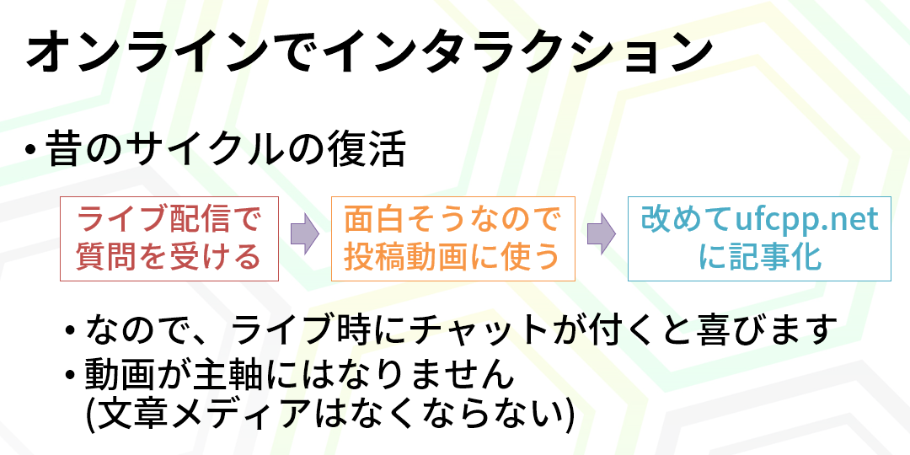
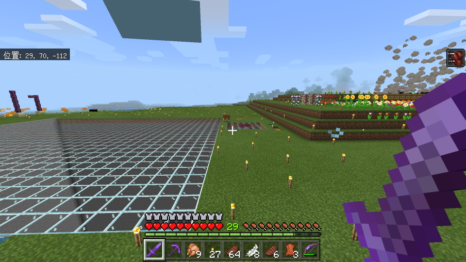

# YouTube で C# がらみのライブ配信初めてました(1年経った)

なんか割かし真面目に YouTube で C# ライブ配信するようになってから、気が付けばもう1年経ってるらしい。

- [ufcpp YouTube チャンネル](https://www.youtube.com/channel/UCY-z_9mau6X-Vr4gk2aWtMQ)

元々、「落ち着いたらちゃんとした告知的なものをここのブログでも書きたい」と思ってたら1年経ちました(今ここ)。

[始めた当初の頃](https://youtu.be/a5Qs7u6CoqM)とか、ノート PC で無線 LAN で配信してましたからね、これ。
諸事情あって。

配信やるようになった経緯もまあ[1回動画にしてますが](https://www.youtube.com/watch?v=wEGhEAl4iEg)、そういえばスライドを上げておらず、先ほどようやくアップロード。

<iframe src="//www.slideshare.net/slideshow/embed_code/key/jjEoEDswPq1VGm" width="595" height="485" frameborder="0" marginwidth="0" marginheight="0" scrolling="no" style="border:1px solid #CCC; border-width:1px; margin-bottom:5px; max-width: 100%;" allowfullscreen> </iframe> 
 <strong> <a href="//www.slideshare.net/ufcpp/youtube-244839075" title="YouTube ライブ配信するようになった話" target="_blank">YouTube ライブ配信するようになった話</a> </strong> 

## ネタの仕入れ

概ねまあ、以下のスライドに全てが詰まっているわけですが。

「色々と自分の記憶にはあるけども、需要あるのかどうかわからなくて書くモチベーションが湧かない」みたいな「ネタはあるのにネタ切れ」状態だったので、なんかライブ配信でもやってみようかと。

ぶっちゃけて言うと「あれ？ なんか Virtual YouTuber の配信が投稿動画型からライブ配信型に入れ替わってない？」みたいなのに唐突に気づいてしまいまして。
これ、自分が配信を始めた2020年の3月とか、さかのぼって言うと配信しようと考え始めた2020年の正月頃なんですけど、その時点でもすでに“今更な話”(にじさんじとかホロライブとかの大手の「箱」ができてからも1年半～2年経ってるくらいの時期)なんですが。
とりあえず、「チャット欄とほぼリアルタイムで会話しながらゲームしてるのすげぇな」とか、
「雑談配信で2・3時間行けるんだ」とかいうことを自分が認識したのが大体その頃。

そしてその結果、「今の自分に必要なのはこのチャット欄じゃない？」とか思ってライブ配信をすることにしました。
普通はまあ、そんないきなりライブ配信を始めたってチャットなんて付かないんですけども。
幸いまあ、「勉強会を開いてた頃から知った名前」な方からのコメントが結構つきまして、なんとか定着して今に至ります。

今目下の悩みとして「新規層はチャットに入ってきてくれるのか」みたいなのはあるんですが…

## ネタの書き出し

そしてまあ1年経って。

とりあえずなんかやっとペースみたいなものはつかめてきたかなと。
あんまり頻度多くてもしんどい。
かといってあんまりやらないとなまって再開がしんどい。
折衷案で、「C# 配信かマイクラ作業を垂れ流すだけの配信のどっちかを週1くらいでやる」みたいなところで落ち着けて、C# 配信は2・3週に1回くらいのペース。

(おまけでついてきたマイクラの方はすっかり整地厨に。段差は許さない。)

話を戻して C# 配信の方、当初目的であるネタの仕入れに関しては期待以上の成果を得ていて、むしろアウトプットが全然できていないみたいな状態になっています。

毎度2・3時間しゃべっておいて自分でいうのもなんですが、
文字に書き残しておきたかったりするネタが多いので、
そういう意味では最終成果物である文字メディアが未完成。

毎回、ライブ配信中に書き捨てたコードを GitHub issue に書き残してるんですが。

- [++C++; の中の人が YouTube ライブ配信する際に使ってる配信内容まとめ用リポジトリ。](https://github.com/ufcpp-live/UfcppLiveAgenda/issues)

このメモ書き issue を掘り起こしてちゃんとしたブログにできそうだなとか思うものが、去年の8月くらいの配信までさかのぼれる状態だったりします。

うちのサイトのブログ、[2016年](../../../2016/index.md)とか[2018年](../../../2018/index.md)とか見てもらうとわかるんですが、「1・2年かけて [Gist](https://gist.github.com/) に書き捨ててたコードを発掘するだけで1人アドベントカレンダーができた」みたいな年がちらほらあります。
今、1人 2・3アドベントカレンダー分くらいは書き捨てコード溜まってるんじゃないですかね。

正直、入出力のペースが合っていない(入力過剰)のでさばききれる気もしてないので、
「ご興味がある方はご自由に使ってブログにしてください…」みたいな気持ちにもなっていたりします。

今年、[C# 9.0 の新機能](../../../../study/csharp/cheatsheet/ap_ver9.md)ページもまだ埋まってない状態ですからねぇ… ([残タスク](https://github.com/ufcpp/UfcppSample/issues/297)。まだあと record とか function pointer とかの重たいやつが残ってる。)

当初理念スライドにある「文章メディアはなくならい」の言葉はどこに… (やる気はある)

## おまけで宣伝

配信中に急に思い付きで言ってみたことを、そのまま[じんぐるさん](https://twitter.com/xin9le)に押し付けたやつがありまして。

C# がらみで日本語で話せる Discord サーバー持ちたいとか思って立てたやつがあります。

- [C# Japan Discord サーバー](https://discord.gg/kZzNCknB)

立ててから自分では2か月くらい[告知出す](https://twitter.com/ufcpp/status/1352923382782652416)のもやっておらず、ブログを書いてる今に至ってはもう4か月を過ぎているという。

4か月ほどで、今、約700人くらいのサーバーになっています。
