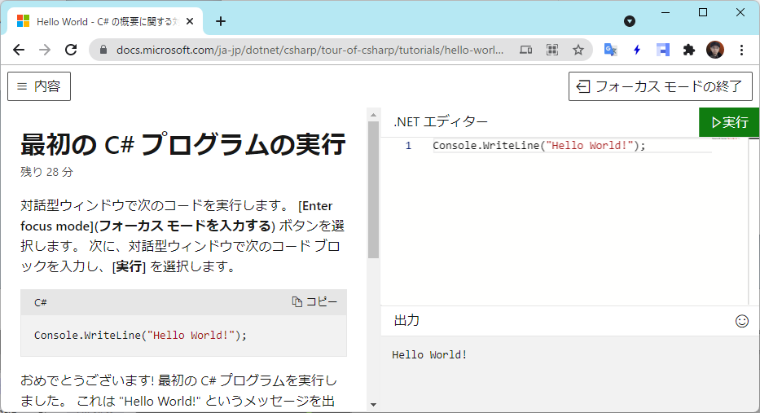
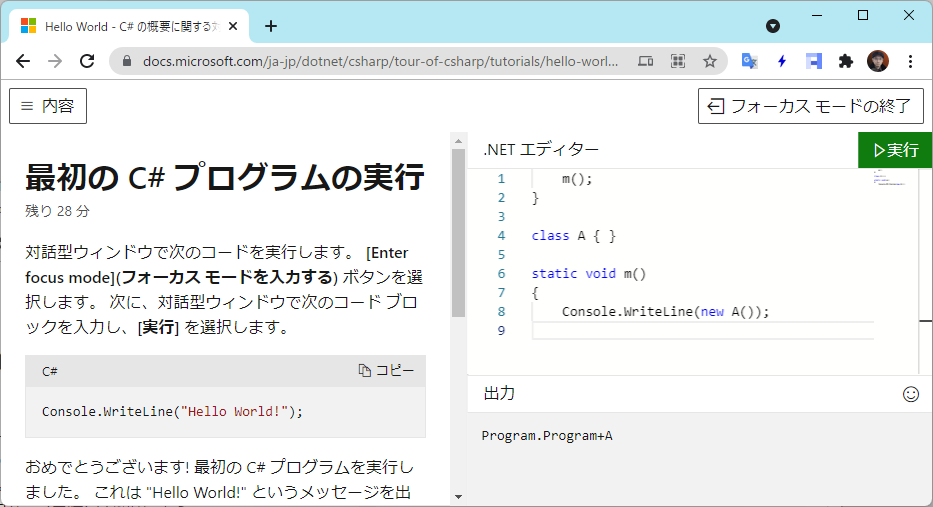

# 最初の C# プログラム(.NET 6 新テンプレート)

.NET 6 ではプロジェクト テンプレートが更新されて、かなりシンプルになります。
例えば、コンソール アプリの場合(`dotnet new console` コマンドで生成)は(コメント行を除けば実質)以下の1行だけの C# ファイルが生成されます。

<pre class="source" title="新コンソール アプリ テンプレート">
<code>Console.WriteLine("Hello, World!");
</code></pre>

[先日の .NET 6 Preview 7](../net6p7/index.md) から、コンソール アプリと Web アプリがこの新テンプレートになっています。
[トラッキング issue](https://github.com/dotnet/templating/issues/3359) を見るに、他のタイプのプロジェクトも同じ方針で書き換え中みたいです。

今日はこの新テンプレートがらみで、背景とか、内部挙動的な話とか、Preview 7 から正式リリースまでの間に掛かる予定の変更の話とか。

## 旧テンプレート

まあ、これまでのテンプレートが以下のようなものでしたから、ずいぶんとすっきりしました。

<pre class="source" title="旧テンプレート">
<code>using System;

namespace ConsoleApp1
{
    class Program
    {
        static void Main(string[] args)
        {
            Console.WriteLine("Hello, World!");
        }
    }
}
</code></pre>

C# の勉強を続けているとそのうちどこかで出会うことになるコンセプトとはいえ、完全な初心者にとってはノイズにしかならない「おまじない」が結構あります。

* [using](../../../../study/csharp/structured/sp_namespace.md#using)
* [namespace](../../../../study/csharp/structured/sp_namespace.md#namespace)
* [class](../../../../study/csharp/oop/oo_class.md)
* [static](../../../../study/csharp/oop/oo_static.md)
* [コマンドライン引数](../../../../study/csharp/structured/st_command.md)
* [エントリーポイント](../../../../study/csharp/misc/miscentrypoint.md)

ということで、「初心者向けにもっとシンプルに書ける言語になりたい」というのが結構前から C# の課題でした。

[C# 6.0 の時にスクリプト実行用の構文](../../../../study/csharp/cheatsheet/apscripting.md)ができたりもしましたし、
[C# 9.0 ではトップ レベル ステートメント](../../../../study/csharp/cheatsheet/ap_ver9.md#top-level-statements)が導入されました。
その流れで、C# 10.0 では [global using](https://github.com/ufcpp/UfcppSample/issues/345) や [file-scoped namespace](https://github.com/ufcpp/UfcppSample/issues/352) などが入りましたし、 .NET 6 以降、標準のプロジェクト テンプレートも積極的にこれら「シンプル化のための機能」を使ったものになります。

## 「最初の C# プログラム」構想

今時のプログラミング言語は大体公式サイトで「ブラウザー内で試してみる」機能が付いています。

というか「プログラミングを始めるにはまず Visual Studio をインストールします」なんて言うと、今時そこで9割の人が離脱します…

ということで、C# も現在では公式サイトで、

* [C# 関連のドキュメント](https://docs.microsoft.com/ja-jp/dotnet/csharp/)
* [オンライン、対話的な Hello World](https://docs.microsoft.com/ja-jp/dotnet/csharp/tour-of-csharp/tutorials/hello-world)
* [最初の C# プログラムの実行](https://docs.microsoft.com/ja-jp/dotnet/csharp/tour-of-csharp/tutorials/hello-world?tutorial-step=1)

とたどって、ブラウザー内で C# コードを試してみることができます。
そこで表示されているのが「新テンプレート」にもある以下の1行。

<pre class="source" title="最初の C# プログラム">
<code>Console.WriteLine("Hello, World!");
</code></pre>

今まで、この1行、実は正規の C# だと動かなかったんですよね。
「適切な場所にこの C# をコピペすれば動く」と言う意味ではちゃんと動く C# コードなんですが、
「この1行だけをコピペしても動かない」という意味で「動かないコード」でした。

ところが、この公式サイト内では以下のように「動いてます」。

(そして、「公式サイトで動くことになっているコードが手元では動かない」と言うようなクレーム、結構あると思うんですよね。
僕も Twitter 上でこの手の文句を言っている人を数度見たことがあり。)

これ、最初は「C# スクリプト(通常の C# とちょっと別文法)なのかな？」とも思ったんですが、
[以前ちょっと試した感じ](https://github.com/ufcpp-live/UfcppLiveAgenda/issues/21#issuecomment-739150490)、
どうも[スクリプト用の構文](../../../../study/csharp/cheatsheet/apscripting.md)ではなさそうと言う結論に。

少なくとも今日(2021年8月16日)の時点では、おそらく、前後に以下のコードを文字列結合してからコンパイルしているのだろうという推測をしています。

前:

<pre class="source" title="前に concat してる文字列">
<code>using System;
using System.Collections.Generic;
using System.IO;
using System.Linq;
using System.Net.Http;
using System.Threading;
using System.Threading.Tasks;

namespace Program
{
    class Program
    {
        static void Main()
        {
</code></pre>

後ろ:

<pre class="source" title="後ろに concat してる文字列">
<code>        }
    }
}
</code></pre>

その結果、以下のようなおかしな真似ができます。

## 「最初の C# プログラム」を動く C# コードに

で、C# 10.0 でようやくこの「最初の C# プログラム」が動くコードになりました。

C# 9.0 時点でも以下のコードまでは書けていたんですが…

<pre class="source" title="C# 9.0 での「最初の C# プログラム」">
<code>using System;

Console.WriteLine("Hello, World!");
</code></pre>

ここで最後のノイズが `using System;` だったわけですが、
これが C# 10.0 の [global using](https://github.com/ufcpp/UfcppSample/issues/345) で解消します。

要は、「暗黙的に using してる名前空間がある」という情報を何らかの方法で C# コンパイラーに伝えられればいいんですが、C# 10.0 では以下のような方式を取ることにしました。

* global using という C# の文法を追加
* .NET SDK 側で、コンパイル開始時に所定の global using コードを生成

例えば、コンソール アプリの場合、以下のようなソースコードが自動的に作られて、
手書きコードと一緒にコンパイルされます。

<pre class="source" title="標準で自動生成される global using コード">
<code>// &lt;autogenerated /&gt;
global using global::System;
global using global::System.Collections.Generic;
global using global::System.IO;
global using global::System.Linq;
global using global::System.Net.Http;
global using global::System.Threading;
global using global::System.Threading.Tasks;
</code></pre>

## .NET 6 Preview 7 でのバグ挙動と破壊的変更問題

ただし、先日リリースしたての .NET 6 Preview 7 ではこれのせいでいくつか問題を起こしています。
すでに対処はされていて、次のリリース(おそらく RC 1)までに治るっぽいです。

とりあえずは Preview 7 時点のバグ挙動の説明。

上記の global using コードをどういう条件で生成するかと言うのが問題でして、
Preview 7 時点では「TargetFramework が net6.0 なら生成」となっていました。
これでどういう問題を起こすかと言うと、

* TargetFramework net6.0 なのにあえて LangVersion を9以下に設定して global using を使えなくする
    * 「global using を使うなら C# 10.0 以降を使え」というエラーが出る
* TargetFrameworks で複数の TargetFrameworks を混在させる
    * net6.0 のときだけ global using が掛かっている状態になるので、net6.0 のときにしかコンパイルできないコードが生まれる

そして、TargetFramework を net6.0 に変えるだけで、既存のコードを壊すことがあります。
まあ、勝手に using している名前空間が足されている状態なので、そこに含まれている型と名前被りがあると「不明瞭な型」扱いを受けてコンパイル エラーを起こします。

例えば、[.NET チーム自身が地雷を踏んで、暗黙的な global using 生成を止める](https://github.com/dotnet/runtime/pull/56744)という一時的な対処をやっています。

当初はこれを「[.NET 6 での破壊的変更](https://docs.microsoft.com/ja-jp/dotnet/core/compatibility/sdk/6.0/implicit-namespaces)」としてユーザーに受け入れてもらおうと思っていたみたいなんですが、さすがに無理だと思ったのか、方式を改めるみたいです。

## 次のリリースまでに掛かる変更

ということで、[変更計画](https://github.com/dotnet/sdk/issues/19521) (6.0.100-rc.1 に入れる目標とのこと)。

今(Preview 7 時点):

* net6.0 だと自動的に global using コードが生成されてしまう
* それを抑止するために、DisableImplicitNamespaceImports というオプションがある(本来は Visual Basic 用)
* プロジェクト テンプレートにはこれ関連の項目は何も含めない

変更後(RC 1 目標):

* ImplicitUsings というオプションを用意して、これが true もしくは enable の時だけ global using コードを生成する
    * DisableImplicitNamespaceImports は C# 向けにはなくす(Visual Basic 用オプションの流用をやめる)
* プロジェクト テンプレートに `<ImplicitUsings>enable</ImplicitUsings>` の行を足す

明示的なオプション指定を必須にして、標準のテンプレートにこのオプションを足すという方向性。

なので、既存のプロジェクトを net6.0 に変えただけで破壊的変更ということにはならなくなる予定です。
その代わり、csproj (プロジェクト設定ファイル)に1行ノイズが増えますが…
これはさすがにしょうがなさそう。
