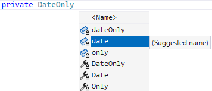
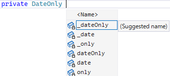

# 【Visual Studio】 Naming Style 設定

こないだの [C# 配信](https://youtu.be/lxr0QlZR0M4)で、
「フィールドの naming style を `_camelCase` にするための設定を .editorconfig で書いておきたい」という話になったやつ。

[.editorconfig がらみの話になったのは 1:57:52 頃～](https://youtu.be/lxr0QlZR0M4?t=7072)

## private/internal フィールドの名前規約

長らく C#/.NET 方面は private なところの規約についてはそこまでうるさく言われない文化だったりしたのでそこまで統一見解はないんですが、
皆様は private フィールドの名前をどうしていますでしょうか。

最近では、 [dotnet/runtime](https://github.com/dotnet/runtime) が `_` 開始の `camelCase` を採用したということで、このルールを支持する人が増えたというか、
`this.x` 派だった人も「dotnet/runtime がそういうのなら」という感じでちらほら改宗していたりはします。

<pre class="source" title="_ 始まり推奨">
<code>class C
{
    private DateTime <em>_date</em>;
}
</code></pre>

ところで、以下のスクショをご覧ください。
(フィールドに対する名前の提案。)

Visual Studio を触っている人なら1度は思ったことがあると思うんですが、
「あっ、そこは `_` 付けてくれないんだ…」

## Naming Style 設定

ということで、[okazuki さん](https://twitter.com/okazuki)曰く、
ちゃんと `_` 始まりで提案してもらえるように設定を入れているとのこと。

.editorconfig に以下のような行を入れておくと `_` 始まりになります。

<pre class="source" title="begin_with__">
<code>[*.{cs,vb}]

dotnet_naming_rule.private_or_internal_field_should_be_begin_with__.severity = suggestion
dotnet_naming_rule.private_or_internal_field_should_be_begin_with__.symbols = private_or_internal_field
dotnet_naming_rule.private_or_internal_field_should_be_begin_with__.style = begin_with__

dotnet_naming_symbols.private_or_internal_field.applicable_kinds = field
dotnet_naming_symbols.private_or_internal_field.applicable_accessibilities = internal, private
dotnet_naming_symbols.private_or_internal_field.required_modifiers = 

dotnet_naming_style.begin_with__.required_prefix = _
dotnet_naming_style.begin_with__.required_suffix = 
dotnet_naming_style.begin_with__.word_separator = 
dotnet_naming_style.begin_with__.capitalization = camel_case
</code></pre>

(style, symbols, rule の3つ組が必要みたいです。)

この状態で先ほどと同じ変数名の提案を出すと以下のように変化します。

ちなみに、こんな構文＆変数名、覚えられるわけもなく、okazuki さんは Visual Studio 上のオプション画面でこの設定を入れて、.editorconfig にエクスポートして使っていたそうです。

そこに、Visual Studio 17.1 Preview 2 の .editorconfig の GUI 設定画面に Naming Style のタブが増えたということで期待しているという状態。
(といっても、 .editorconfig GUI では "`begin_with__`" みたいな新規スタイル追加はできないっぽくてまだまだいまいちな感じ。)
