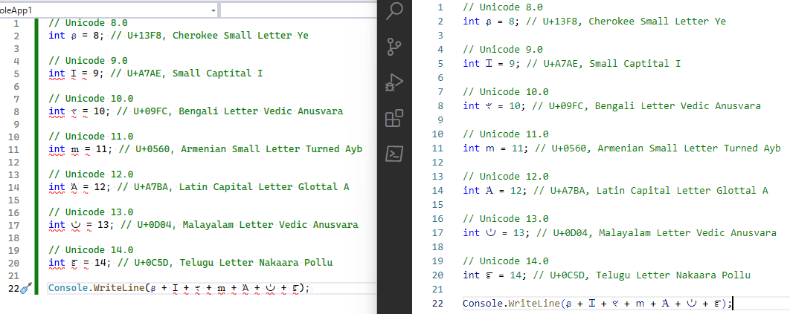

# Visual Studio の .NET Core 化まだー？

[C# 配信](https://www.youtube.com/@ufcppdotnet)でちょくちょく出てくる話題の1つに

「Visual Studio (for Windows)はいまだに .NET Framework だから」

というものがあります。
もちろん、「.NET Core 化はよ」みたいな文脈です。

Visual Studio は .NET 製アプリの中でも大規模なものの1つなわけで、ドッグフーディング的な意味で早く .NET Core 化してほしいというのもありますし。

.NET Framework → .NET 5 → .NET 6 → .NET 7 と、毎度2・3割は速くなってるというベンチマークがあるわけで合計すると2倍以上速いかもしれず、
普通にパフォーマンス上の理由でも早く .NET Core 系になってほしかったりもします。

そしてもう1個、
実は <em>.NET Framework の方は Unicode 8.0 で止まっている</em>という話があったり。

## C# の lexer/parser は .NET ランタイム依存

C# では、空白文字とか識別子に使える文字とかの定義に Unicode の文字カテゴリーを使っています。

* 言語仕様: 6 Lexical structure / [6.4.3 Identifiers](https://learn.microsoft.com/en-us/dotnet/csharp/language-reference/language-specification/lexical-structure#643-identifiers)
* うちのサイト内の解説: [識別子名に使える文字](../../../../study/csharp/start/misc_identifier.md)

そして、[C# コンパイラー自身が C# 製](https://github.com/dotnet/roslyn)になって以来、
カテゴリー判定には普通に .NET の [`GetUnicodeCategory`](https://learn.microsoft.com/ja-jp/dotnet/api/system.char.getunicodecategory) を使っています。

そして、
「Visual Studio は .NET Framework 動作」
と「.NET Framework は Unicode 8.0 止まり」
のコンボで、
Visual Studio 上でだけコンパイルできないコードが割かし簡単に書けたりします。

## C# 9.0 以降に追加された letter

C# で識別子に使える文字は、まあかなり端折って言うと、いわゆる letter と言われる文字です。

で、Unicode の各バージョンで追加された文字は、 [unicode.org 内の各種データ置き場](https://unicode.org/Public/UNIDATA/) の [DerivedAge.txt](https://unicode.org/Public/UNIDATA/DerivedAge.txt) とかで調べられます。

ちょっと Unicode 8.0 から 14.0 まで1文字ずつそれっぽい letter を適当に拾って…

* Unicode 8.0: ᏸ U+13F8, Cherokee Small Letter Ye
* Unicode 9.0: Ɪ U+A7AE, Small Captital I
* Unicode 10.0: ৼ U+09FC, Bengali Letter Vedic Anusvara
* Unicode 11.0: ՠ U+0560, Armenian Small Letter Turned Ayb
* Unicode 12.0: Ꞻ U+A7BA, Latin Capital Letter Glottal A
* Unicode 13.0: ഄ U+0D04, Malayalam Letter Vedic Anusvara
* Unicode 14.0: ౝ U+0C5D, Telugu Letter Nakaara Pollu

これを、こうじゃ:

<pre class="source" title="Unicode 8.0 以降に追加された letter">
// Unicode 8.0
int ᏸ = 8; // U+13F8, Cherokee Small Letter Ye

// Unicode 9.0
int Ɪ = 9; // U+A7AE, Small Captital I

// Unicode 10.0
int ৼ = 10; // U+09FC, Bengali Letter Vedic Anusvara

// Unicode 11.0
int ՠ = 11; // U+0560, Armenian Small Letter Turned Ayb

// Unicode 12.0
int Ꞻ = 12; // U+A7BA, Latin Capital Letter Glottal A

// Unicode 13.0
int ഄ = 13; // U+0D04, Malayalam Letter Vedic Anusvara

// Unicode 14.0
int ౝ = 14; // U+0C5D, Telugu Letter Nakaara Pollu

Console.WriteLine(ᏸ + Ɪ + ৼ + ՠ + Ꞻ + ഄ + ౝ);</pre>

(ちなみに C# コンパイラーっていまだに[サロゲートペア](https://ja.wikipedia.org/wiki/Unicode#%E3%82%B5%E3%83%AD%E3%82%B2%E3%83%BC%E3%83%88%E3%83%9A%E3%82%A2)に対応していないので、[BMP](https://ja.wikipedia.org/wiki/%E5%9F%BA%E6%9C%AC%E5%A4%9A%E8%A8%80%E8%AA%9E%E9%9D%A2) 内で当該文字を探さないといけないんですが。
見ての通り、最近でも BMP への文字追加が意外とたくさんあります。)

これをエディターで開いてみましょう。

左が Visual Studio for Windows、右が VS Code。
.NET Framework が Unicode 8.0 で止まっている証拠の1つとなります。

ちなみに、 .NET SDK のバージョンによってもどこまでコンパイルできるか変わるはずです。
確か、 .NET 6 は Unicode 13.0 なので、 ౝ (U+0C5D、Unicode 14 での追加)はコンパイルできないと思います。

## おまけ: 対 Visual Studio 専用ホモグラフ攻撃

ほんとたまたまで、
「DerivedAge.txt を眺めてて各バージョン最初に目に入った letter っぽい文字」
を選んだだけなんですが…

<em>Ɪ と ՠ の2文字、ASCII 文字と似てて[ホモグラフ攻撃](https://ja.wikipedia.org/wiki/%E3%83%9B%E3%83%A2%E3%82%B0%E3%83%A9%E3%83%95%E6%94%BB%E6%92%83)できそうじゃない…</em>

<pre class="source" title="おもむろに謎のクラスを1つ定義">
class Ɪՠage { }
</pre>

この `Ɪՠage` クラス、最初の2文字が先ほどの Ɪ (U+A7AE)と ՠ (U+0560)です。

これ、たぶん、CI とかも通っちゃうんですよね。
これがコンパイルできないのは本当に Visual Studio for Windows だけ…
