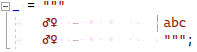
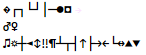

# raw string の空白文字

書き捨ててたコードの供養ブログ シリーズ。
今日は、[C# 11 で入った生文字列(raw string literals)](../../../../study/csharp/cheatsheet/ap_ver11.md#raw-string)は、C# には珍しく、空白文字の数や並び順に影響を受けるという話。

## <a id="csharp-whitespace">C# と空白文字</a>

C# は空白文字の影響を受けにくい言語仕様になっています。
主に2点。

* 空白の有無によって意味が変わる場所が極めて少ない
* 全角スペースとかが混入していても ASCII のスペースと同じ扱いをする

(C# に限らず、
C 言語の影響を受けて作られた言語で、
Unicode に対応している言語は結構こういう仕様のものが多いはず。)

### <a id="existence">空白の有無</a>

「空白の有無」は、`A B` と `AB` みたいな単語区切りを除けば、
自分の思いつく限り、意味が変わるのは `x +++ y` くらいでした。

```csharp {title="+++"}
var x = 1;
var y = 2;

var z = x+++y; // ここの +++

Console.WriteLine((x, y, z));
```

ちなみに、以下のような差。

```csharp {title="++ + と + ++ と + + +"}
var z1 = x++ + y; // (x++) + y
var z2 = x + ++y; // x + (++y)
var z3 = x + + +y; // x + (+(+y))
// +++ は ++ + の意味になる。
```

コメントまで含めると `//*/` と `//* /` とかも思いつきますが、
すぐに思いついたのはこれだけでした。

### <a id="whitespace-category">ASCII 以外の空白文字</a>

C# は割かし全角スペース耐性があります。
C# は「空白かどうか」を Unicode カテゴリーを見て判定しているので、
スペースの半角・全角は問いませんし、なんだったら nbsp (HTML を書いてて時々出てくる「ここで改行しちゃだめ」スペース)とかが混入しても大丈夫です。

正確に言うと、C# の文法では以下の文字が「空白」になっています。

* Unicode の文字カテゴリーが Zs (Space Separator)の文字
* 水平タブ(U+0009)
* 垂直タブ(U+000B)
* フォーム フィード(U+000C)

ちなみに、Zs の文字は以下の通り。

* U+0020: space
* U+00A0: no-break space
* U+1680: ogham space mark ([オガム文字](https://ja.wikipedia.org/wiki/%E3%82%AA%E3%82%AC%E3%83%A0%E6%96%87%E5%AD%97))
* 幅違い
    * U+2000: en quad
    * U+2001: em quad
    * U+2002: en space
    * U+2003: em space
    * U+2004: three-per-em space
    * U+2005: four-per-em space
    * U+2006: six-per-em space
    * U+2007: figure space
    * U+2008: punctuation space
    * U+2009: thin space
    * U+200A: hair space
* 幅違い no-break
    * U+202F: narrow no-break space
    * U+205F: medium matematical space
* U+3000: ideographic space (全角スペース)

こんな文字は入力する方が大変なんですが…
頑張って入力すると、[以下のようなソースコード](https://gist.github.com/ufcpp/3eeebaf3c79c0af2f76336f8e38b3104)が書けたりします。

```csharp {title="スペース混在"}
var a = new[] {
				0,
1,
2,
    3,
    4,
    5,
    6,
    7,
    8,
    9,
    10,
    11,
    12,
    13,
    14,
    15,
    16,
    17,
    18,
　　　　19,
};
```

入力も大変なら、Visual Studio みたいな IDE は自動整形機能でごっそり全部、消すか、通常のスペース(U+0020)に置き換えてくれるので、
この変なソースコードを維持するのもそれなりに大変です。

ちなみに今回は、以下のコードでコード生成しました。

```csharp {title="スペース混在コード生成"}
using var f = new StreamWriter("a.cs");

var ws = new[] { 0x0009, 0x000B, 0x000C, 0x20, 0xA0, 0x1680, 0x2000, 0x2001, 0x2002, 0x2003, 0x2004, 0x2005, 0x2006, 0x2007, 0x2008, 0x2009, 0x200A, 0x202F, 0x205F, 0x3000 }.Select(i => (char)i).ToArray();

f.WriteLine("""
    var a = new[] {
    """);

for (int i = 0; i < ws.Length; i++)
{
    var w = ws[i];
    f.WriteLine($"{w}{w}{w}{w}{i},");
}

f.WriteLine("""
    };
    """);
```


## <a id="raw-string">raw string と空白文字</a>

C# についてまとめると以下の通り。

* 空白文字の種類に影響を受けることはない
* 空白文字の有無や個数、順序に影響を受けることもほとんどない
* Visual Studio が軒並み整形してしまうので、U+0020 (通常のスペース)以外の空白文字は維持するのも難しい

ところで、C# 11 では以下のような「[複数行文字列リテラル](../../../../study/csharp/start/st_string.md#multiline-indent)」を書けるようになりました。

```csharp {title="生文字列で複数行文字列リテラルを書く例"}
var raw = """
    raw string literals (生文字列リテラル)
    | ← ここよりも左側にあるインデントは無視される。
    ここまでがリテラル。
    """; // この「閉じ引用符」行のインデントが基準。

Console.WriteLine(raw); // 「raw」から始まる。「    raw」にはならない。末尾も改行は入らない。
```

ここでちょっと好奇心を働かせます。
空白文字を混在させたときの扱いはどうなるんだろう？

試してみると、コンパイル エラーでした。
CS9003「閉じ行と異なる空白を含んでいます」エラー。

```csharp {title="異なる空白文字を使うとコンパイル エラー" error-text="　　　　" error-diagnostics="CS9003@2:1-2:5"}
_ = """
　　　　全角スペース4つ。
    """; // スペース4つ。
```

```csharp {title="1個だけ変えてもダメ" error-text="   　" error-diagnostics="CS9003@2:1-2:5"}
_ = """
   　4つ中1個だけ全角。
    """; // スペース4つ。
```

おっ？異なる文字がダメということは？
もしや？…

```csharp {title="順序まで完全一致していればOK！"}
_ = """
　 	 　全角、半角、タブ、半角、全角。
　 	 　"""; // 全角、半角、タブ、半角、全角。
```

混在していても、順序を含めて完全に一致していればコンパイルできるみたいです。

じゃあ、こんな感じで…

```csharp {title="空白文字全部入りコード生成"}
using var f = new StreamWriter("a.cs");

var ws = new[] { 0x0009, 0x000B, 0x000C, 0x20, 0xA0, 0x1680, 0x2000, 0x2001, 0x2002, 0x2003, 0x2004, 0x2005, 0x2006, 0x2007, 0x2008, 0x2009, 0x200A, 0x202F, 0x205F, 0x3000 }.Select(i => (char)i).ToArray();
var w = string.Join("", ws);

f.WriteLine($""""
    _ = """
    {w}abc
    {w}""";
    """");
```

どうかな？

```csharp {title="空白文字全部入り(コンパイルできる)"}
_ = """
	                　abc
	                　""";
```

コンパイルできる！

そして、どうも現状 (Visual Studio 17.5 時点) で、
この raw string のインデント部分の自動整形はしないみたいです。
([下手に整形するとさっきの CS9003 エラーの原因になる](https://github.com/dotnet/roslyn/issues/64237)ので。)

まあ、こんなコード入力するの自体困難なコードで問題を起こす愉快犯もそうそういないと思いますが。

C# らしからぬ、

* 空白の順序に意味がある
* Visual Studio に自動整形されない

というのが珍しかったという話になります。

## <a id="symbol-font">余談: 謎の記号</a>

ところで、先ほどのコード、Visual Studio で開くとこんな感じ:



なぜか♂♀記号が…

気になっていろいろ試してみたところ、
制御文字全般謎の記号に置き換わりました。
0～0x20 までの文字を書き込んで Visual Studio で開くと以下のような感じ。



以下のような話かも？

* 「空白を表示」をオンにしたときに、スペースとタブの代わりに ‣ と • を表示している辺りのロジックが悪さをしている？
* 一部は[CP437](https://en.wikipedia.org/wiki/Code_page_437)の文字が表示されてる

どうでもいいものの一応はバグ報告:

* Visual Studio Developer Community に: [10156578](https://developercommunity.visualstudio.com/t/Visual-Studio-IDE-displays-ASCII-control/10156578)

まあ報告しておいてなんですけども、優先度付かないでしょうね、こんなの。
