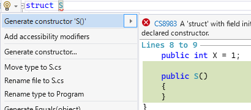

# 【C# 10.0 変更点】 構造体のフィールド初期化子にはコンストラクター必須

先日 Visual Studio 17.1.0 (正式リリース)と 17.2 Preview 1 が出たわけですが。

これをインストールすると、ちょこっと C# 10.0 の構造体のフィールド初期化子の挙動が変わります。
以下のようなコード、17.0/17.1 Preview 時代はコンパイルできていたんですが、17.1/17.2 Preview ではコンパイル エラーになります。

```csharp {title="しれっと破壊的変更が掛かった文法"}
struct S
{
    public int X = 1; // ここが原因。
}
```

ちなみに、C# の言語バージョンが改まったわけではなく、
バグ修正とかと同じノリでサイレント修正です。

仕様: [Never synthesize parameterless struct constructor](https://github.com/dotnet/csharplang/pull/5637)

## 問題

上記のコードの 17.0/17.1 Preview 時代の挙動なんですが、
まあ、暗黙的に引数なしコンストラクターが追加されています。
以下のような挙動。

```csharp {title="17.0 時代の挙動"}
Console.WriteLine(new S().X); // 1

struct S
{
    public int X = 1;
    // public S() { } これがある時と同じ挙動になってた。
}
```

問題は、このコードに引数ありコンストラクターを足したとき。
以下のようになっていたそうです。

```csharp {title="引数ありコンストラクターを手動で足すと、引数なしコンストラクターの自動生成がなくなる"}
Console.WriteLine(new S().X); // 0。 default(S).X 扱い…

struct S
{
    public int X = 1;
    public S(int x) => X = x;
    // public S() { } これが生成されなくなる。
}
```

この挙動が罠すぎるので、傷が浅いうちに不具合扱いして挙動を変えようということになりました。

## 案1: 現状維持

もちろん、現状維持も検討されたみたいなんですが、
C# 10.0 リリース後のユーザーの反応的には相当に強い懸念の声が出ていて、無視はできないレベルと判断されたそうです。

## 案2: 常に引数なしコンストラクターを生成する

以下のように直すのが自然な気がしなくもないわけですが…

```csharp {title="案2: 常に引数なしコンストラクターを生成する"}
Console.WriteLine(new S().X); // ちゃんと1になればいいわけで。

struct S
{
    public int X = 1;
    public S(int x) => X = x;
    // public S() { } これが生成されればいい。
}
```

これで問題になるのが、`record struct` の[プライマリ コンストラクター](../../../../study/csharp/datatype/record.md#primary-constructor)だそうで。

プライマリ コンストラクターがある場合、「全てのコンストラクターは最終的にプライマリ コンストラクターにたどり着く必要がある」ということになっています。

```csharp {title="必ず最終的にはプライマリ コンストラクターにたどり着く"}
record struct S(int X)
{
    // 必ず S(int X) にたどり着くように書かないとダメ。
    public S() : this(1) { }
    public S(int a, int b) : this(a * b) { }
}
```

ここで、じゃあ、先ほどの、フィールド初期化子があるときにどうするか。
コンパイラーが自動的に引数なしコンストラクターを追加するのであれば、プライマリ コンストラクターには何を渡すべきかという問題がでます。

```csharp {title="引数なしコンストラクターはどう実装されるべきか…"}
record struct S(string X)
{
    public int Y = 1;

    // public S() : this(null) { } を足す？
    // 非 null が期待される string に null が渡ってしまう…
}
```

これがあるから、当初、「引数ありコンストラクターがあるときにはむやみに引数なしコンストラクターを追加しない」という判断になったようです。

## 案3: コンストラクターが1つもないとき、フィールド初期化子をエラーに

ということで、今日のブログの冒頭の話に戻ります。

以下のコードがエラーになりました。

```csharp {title="しれっと破壊的変更が掛かった文法"}
struct S
{
    public int X = 1;
}
```

ちなみに、Visual Studio 17.2 Preview 1 では、この状態の(エラーのある)コードに対して「引数なしコンストラクターを追加する」というリファクタリング機能が追加されています。



ただ、最初から以下のようなコードを書くと罠っぽい挙動になるのは今と同じ。

```csharp {title="引数ありコンストラクターを手動で足すと new S() が default(S) 扱い"}
Console.WriteLine(new S().X); // 0。 default(S).X 扱い…

struct S
{
    public int X = 1;
    public S(int x) => X = x;
    // public S() { } これは生成されない。
}
```

ただ、「後から迂闊に引数ありコンストラクターを足してしまう」という状況は減るはずです。

エラーにならないようにするのは元々が以下のようなコードのはずで、

```csharp {title="エラーにならないコード"}
struct S
{
    public int X = 1;
    public S() { }
}
```

ここに引数ありコンストラクターを足すはずなので、
以下のような挙動が期待されます。

```csharp {title="コンストラクターが明示的にあれば解決"}
Console.WriteLine(new S().X); // ちゃんと1。

struct S
{
    public int X = 1;
    public S() { }
    public S(int x) => X = x;
}
```
