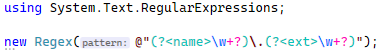
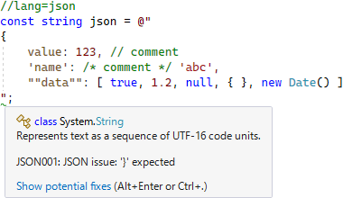

# C# 中の埋め込み言語

[さかのぼること4年前](../../../2018/1/pickuproslyn0103/index.md)、C# 中に正規表現な文字列を書くと以下のように構文ハイライトされるようになりました。



色が付く以外に、コード補完や構文ミスに対する警告とかも出ます。

今日はこの手の「C# 中への別言語の埋め込み」がらみの話です。

先日、4件くらい [low level imprevements のブログ](../ref-field/index.md)を書いて、その中で「実に5年ぶりの low level の機運」とか書きましたが、
「埋め込み言語」にも4年ぶりの機運が来ています。

## JSON

4年ぶりに何が起きたかというと、JSON にも構文ハイライトが働くようになりました。

* [Enable feature lightup on json strings (classification, bracematching, diagnostics).](https://github.com/dotnet/roslyn/pull/59034)

そして [Visual Studio 17.2 Preview 1](https://docs.microsoft.com/en-us/visualstudio/releases/2022/release-notes-preview#17.2.0-pre.1.0) にこのコードが入っていりました。
以下スクショ。



「JSON に対応した」というだけだと、
正直「なんで今更…」という感想が多少します。
外部の JSON ファイルを読む機会は近年どんどん増えていますが、
C# 中に JSON を埋め込む需要ってそんなにあったっけ？という感じ。

まあ、今後、対応する「埋め込み言語」を増やすか、
任意の開発者が任意の「埋め込み言語」を増やせるようにする予兆かも？
という淡い期待をしつつ今後の動きを待ちましょう…

## StringSyntax 属性

もう1個新しいのが、`StringSyntax` という属性が増えました。

* [[API Proposal]: System.Diagnostics.CodeAnalysis.StringSyntaxAttribute](https://github.com/dotnet/runtime/issues/62505)
* [[API Implementation]: System.Diagnostics.CodeAnalysis.StringSyntaxAttribute](https://github.com/dotnet/runtime/pull/62995)
* [Add StringSyntaxAttribute.Json](https://github.com/dotnet/runtime/pull/64081)

これまで、「正規表現扱いされる文字列」の判定は結構特殊なことをやっていました。

* `Regex` クラス関連のメソッドで、`pattern` という名前の引数に渡している
* 直前に `lang=regex` みたいな文字列が入ったコメントが書かれている

みたいな判定をしています。

ちなみに、この2個目の仕様があるので、以下のようなコードにも構文ハイライトが掛かります。

```csharp
//lang=regex
var regex = @"(?<name>\w+?\d{3}).txt";

//lang=json
var json = @"{ 'value': 123 }";
```

ほぼ「隠し仕様」みたいになってますが。

で、まあ、あんまりこういう特殊対応するのも微妙なので、
このたび、埋め込み言語指定用の属性ができました。
それが `StringSyntax` 属性。
`Regex` クラスのコンストラクターや `Match` メソッドにもこの属性が追加されています。

```csharp
public class Regex
{
    public Regex([StringSyntax(StringSyntaxAttribute.Regex, "options")] string pattern) { }
}
```

## raw string literal

今このタイミングでなのは、
[raw string literal](../../../2021/2/rawstringliteral/index.md) が入ったからでしょうね。
C# の文字列リテラル中にコードを埋め込みやすくなったので。
(さらに大本をたどると、raw string literal が入るきっかけは [source generator](../../../../study/csharp/misc/analyzer-generator.md) です。
コード生成しだすと raw string が欲しくなるので。)

Visual Studio 17.2 Preview 1 で、以下のようなコードが書けるようになりました。
(C# 11 候補。現状は LangVersion preview が必要。)

```csharp
const string regex = @"(?<name>\w+?\d{3}).txt";
var json = @"{ 'value': 123 }";

var raw = $$"""
class A
{
    public const string R = @"{{regex}}"
    public const string J = @"{{json}}"
}
""";
```

## EmbeddedLanguages

この辺りの「埋め込み言語」の実装は Roslyn リポジトリ内の以下の場所にあります。

* [src/Features/Core/Portable/EmbeddedLanguages](https://github.com/dotnet/roslyn/tree/main/src/Features/Core/Portable/EmbeddedLanguages)

現状、正規表現と JSON の他に2つほど実装があります。

* DateAndTime: `DateTime` などの `ToString` 時に使う書式。`yyyy` みたいなやつを補完してくれます(補間のみ)。
* StackFrame: スタック トレース情報のハイライト。たぶん他の用途にコードを流用しただけで、今回説明しているような文字列中のハイライトには使われてなさげ。

### プラグイン式

まあここまで話しておいてあれですが、
今日書いた内容、結構気持ち悪いと感じる人も多いんじゃないでしょうか。
コンパイラーの中に別言語を埋め込むとかリスクも非常に高く。

一度コンパイラーに組み込んじゃったものはめったなことでは消せないですからね。
例えばまあ、「XML リテラルを書けるようにしたら XML 自体が廃れた」みたいなこともあるわけでして。
(Visual Basic であった実話。)

そんなリスク、C# チームはよくわかっているので、
今日話したような「埋め込み言語」はコンパイラー内のコードではなく、
[MEF](https://docs.microsoft.com/ja-jp/dotnet/framework/mef/) プラグインとして外から渡す作りになっています。

素の Roslyn コンパイラー(`Microsoft.CodeAnalysis.CSharp` パッケージ)だけを参照していると正規表現や JSON の構文ハイライト(`Classifier.GetClassifiedSpansAsync`)は得られません。

前述の [EmbeddedLanguages](https://github.com/dotnet/roslyn/tree/main/src/Features/Core/Portable/EmbeddedLanguages) にある埋め込み言語を有効にしたければ、
`Microsoft.CodeAnalysis.CSharp.Features` パッケージを参照する必要があります。
このパッケージ内の MEF Export として埋め込み言語が入っていて、
それをコンパイラーが読み込むことで始めて構文ハイライトが掛かります。

という一連の流れのデモ:

* [UfcppSample Demo/2022/EmbeddedLanguages](https://github.com/ufcpp/UfcppSample/tree/master/Demo/2022/EmbeddedLanguages)

この辺りの仕組み、まだこなれていないから public にしたくないので、4年間ずっと internal だったりします。
public になってくれればも、誰もが埋め込み言語を作れるようになりそうなんですけどね。
raw string literal とか source generator とかがこなれてきたくらいにそうなることを期待しています。
