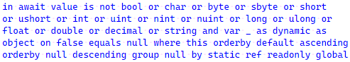

# C# でキーワードをできるだけ多く並べる遊び

以下のコード、有効な(エラーなくコンパイルできる) C# コードの一部です。



## きっかけ

Twitter でこんなのを見かけて。

<div>
<blockquote class="twitter-tweet"><p lang="en" dir="ltr">Can you think of a valid C# program containing 16 keywords in a row, where at least half of them are all different?</p>&mdash; Kirill Osenkov 🇺🇦 (@KirillOsenkov) <a href="https://twitter.com/KirillOsenkov/status/1529288974757339136?ref_src=twsrc%5Etfw">May 25, 2022</a></blockquote> <script async src="https://platform.twitter.com/widgets.js" charset="utf-8"></script>
</div>

雑に翻訳:

> 有効な C# プログラムで1行に16キーワード並べられる？少なくともそのうち半分は異なるキーワードとして。

その後の返信から、

* 連続したキーワードのみ(`<` とかの記号が間に挟まってるのはダメ)
* [文脈キーワード](../../../2021/2/lexicalkeywords/index.md)はあり

とのこと。

## 書いたコード

試しに色々考えてみたところ、「半分は異なる」どころか、「全部異なる」でも20個超えれることが判明。

Gist に全体像:

* [ConsecutiveKeywords.cs](https://gist.github.com/ufcpp/93caaa4f7652846b1f68fe687ef2d5d5)

キーワードが連続しているのは以下の部分。

とりあえず重複を許容して62個、44種並べられたもの:

```csharp {title="キーワードを並べられるだけ並べた物(重複を許容して62個、44種)"}
in await value is not bool or char or byte or sbyte or short
or ushort or int or uint or nint or nuint or long or ulong or
float or double or decimal or string and var _ as dynamic as
object on false equals null where this orderby default ascending
orderby null descending group null by static ref readonly global
```

これ、多少インデントをまともに整形すると以下のようなコードです。

```csharp {title="上記コードを整形"}
from x in value
join y
    in await value
        is not bool or char or byte or sbyte or short
            or ushort or int or uint or nint or nuint
            or long or ulong or float or double
            or decimal or string and var _
        as dynamic
        as object
    on false equals null
where this
orderby default ascending
orderby null descending
group null by
    static ref readonly global::System.Int32() => ref NullRef<int>()
```

とりあえず、「Visual Studio 上で青色か紫色になるやつはキーワードとする」という前提。
[Classifier](https://docs.microsoft.com/ja-jp/dotnet/api/microsoft.codeanalysis.classification.classifier) が `"keyword"` か `"keyword - control"` を返してるやつです。

ちなみに、重複を一切認めなくても27個のキーワードを並べられました。

```csharp {title="キーワードを並べられるだけ並べた物(重複なし27個)"}
in await value is not bool or byte and var _ as object on false equals
null where this orderby default ascending group true by static ref readonly int
```

昨日、最初につぶやいた時点では20個くらいだったんですが、そこからだいぶ増えて27個に。

## 過程

### 水増し要員

重複を際限なく許すのなら、以下のように、何回でも繰り返せるものがあります。

* `x is` (` not`)×n ` null`
* `x is int` (` or int`)×n
* `from x in y` (` where true`)×n ` select null`
* `x` (` as object`)×n

特に `not` は単独でいくらでも増やせるので、1個単位で個数の調整が可能。
なので、きっかけとなったツイートの「半分は異なる」の条件を満たすために「`not` を増やす」という水増しが可能。

とりあえず、Kirill さんの言っていた16個程度であれば、`x is not null or byte or short or int`... で余裕で達成できます。
Kirill さんもこれを想定してつぶやいていたんじゃないかなぁと思います。

### クエリ式

キーワード並べ放題という意味では[クエリ式](../../../../study/csharp/data/sp3_linq.md#query)が強すぎでした。
`select`, `where`, `orderby`, `group`, `by` 等々、クエリ式内限定の文脈キーワードがたくさんありますし、
`where true` みたいにキーワードだけで式を構築しやすくて。

以下のように、「`object` 引数で何でも受け付ける拡張メソッド」を置いておくことでさらに自由度が増します。
`where null` でも `group default by false` でも何でもありです。

```csharp {title="何でも受け付けるLINQ演算子(拡張メソッド)"}
static partial class Ex
{
    public static object Select(this object x, Func<object, object> f) => null;
    public static object Join(this object x, object y, Func<object, object> a, Func<object, object> b, Func<object, object, object> c) => null;
    public static object Where(this object x, Func<object, object> f) => true;
    public static object OrderBy(this object x, Func<string, object> f) => null;
    public static object OrderByDescending(this object x, Func<object, object> f) => null;
    public static object GroupBy(this object x, Func<object, object> a, Func<string, object> b) => null;
}
```

### 他の選択肢

クエリ式が強すぎることで、他の選択肢が消えます。

例えば、`protected internal` とか `sealed override` とかの選択肢が消えます。
余談として、こういう「修飾子系のキーワード」で頑張る場合、現状、 `unsafe protected internal sealed override partial ref readonly int` の9個が最長でした。

あと、当初は[パターンマッチ](../../../../study/csharp/datatype/patterns.md)を中心に考えていて、
「じゃあ `case` とか `when` を使えば伸びるのでは… と思っていたものの、
ここもクエリ式を組み込めなくて没になりました(キーワード14個)。

```csharp {title="case, when (没案)"}
case not null and bool or byte when true as object is var _
```

### 式の並べ方

`let` みたいに絶対に `=` が挟まってしまって途切れるものは置いておいて、クエリ式の候補には以下のようなものがあります。

先頭要素(`x` をキーワードにできないのでそこで連続性が途切れる):

* `from x in a`
* `join x in a on b equals c`

それ以降の要素:

* `where a`
* `orderby a` (さらに後ろに `ascending` または `descending` を付けれる)
* `group a by b`

(`select` は `group` と競合するので没。)

`join` から始めて、`in` から後ろを使うのが最長の候補です。

```csharp {title="クエリ式の最長候補"}
from x in n join y
// ここから下がキーワード候補
in a on b equals c
where d
orderby e ascending
group f by g
```

(重複を許すなら `orderby descending` を追加。)

### 単独キーワード

前節のクエリ式のうち `a`～`f` の6個には、単独で有効な式になれるキーワードが必要です。
`x is int or int`... とか `x as object as object`... とかで水増しするにしても、
起点 `x` になれる物が必要なので。

候補には、

* `null`, `true`, `false`: どこでも使えるリテラル
* `default`: ターゲット型推論が効くとき限定で使えるリテラル
* `this`: クラスのインスタンスメンバー内限定
* `value`: プロパティの `set` 内限定
* `args`: [トップ レベル](../../../../study/csharp/cheatsheet/ap_ver9.md#top-level-statements)内限定

があって、このうち、`value` と `args` は両立不可能。
`this` と `args` も両立不可。
両立できなくて困る `args` を除いて、偶然にも、ちょうど必要な6種でした。
(C# チームはこの縛りを見抜いていた！？)

`where default` (ちゃんと `Where` メソッドの引数から型推論可能)とかが通ったのも助かりました。

あと、将来(たぶん、C# 11 で)、プロパティ内限定で使える `field` キーワードも追加されそうです。
(これも `args` と両立不可。`value`, `this` とは可能。)

### 末尾キーワード

前述のクエリ式のうち `g` については、「どうやっても後ろに記号がくっついてくるキーワード」が使えます。
例えば、以下のような候補あり。

* `new object()`: `object` の代わりに `global::System.Object` とかを使えば `global` の巻き込みもできる
* `true with { }`: `with` の前は構造体でないとダメなので `true` か `false` くらいしか選択肢なし
* `static () => { }`: ラムダ式

ラムダ式の案を思いつくまでは `new global::System.Object()` が最長だと思って使っていました。
(`true` は `a`～`f` の方で使いたい。)

で、途中で[C# 10 で導入されたラムダ式の戻り値指定](../../../../study/csharp/functional/fun_localfunctions.md#lambda-csharp10)が使えることに気づいて一気に伸びました。
パターン (`x is int` みたいなところ)には使えなくても、
ラムダ式戻り値としてなら `static`, `ref`, `readonly` などの修飾子が使えます。

以下のようなコードの、`static ref readonly global` の部分が使えました。

```csharp {title="ラムダ式戻り値"}
using static System.Runtime.CompilerServices.Unsafe;

var f = static ref readonly global::System.Int32 () => ref NullRef<int>()
```

末尾限定で [`global`](../../../../study/csharp/structured/sp_namespace.md#global) が使えることも分かっているので、型名は `int` ではなく `global::System.Int32` で参照しています。

## 修飾

`null` とか `value` とかは、`await value is null` みたいにある程度前後を修飾できます。

### await

`await` も以下のような拡張メソッドを用意しておくことで任意のオブジェクトに対して使えます。

```csharp {title="任意のオブジェクトを awaitable にする拡張メソッド"}
using System.Runtime.CompilerServices;

static partial class Ex
{
    public static ValueTaskAwaiter<object> GetAwaiter(this object x) => default;
}
```

ただ、前述の通り、`value` を使いたければプロパティの `set` 内である必要があります。
プロパティは非同期にはできないので、1段工夫が必要で、以下のように、ラムダ式で覆う必要がありました。

```csharp {title="プロパティ内で await を使う"}
public object X
{
    set => _x = async () => ...
```

### is

`Where` とか `OrderBy` とかを `object` 引数で定義したので、別に `bool` を渡しても大丈夫です。
なので、`orderby value is null` (`bool` になっちゃう)とかも書けます。
ということで、パターン使い放題。

特に、C# 9 で [`not`, `and`, `or`](../../../../study/csharp/datatype/patterns.md#pattern-combintor)が追加されたので、これで結構伸ばせます。

重複なしなら以下のパターン。

```csharp {title="not or and var _"}
is not bool or int and var _
```

`not null` とかも書けるんですが、`null` は前述の「単独で使える貴重なキーワード」なので、ここでは避けます。

また、この文脈においては `_` は [discard](../../../../study/csharp/datatype/patterns.md#discard) の意味になるので、キーワード扱い(Visual Studio 上で青色)になります。

重複を許すのであれば、`or byte or sbyte or short`... というように、全ての組み込み型を `or` でつなぐことでかさ増しできます。

当初、`char`, [`nint`, `nuint`](../../../../study/csharp/cheatsheet/ap_ver9.md#nint) を忘れてました…

### as

`as` も含めたいがために、1個だけ `or object` とはせずに `as object` で使いました。

ここで、`x is dynamic` とは書けないものの、[`x as dynamic` なら書ける](https://twitter.com/Benshi_Orator/status/1529649583688937473)とご指摘いただき、
無事1キーワード増えました。

## まとめ

青いなぁ。

「こんなコード書きたくないし、書いた自分でも読めない」な状態ですが、
思った以上にキーワードを大量に並べることができました。

当初は[35個](https://twitter.com/ufcpp/status/1529782647483797506)だったんですが、
9個増えて44個になりました。

* `char`, `nint`, `nuint` 忘れ
* `orderby descending` 忘れ
* `await` 導入
* `as dynamic` 導入
* ラムダ式戻り値の導入

だいたいはクエリ式のせいですが、
クエリ式を使わず重複なしでも `case` から始まる14キーワードとかを並べられるみたいです。

色々やっているうちに、`in a on b equals c where d orderby e group f by`... みたいなのに必要な6種類のキーワードがピッタリあって、この縛りを見抜かれていた感があります。
