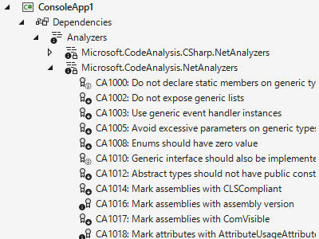

# .NET の文字列比較でカルチャー未指定を検知する

[先日の C# 配信](https://www.youtube.com/watch?v=M5weHOCzJ6E)で、
「これはブログに書いておくと助かる人がいるんじゃないか」と言われたものをブログ化。

## 背景: カルチャー依存問題再び

うちのブログでも何回か書いてるんですが、 .NET の文字列比較は、カルチャー依存比較するものと Ordinal (文字コード通り)比較するものが混在していて、なかなかにやばいです。

* [.NET のカルチャー依存 API 問題](../../../2021/8/invariantculture/index.md)
* [忘れがちなカルチャー依存問題](../../3/string-order/index.md)

[例えば以下のようなやつ](https://gist.github.com/ufcpp/071785157dfb8402af27b443427f8b90)。

<pre class="source" title="正気とは思えない ContaisKey">
using static System.Console;

// 正規化すると同じ文字になる、文字コード的には別の文字。
var s1 = &quot;a\u0301&quot;; // á = a + ́
var s2 = &quot;\u00e1&quot;; // á

// これは false。Ordinal 比較。
WriteLine(new Dictionary&lt;string, int&gt; { { s1, 0 } }.ContainsKey(s2));

// これは true。CurrentCulture 比較。
WriteLine(new SortedDictionary&lt;string, int&gt; { { s1, 0 } }.ContainsKey(s2));
</pre>

なんでこんなことになるかというと、

* `Dictionary` は `EqualityComparer` 依存
    * `EqualityComparer` は `Ordinal` 比較
    * `Ordinal` 比較だと、文字コード的に別の文字は一致しない
* `SortedDictionary` は `Comparer` 依存
    * `Comparer` は `CurrentCulture` 比較
    * `CurrentCulture` 比較だと、たいていのカルチャーで `a\u0301` と `\u00e1` を同一視

という仕組み。

やばい。

前述のブログで一応の解決策として、
[InvariantGlobalization](https://learn.microsoft.com/ja-jp/dotnet/core/runtime-config/globalization) モード指定してしまうという案も書いたんですが、
このモード変更は影響範囲が結構大きいので、
保守しているコードベースがでかいとなかなか踏み切れない方も多いと思います。

## コード解析

このカルチャー依存文字列比較問題は .NET の中の人も把握していて、
.NET 5 の頃にいろいろと対策をしました。
その対策の1つに、[NetAnalyzers](https://learn.microsoft.com/ja-jp/dotnet/fundamentals/code-analysis/overview?tabs=net-7) の提供があります。

NetAnalyzers は要するに、「.NET SDK 付属の公式コード解析」です。
例えば Visual Studio からなら、Dependencis → Analyzers → Microsoft.CodeAnalysis.NetAnalysers のところで確認できます。

この中で、カルチャー依存 API 対策になっているのは以下の項目。

* CA1304: Specify CultureInfo
* CA1305: Specify IFormatProvider
* CA1307: Specify StringComparison for clarity
* CA1310: Specify StringComparison for correctness

こいつら、デフォルトでは Silent なんですよね…
(Silent = 何も表示しない。エラーや警告はおろか、サジェストのアイコンすら出ない。)

カルチャー依存 API のやばさのわりに Silent。
まあ、 .NET Framework 1.0 から .NET 5 までの十数年、ずっとそうでしたからね…

ということで、このコード解析の警告・エラー レベルを上げてしまった方がいいかもしれません。
.editorconfig に以下のような行を足せばエラーにできます。

<pre class="source">
[*.cs]
dotnet_diagnostic.CA1304.severity = error
dotnet_diagnostic.CA1305.severity = error
dotnet_diagnostic.CA1307.severity = error
dotnet_diagnostic.CA1310.severity = error
</pre>

例えば以下のようなメソッドを警告にできます。

<pre class="source" title="">
using System.Resources;

static string? M(ResourceManager m) =&gt; m.GetString(&quot;&quot;); // CA1304
DateTime.Now.ToString(); // CA1305
&quot;&quot;.IndexOf(' '); // CA1307
&quot;abc&quot;.StartsWith(&quot;abc&quot;); // CA1310
</pre>
