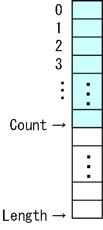

# 配列リスト

##  概要

「[配列](../../csharp/structured/st_array.md#array)」も、
同じ型のデータを複数集めた物ですから、
コレクションの一種です。
実際、C# の配列は <code>System.Collections.ICollection</code> という「[インターフェース](../../csharp/oop/oo_interface.md#interface)」を実装していて、コレクションとして扱うことができます。

ですが、単なる配列の場合、
コレクションとして使うには幾分か機能不足な部分があります。

* 最初に配列を作ったときに指定した長さ以上の要素を持てない。

* 新しい要素の挿入・削除ができない。

ということで、
配列に

* 要素数が足りなくなったら自動的に配列を確保しなおす。

* 新しい要素の挿入・削除。

という機能を追加したコレクションクラスを作ることがあります。

このような機能を持つクラスは、ライブラリによって名前がまちまちで、
C++ の STL では 「[vector](../../stl/seq_container/vector.md#vector)」、
C# （.NET Framework）では System.Collections.ArrayList や System.Collections.Generic.List&lt;T&gt; という名前になっています。
ここでは「<strong id="array" class="keyword">配列リスト</strong>」と呼ぶことにしましょう。

##  特徴

配列リストは以下のような利点を持っています。

* 実装が単純（作るのが楽というだけではなく、動作が高速）。

* 「[インデクサー](../../csharp/oop/oo_indexer.md#indexer)」を使った要素へのランダムアクセスが、配列とほとんど変わらない速度（もちろんオーダーは O(1)）でできる。

しかしながら、所詮中身は配列なので、
以下のような欠点が残っています。

* 末尾以外への要素の挿入・削除が低速（要素数を n として平均 O(n)）。

##  実装方法

配列リストは、
単純に配列をラッピングするだけなので、実装が非常に簡単です。
まず、配列と、（確保した長さとは別に）実際に入っている要素の数を保持する変数を用意します。

<pre class="source" title="" lang="">
<code>class ArrayList&lt;T&gt; : IEnumerable&lt;T&gt;
{
  T[] data;
  int count;
}
</code></pre>

配列は、図1に示すように、実際に格納されている要素数（Count）よりも大きめに確保しておきます。

<pre class="source" title="" lang="">
<code>public ArrayList(int capacity)
{
  this.data = new T[capacity];
  this.count = 0;
}
</code></pre>

<figure>
	
	<figcaption>大きめに配列を確保</figcaption>
</figure>

要素を追加していって、
配列の長さが足りなくなったら、配列を確保しなおします。
新たに確保しなおす配列の長さをどうするかは自由に決めれますが、
2倍ずつ長くする場合が多いです。

<pre class="source" title="" lang="">
<code>/// &lt;summary&gt;
/// 配列を確保しなおす。
/// &lt;/summary&gt;
/// &lt;remarks&gt;
/// 配列長は2倍ずつ拡張していきます。
/// &lt;/remarks&gt;
void Extend()
{
  T[] data = new T[this.data.Length * 2];
  for (int i = 0; i &lt; this.data.Length; ++i) data[i] = this.data[i];
  this.data = data;
}
</code></pre>

中身は単なる配列なので、
末尾以外の位置の要素の挿入・削除は、
要素を1つずつずらして隙間を空ける/埋める作業が必要になります。
したがって、末尾以外への要素の挿入・削除は非常に低速です。

<pre class="source" title="" lang="">
<code>/// &lt;summary&gt;
/// i 番目の位置に新しい要素を追加。
/// &lt;/summary&gt;
/// &lt;param name="i"&gt;追加位置&lt;/param&gt;
/// &lt;param name="elem"&gt;追加する要素&lt;/param&gt;
public void Insert(int i, T elem)
{
  if (this.count &gt;= this.data.Length)
    this.Extend();

  for (int n = this.count; n &gt; i; --n)
  {
    this.data[n] = this.data[n - 1];
  }
  this.data[i] = elem;
  ++this.count;
}

/// &lt;summary&gt;
/// i 番目の要素を削除。
/// &lt;/summary&gt;
/// &lt;param name="i"&gt;削除位置&lt;/param&gt;
public void Erase(int i)
{
  for (int n = i; n &lt; this.count - 1; ++n)
  {
    this.data[n] = this.data[n + 1];
  }
  --this.count;
}
</code></pre>

##  サンプルソース

C# サンプルソースを示します。

[https://github.com/ufcpp/UfcppSample/blob/master/Chapters/Algorithm/Collections/ArrayList.cs](https://github.com/ufcpp/UfcppSample/blob/master/Chapters/Algorithm/Collections/ArrayList.cs)
