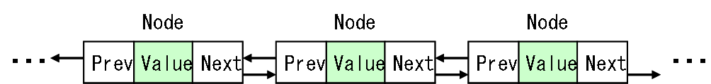

# 双方向連結リスト

## <a id="sec-generated-title-1"></a> <a id="abstract"></a>概要

「[片方向連結リスト](col_flist.md)」でも説明しましたが、
ノードと呼ばれる物を1つずつ連結して作るコレクションを<strong id="linked" class="keyword">連結リスト</strong>
と呼びます。
「[片方向連結リスト](col_flist.md#flist)」では、各ノードに「次のノード」の情報を持たせることで、
ノードを連結していました。

これに対して、
各ノードが「次のノード」だけでなく「前のノード」の情報も持っているものを<strong id="blist" class="keyword">双方向連結リスト</strong>（bidirectional linked list）と呼びます。
「[片方向連結リスト](col_flist.md#flist)」には制限が多く、用途の幅がそれほど広くないのに対して、
こちらはコレクションとしていろいろと応用が利きます。

<figure>

[](../../../../assets/media/ufcpp2000/algorithm/fig/col_blist0.png)

<figcaption>片方向連結リスト</figcaption>
</figure>


## <a id="sec-generated-title-2"></a> <a id="character"></a>特徴

双方向連結リストは以下のような利点を持っています。

* 「[片方向連結リスト](col_flist.md#flist)」と同様に、常に要素数分のメモリだけ確保しておける。

* あるノードの直後および直前に新しい要素を挿入する場合、一定時間（O(1)）で行える。

* あるノードの削除を一定時間（O(1)）で行える。


ただし、以下のような欠点もあります。

* 「[片方向連結リスト](col_flist.md#flist)」と同様に、リスト中の要素にランダムアクセスできない。

* 「[片方向連結リスト](col_flist.md#flist)」と比べて、ちょっとだけ余分にメモリが必要。

* 先頭から順に、あるいは末尾から逆順にしか要素にアクセスできない。

* 「あるノード前後への挿入・削除が O(1)」といっても、そのノードを探してくる操作自体は O(n)。


要素の検索には時間がかかるものの、
挿入・削除が高速なので、名簿等、文字通りのリスト管理にはこの双方向連結リストがよく使われます。
なので、単にリストとか連結リストという言葉で双方向連結リストを指す場合もあります。
C++ の STL では双方向連結リストが単に list という名前ですし、
C# でも LinkedList という名前になっています。


## <a id="sec-generated-title-3"></a> <a id="impl"></a>実装方法

まず、ノードを実装します。
「[片方向連結リスト](col_flist.md#flist)」の場合と比べて、
「前のノード」を指す <code>prev</code> というメンバー変数が増えています。

```csharp
public class Node
{
  T val;
  Node prev;
  Node next;

  internal Node(T val, Node prev, Node next)
  {
    this.val = val;
    this.prev = prev;
    this.next = next;
  }

  public T Value
  {
    get { return this.val; }
    set { this.val = value; }
  }

  public Node Next
  {
    get { return this.next; }
    internal set { this.next = value; }
  }

  public Node Previous
  {
    get { return this.prev; }
    internal set { this.prev = value; }
  }
}
```


片方向連結リストのときと同様に、
<code>Next</code> と <code>Previous</code> の「[アクセスレベル](../../csharp/oop/oo_conceal.md#level)」は internal にしておきます。

そして、双方向連結リスト本体の実装では、
リストの先頭ノードや末尾ノードを持つ代わりに、
以下のようなダミーの（有効な値を持たない）ノードを持つ実装方法が一般的です。

```csharp
public class LinkedList<T> : IEnumerable<T>
{
  Node dummy;
}
```


リストの先頭および末尾のノードは、それぞれ <code>dummy.Next</code> および <code>dummy.Previous</code> に格納します。
ただし、初期状態では、<code>dummy.Next</code> および <code>dummy.Previous</code> には <code>dummy</code> 自身の参照を入れておきます。

```csharp
public LinkedList()
{
  this.dummy = new Node(default(T), null, null);
  this.dummy.Next = this.dummy;
  this.dummy.Previous = this.dummy;
}

/// <summary>
/// リストの先頭ノード。
/// </summary>
public Node First
{
  get { return this.dummy.Next; }
}

/// <summary>
/// リストの末尾ノード。
/// </summary>
public Node Last
{
  get { return this.dummy.Previous; }
}
```


このように、ダミーノードを使えば、
先頭・末尾への要素の挿入・削除を特別扱いする必要がなくなります。
ちなみに、ダミーノード自身は、
（値に意味はないけど）先頭よりも1つ前、末尾よりも1つ後ろに常に位置することになり、
リストの終端判定に使う事ができます。

```csharp
/// <summary>
/// リストの終端（末尾よりも後ろの番兵に当たるノード）。
/// </summary>
public Node End
{
  get { return this.dummy; }
}
```


例えば、
ノードの先頭から順に全ての要素にアクセスするには、以下のようなコードを書きます。

```csharp {highlight-text="n != this.End"}
for (Node n = this.First; n != this.End; n = n.Next)
  Console.Write(n.Value);
```


リストへの要素の追加・削除は以下のように行います。

```csharp
/// <summary>
/// ノード n の後ろに新しい要素を追加。
/// </summary>
/// <param name="n">要素の挿入位置</param>
/// <param name="elem">新しい要素</param>
/// <returns>新しく挿入されたノード</returns>
public Node InsertAfter(Node n, T elem)
{
  Node m = new Node(elem, n, n.Next);
  n.Next.Previous = m;
  n.Next = m;
  return m;
}

/// <summary>
/// ノード n の前に新しい要素を追加。
/// </summary>
/// <param name="n">要素の挿入位置</param>
/// <param name="elem">新しい要素</param>
/// <returns>新しく挿入されたノード</returns>
public Node InsertBefore(Node n, T elem)
{
  Node m = new Node(elem, n.Previous, n);
  n.Previous.Next = m;
  n.Previous = m;
  return m;
}

/// <summary>
/// ノード n の自身を削除。
/// </summary>
/// <param name="n">要素の削除位置</param>
/// <returns>削除した要素の次のノード</returns>
public Node Erase(Node n)
{
  if (n == this.dummy)
  {
    return this.dummy;
  }
  n.Previous.Next = n.Next;
  n.Next.Previous = n.Previous;
  return n.Next;
}
```


先ほども言いましたが、ダミーノードを使うことによって、
先頭・末尾への要素の挿入・削除は特別扱いする必要がありません。
以下のようにして実装できます。

```csharp
/// <summary>
/// 先頭に新しい要素を追加。
/// </summary>
/// <param name="elem">新しい要素</param>
/// <returns>新しく挿入されたノード</returns>
public Node InsertFirst(T elem)
{
  return this.InsertAfter(this.dummy, elem);
}

/// <summary>
/// 末尾に新しい要素を追加。
/// </summary>
/// <param name="elem">新しい要素</param>
/// <returns>新しく挿入されたノード</returns>
public Node InsertLast(T elem)
{
  return this.InsertBefore(this.dummy, elem);
}

/// <summary>
/// 先頭の要素を削除。
/// </summary>
public void EraseFirst()
{
  this.Erase(this.First);
}

/// <summary>
/// 末尾の要素を削除。
/// </summary>
public void EraseLast()
{
  this.Erase(this.Last);
}
```


これらの操作は常に一定の時間で実行可能です。
ただ、リストに含まれている要素数を求めるのは、
片方向連結リストと同様に、
前から順にノードをたどって数えるしかありません。
（要素数を保持しておく変数を別に用意しておくという手はあります。）

```csharp
/// <summary>
/// 要素の個数。
/// </summary>
public int Count
{
  get
  {
    int i = 0;
    for (Node n = this.First; n != this.End; n = n.Next)
      ++i;
    return i;
  }
}
```


## <a id="sec-generated-title-4"></a> <a id="sample"></a>サンプルソース

C# サンプルソースを示します。

[https://github.com/ufcpp/UfcppSample/blob/master/Chapters/Algorithm/Collections/LinkedList.cs](https://github.com/ufcpp/UfcppSample/blob/master/Chapters/Algorithm/Collections/LinkedList.cs)
