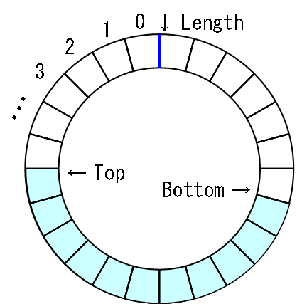

# 循環バッファ

## 概要
「[配列リスト](col_array.md#array)」は、
要素へのランダムアクセスが非常に高速という利点がある一方、
末尾以外への要素の挿入が極端に遅いという欠点がありました。
用途によってはこれでも十分なのですが、
ある用途においては、末尾だけでなく先頭にも要素の挿入・削除を行いたい場合があります。

そこで、先頭と末尾の要素の挿入・削除を高速に（オーダー O(1) で）行えるデータ構造として、
<strong id="circular" class="keyword">循環バッファ</strong>（circular buffer）という物が考えられています。
循環バッファはリングバッファ（ring buffer）等とも呼ばれます。

循環バッファは、その名前の通り、
配列の先頭と末尾を繋いだ環のようなイメージのデータ構造です（図1）。

<figure>
	
	<figcaption>循環バッファ</figcaption>
</figure>

## 特徴
循環バッファは以下のような利点を持っています。

* 「[配列リスト](col_array.md#array)」と同様に、高速な（オーダー O(1)）ランダムアクセスが可能。

* 先頭および末尾への要素の追加・削除が一定時間（O(1)）で行える。

ただし、以下のような欠点もあります。

* オーダーは O(1) でも、オーバーヘッドが生じるため、「[配列リスト](col_array.md#array)」と比べると少しランダムアクセスが遅い。

* 先頭と末尾以外への要素の挿入・削除は相変わらず遅い。

## 実装方法
配列の先頭と末尾を環のように繋ぐというのをどうやって実装するかと言うと、
答えは簡単で、

<pre class="source" title="" lang="">
<code>data[i % data.Length]
</code></pre>

というように、
配列長による剰余演算でアクセスする位置 <code>i</code> をクリッピングします。

そして、先頭と末尾の両方への要素の挿入・削除を高速に行うために、
要素が入っている先頭位置を表すメンバー変数 <code>top</code> と、
末尾位置を表す <code>bottom</code> を用意します。

<pre class="source" title="" lang="">
<code>T[] data;
int top, bottom;
</code></pre>

先頭から i 番目の要素へのアクセスは以下のようにして行います。

<pre class="source" title="" lang="">
<code>public T this[int i]
{
  get
  {
    return this.data[(i + this.top) % this.data.Length];
  }
  set
  {
    this.data[(i + this.top) % this.data.Length] = value;
  }
}
</code></pre>

ただ、一般に、剰余演算は遅い演算（四則演算の中ではダントツで遅い）なので、
極力避けたいものです。
配列長 <code>data.Length</code> が2の冪（
        2n
       の形で表される数）のときには、以下のように、
剰余演算を論理 AND 演算に置き換えることができるので、
配列長を2の冪に限定してこの方法を使って循環バッファを実装するのが一般的です。

<pre class="source" title="" lang="">
<code>public CircularBuffer(int capacity)
{
  capacity = Pow2((uint)capacity);
  this.data = new T[capacity];
  this.top = this.bottom = 0;
  this.mask = capacity - 1;
}

static int Pow2(uint n)
{
  --n;
  int p = 0;
  for (; n != 0; n &gt;&gt;= 1) p = (p &lt;&lt; 1) + 1;
  return p + 1;
}

public T this[int i]
{
  get
  {
    return this.data[(i + this.top) &amp; this.mask];
  }
  set
  {
    this.data[(i + this.top) &amp; this.mask] = value;
  }
}
</code></pre>

先頭への要素の挿入・削除は以下のように行います。

<pre class="source" title="" lang="">
<code>/// &lt;summary&gt;
/// 先頭に新しい要素を追加。
/// &lt;/summary&gt;
/// &lt;param name="elem"&gt;追加する要素&lt;/param&gt;
public void InsertFirst(T elem)
{
  if (this.Count &gt;= this.data.Length - 1)
    this.Extend();

  this.top = (this.top - 1) &amp; this.mask;
  this.data[this.top] = elem;
}

/// &lt;summary&gt;
/// 先頭の要素を削除。
/// &lt;/summary&gt;
public void EraseFirst()
{
  this.top = (this.top + 1) &amp; this.mask;
}
</code></pre>

末尾に関しては以下の通りです。

<pre class="source" title="" lang="">
<code>/// &lt;summary&gt;
/// 末尾に新しい要素を追加。
/// &lt;/summary&gt;
/// &lt;param name="elem"&gt;追加する要素&lt;/param&gt;
public void InsertLast(T elem)
{
  if (this.Count &gt;= this.data.Length - 1)
    this.Extend();

  this.data[this.bottom] = elem;
  this.bottom = (this.bottom + 1) &amp; this.mask;
}

/// &lt;summary&gt;
/// 末尾の要素を削除。
/// &lt;/summary&gt;
public void EraseLast()
{
  this.bottom = (this.bottom - 1) &amp; this.mask;
}
</code></pre>

見ての通り、いずれも要素数に関係なく、一定時間で挿入・削除が可能です。

## サンプルソース
C# サンプルソースを示します。

[https://github.com/ufcpp/UfcppSample/blob/master/Chapters/Algorithm/Collections/CircularBuffer.cs](https://github.com/ufcpp/UfcppSample/blob/master/Chapters/Algorithm/Collections/CircularBuffer.cs)
