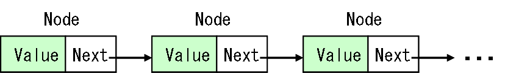

# 片方向連結リスト

## <a id="sec-generated-title-1"></a> <a id="abstract"></a>概要

「[配列リスト](col_array.md#array)」や「[循環バッファ](col_circular.md#circular)」を使う場合、
要素の追加に柔軟に対応するためには、
実際に格納している要素の数よりも多めにメモリを確保しておく必要があります。
これに対して、<strong id="linked" class="keyword">連結リスト</strong>と呼ばれるデータ構造ならば、
常に必要な分のメモリだけ確保しておけば十分です。

連結リストには、大きく分けて片方向連結リストと両方向連結リストと呼ばれるものがあり、
ここで説明するのは前者の<strong id="flist" class="keyword">片方向連結リスト</strong>（forward linked list）です。

片方向連結リストは、図1に示すように、
ノード（node: 節）と呼ばれるデータ構造を繋いで出来たものです。
各ノードは、格納したい値 <code>Value</code> と、
次のノードへの参照（C/C++ 的にはポインター） <code>Next</code> を持っています。

<figure>
	[](../../../../assets/media/ufcpp2000/algorithm/fig/col_flist0.png)
	<figcaption>片方向連結リスト</figcaption>
</figure>


片方向連結リストはメモリ効率がいいという利点はあるのですが、
制約も多く、使い道は限定されています。


## <a id="sec-generated-title-2"></a> <a id="character"></a>特徴

片方向連結リストは以下のような利点を持っています。

* 「[配列リスト](col_array.md#array)」や「[循環バッファ](col_circular.md#circular)」のように、予め大きめのメモリを確保しておく必要がなく、常に要素数分のメモリだけ確保しておける。

* あるノードの直後に新しい要素を挿入する場合、一定時間（O(1)）で行える。

* あるノードの直後のノード（そのノード自身ではなく、直後）の削除を一定時間（O(1)）で行える。


ただし、以下のような欠点もあります。

* リスト中の要素にランダムアクセスできない。

* 先頭から順にしか要素にアクセスできない（逆順参照すらできない）。

* 「あるノードの直後への挿入・削除が O(1)」といっても、そのノードを探してくる操作自体は O(n)。従って、リストの先頭以外への要素の挿入・削除はそれほど得意ではない。


結局の所、「リスト先頭への要素の追加・削除が、計算量・メモリ量の両面で効率よくできる」というのが片方向連結リストの唯一の強みになります。
（この特徴から、スタックというデータ構造の実装にはよく使われます。）


## <a id="sec-generated-title-3"></a> <a id="impl"></a>実装方法

まず、ノードを実装します。
最初に説明したように、
ノードは要素を格納しておくための変数と、
次のノードを指す参照変数を持っています。

```csharp
public class Node<T>
{
  T val;
  Node next;

  internal Node(T val, Node next)
  {
    this.val = val;
    this.next = next;
  }

  /// <summary>
  /// 格納している要素を取得。
  /// </summary>
  public T Value
  {
    get { return this.val; }
    set { this.val = value; }
  }

  /// <summary>
  /// 次のノード。
  /// </summary>
  public Node Next
  {
    get { return this.next; }
    internal set { this.next = value; }
  }
}
```


ここで1つ注意しておくべきことは、
次のノードを指す「[プロパティ](../../csharp/oop/oo_property.md#property)」の <code>Next</code> の「[アクセスレベル](../../csharp/oop/oo_conceal.md#level)」は internal にしておきます。
また、ノードのコンストラクタも internal にします。
これは、ノードの連結構造を変更できるのは片方向連結リスト内からのみにするためです。
もし、リスト外からノードの連結構造を変更できた場合、
利用者の誤った操作でデータ構造が壊れてしまう可能性があります。

そして、片方向連結リスト本体ですが、
リストの先頭ノードを格納するための変数を1つ持ちます。

```csharp
public class ForwardLinkedList<T> : IEnumerable<T>
{
  Node first;
}
```


そして、リストの先頭への要素の追加・削除は以下のように行います。

```csharp
/// <summary>
/// 先頭に新しい要素を追加。
/// </summary>
/// <param name="elem">新しい要素</param>
/// <returns>新しく挿入されたノード</returns>
public Node InsertFirst(T elem)
{
  Node m = new Node(elem, this.first);
  this.first = m;
  return m;
}

/// <summary>
/// 先頭の要素を削除。
/// </summary>
public void EraseFirst()
{
  if (this.first != null)
    this.first = this.first.Next;
}
```


また、以下のようにして、ノードを与えてそのノードの直後の要素を追加・削除できます。

```csharp
  /// <summary>
  /// ノード n の後ろに新しい要素を追加。
  /// </summary>
  /// <param name="n">要素の挿入位置</param>
  /// <param name="elem">新しい要素</param>
  /// <returns>新しく挿入されたノード</returns>
  public Node InsertAfter(Node n, T elem)
{
  Node m = new Node(elem, n.Next);
  n.Next = m;
  return m;
}

/// <summary>
/// ノード n の後ろの要素を削除。
/// </summary>
/// <param name="n">要素の削除位置</param>
public void EraseAfter(Node n)
{
  if (n.Next != null)
    n.Next = n.Next.Next;
}
```


見ての通り、これらの操作は常に一定の時間で実行可能です。
しかしながら、ノード自身を削除する場合、
そのノードの直前のノードを探す作業を行う必要があります。

```csharp
/// <summary>
/// ノード n の自身を削除。
/// </summary>
/// <param name="n">要素の削除位置</param>
/// <returns>削除した要素の次のノード</returns>
public Node Erase(Node n)
{
  Node prev = this.first;
  for (; prev != null && prev.Next != n; prev = prev.Next) ;
  if (prev == this.first)
  {
    this.first = null;
    return null;
  }
  if (prev != null)
  {
    this.EraseAfter(prev);
    return prev.Next;
  }
  return null;
}
```


また、リストに含まれている要素数を求めるのも、
前から順にノードをたどって数えるしかありません。
（要素数を保持しておく変数を別に用意しておくという手はあります。）

```csharp
/// <summary>
/// 要素の個数。
/// </summary>
public int Count
{
  get
  {
    int i = 0;
    for(Node n = this.first; n!=null; n=n.Next)
      ++i;
    return i;
  }
}
```


ちなみに、末尾のノードを指す変数も持っておくことで、
末尾への要素の挿入・削除も高速に行うこともできます。
ですが、先頭と末尾の両方に要素の挿入・削除をしたいときには、
片方向ではなく、両方向連結リストを使う場合が多いので、
この方法はあまり使われません。


## <a id="sec-generated-title-4"></a> <a id="sample"></a>サンプルソース

C# サンプルソースを示します。

[https://github.com/ufcpp/UfcppSample/blob/master/Chapters/Algorithm/Collections/ForwardLinkedList.cs](https://github.com/ufcpp/UfcppSample/blob/master/Chapters/Algorithm/Collections/ForwardLinkedList.cs)
