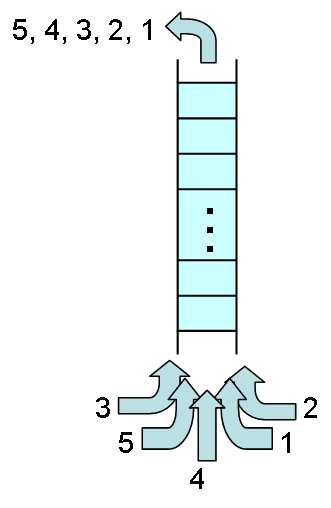
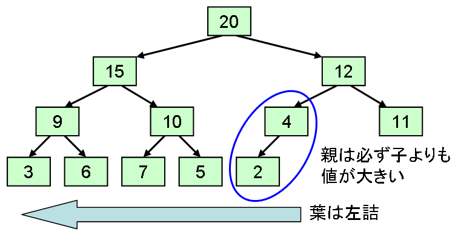
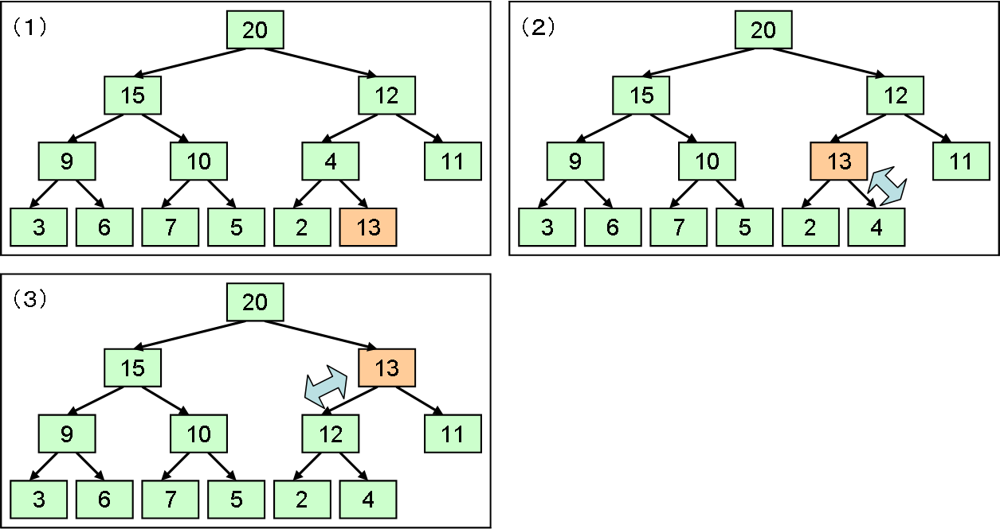
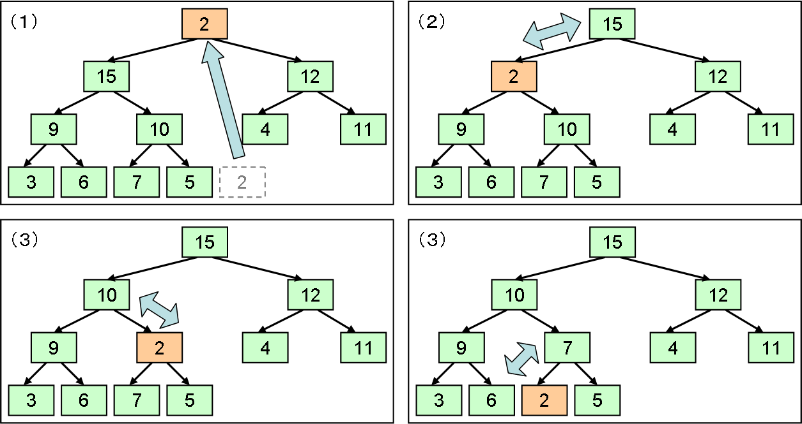
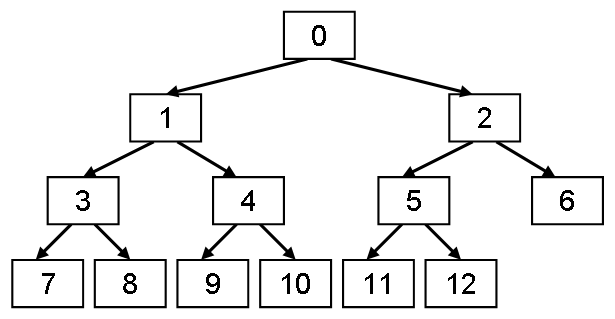

# 優先度付き待ち行列

## <a id="sec-generated-title-1"></a> <a id="abstract"></a>概要

<strong id="priority" class="keyword">優先度付き待ち行列</strong>（priority queue）とは、
ある優先度（例えば、値の大きな物ほど優先度が高いとか）に従って、
優先度の高いものから順に取り出すことの出来るコレクションです。
挿入順序がどうであれ、優先度の高いものが必ず1番最初に取り出されます。

<figure>
	[](../../../../assets/media/ufcpp2000/algorithm/fig/col_heap0.png)
	<figcaption>優先度付き待ち行列</figcaption>
</figure>


名前に「待ち行列」という言葉が含まれていることから分かるように、
優先度付き待ち行列への値の挿入・取り出しはそれぞれエンキュー・デキューといいます。
「[待ち行列](col_queue.md#queue)」のときと同様に、
「[スタック](col_stack.md#stack)」と呼び名をそろえるために、
プッシュ・ポップという名前で実装する場合もあります。

このようなコレクションを実現するためには、
例えば、ソート済みの配列を使うといった方法も考えられますが、
優先度が1番高い要素1つだけが分かれば十分なのに、
ソートを行うのでは余分な労力を裂いていることになります。
これに対して、
優先度が1番高い要素1つだけを効率よく取り出すことの出来る、
ヒープと呼ばれるデータ構造があり、
通常、優先度付き待ち行列は、このヒープを用いて実装されます。


## <a id="sec-generated-title-2"></a> <a id="heap"></a>ヒープ

<strong id="heap" class="keyword">ヒープ</strong>（heap）と言う言葉は、
「塊」とか「積み重ね」という非常に一般的な意味の単語で、
使う分野によって結構意味がばらばらです。
アルゴリズムとデータ構造の分野においては、
常に優先度最大の要素を取り出せる状態に保たれているデータ構造のことを指します。

ヒープは、概念上は以下のような性質を満たす木構造です（図2に例を示します）。

1. 2分木。

2. 葉（末端のノード）を除いて、必ず子ノードを2つ持つ。

3. 葉は左詰

4. 親は子よりも必ず大きな値を持つ。


<figure>
	[](../../../../assets/media/ufcpp2000/algorithm/fig/col_heap1.png)
	<figcaption>ヒープの例</figcaption>
</figure>


ヒープへの値の挿入は、
以下のような手順で行います（図2の例に対して、値13を挿入する例を図3に示します）。

1. 木構造の末端の右端に新しいノードを作る。

2. 新しいノードとその親ノードの持つ値を比べて、親の方が小さければ値を入れ替える。

3. 2の操作を、親の方が値が大きくなるか、根に達するまで繰り返す。


<figure>
	[](../../../../assets/media/ufcpp2000/algorithm/fig/col_heap2.png)
	<figcaption>ヒープへの値の挿入</figcaption>
</figure>


逆に、
ヒープからの値の取り出しは、
以下のような手順で行います（図2の例に対して、値を取り出す例を図4に示します）。

1. 末端右端の要素の値で、根の値を上書きし、末端右端のノードを削除する。

2. 新しい（根になった）ノードとその子ノードの持つ値を比べて、子の方が大きければ値を入れ替える。

3. 2の際、子ノードが2つある場合は、値の大きい方の子ノードと値を入れ替える。

4. 2、3の操作を、親の方が値が大きくなるか、葉に達するまで繰り返す。


<figure>
	[](../../../../assets/media/ufcpp2000/algorithm/fig/col_heap3.png)
	<figcaption>ヒープからの値の削除</figcaption>
</figure>


ヒープへの値の挿入・削除は、
高さの均一な木構造を一直線に見ていくことになるので、
ヒープ中の要素数 n に対して、O(log n) の計算量になります。
（配列を常にソート済みの状態に保とうと思うなら、挿入に O(n) の演算量が必要になるので、ヒープの方が有利。）


## <a id="sec-generated-title-3"></a> <a id="heapimpl"></a>ヒープの実装

ヒープは、概念的には木構造になりますが、
「末端のノードを除いて必ず子ノードを2つ持つ」と「葉は左詰」という構造上の制約があるおかげで、
単なる配列を使って実装することができます。
（要素の追加・削除が絡むので、実際には「[配列リスト](col_array.md#array)」を使う。）

このことを示すために、図2で例示した木構造の各ノードに、
左上から順に0から始まる番号を付けてみましょう。
その様子を図5に示します。

<figure>
	[](../../../../assets/media/ufcpp2000/algorithm/fig/col_heap4.png)
	<figcaption>ヒープのノードに番号付け</figcaption>
</figure>


この図を見れば分かるように、
各ノードの番号に対して、以下の事がいえます。

* <span class="math">n</span>番ノードの親ノードの番号は<span class="math">
          <table class="frac" summary="fraction"><tr><td class="num">n <span class="normal">−</span> <span class="normal">1</span>
            </td></tr><tr><td>
              <span class="normal">2</span>
            </td></tr></table>
        </span>

* <span class="math">n</span>のノードの左の子の番号は<span class="math">2 <span class="normal">×</span> n <span class="normal">+</span> <span class="normal">1</span>
        </span>

* <span class="math">n</span>のノードの右の子の番号は<span class="math">
          2 <span class="normal">×</span>
          <span class="paren" style="font-size:em;">(</span>n <span class="normal">+</span> <span class="normal">1</span><span class="paren" style="font-size:em;">)</span>
        </span>


この性質を使うことで、
「[配列リスト](col_array.md#array)」に対して、以下のような操作を行うことで、
「[配列リスト](col_array.md#array)」をヒープ化できます。

```csharp
/// <summary>
/// ヒープ化されている配列リストに新しい要素を追加する。
/// </summary>
/// <param name="array">対象の配列リスト</param>
static void PushHeap(ArrayList<T> array, T elem)
{
  int n = array.Count;
  array.InsertLast(elem);

  while (n != 0)
  {
    int i = (n - 1) / 2;
    // 親と値を入れ替え
    if (array[n].CompareTo(array[i]) > 0)
    {
      T tmp = array[n]; array[n] = array[i]; array[i] = tmp;
    }
    n = i;
  }
}
```


また、ヒープ化した「[配列リスト](col_array.md#array)」から、
最大の値を持つ要素を削除するには以下のようにします。

```csharp
/// <summary>
/// ヒープから最大値を削除する。
/// </summary>
/// <param name="array">対象の配列リスト</param>
static void PopHeap(ArrayList<T> array)
{
  int n = array.Count - 1;
  array[0] = array[n];
  array.EraseLast();

  for (int i = 0, j; (j = 2 * i + 1) < n; )
  {
    // 値の大きい方の子を選ぶ
    if ((j != n - 1) && (array[j].CompareTo(array[j + 1]) < 0))
      j++;
    // 子と値を入れ替え
    if (array[i].CompareTo(array[j]) < 0)
    {
      T tmp = array[j]; array[j] = array[i]; array[i] = tmp;
    }
    i = j;
  }
}
```


## <a id="sec-generated-title-4"></a> <a id="impl"></a>優先度付き待ち行列の実装

ヒープの作り方さえ分かれば、
優先度付き待ち行列の実装は簡単です。
まず、ヒープ本体となる「[配列リスト](col_array.md#array)」を用意します。

```csharp
class PriorityQueue<T>
  where T : IComparable<T>
{
  ArrayList<T> buffer;
}
```


そして、要素の挿入・削除は以下のように行います。

```csharp
/// <summary>
/// 要素のプッシュ。
/// </summary>
/// <param name="elem">挿入したい要素</param>
public void Push(T elem)
{
  PushHeap(this.buffer, elem);
}

/// <summary>
/// 要素を1つポップ。
/// </summary>
public void Pop()
{
  PopHeap(this.buffer);
}
```


## <a id="sec-generated-title-5"></a> <a id="sample"></a>サンプルソース

C# サンプルソースを示します。

[https://github.com/ufcpp/UfcppSample/blob/master/Chapters/Algorithm/Collections/PriorityQueue.cs](https://github.com/ufcpp/UfcppSample/blob/master/Chapters/Algorithm/Collections/PriorityQueue.cs)
