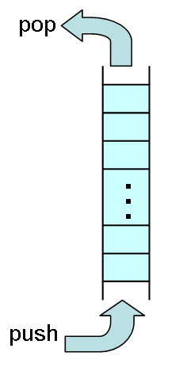

# 待ち行列

##  概要

<strong id="queue" class="keyword">待ち行列</strong>（queue）とは、
図1に示すように、最初に挿入した要素から順に取り出す（first in first out）ようなデータ構造です。
first in first out の頭文字からとって、FIFO バッファと呼んだりもします。

<figure>

<figcaption>待ち行列</figcaption>
</figure>

名前どおり、順番待ちで列を作って並んでいるようなイメージのデータ構造です。
待ち行列に要素を挿入することをエンキュー（enqueue: 列に入る）、
削除することをデキュー（dequeue: 列を出る）といいます。

ただし、コレクションの種類によって要素の挿入・削除の呼び名が異なるのが嫌で、
待ち行列に対しても Push/Pop という名前で挿入・削除を行うような実装方法もよく行われます。

##  実装方法

待ち行列は、コレクションの先頭および末尾の両方に対して要素の挿入・削除を行います。
したがって、待ち行列の実装には、
「[循環バッファ](col_circular.md#circular)」や「[双方向連結リスト](col_blist.md#blist)」を使います。
これらのコレクションは、先頭および末尾への要素の挿入・削除が高速に行えます。

##  サンプルソース

C# サンプルソースを示します。
「[循環バッファ](col_circular.md#circular)」を使った実装です。

[https://github.com/ufcpp/UfcppSample/blob/master/Chapters/Algorithm/Collections/Queue.cs](https://github.com/ufcpp/UfcppSample/blob/master/Chapters/Algorithm/Collections/Queue.cs)
