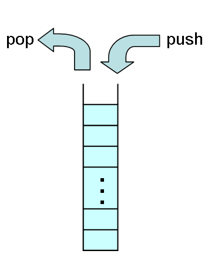

# スタック

## 概要
<strong id="stack" class="keyword">スタック</strong>（stack: 積み重ね、堆積）とは、
図1に示すように、最後に挿入した要素から順に取り出す（first in last out）ようなデータ構造です。
first in last out の頭文字からとって、FILO バッファと読んだりもします。

<figure>
	
	<figcaption>スタック</figcaption>
</figure>

スタックに値を挿入することをプッシュ（push）、
取り出すことをポップ（pop）するといいます。
日本語の場合、プッシュは“積む”といったりもします。
“積む”という言葉通り、
荷物を上に載せていくようなイメージです。
上に積んだ荷物を先にどけないと、下の荷物が取りだせません。

## 実装方法
スタックは、コレクションの先頭あるいは末尾のどちらか一方に対してのみ要素の挿入・削除を行います。
したがって、スタックの実装には、
「[配列リスト](col_array.md#array)」や「[片方向連結リスト](col_flist.md#flist)」を使います。
これらのコレクションは、先頭あるいは末尾への要素の挿入・削除が高速に行えます。

## サンプルソース
C# サンプルソースを示します。
「[配列リスト](col_array.md#array)」を使った実装です。

[https://github.com/ufcpp/UfcppSample/blob/master/Chapters/Algorithm/Collections/Stack.cs](https://github.com/ufcpp/UfcppSample/blob/master/Chapters/Algorithm/Collections/Stack.cs)
