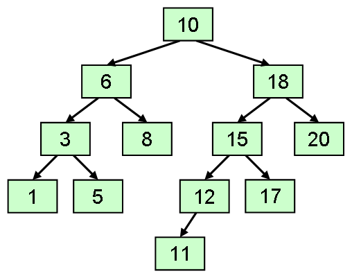
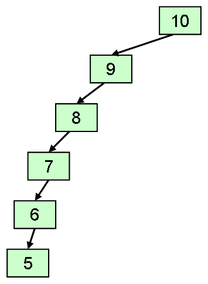

# 2分探索木

## 概要
一般に木構造というと、循環のない有向グラフのことなんですが、
そういう一般論はまた別の機会に話をしましょう。

ここでは、要素の挿入・削除・検索を高速に行うことの出来るコレクションのデータ構造として、
<strong id="bintree" class="keyword">2分探索木</strong>（binary search tree）というものを紹介します。
2分探索木は、以下のような特徴を持つ木構造です（図1）。

* 2分木（各ノードは最大で2本の子を持つ）。

* 全ての要素が「左の子＜親≦右の子」（あるいは「左の子≦親＜右の子」）という大小関係を満たす。

<figure>
	
	<figcaption>2分探索木</figcaption>
</figure>

要素の挿入・削除・検索は、
木の根から葉までの経路を1つ探索することになるので、
木の高さ分に比例する計算量が必要です。
理想的には、木のバランスが均等に整っていれば、
要素数を n として計算量は O(log n) になります。
しかしながら、逆に、
図2に示すように、木が左右どちらかに偏っている場合、
計算量は O(n) になります。

<figure>
	
	<figcaption>偏った2分探索木</figcaption>
</figure>

## 特徴
2分探索木は以下のような利点を持っています。

* 理想的には、要素の挿入・削除・検索が O(log n) で行える。

* 「[ハッシュテーブル](col_hash.md#hashtable)」のように、メモリを多めに確保しておく必要がない。

* また、ハッシュ関数の作り方に悩む必要もない。

* 要素を整列された順序で取り出せる。

ただし、以下のような欠点もあります。

* 木の高さがバランスを保っていないと検索などが O(n) になる。平衡化機構が必要。

ちなみに、2分探索木への、平衡化機構の組込み方にはいくつか種類があります。
実装が簡単なのでよく用いられる物としては、
赤黒木あるいは2色木（red-black tree）と呼ばれるものがあります。

## 2分探索木の実装
まず、2分探索木も構造的には2分木なので、
以下のような左右の子を持つノードを定義します。

<pre class="source" title="" lang="">
<code>public class Node
{
  #region フィールド

  internal T val;
  internal Node left, right, parent;

  internal Node() : this(default(T), null) { }

  internal Node(T val, Node parent)
  {
    this.val = val;
    this.parent = parent;
    this.left = this.right = null;
  }
}
</code></pre>

「[連結リスト](col_flist.md#linked)」と同様に、
<code>left</code>、 <code>right</code> 等の「[アクセスレベル](../../csharp/oop/oo_conceal.md#level)」は internal にしておきます。

そして、2分探索木には、木の根に当たるノードを持つための変数を用意します。

<pre class="source" title="" lang="">
<code>class BinaryTree&lt;T&gt; : IEnumerable&lt;T&gt;
  where T: IComparable&lt;T&gt;
{
  Node root;
}
</code></pre>

前節で説明したような条件を満たす2分探索木中の要素を検索するには、以下のようにします。
要するに、値の大小を見て、左の子を見るか右の子を見るか決めて、
木を根から葉に向かってたどります。

<pre class="source" title="" lang="">
<code>public Node Find(T elem)
{
  Node n = this.root;
  while (n != null)
  {
    if (n.val.CompareTo(elem) &gt; 0) n = n.left;
    else if (n.val.CompareTo(elem) &lt; 0) n = n.right;
    else break;
  }
  return n;
}
</code></pre>

次に、要素の挿入ですが、
とりあえず、平衡化することは考えなければ、
実装方法は簡単で、検索のときと同じ要領で木の中を探索し、
新しい葉を作ります。

<pre class="source" title="" lang="">
<code>public void Insert(T elem)
{
  if (this.root == null)
  {
    this.root = new Node(elem, null);
    return;
  }

  Node n = this.root;
  Node p = null;
  while (n != null)
  {
    p = n;
    if (n.val.CompareTo(elem) &gt; 0) n = n.left;
    else n = n.right;
  }

  n = new Node(elem, p);
  if (p.val.CompareTo(elem) &gt; 0) p.left = n;
  else p.right = n;
}
</code></pre>

ノードの削除も、平衡化のことを考えなければ、
以下のようにして簡単に行えます。

* 左の子が null なら、自身の位置に右の子ノードを繋ぎなおす。

* 右の子が null なら、自身の位置に左の子ノードを繋ぎなおす。

* 両方の子が非 null なら、自身の次に大きな値を持つノード（右の部分木の左端）で自身を置き換える。

<pre class="source" title="" lang="">
<code>public void Erase(Node n)
{
  if (n == null) return;

  if (n.left == null) this.Replace(n, n.right);
  else if(n.right == null) this.Replace(n, n.left);
  else
  {
    Node m = n.right.Min;
    n.Value = m.Value;
    this.Replace(m, m.right);
  }
}

/// &lt;summary&gt;
/// n の片方の子は null、もう片方の子は m という前提の元で、
/// ノード n の位置を子ノード m で置き換える。
/// &lt;/summary&gt;
/// &lt;param name="n"&gt;削除するノード&lt;/param&gt;
/// &lt;param name="m"&gt;置き換える子ノード&lt;/param&gt;
void Replace(Node n, Node m)
{
  Node p = n.parent;
  if (m != null) m.parent = p;
  if (n == this.root) this.root = m;
  else if (p.left == n) p.left = m;
  else p.right = m;
}

public class Node
{
  /// &lt;summary&gt;
  /// このノード以下の部分木中で、最小の要素を持つノード（＝左端ノード）を返す。
  /// &lt;/summary&gt;
  internal Node Min
  {
    get
    {
      Node n = this;
      for (; n.left != null; n = n.left) ;
      return n;
    }
  }
}
</code></pre>

## サンプルソース
C# サンプルソースを示します。
まずは、平衡化機構のないものです。

[https://github.com/ufcpp/UfcppSample/blob/master/Chapters/Algorithm/Collections/BinaryTree.cs](https://github.com/ufcpp/UfcppSample/blob/master/Chapters/Algorithm/Collections/BinaryTree.cs)

（ISet 「[インターフェース](../../csharp/oop/oo_interface.md#interface)」 は、
[Set.cs](../../../../assets/src/Set.cs) で定義しています。）

## 執筆予定
木構造の平衡化、赤黒木。
