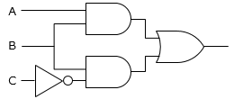
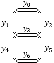
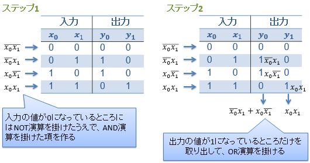
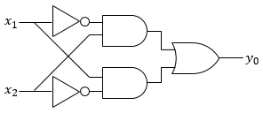

# 組み合わせ回路

## 概要
論理演算の組み合わせで表現できるディジタル回路のことを<strong id="combinational-circuit" class="keyword">組み合わせ回路</strong>（combinational logic circuit）と呼びます。
例えば、AB + BC という論理式を回路図で表現すると図1に示すようになります。

<figure>

<figure>
	
	<figcaption>
            AB + BC
          を表す論理回路図</figcaption>
</figure>

</figure>

このように、論理演算を基本としてディジタル回路を考えることを論理レベルと呼びます。
論理レベルで設計した回路をゲート・レベルに落とし込む作業は機械的に行うことができ、通常は設計支援ツールなどを用いて自動的に行います。

ここでは、組み合わせ回路（論理レベル）の設計方法について説明してしていきます。

## 組み合わせ回路の設計
入力と出力がいずれも0, 1で表せる限り、どんな複雑なものでも否定、論理積、および、論理和を組み合わせた式で表現することができます。
すなわち、組み合わせ回路を設計するためには、以下のような手順を考えることになります。

* 入力、出力を0, 1で表現する

* 入出力の関係を論理式で表す
    * 加法標準形で表す

    * 論理式を簡単化する

* 論理式から組み合わせ回路に起こす

それでは具体的な例を挙げながら、これらの手順についてみていきましょう。

### 仕様例
例として、ディジタル時計などに見られる数字の液晶表示を考えてみましょう。

説明を簡単にするため、表示する数字は1～4の4つだけに絞ります。要するに、表1に示すような入出力を得ることを考えます。

<table summary="ディジタル時計の液晶表示の入出力">
	<caption>
		ディジタル時計の液晶表示の入出力
	</caption>
	<tr>
		<th>入力</th>
		<th>出力</th>
	</tr>
	<tr>
		<td markdown="1">1</td>
		<td markdown="1">
<figure>
	

</figure>

</td>
	</tr>
	<tr>
		<td markdown="1">2</td>
		<td markdown="1">
<figure>
	

</figure>

</td>
	</tr>
	<tr>
		<td markdown="1">3</td>
		<td markdown="1">
<figure>
	

</figure>

</td>
	</tr>
	<tr>
		<td markdown="1">4</td>
		<td markdown="1">
<figure>
	

</figure>

</td>
	</tr>
</table>

ちなみに、この手の液晶表示は、数字を7つ線で表すので、7セグ ディスプレイ（7 segment display）と呼ばれます。
7セグ ディスプレイは設計が簡単なので、組み合わせ回路設計の例としてよく使われます。

## 入出力を0, 1で表現
まず、入出力をすべて0, 1で表現します。

入力は数字が4つあるだけなので、1～4をそれぞれ00, 01, 10, 11などと割り当てることで、2ビットで表現することができます。
入力の上位ビットを x0 下位ビットを x1 と表しましょう。

一方、出力は7本の液晶表示部がそれぞれオン/オフという状態を持っているので、オンを1、オフを0として、7ビット使って表現します。
こちらは図2に示すような順番で、
y0 ～ y6
という記号を振りましょう。

<figure>
	
	<figcaption>7つの液晶表示部に番号を振る</figcaption>
</figure>

このルールに基づいて、表1の入出力を 
x0 ～ x1、y0 ～ y6 
で表すと、表2に示すような入出力表が得られます（このような表を真偽値表と呼びます）。

<table summary="ディジタル時計の液晶表示の入出力の関係を表す真偽値表">
	<caption>
		ディジタル時計の液晶表示の入出力の関係を表す真偽値表
	</caption>
	<tr>
		<th colspan="2">入力</th>
		<th colspan="7">出力</th>
	</tr>
	<tr>
		<td markdown="1">0</td>
		<td markdown="1">0</td>
		<td markdown="1">0</td>
		<td markdown="1">0</td>
		<td markdown="1">1</td>
		<td markdown="1">0</td>
		<td markdown="1">0</td>
		<td markdown="1">1</td>
		<td markdown="1">0</td>
	</tr>
	<tr>
		<td markdown="1">0</td>
		<td markdown="1">1</td>
		<td markdown="1">1</td>
		<td markdown="1">0</td>
		<td markdown="1">1</td>
		<td markdown="1">1</td>
		<td markdown="1">1</td>
		<td markdown="1">0</td>
		<td markdown="1">1</td>
	</tr>
	<tr>
		<td markdown="1">1</td>
		<td markdown="1">0</td>
		<td markdown="1">1</td>
		<td markdown="1">0</td>
		<td markdown="1">1</td>
		<td markdown="1">1</td>
		<td markdown="1">0</td>
		<td markdown="1">1</td>
		<td markdown="1">1</td>
	</tr>
	<tr>
		<td markdown="1">1</td>
		<td markdown="1">1</td>
		<td markdown="1">0</td>
		<td markdown="1">1</td>
		<td markdown="1">1</td>
		<td markdown="1">1</td>
		<td markdown="1">0</td>
		<td markdown="1">1</td>
		<td markdown="1">0</td>
	</tr>
</table>

## 加法標準形の論理式で表す
表2のような真偽値表から機械的に論理式を作る方法があります。
図3に示すように、まず、真偽値表の入力のところの0, 1に応じて入力変数のAND演算を行います。
そして、AND演算で作った項を、真偽値表の出力のところの0, 1に応じてOR演算することで式を得ます。

<figure>
	
	<figcaption>真偽値表から論理式を得る</figcaption>
</figure>

この方法を使って、表2の審議地表から論理式を作ると以下のようになります。

      y0 = x0 x1
      + x0 x1
    

      y1 = x0 x1
    

      y2 = x0 x1
      + x0 x1
      + x0 x1
      + x0 x1
    

      y3 = x0 x1
      + x0 x1
      + x0 x1
    

      y4 = x0 x1
    

      y5 = x0 x1
      + x0 x1
      + x0 x1
    

      y6 = x0 x1
      + x0 x1
    

## 論理式の簡単化
一般に、論理式から組み合わせ回路におこす際、論理式の複雑さにほぼ比例して組み合わせ回路の規模が大きくなります。
回路の大きさは、材料費、故障率、消費電力などに直結しますので、小さければ小さいほど良いです。
このため、論理式可能な限り簡単化する必要があります。

論理式は機械的な作業で簡単化できる場合があります。
例えば、以下の2つの式は全く同じ出力を得ます（a, b の値が何であろうと、常に x と y の値が同じになります）。

      x = a + ab 
    

      y = a
    

x の場合、AND演算とOR演算がそれぞれ1回ずつ必要ですが、y の場合には特に演算が必要なくなります（単に入力を出力側に素通しするだけでよくなります）。
結果的に、y の側の式を使った方が、組み合わせ回路を小さくできます。

このような簡単化には、表3に示すようないくつかのパターンがあります。

<table summary="論理式の簡単化">
	<caption>
		論理式の簡単化
	</caption>
	<tr>
		<th>パターン</th>
		<th>説明</th>
		<th>応用例</th>
	</tr>
	<tr>
		<td markdown="1">ab + ac = a (b + c)</td>
		<td markdown="1">AND と OR には分配法則が成り立つ</td>
		<td markdown="1"></td>
	</tr>
	<tr>
		<td markdown="1">1 + a = 1</td>
		<td markdown="1">真との OR は常に真</td>
		<td markdown="1">
            a + ab
            =
            a (1 + b)
            =
            a 1
            =
            a
          </td>
	</tr>
	<tr>
		<td markdown="1">a + a = 1</td>
		<td markdown="1">NOT との OR は常に真</td>
		<td markdown="1">
            ab + ab
            =
            a (
              b + b
            )
            =
            a 1
            =
            a
          </td>
	</tr>
	<tr>
		<td markdown="1">a a = 1</td>
		<td markdown="1">NOT との AND は常に偽</td>
		<td markdown="1">
            a (
              a + b
            )
            =
            a b
          </td>
	</tr>
	<tr>
		<td markdown="1">a + ab = a + b</td>
		<td markdown="1">
            a + ab
            =
            a 1 + ab
            =
            a (1 + b) + ab
            =
            a + ab + ab
            =
            a + (a + a) b
            =
            a + 1 b
            =
            a + b
          </td>
		<td markdown="1"></td>
	</tr>
</table>

これを表2の例に適用すると、以下のような論理式が得られます。

      y0 = 
        x0
       x1
      + x0 
        x1
      
    

      y1 = x0 x1
    

      y2 = 1
    

      y3 = x0 + x1
    

      y4 = 
        x0
       x1
    

      y3 = x0 + x1
    

      y6 = 
        x0
       x1
      + x0 
        x1
      
    

## 組み合わせ回路化
あとは、このページの冒頭で説明したように、論理式から回路に起こすことで液晶表示を行う組み合わせ回路を作ることができます。
例として、
        y0 = 
          x0
         x1
        + x0 
          x1
        
       を回路化したものを図4に示します。

<figure>
	
	<figcaption>y0を求める回路</figcaption>
</figure>

## ドント・ケア
入力の表現方法によっては、絶対に入力されない組み合わせが生じる場合があります。
この絶対に入力されない組み合わせに対応する出力はどうなっても構わない（don’t care）ことになり、これをドント・ケア（“don’t care” （気にするな）を1つの名詞として使います）と呼びます。

例えば、表4に示すように、入力として0～2までの3つの値を使いたいとします。
この場合、0, 1で表現するためには2ビット（最大で4つまで値を表現可能）が必要なわけですが、4つ中、3つしか値を使わないので、1つ使わない表現が生まれます。

<table summary="3つの値を使う回路の入出力例">
	<caption>
		3つの値を使う回路の入出力例
	</caption>
	<tr>
		<th>入力</th>
		<th>出力</th>
	</tr>
	<tr>
		<td markdown="1">0</td>
		<td markdown="1">1</td>
	</tr>
	<tr>
		<td markdown="1">1</td>
		<td markdown="1">2</td>
	</tr>
	<tr>
		<td markdown="1">2</td>
		<td markdown="1">0</td>
	</tr>
</table>

この表4の入力2ビットを x0, x1、
出力2ビットを y0, y1 で表現すると、
表5のような真偽値表がえられます。

<table summary="3つの値を使う回路の真理値表の例">
	<caption>
		3つの値を使う回路の真理値表の例
	</caption>
	<tr>
		<th>x0</th>
		<th>x1</th>
		<th>y0</th>
		<th>y1</th>
	</tr>
	<tr>
		<td markdown="1">0</td>
		<td markdown="1">0</td>
		<td markdown="1">0</td>
		<td markdown="1">1</td>
	</tr>
	<tr>
		<td markdown="1">0</td>
		<td markdown="1">1</td>
		<td markdown="1">1</td>
		<td markdown="1">0</td>
	</tr>
	<tr>
		<td markdown="1">1</td>
		<td markdown="1">0</td>
		<td markdown="1">0</td>
		<td markdown="1">0</td>
	</tr>
	<tr>
		<td markdown="1">1</td>
		<td markdown="1">1</td>
		<td markdown="1">-</td>
		<td markdown="1">-</td>
	</tr>
</table>

この表で、最下段の出力のハイフン記号がドント・ケアで、文字通り「値が0でも1でも気にしない」という意味です。
「0でも1でも気にしない」ということは、「0か1かをとりあえず入れてみて、論理式が簡単になる方を選ぶ」ということができて、論理回路を小さくできます。
