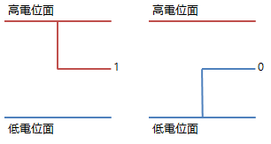
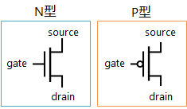
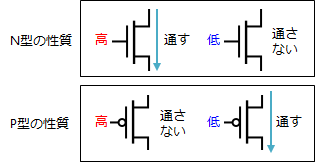
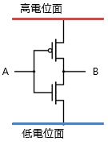
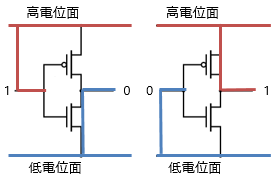
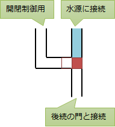
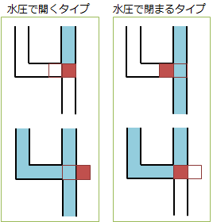

# ゲート

##  概要

「ディジタル回路では、電位の高低によって0と1の2値を表現する」という話はコンピューターに詳しくない人でも聞いたことがあるかもしれません。
本項では、その0と1の2値を表現するために用いる物理素子レベルの説明をします。

ディジタル回路設計では、物理的な素子の性質をそのまま計算するのではなく、
「0、1の切り替え」という抽象的な概念に置き換えて回路設計します。

##  ゲート

ここで重要なことは、物理素子がどうなっているかではありません。
どんなものを使おうと、0、1の切り替え（switching）ができればディジタル回路を作れるということです。
この0、1切り替えを行う素子のことを<strong id="gate" class="keyword">ゲート</strong>（gate: 門）と呼びます。

ディジタル回路は、物理素子レベルでどうやって実現するかまで理解しようと思うと、量子物性、電気回路、制御工学など、深い知識が必要で、かなり難しいです。
難しいことを難しいまま扱おうとしても、大規模化できません。

そこで、ゲートとなるような（0、1の切り替えができるような）素子を作って、
あとは素子の実装がどうなっているかは気にせず、
ゲートの組み合わせとしてディジタル回路を作っていきます。

##  MOSFET

一応、今現在、主流になっているゲートの作り方を紹介しておきましょう。
<strong id="mosfet" class="keyword">MOSFET</strong>（Metal Oxide Semiconductor Field Effect Transistor: 金属酸化膜半導体 電界効果トランジスター）と呼ばれる素子です。

###  電圧の高低で0、1を表現

MOSFETを用いたディジタル回路では、図1に示すように、電位の高い面と電位の低い面を作り、そのどちらとつながっているかによって0, 1という2つの値を表現します。

<figure>

<figcaption>電位の高低で0、1を表現</figcaption>
</figure>

このような電位の高低を使う回路以外にも、とにかく明確に区別のつく2つの状態さえ作ることができればディジタル回路は作れます。
例えば、バイポーラ・トランジスターというものを用いれば、電流の大小によって0、1を表現することになります。
ただ、この方式は消費電力が大きく、一般的にはあまり使われません。

ちなみに、MOSFETを用いたディジタル回路において、電位の高低のどちらを0にして、どちらを1にするかは自由に選べますが、ここでは、高電位を1として説明していきます。
（この流儀を正論理と呼び、逆にする場合を負論理と呼びます。）

###  MOSFETの性質

MOSFETでは、0、1を表現するために、電圧の高低を使います。

MOSFETにはN型とP型の2タイプ（Negative/Positiveの頭文字を取ったもの）があり、図2のような回路記号で記述します。

<figure>

<figcaption>MOSFETの回路記号</figcaption>
</figure>

MOSFETの詳細については別途調べてもらう、例えば[Wikipedia](http://ja.wikipedia.org/wiki/MOSFET)でも見てもらうとして、
簡単に性質だけ話すと、図3に示すようになります。
N型の場合、gateの部分に電圧をかけるとsource-drain間の電気抵抗が下がり、掛けないと電気抵抗がかかります。P型の場合にはその逆の挙動になります。

<figure>

<figcaption>MOSFETの性質</figcaption>
</figure>

###  CMOS回路

前節のMOSFETの性質を使って、ゲート（0、1、つまり、電圧の高低を切り替える素子）を作ることができます。
MOSFETを使ったゲートの作り方にもいくつか手法があるんですが、
消費電力的に有利な手法として、N型とP型を同数組み合わせて作る<strong id="cmos" class="keyword">CMOS</strong>（Complementary MOS: 相補型MOS）回路というものがよく使われます。

例えば、0、1を反転させるための回路（NOT ゲートと呼ばれます）をCMOSで作ると、図4のようになります。

<figure>

<figcaption>CMOS型のNOTゲート</figcaption>
</figure>

図5に、CMOS NOT回路の挙動を示します。入力が1の場合、N型の側の電気抵抗が下がり、低電位面と出力がつながる状態になります。
逆に、入力が0ならP型の側の電気抵抗が下がることで、高電位面と出力がつながります。結果として、入力と出力の0, 1が反転することになります。

<figure>

<figcaption>CMOS型のNOTゲートの挙動</figcaption>
</figure>

##  例えば、電気を使わなくても

ディジタル回路設計では、ゲート、つまり、0、1切り替える素子さえあれば、その実現方法は問いません。
CMOS回路は、生産効率、正確さ、故障しにくさ、動作速度、サイズなどの利点があるため使われているというだけで、
採算度外視すればさまざまなものを使ってディジタル回路を作れます。

0、1が表現できればいいので、何か大小差や高低差があれば構いません。
水圧差を使って水流回路を作ることや、気圧差を使って風回路を作るとかも考えられます。

（実際、どこかの科学博物館に風を使った回路が展示されてるというような話を聞いた記憶があるものの、
具体的な情報源が見つけられず。）

例えば、ダムのような場所で、図6に示すような水圧で開閉するゲートを使えば、水流回路が作れるでしょう。
MOSFETのP型、N型と同様に、水圧で開くタイプと閉まるタイプの2種類があり（図7）、この組み合わせでさまざまなディジタル回路が作れます。

<figure>

<figcaption>水圧ゲート（水流回路の基本素子）。</figcaption>
</figure>

<figure>

<figcaption>2種類の水圧ゲート。</figcaption>
</figure>

もっとも、実用に耐えうる規模、動作速度は得られないでしょう。
ここでの話はあくまで原理的な話で、実際にディジタル回路を作るにあたっては、故障率が低くなければなりません。
ディジタル回路の規模は、ゲートの数にして何百万個もあります。
何百万個というゲートののどれか1つでも欠けてはいけないという要件がある場合、ゲートの1つ1つの信頼性は極めて高くなければいけません。
水流回路などでこの要件を満たせるかというと、現実には厳しいでしょう。
