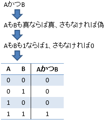
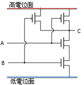
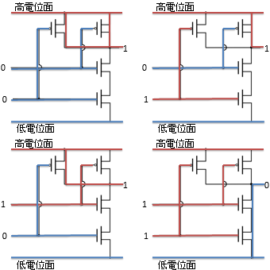
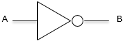
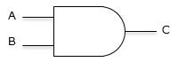
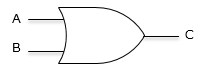
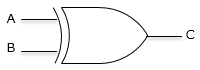
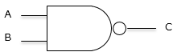
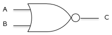

# 論理演算

##  概要

「[ゲート](gatelevel.md)」では、ディジタル回路の基本となるのは、0か1かを選択する回路（ゲート）だということを説明しました。
そして次に必要になるのは、そのゲートを組み合わせて、複雑な回路を設計する手法です。

もちろん、ただやみくもにゲートを並べればいいというものではありません。
ディジタル回路の設計には、論理演算という数学的理論を利用します。
本節以降では、この論理演算の基礎と、論理演算を使ったディジタル回路設計（論理レベル設計）について説明していきます。

##  論理演算

コンピューターの内部では、値はすべて0, 1の2値で表現されます。
この2値に対するいくつかの演算を<strong id="logical-operation" class="keyword">論理演算</strong>（logical operation）と呼びます。
論理演算は、もともとは命題の真偽に関する演算を表していました。
例えば、「AかつBならばCである」というような命題をA∧B→Cという式で表して、真偽に対する演算とみなすものです（このような、論理を数学的に取り扱う学問を数理論理学と呼びます）。

ここで、真と1、偽と0を同じものとみなすことで、0, 1の2値に対する演算と論理演算を同じものだとみなすことができます。
（このような背景から、0, 1だけで表現される値を論理値、0, 1に対するいくつかの演算を論理演算と呼び、論理演算の組み合わせで表現される式を論理式と呼びます。）

例えば、「AかつB」というのは、「AもBも真ならば真、さもなければ偽」という真偽値間の演算とみなせます。
ここで、真を1、偽を0とみなすことで、0, 1の2値間の演算が得られます。このような演算を論理積と呼びます（図1）。

<figure>
	
	<figcaption>論理積演算</figcaption>
</figure>

論理積に加えて、代表的な論理演算に否定と論理和があります。
否定、論理積、および、論理和は、英単語を用いてそれぞれNOT, AND, OR演算と呼ぶこともあります。
論理演算の記法にはいくつか流儀がありますが、代表的なものを表1に示します。

<table summary="否定、論理積、および、論理和演算の記法">
	<caption>
		否定、論理積、および、論理和演算の記法
	</caption>
	<tr>
		<td markdown="1"></td>
		<th>否定</th>
		<th>論理積</th>
		<th>論理和</th>
	</tr>
	<tr>
		<th></th>
		<td markdown="1">NOT A</td>
		<td markdown="1">A AND B</td>
		<td markdown="1">A OR B</td>
	</tr>
	<tr>
		<th>読み方</th>
		<td markdown="1">Aの否定、非A</td>
		<td markdown="1">AかつB</td>
		<td markdown="1">AまたはB</td>
	</tr>
	<tr>
		<th>代数的記法</th>
		<td markdown="1">Ā</td>
		<td markdown="1">AB</td>
		<td markdown="1">A+B</td>
	</tr>
	<tr>
		<th>論理学的記法</th>
		<td markdown="1">¬A</td>
		<td markdown="1">A∧B</td>
		<td markdown="1">A∨B</td>
	</tr>
	<tr>
		<th>C言語記法</th>
		<td markdown="1"><code>!A</code></td>
		<td markdown="1"><code>A &amp; B</code></td>
		<td markdown="1"><code>A | B </code></td>
	</tr>
</table>

代数的記法は、整数の加算・乗算と同じ記号を使って論理演算を表すものです。
AB は、いわば掛け算記号の省略で、省略せずに A×B と書いても同じ意味です。

一方、論理学的記法は論理学でよく使われる記法です。
∧ を wedge（楔型）、∨ を vee （V 字型）と呼んだりもします。

また、プログラミング言語ではキーボードで入力できる記号のみで論理式を表します。
C言語やJava、C#などでは、NOT, AND, OR演算に対してそれぞれ !, &amp;, | の記号（それぞれ、感嘆符、アンパサンド、縦棒）を用います。

Web ページ上での表示の都合で、

それぞれの値がどうなるかを表2に示します。代数的記法は、整数の加算・乗算と同じ記号を使って論理演算を表すものです。

<table summary="否定、論理積、および、論理和の値">
	<caption>
		否定、論理積、および、論理和の値
	</caption>
	<tr>
		<th>A</th>
		<th>B</th>
		<th>否定  Ā</th>
		<th>論理積  AB</th>
		<th>論理和  A+B</th>
	</tr>
	<tr>
		<td markdown="1">0</td>
		<td markdown="1">0</td>
		<td markdown="1">1</td>
		<td markdown="1">0</td>
		<td markdown="1">0</td>
	</tr>
	<tr>
		<td markdown="1">0</td>
		<td markdown="1">1</td>
		<td markdown="1">1</td>
		<td markdown="1">0</td>
		<td markdown="1">1</td>
	</tr>
	<tr>
		<td markdown="1">1</td>
		<td markdown="1">0</td>
		<td markdown="1">0</td>
		<td markdown="1">0</td>
		<td markdown="1">1</td>
	</tr>
	<tr>
		<td markdown="1">1</td>
		<td markdown="1">1</td>
		<td markdown="1">0</td>
		<td markdown="1">1</td>
		<td markdown="1">1</td>
	</tr>
</table>

その他、NOT、AND、OR の組み合わせでも実現できますが、特別な記号が割り当てられているいくつかの演算があります。
このような演算の記法を表3に、演算結果がどうなるかを表4に示します。

<table summary="否定論理積、否定論理和、排他的論理和、および、等価演算の記法">
	<caption>
		否定論理積、否定論理和、排他的論理和、および、等価演算の記法
	</caption>
	<tr>
		<td markdown="1"></td>
		<th>否定論理積</th>
		<th>否定論理和</th>
		<th>排他的論理和</th>
		<th>等価</th>
	</tr>
	<tr>
		<th></th>
		<td markdown="1">A NAND B</td>
		<td markdown="1">A NOR B</td>
		<td markdown="1">A XOR B</td>
		<td markdown="1">A XNOR B</td>
	</tr>
	<tr>
		<th>代数的記法</th>
		<td markdown="1">
            AB
          </td>
		<td markdown="1">
            A + B
          </td>
		<td markdown="1">
              A ⊕ B
          </td>
		<td markdown="1">
              A ≡ B
          </td>
	</tr>
	<tr>
		<th>論理学的記法</th>
		<td markdown="1">¬(A∧B)</td>
		<td markdown="1">¬(A∨B)</td>
		<td markdown="1">¬(A⇔B)</td>
		<td markdown="1">A⇔B</td>
	</tr>
	<tr>
		<th>C言語記法</th>
		<td markdown="1"><code>!(A &amp; B)</code></td>
		<td markdown="1"><code>!(A | B)</code></td>
		<td markdown="1"><code>A ^ B </code></td>
		<td markdown="1"><code>A == B </code></td>
	</tr>
</table>

<table summary="否定論理積、否定論理和、排他的論理和、および、等価演算の値">
	<caption>
		否定論理積、否定論理和、排他的論理和、および、等価演算の値
	</caption>
	<tr>
		<th>A</th>
		<th>B</th>
		<th>否定論理積  
            AB
          </th>
		<th>否定論理和  
            
              A + B
            
          </th>
		<th>排他的論理和  
            A ⊕ B
          </th>
		<th>等価  
            A ≡ B
          </th>
	</tr>
	<tr>
		<td markdown="1">0</td>
		<td markdown="1">0</td>
		<td markdown="1">1</td>
		<td markdown="1">1</td>
		<td markdown="1">0</td>
		<td markdown="1">1</td>
	</tr>
	<tr>
		<td markdown="1">0</td>
		<td markdown="1">1</td>
		<td markdown="1">1</td>
		<td markdown="1">0</td>
		<td markdown="1">1</td>
		<td markdown="1">0</td>
	</tr>
	<tr>
		<td markdown="1">1</td>
		<td markdown="1">0</td>
		<td markdown="1">1</td>
		<td markdown="1">0</td>
		<td markdown="1">1</td>
		<td markdown="1">0</td>
	</tr>
	<tr>
		<td markdown="1">1</td>
		<td markdown="1">1</td>
		<td markdown="1">0</td>
		<td markdown="1">0</td>
		<td markdown="1">0</td>
		<td markdown="1">1</td>
	</tr>
</table>

##  論理演算とディジタル回路

では、どうすれば電子回路を使って論理演算を行えるかについて見ていきましょう。
「[ゲート](gatelevel.md)」で説明しましたが、論理演算の実現にはCMOSと呼ばれる構成の電子回路を用いることが多く、ここでもCMOSを例に挙げて説明していきます。

図2に、CMOSを用いて作られたNAND回路の回路図を示します。
（ANDやORではなく、NANDな理由は、CMOSを用いて作る場合にはNANDの方がシンプルな回路で実現できるためです。NANDが実現できれば、ANDもORも実現することができます。）

<figure>
	
	<figcaption>CMOS NAND回路の回路図</figcaption>
</figure>

「[MOSFETの性質](gatelevel.md#mosfet-structure)」で述べたように、MOSFETと呼ばれる素子は一種のスイッチとして働きます。
AおよびBの値に応じてスイッチが開閉し、Cの値が図3のように変化します。
結果として、AもしくはBのいずれか一方でも0のときにはCが1になり、両方が1の時に限りCが0になります（NAND演算の挙動）。

<figure>
	
	<figcaption>CMOS NAND回路の動作の例</figcaption>
</figure>

このように0, 1を選択するためのゲートとなる素子さえあれば、論理演算を行う回路を作成することができます。
ここでは NAND 演算を例に挙げましたが、同様に、NOT 演算、NOR 演算なども作れます（AND や OR は、NAND、NOR を使っても同様の演算を実現できます）。

このような、論理演算を行うための回路を<strong id="logical-circuit" class="keyword">論理回路</strong>（logical circuit）と呼びます。

##  論理回路記号

論理回路には表4に示すような専用の記号が取り決められています。

<table summary="論理演算を表す回路記号">
	<caption>
		論理演算を表す回路記号
	</caption>
	<tr>
		<td markdown="1"></td>
		<th>回路記号</th>
	</tr>
	<tr>
		<th>否定  
            A
          </th>
		<td markdown="1">
<figure>
	

</figure>

</td>
	</tr>
	<tr>
		<th>論理積  
            AB
          </th>
		<td markdown="1">
<figure>
	

</figure>

</td>
	</tr>
	<tr>
		<th>論理和  
            AB
          </th>
		<td markdown="1">
<figure>
	

</figure>

</td>
	</tr>
	<tr>
		<th>排他的論理和  
            A ⊕ B
          </th>
		<td markdown="1">
<figure>
	

</figure>

</td>
	</tr>
	<tr>
		<th>否定論理積  
            AB
          </th>
		<td markdown="1">
<figure>
	

</figure>

</td>
	</tr>
	<tr>
		<th>否定論理和  
            A + B
          </th>
		<td markdown="1">
<figure>
	

</figure>

</td>
	</tr>
</table>
