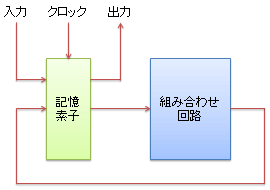
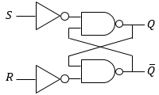
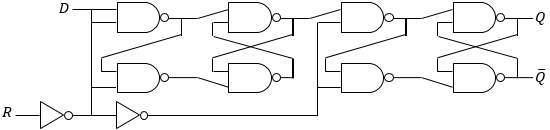
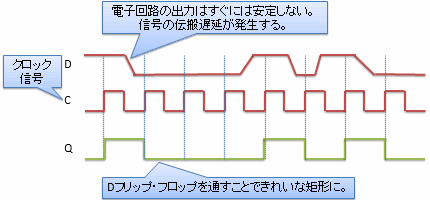
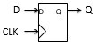
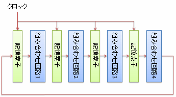
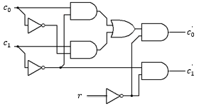
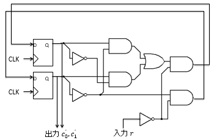

# 順序回路

## 概要
前節で説明した「[組み合わせ回路](combinationalcircuit.md#combinational-circuit)」組み合わせ回路は、回路の出力が入力だけに依存して決まります。
物理的な電気信号の伝播遅延はありますが、信号が安定するのを待ってから出力を見るなら、同じ入力を与えると必ず同じ出力が得られます。
言いかえると、回路の内部に記憶（過去の入力に依存したり、時間で変化したり）を持っていません。
このような無記憶の回路で複雑な処理をしようとすると、回路規模が膨大になったり、電気信号の伝播遅延が非常に大きくなったりしてしまい、
現実的なコスト・演算性能・製造歩留りで回路を作れなくなります。

そこで、記憶素子を導入し、記憶素子＋組み合わせ回路という構成の回路を考えます。
1回の信号伝播ですべてを計算するのではなく、少し計算を進めては記憶し、複数回かけて計算を行います。
このような、記憶を持つ回路を<strong id="sequencial-circuit" class="keyword">順序回路</strong>（sequential logic circuit）と呼びます。

ちなみに、記憶素子のことをレジスター（register）と呼び、
記憶素子の間の信号伝搬（transfer）を考えるという意味で、
順序回路レベルでのディジタル回路設計をレジスター転送レベル（register transfer level、略してRTL）と呼ぶこともあります。

## 順序回路
概要での説明の通り、組み合わせ回路に加えて記憶素子を導入することで、内部状態を持つことができる回路を順序回路と呼びます。
通常は、次節で説明するDフリップ・フロップのような、クロック信号の立ち上がりでだけ内部状態を更新するような素子を使い、
図1に示すような構成で回路を作ります。

（電子回路に対してフィードバックをかけると、電源電圧いっぱいまで、もしくは、電圧0まで振り切れる状態になることがあります。
フリップ・フロップはこれをうまく制御して、安定的に高電圧のまま、もしくは、低電圧のまま居続ける回路を作っています。）

<figure>
	
	<figcaption>順序回路の典型的な構成例</figcaption>
</figure>

回路の内部に状態を持っているので、同じ入力を与えても、入力のタイミングが異なれば出力の値が変わります。
しかし、同じ状態から開始して同じ入力列を同じ順序で与えていけば、結果として得られる出力の列は常に同じになります。
順序回路という名前は、このような「入力の順序に依存した回路」という意味になります

### 記憶素子の構成例
CMOS回路を用いた記憶素子の実装として、最もよくつかわれるのは<strong id="flip-flop" class="keyword">フリップ・フロップ</strong>（flip-flop: シーソーのバッタンという音をあらわす擬音語に由来する）と呼ばれる回路です。
フリップ・フロップは、図2に示すような、NAND回路に対してフィードバック構造を作ることで、値を定常的に保持します。

<figure>
	
	<figcaption>SRフリップ・フロップ</figcaption>
</figure>

図2 に示すのはSRフリップ・フロップと呼ばれるタイプのもので、2つの入力S, Rによって、出力Qの値を保持もしくは更新する回路です。
SRフリップ・フロップの入出力の関係を表1に示します。

<table summary="SRフリップ・フロップの入出力">
	<caption>
		SRフリップ・フロップの入出力
	</caption>
	<tr>
		<td markdown="1">S</td>
		<td markdown="1">R</td>
		<td markdown="1">Q</td>
	</tr>
	<tr>
		<td markdown="1">0</td>
		<td markdown="1">0</td>
		<td markdown="1">直前の値を保持</td>
	</tr>
	<tr>
		<td markdown="1">0</td>
		<td markdown="1">1</td>
		<td markdown="1">0</td>
	</tr>
	<tr>
		<td markdown="1">1</td>
		<td markdown="1">0</td>
		<td markdown="1">1</td>
	</tr>
	<tr>
		<td markdown="1">1</td>
		<td markdown="1">1</td>
		<td markdown="1">値が不定になる</td>
	</tr>
</table>

ただ、実際によくつかわれるのはもう少し複雑で図3に示すような回路構造を持つDフリップ・フロップと呼ばれるタイプのものです。

<figure>
	
	<figcaption>Dフリップ・フロップ</figcaption>
</figure>

Dフリップ・フロップでは、入力Cの値が0から1に変化したときにだけ、入力Dの値で出力Qを上書きします。
入出力の変化の例を図4に示します。

<figure>
	
	<figcaption>Dフリップ・フロップの入出力の変化の例</figcaption>
</figure>

通常、入力Cには図4中のような矩形の周期信号を入力します。
このような周期信号を<strong id="clock-signal" class="keyword">クロック信号</strong>（clock signal）と呼びます。
すなわち、Dフリップ・フロップはクロック信号の立ち上がり（0から1に変化するタイミング）でのみ出力Qの値を変化させる回路です。
クロック信号の立ち上がり以外のタイミングでは、入力Dの値がどうなっていても出力Qは変化しません。
この仕組みによって、Dフリップ・フロップは信号の伝播遅延を吸収する効果があります。

「伝播遅延を吸収」というのをもう少し詳しく説明しましょう。
通常、電子回路の出力は安定するまでに時間がかかり、一時的に値が0, 1に確定しない不安定な状態になります
（図4の入力Dのように、電子回路の電位が高低の間を遷移する過渡的な状態があり、0, 1を正しく判定できない）。
この、0, 1を正しく判定できない時間がしばらく存在することを「信号の伝播が遅延している」といいます。
遅延している信号をDフリップ・フロップに通すことによって、安定した、電位の高低変化がはっきりとした信号を得ることができます。

ちなみに、フリップ・フロップは図5に示すような記号で表すことがあります。
まず四角を書いて、入出力信号の部分にD, Qなどの信号名を、クロック信号を与える部分に三角形を書きます。
また、CLKと書いてクロック信号を表すことが多いです。

<figure>
	
	<figcaption>Dフリップ・フロップを表す記号</figcaption>
</figure>

### 信号の伝播遅延と動作周波数
前節で、記憶素子は電子回路の信号の伝播遅延を吸収する役割があるという話をしました。
その結果、順序回路のクロック信号の周期（clock cycle）は、組み合わせ回路部分の伝播遅延よりも長く設定しなければなりません
（そうしないと、組み合わせ回路の出力がまだ不安定な時に記憶素子の状態を書き換えようとして、正しい値が得られなくなります）。

パソコンのカタログによく「CPUの動作周波数」という言葉が出ていますが、
この動作周波数というのはここで説明したクロック信号の周波数（周期の逆数）のことになります。
動作周波数を上げる（周期を短くする）ためには、組み合わせ回路部分の伝播遅延を極力小さく設計する必要があります。

ちなみに、このクロック信号の周期は、ディジタル回路における時間の最小単位となります。
信号周期を「計算にどのくらいの時間がかかるか」という意味合いで使う場合には、
横文字のまま「nサイクルかかる」というような呼び方をする場合が多いです。

### パイプライン処理
大まかな話でいうと、組み合わせ回路が複雑になればなるほど、回路の伝播遅延が大きくなります。
そこで、Figure 28に示すように、組み合わせ回路の合間合間に記憶素子を挟んで、数サイクルかけて計算を行う回路構成もよく用いられます。
このような構成をパイプライン（pipeline）構成と呼びます。

<figure>
	
	<figcaption>順序回路のパイプライン構成</figcaption>
</figure>

組み合わせ回路を分けることで、1つ1つの回路の伝播遅延は小さくなり、クロック周波数を上げることができます。

もちろん、その分、複数サイクルかけて処理することになるわけで、
1つのデータを処理するのにかかる時間（遅延（delay））はむしろ延びます。
しかし、複数のデータを同時に処理できるので、単位時間あたりに処理できるデータ量（スループット（throughput））は多くなります。

また、「ある処理は1サイクルでできるけども、別のある処理は5サイクルかかる」といったように、かかる時間が違う複数の回路を混在させる場合にも、パイプライン処理は有効です。
すべてを1サイクルで処理しようとすると、最も遅い処理に合わせてクロックを決める必要がありますが、
パイプライン化によってこれを避けることができます。

## 順序回路の設計
順序回路の設計は、要するに、記憶素子の間に挟む組み合わせ回路の設計になります。
したがって、以下のような手順を考えることになります。

* 入出力と、記憶素子の状態を0, 1で表現する

* 入力と記憶素子の状態を与え、出力と記憶素子の次状態（次の周期での状態）を出力する組み合わせ回路を設計する

* 設計した組み合わせ回路と記憶素子を配線する

例として、カウンター回路というものを考えてみましょう。
カウンター回路とは、クロック信号の周期ごとに出力の値を0, 1, 2, 3, …と変化させていく回路です。

### 仕様例
ここでは、以下のようなカウンター回路仕様を考えてみます。

* 記憶素子の状態は2ビットの数値とする
    * 「00→01→10→11→以下00に戻って繰り返し」というように、4つの数字を繰り返す

* 記憶素子の状態をそのまま出力する

* 入力として1ビットのリセット信号を与える
    * リセット信号が0の時はカウンター動作を続ける

    * リセット信号が1の時、次の周期では記憶素子の状態を00に戻す

状態を2ビットで持つので、2ビット・カウンターと呼びます。
それでは、「[組み合わせ回路の設計](combinationalcircuit.md#design)」の例と同様に、順を追って設計していきましょう。

## 入出力と記憶素子の状態を0, 1で表現
仕様の段階でほぼ網羅していますが、再度、2ビット・カウンターの入出力、および、記憶素子の状態をまとめましょう。
論理式で表すことを考えて、記号もここで決めておきます。

* 1ビットのリセット信号rを入力とする
    * rの値が1の時に内部状態をリセットする

* 数値のカウント用に記憶素子の状態を2ビットc0,c1を使う
    * 上位ビットをc0、下位ビットをc1とする

    * 次状態をc0',c1'でという記号で表す

入力および記憶素子の状態と、次状態の関係を真理値表にすると、表1のようになります。
出力については、記憶素子の状態をそのまま出力するだけなので省略します
（c0, c1 の値がそのまま出力になります）。

<table summary="2ビット・カウンターの入出力・記憶素子の状態の関係を表す真理値表">
	<caption>
		2ビット・カウンターの入出力・記憶素子の状態の関係を表す真理値表
	</caption>
	<tr>
		<td markdown="1">r</td>
		<td markdown="1">c0</td>
		<td markdown="1">c1</td>
		<td markdown="1">c0'</td>
		<td markdown="1">c1'</td>
	</tr>
	<tr>
		<td markdown="1">0</td>
		<td markdown="1">0</td>
		<td markdown="1">0</td>
		<td markdown="1">0</td>
		<td markdown="1">1</td>
	</tr>
	<tr>
		<td markdown="1">0</td>
		<td markdown="1">0</td>
		<td markdown="1">1</td>
		<td markdown="1">1</td>
		<td markdown="1">0</td>
	</tr>
	<tr>
		<td markdown="1">0</td>
		<td markdown="1">1</td>
		<td markdown="1">0</td>
		<td markdown="1">1</td>
		<td markdown="1">1</td>
	</tr>
	<tr>
		<td markdown="1">0</td>
		<td markdown="1">1</td>
		<td markdown="1">1</td>
		<td markdown="1">0</td>
		<td markdown="1">0</td>
	</tr>
	<tr>
		<td markdown="1">1</td>
		<td markdown="1">0</td>
		<td markdown="1">0</td>
		<td markdown="1">0</td>
		<td markdown="1">0</td>
	</tr>
	<tr>
		<td markdown="1">1</td>
		<td markdown="1">0</td>
		<td markdown="1">1</td>
		<td markdown="1">0</td>
		<td markdown="1">0</td>
	</tr>
	<tr>
		<td markdown="1">1</td>
		<td markdown="1">1</td>
		<td markdown="1">0</td>
		<td markdown="1">0</td>
		<td markdown="1">0</td>
	</tr>
	<tr>
		<td markdown="1">1</td>
		<td markdown="1">1</td>
		<td markdown="1">1</td>
		<td markdown="1">0</td>
		<td markdown="1">0</td>
	</tr>
</table>

## 論理式化と組み合わせ回路化
表2の真理値表を元に、
「[加法標準形の論理式で表す](combinationalcircuit.md#disjunctive-normal)」、
「[論理式の簡単化](combinationalcircuit.md#simplify)」
の要領で組み合わせ回路の出力となる c0', c1' を論理式で表すと以下のようになります。

            c0'
            =
            r
            (
                c0 c1
                +
                c0c1
            )
        

            c1'
            =
            r
            c1
        

この論理式を組み合わせ回路に起こすと図7のような回路になります。

<figure>
	
	<figcaption>c0',c1' を求める組み合わせ回路</figcaption>
</figure>

## 記憶素子との接続
最後に、前節で得た組み合わせ回路に記憶素子を接続することで、図8に示すような順序回路を得ます。

<figure>
	
	<figcaption>2ビット・カウンターの順序回路</figcaption>
</figure>

## 余談: ハードウェア記述言語
本稿で説明したようなレジスター転送レベルのディジタル回路設計も、信号線や記憶素子の個数が多くなってくると非常に複雑で、
論理式の最適化などを手作業で行うことには限界があります。
実際には、ハードウェア記述言語（hardware description language、略してHDL）と呼ばれる、
人間の読み書きしやすい形式の言語を使って論理式を記述し、最適化は機械に任せるという設計手法が取られます。
HDLには、有名なものだと、Verilog HDLやVHDLと呼ばれるものがあります。
