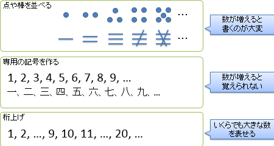
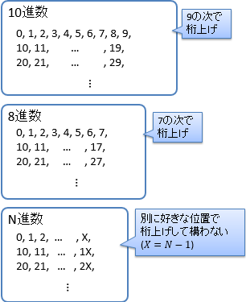
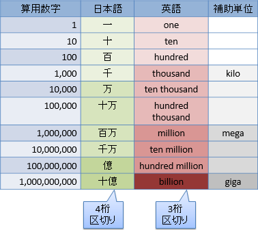
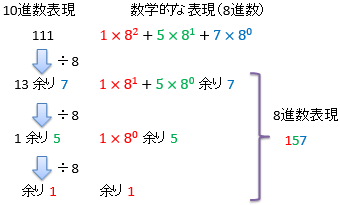
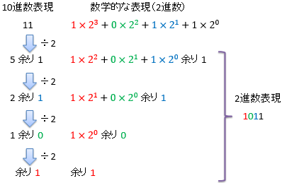

# 日常における数字

##  概要

「[ゲート](../basis/gatelevel.md)」で説明しますが、コンピューターの内部では電圧の高低で0, 1 の 2 値で数字を表現します。
一方で、私たち人間は普段、10進数というものを用いて数字を表現しています。
ただし、「普段、10 進数を用いている」と言っても、何気なく使っていて、数字の表現方法を意識することはあまりないと思います。
そこで本章では、2 進数や10 進数など、数字の表現方法について改めて説明していきます。

##  数字の表し方いろいろ

私たちは普段、10進数というものを使っているわけですが、本当のところは別にどんな表し方をしてもかまいません。
0, 1, 2, …, 9という10個の文字を必ずしも使う必要はありません。
図1に示すように、いろいろな表し方があります。
極端な話、利便性を度外視すれば、個数分だけ点や棒を並べるだけでもかまいません。
数が多くなってくるとこれでは不便なので、利便性を考えた結果、0 ～ 9という記号を使うわけです。
ただ、あまり記号を増やしすぎると覚えきれなくなるので、9の次は「桁上げ」というものを使って10と書きます。

<figure>
	
	<figcaption>数字に使う記号と桁上げ</figcaption>
</figure>

ちなみに、図2に示すように、「桁上げ」を使うにしても、いくつで桁上げするかは自由に選べます。
10進数の場合は9の次で桁上げして10になりますが、例えば、7の次で桁上げすれば8進数、1の次なら2進数になります。

<figure>
	
	<figcaption>桁上げ</figcaption>
</figure>

また、10進数を使うにしても、0 ～ 9という文字以外のものを使ったってかまいません。
例えば、0 ～ 9の代わりに「あかさたなはまやらわ」を使って、1,980を「か、わらあ」と書いてもいいわけです。
これは少々極端な例ではありますが、とにかく、数字を表す際、何の文字を使うか・桁上げをどうするかなど、いくらでも自由な選択が可能です。

##  日常で使われる数字

日常で、<strong id="decimal" class="keyword">10進数</strong>（decimal number）というものが普及している理由は、おそらく人間の指の本数が左右合わせて10本だからでしょう。
片手じゃなくて両手なのは、片手の5だとちょっと数字として小さすぎるからかもしれません。
人間が瞬時に認識できる／短期的にぱっと暗記できるものの個数は大体7±2個くらいだなんて話もあって、その下限の5だと少し心もとないです。

あと、よく考えてみると、図3に示すように、日常的にもう1つ別のn進数が使われています。
算用数字で1, 10, 100, 1000, …と書く分には10進数しか使っていないですが、一、十、百、千、万、…と読み上げると、もう1つ、万進数というものが出てくることに気づきます。
一～千までは10倍ずつですが、万以降は、万、億、兆、京、…と1万倍ずつになります。
英語の場合は万進数ではなく、千進数ですね。thousand, million, billion, trillion, …が1千倍ずつです。
科学で使われる補助単位のkilo, mega, giga, …なども同様に1千倍ずつになっています。

<figure>
	
	<figcaption>10進数と千進数・万進数の併用</figcaption>
</figure>

##  桁上げの数学的表現

最後に、「桁上げ」というものを数学的にどう表すのかと、異なる進数の間での変換について説明します。

10進数で表された数字を一般的に表すと、K 桁の場合には

    a K−1
    a K−2
  …
    a2
    a1
    a0
  

という数字の並びになります。
この数値を数式として表すと、以下のようになります。

    <table class="sigma" summary="sum"><tr><td class="sigmasub">K−1</td></tr><tr><td class="sigma">∑</td></tr><tr><td class="sigmasub">i = 0</td></tr></table>
    ai
  10i
  

（∑記号は、数列の和を表します。）
例えば、10進数で1234なら

        4
        + 3 × 10
        + 2 × 102
        + 1 × 103
となるわけです。
同様に、N進数の場合は以下のように表すことができます（10のところが N に変わっただけです）。

    <table class="sigma" summary="sum"><tr><td class="sigmasub">K−1</td></tr><tr><td class="sigma">∑</td></tr><tr><td class="sigmasub">i = 0</td></tr></table>
    ai
  Ni
  

この式から、数値をN進数で表現する方法が見えてきます。
数値を N で割って余りを取ると、各桁の数字を得ることができます。

具体例を見てみましょう。上の式を N で割ると以下のようになります。

    <table class="sigma" summary="sum"><tr><td class="sigmasub">K−1</td></tr><tr><td class="sigma">∑</td></tr><tr><td class="sigmasub">i = 0</td></tr></table>
    ai
  Ni − 1
      … 余り  
  a0
  

これをさらにもう1度割ると、以下のようになります。

    <table class="sigma" summary="sum"><tr><td class="sigmasub">K−1</td></tr><tr><td class="sigma">∑</td></tr><tr><td class="sigmasub">i = 0</td></tr></table>
    ai
  Ni − 2
      … 余り  
  a1
  

このように、Nで割った余りを取っていくことで、
a0, a1, a2, ...
と、各桁の数字を逐次求めることができます。

この流れを絵で表してみましょう。
10進数の111を8進数に変換する例を図4に、
10進数の11を2進数に変換する例を図5にしめします。

<figure>
	
	<figcaption>8進数への変換</figcaption>
</figure>

<figure>
	
	<figcaption>2進数への変換</figcaption>
</figure>
