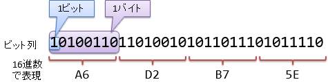

# コンピューターでよく使う数字

##  概要

前節の「[日常における数字](digits.md)」に続き、数字の表し方についての説明です。
ここでは、コンピューターと関連してよく使う、2進数や16進数について説明していきます。

##  2進数、8進数、16進数

人間が10進数を好んで使うのに対して、コンピューターの内部では<strong id="binary" class="keyword">2進数</strong>（binary number）が使われます。
「[ゲート](../basis/gatelevel.md)」で説明しますが、ディジタル電子回路は電位の高低の変化によってさまざまな計算を行います。
数字を表すのにも、電位の高低が使われますので、0と1の2つだけを使った数、すなわち、2進数を用いるのが好都合なわけです。

しかしながら、2進数では桁数が大きくなりすぎるという問題があります。
例えば、10進数の200を2進数で表そうとすると11001000という8桁の数字になってしまいます。
そこで、人間が日常的に10進数と千進数/万進数を併用しているのと同じように、コンピューターの分野でも2進数に対して、
3桁区切りの<strong id="octal" class="keyword">8進数</strong>（octal number）や4桁区切りの<strong id="hexadecimal" class="keyword">16進数</strong>（hexadecimal number）を併用します。

##### 8進数

2進数3桁と8進数の対応を表1に示します。
8進数の利点は、人間が慣れ親しんでいる10進数に一番近いということでしょうか。
（2の累乗（2nの形の数）で一番10に近い数字は8になります。）
また、8進数の場合、0 ～ 7という10進数で使う文字をそのまま使えるという利点もあります。

<table summary="2進数（3桁）⇔ 8進数の対応表">
	<caption>
		2進数（3桁）⇔ 8進数の対応表
	</caption>
	<tr>
		<th>2進数</th>
		<th>8進数</th>
	</tr>
	<tr>
		<td markdown="1">000</td>
		<td markdown="1">0</td>
	</tr>
	<tr>
		<td markdown="1">001</td>
		<td markdown="1">1</td>
	</tr>
	<tr>
		<td markdown="1">010</td>
		<td markdown="1">2</td>
	</tr>
	<tr>
		<td markdown="1">011</td>
		<td markdown="1">3</td>
	</tr>
	<tr>
		<td markdown="1">100</td>
		<td markdown="1">4</td>
	</tr>
	<tr>
		<td markdown="1">101</td>
		<td markdown="1">5</td>
	</tr>
	<tr>
		<td markdown="1">110</td>
		<td markdown="1">6</td>
	</tr>
	<tr>
		<td markdown="1">111</td>
		<td markdown="1">7</td>
	</tr>
</table>

##### 16進数

一方で、8という数字は少し小さすぎて不便だったりします。
8進数だと、2桁使っても、10進数でいうところの0 ～ 63までの64個の値しか表現できないわけですが、これは少々心もとない数字です。
例えば、パソコンのキーボードに並んでいる文字を数字で表すことを考えてみましょう。
アルファベットの大文字・小文字と数字だけで62個必要で、記号まで含めると64個ではとても足りません。

そこで、実際よく使われるのは4桁区切りの16進数の方になります。
16進数で2桁あれば256個の値が表現できて、キーボードに印字されている記号を表すのには十分な数になります。
ただ、16進数を使う場合、1桁の数字を表すのに16個の記号が必要になるわけで、0 ～ 9では足りません。
そのため、表2に示すように、a ～ fという6つの記号を加えて数字を表します。

<table summary="2進数（4桁） ⇔ 16進数・10進数の対応表">
	<caption>
		2進数（4桁） ⇔ 16進数・10進数の対応表
	</caption>
	<tr>
		<th>2進数</th>
		<th>16進数</th>
		<th>10進数</th>
	</tr>
	<tr>
		<td markdown="1">0000</td>
		<td markdown="1">0</td>
		<td markdown="1">0</td>
	</tr>
	<tr>
		<td markdown="1">0001</td>
		<td markdown="1">1</td>
		<td markdown="1">1</td>
	</tr>
	<tr>
		<td markdown="1">0010</td>
		<td markdown="1">2</td>
		<td markdown="1">2</td>
	</tr>
	<tr>
		<td markdown="1">0011</td>
		<td markdown="1">3</td>
		<td markdown="1">3</td>
	</tr>
	<tr>
		<td markdown="1">0100</td>
		<td markdown="1">4</td>
		<td markdown="1">4</td>
	</tr>
	<tr>
		<td markdown="1">0101</td>
		<td markdown="1">5</td>
		<td markdown="1">5</td>
	</tr>
	<tr>
		<td markdown="1">0110</td>
		<td markdown="1">6</td>
		<td markdown="1">6</td>
	</tr>
	<tr>
		<td markdown="1">0111</td>
		<td markdown="1">7</td>
		<td markdown="1">7</td>
	</tr>
	<tr>
		<td markdown="1">1000</td>
		<td markdown="1">8</td>
		<td markdown="1">8</td>
	</tr>
	<tr>
		<td markdown="1">1001</td>
		<td markdown="1">9</td>
		<td markdown="1">9</td>
	</tr>
	<tr>
		<td markdown="1">1010</td>
		<td markdown="1">a</td>
		<td markdown="1">10</td>
	</tr>
	<tr>
		<td markdown="1">1011</td>
		<td markdown="1">b</td>
		<td markdown="1">11</td>
	</tr>
	<tr>
		<td markdown="1">1100</td>
		<td markdown="1">c</td>
		<td markdown="1">12</td>
	</tr>
	<tr>
		<td markdown="1">1101</td>
		<td markdown="1">d</td>
		<td markdown="1">13</td>
	</tr>
	<tr>
		<td markdown="1">1110</td>
		<td markdown="1">e</td>
		<td markdown="1">14</td>
	</tr>
	<tr>
		<td markdown="1">1111</td>
		<td markdown="1">f</td>
		<td markdown="1">15</td>
	</tr>
</table>

##  余談: 3進数回路

「電位の高低で0, 1の2つの値を表現」と言いましたが、それなら「電位の高、中、低で0, 1, 2の3つの値を表現」でも別にかまわないのではないでしょうか。
実はそのとおりで、こういう「3進数回路」を作ることも原理的には可能です。

この3進数には1つメリットがあります。
数字を記録したり、計算を行ったりする際、ディジタル回路の規模に、おおむね以下のような比例関係が成り立つものと仮定しましょう。

<blockquote markdown="1">
回路規模 ∝ 数字の種類 × 桁数

</blockquote>
数字の種類とは、2進数ならば2、3進数ならば3、N進数ならばNということです。
桁数は、例えば、数 α をN進数で表したとき、

<blockquote markdown="1">
桁数 = logN α

</blockquote>
となります。したがって、この仮定の下だと、以下の比例関係が成り立ちます。

<blockquote markdown="1">
回路規模 ∝ 数字の種類 × logN α

</blockquote>
α の方は定数として N を変化させたとき、この式を最小にする（回路規模が最も小さくなる）のはいつでしょうか。
Nを変数として、 を最小にする値を数学的に求めると、N=e（自然対数の底≒2.718281828）になります。
整数に限定するなら N = 3 のときがに最小で、実は、3進数を使うとディジタル回路規模を小さくできる可能性が高いです（次点で2進数が有利）。

ただし、3進数回路は、2進数回路と比べて電子回路の配線構造が複雑になりがちで、実際には、回路規模的にそれほど有利にはなりません。

##  1 ビット、1 バイト

コンピューターの分野では、2進数1桁分の情報を1<strong id="bit" class="keyword"> ビット</strong>（1bit）と呼びます。
英単語のbit（かけら）とbinary digit（2進の数字）をかけた呼び名だと言われています。

また、1ビットだと情報の単位としては小さすぎて使いづらいので、通常は8ビットをひとまとめにして1<strong id="bit" class="keyword"> バイト</strong>（1byte）と呼びます。
こちらは、英単語のbite（1かじり）をもじったもので、bitとの混乱を避けるためにスペルを少し変えてbyteだそうです。

8ビットをひとまとめにする理由は、8という数字が2の累乗になっていたり、16進数2桁で表すことができたりでキリがいいからです。
16進数のところで説明したように、16進数2桁あれば、パソコンのキーボードに出てくる記号を表すには十分な数が得られます。

ちなみに、1ビット/1バイトを省略して書くときにはbitの方を1b、byteの方を1Bと、大文字・小文字を変えて表します。

2進数で数値を表したとき、コンピューターの内部では 0, 1 の羅列になっているわけですが、これをビット列（bit sequence）と呼んだりもします。
言葉の使い方を図1にまとめましょう。

<figure>
	
	<figcaption>ビット、バイトと16進数</figcaption>
</figure>

##  扱える値の範囲

現在のコンピューターでは、バイト単位で情報を読み書きするものが多いです。
特に数値の場合には、1バイト、2バイト、4バイト、もしくは、8バイトというきりがいい単位の記憶領域を使って読み書きされます。
有限の桁で数値を読み書きするので、当然、扱える値の範囲が限られます。
例えば、符号などを記録せず、ビットの全桁を使って0以上の整数を表現する場合、扱える最大の値は以下のようになります。

* 1バイト（2進数8桁）: 255

* 2バイト（2進数16桁）: 65,535

* 4バイト（2進数32桁）: 4,294,967,295

* 8バイト（2進数64桁）: 18,446,744,073,709,551,615
