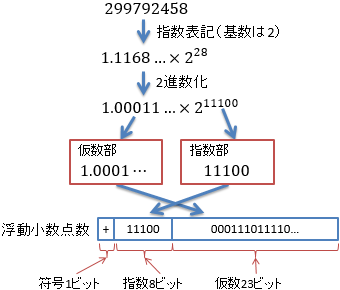

# 浮動小数点数

## 概要
「[コンピューターでよく使う数字](digitsincomputer.md)」で説明したとおり、コンピューターで扱える数値の桁数は有限です。
例えば、8バイト（64ビット）の記憶領域を使っても、整数の場合、10進数で20桁程度の桁数しか表現できません。

そこで、限られた記憶領域でできる限り大きな数を表す方法として、浮動小数点数（fl oating point number）というものが考えられれています。

## 浮動小数点数 ＝ 指数表記
浮動小数点数は、自然科学などの分野で数値を指数表記で2.99792×108と表すように、
値を<strong id="fraction" class="keyword">仮数部</strong>（fraction：2.99792の部分）と<strong id="exeponent" class="keyword">指数部</strong>（exponent：10の指数としてかかっている8の部分）に分けて値を表現する方法です。
浮動小数点という言葉は、「10nというような指数を掛けることで小数点の位置を変えている」という意味です。
ちなみに、この場合の10は<strong id="base" class="keyword">基底</strong>（base）と呼びます。

コンピューター内部では2進数が基本ですので、図1に示すように、
0.5584×228といった感じで、指数部の基底は2にします。
そして、仮数部と指数部をそれぞれ2進数で記録します。

<figure>
	
	<figcaption>浮動小数点数の例</figcaption>
</figure>

当然、仮数部と指数部にそれぞれ何ビットずつ使うかによって表現できる値の範囲が変わります。
一般には、IEEE 754という規格で定められている形式を用いることが多く、
図1の例の指数8ビット、仮数23ビットという表現形式はIEEE 754規格の単精度（32ビットを使うという意味。64ビット使うものを倍精度と呼びます）浮動小数点数になります。

### 注: IEEE
IEEEとは、The Institute of Electrical and Electronics Engineersの略称で、アメリカに本部を置く学会の名前です。
IEEE 754という名称は、「IEEEで定めた754番の規格」という意味です。

## 浮動小数点数に関する注意
以下で説明するように、IEEE 754規格ではいくつか注意すべき点があります。

### 正規化
指数表記では、123 = 12.3 × 10 = 1.23 × 102 = 0.123 × 103 というように、
同じ数字を複数の方法で表すことができてしまいます。
そこで、通常は「必ず0.から始めて、0以外の数字が続くようにする」というようなルールを定めて表記を1通りに定めます。
このような処理を正規化（nomalization）と呼びます。

IEEE 754規格では以下のような正規化ルールを使っています。

* 0以外の数字の場合、仮数部は必ず1.から始める

* この1.は省略して記録する

### 無限大
有限桁しか表現できないコンピューターの世界では、桁を途中で打ち切ることによって誤差が生じます。
このような誤差を<strong id="rounding" class="keyword">打切り誤差</strong>と呼びます。

打ち切り誤差がつきものなコンピューターの世界では、非常に小さな値と0の区別がつかなくなります。
その逆数を考えると、非常に大きな値と無限大も区別がつかないことになります。
そこで、浮動小数点数では、オーバーフローしてしまった（扱える範囲を超えた）値は無限大として扱います。

ただし、無限大という概念は本来数字として扱うには厄介なもので、浮動小数点数においても、
無限大は以下のような通常の数値とは少し異なる挙動をします。

* 無限大にはどんな数を足しても掛けても無限大（∞+x=∞，∞×x=∞）

* 無限大同士の引き算や割り算の結果は不定（数として扱えない）

このような無限大を表現するため、特別なビット配置を使います。
IEEE 754規格の場合には、指数部を最大値（単精度の場合は255）、仮数部を0にしたものを無限大の表現としています。
符号部に応じて、正の無限大と負の無限大があります。

ちなみに、浮動小数点数で取り扱える範囲内で、0ではない絶対値が最小の数値をε（ギリシャ文字のイプシロン）で表すことがあります。
εは、本来は無限小（無限大の対になる概念で、数ではない）を表す記号ですが、コンピューターの世界では非常に小さな値と無限小も区別しません。

### NaN（Not a Number）
前節で話したように、無限大同士の割り算結果など、数として扱えないものもあります。
このような無効な値をNaN（Not a Number: 非数）と呼びます。

IEEE 754規格の場合には、指数部を最大値、仮数部を0以外にしたものをNaNの表現としています。

NaNは計算エラーみたいなもので、一度NaNになると、その後どういう計算をしても結果はすべてNaNになります。
