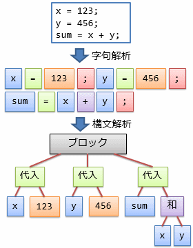
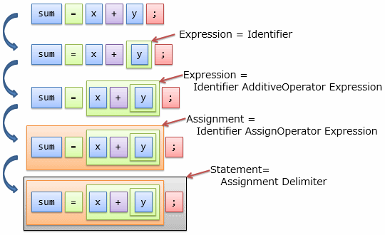
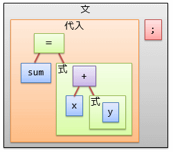
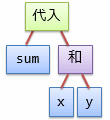
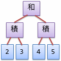
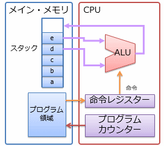
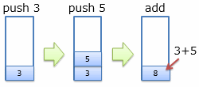
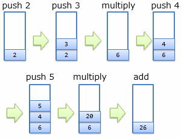
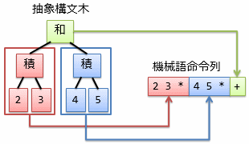

# コンパイラー

##  概要

高級言語を使ってプログラムを作るためには、高級言語から、CPUが実行できる「[機械語](../general/cpu.md#machine-language)」への変換作業が必要になります。
この変換作業のことをコンパイル（compile： 編纂する）と呼びます。
そして、コンパイルを行うためのプログラムを<strong id="compiler" class="keyword">コンパイラー</strong>（compiler）と呼びます。

ここでは、コンパイラーが内部でどういう作業をしているのかについて説明していきます。

高級言語のコンパイラーを作るということは、人が読みやすい形式の文字列を機械語に変換していく作業を行うことになります。
変換作業は、途中、以下のような手順を通ります（図1）。

* <strong id="lexical" class="keyword">字句解析</strong>（lexical analysis）： 文字列を単語に切り分ける作業。

* <strong id="syntactic" class="keyword">構文解析</strong>（syntactic analysis）： 単語と単語がどういうつながりを持つのかを表す木構造の情報を得る作業。

<figure>
	
	<figcaption>字句解析と構文解析</figcaption>
</figure>

最終的に、構文解析で得た木構造から機械語を作ります。
本項では、木構造からの変換が容易なスタック・マシン（stack machine）と呼ばれるタイプの機械語を用いて説明を行っていきます。

##  注: コンパイラーとインタープリター

元々、コンパイルという言葉は「ソース・コードを事前に全て実行可能ファイルに変えておく」ということを指していました。
これに対して、「ソース・コードのままで配布して、逐次的に機械語に翻訳して実行する」という方式もあり、
逐次翻訳作業のことをインタープリット（interpret： 翻訳する）、逐次実行するためのプログラムを<strong id="interpreter" class="keyword">インタープリター</strong>（interpreter）と呼びます。

最近では、コンパイラーを使う場合でも、直接CPU依存な機械語を作るのではなく、
いったんCPU非依存な中間言語（intermediate language）に変換する場合もあります。
また、インタープリターを使う場合にも、厳密に逐次翻訳されているわけではなく、
プログラム起動時に機械語に翻訳してから実行するようなタイプのプログラミング言語もあります。
そのため、コンパイラーとインタープリターの区別はあいまいになっています。

コンパイラーとインタープリターのいずれにしても、
本項で説明するような字句解析、構文解析、機械語化などの過程が必要になります。

##  正規表現

まずは、字句解析から見ていくわけですが、その前に、正規表現というものの説明が必要になります。

前節では、字句解析を「文字列を単語に切り分ける処理」と言いましたが、
正確には、「プログラムとして意味のある最小単位に切り分ける処理」になります。
この「意味のある最小単位」のことをトークン（token： 本来は、通行証として使われる小さなコインなどをさす言葉）と呼びます。

字句解析には<strong id="regex" class="keyword">正規表現</strong>（regular expression）と呼ばれるパターン・マッチング（特定の文字パターンの検出）手法がよく使われます。
正規表現では、以下のような記法で文字列のパターン・マッチングを行います。

* <code>abc</code>というように、文字列をそのまま書くと、これと同じ文字列とマッチします。

* <code>a|b</code>というように、|（縦棒）記号を用いることで、「aまたはb」というように2つのうちどちらか一方とマッチします。
    * 例えば、<code>gr(e|a)y</code>でgreyまたはgrayとマッチします。

* 文字クラス:
    * <code>\w</code>（アルファベットなど、単語に使われる文字）や<code>\s</code>（空白やタブ、改行などの空白文字）というように、<code>\\</code>から始まる記号で、特定のカテゴリーに含まれる文字とマッチします。

    * <code>.</code>（ドット）記号で、任意の1文字とマッチします。

* <code>()</code>でグループ化することができます:
    * 例えば、<code>(abc)|(def)</code>で、<code>abc</code>または<code>def</code>のどちらかにマッチします。

* 量指定:
    * <code>?</code>記号で「0個または1個」を表します。
        * 例えば<code>ab?</code>でaまたはabとマッチします。

    * <code>*</code>記号で「0個以上」を表します。
        * <code>ab*</code>でa, ab, abb, abbbなどとマッチします。

    * <code>+</code>記号で「1個以上」を表します。
        * <code>ab+</code>でab, abb, abbbなどとマッチします。

正規表現にはその他にもさまざまな記法があります。
また、結構「方言」があり、ひとくちに正規表現と言ってもいろいろな種類のものがあります
（上述の例のような基本的な部分に関しては、どの方言でもほぼ同じ記法です）。

##### 注意: 名前の由来

言語学などの分野で、言語の文法を形式的に（機械的な一定のルール（format）に沿った表現で）表そうという学問があって、
これを形式言語（formal language）と呼びます。
正規表現という言葉は、元々この分野の用語です。

ここでは正確な定義は割愛しますが、（言語の文法としては割とシンプルな類の）あるルールで生成できるような文字列のことを正規言語（regular language）と呼びます。
本来の意味の正規表現は、正規言語を表すためのルールのことを指します（逆に、正規表現で生成できる文字列のことを正規言語と言っても構いません）。

ただし、現在、コンピューター関連の分野で正規表現というと、文字列のパターン・マッチングのための文法のことを指します。
パターン・マッチングのための便利な記法を色々取り入れて拡張されていて、
本来の意味での正規表現（＝ 正規言語を表すのに必要十分なルール）ではなくなっています。

##  字句解析

正規表現について簡単に説明したところで、具体的に例を挙げながら字句解析について説明していきましょう。
例として、以下のようなソース・コードを考えましょう。

<pre class="source" title="字句解析対象のコード" lang="">
<code>x = 123;
y = 456;
sum = x + y;
</code></pre>

字句解析は、このようなコードの中から、<code>x</code> や <code>123</code> といった部分（これを「字句」といいます）を抜き出す作業です。
そのための正規表現として、表1のようなものを使います。

<table summary="字句解析用の正規表現の例">
	<caption>
		字句解析用の正規表現の例
	</caption>
	<tr>
		<th>トークンのタイプ</th>
		<th>正規表現</th>
		<th>補足説明</th>
	</tr>
	<tr>
		<td markdown="1"><code>Identifier</code></td>
		<td markdown="1"><code>\w+</code></td>
		<td markdown="1">識別子： 1文字以上の単語文字（アルファベットなど）</td>
	</tr>
	<tr>
		<td markdown="1"><code>Digits</code></td>
		<td markdown="1"><code>\d+</code></td>
		<td markdown="1">数： 1文字以上の数字</td>
	</tr>
	<tr>
		<td markdown="1"><code>AssignOperator</code></td>
		<td markdown="1"><code>=</code></td>
		<td markdown="1">代入演算子</td>
	</tr>
	<tr>
		<td markdown="1"><code>AdditiveOperator</code></td>
		<td markdown="1"><code>+|-</code></td>
		<td markdown="1">加法演算子： +または-</td>
	</tr>
	<tr>
		<td markdown="1"><code> Delimiter</code></td>
		<td markdown="1"><code>;</code></td>
		<td markdown="1">区切り</td>
	</tr>
	<tr>
		<td markdown="1"><code>WhiteSpace</code></td>
		<td markdown="1"><code>\s+</code></td>
		<td markdown="1">空白： 1個以上の空白文字</td>
	</tr>
</table>

どの正規表現パターンにマッチしたかによって、字句を分類します。
どの分類かを表すのが、表中左側の「トークンのタイプ」です。

表1の正規表現を使って、先ほどのソースコードを字句解析した結果を表2に示します。
（空白文字（トークン・タイプが WhiteSpace のもの）は無視します。C言語など、多くのプログラミング言語で空白文字は無視されます。）

<table summary="字句解析の結果の例">
	<caption>
		字句解析の結果の例
	</caption>
	<tr>
		<th>マッチした文字列</th>
		<th>トークンのタイプ</th>
	</tr>
	<tr>
		<td markdown="1"><code>x</code></td>
		<td markdown="1"><code>Identifier</code></td>
	</tr>
	<tr>
		<td markdown="1"><code>=</code></td>
		<td markdown="1"><code>AssignOperator</code></td>
	</tr>
	<tr>
		<td markdown="1"><code>123</code></td>
		<td markdown="1"><code>Digits</code></td>
	</tr>
	<tr>
		<td markdown="1"><code>;</code></td>
		<td markdown="1"><code>Delimiter</code></td>
	</tr>
	<tr>
		<td markdown="1"><code>y</code></td>
		<td markdown="1"><code>Identifier</code></td>
	</tr>
	<tr>
		<td markdown="1"><code>=</code></td>
		<td markdown="1"><code>AssignOperator</code></td>
	</tr>
	<tr>
		<td markdown="1"><code>456</code></td>
		<td markdown="1"><code>Digits</code></td>
	</tr>
	<tr>
		<td markdown="1"><code>;</code></td>
		<td markdown="1"><code>Delimiter</code></td>
	</tr>
	<tr>
		<td markdown="1"><code>sum</code></td>
		<td markdown="1"><code>Identifier</code></td>
	</tr>
	<tr>
		<td markdown="1"><code>=</code></td>
		<td markdown="1"><code>AssignOperator</code></td>
	</tr>
	<tr>
		<td markdown="1"><code>x</code></td>
		<td markdown="1"><code>Identifier</code></td>
	</tr>
	<tr>
		<td markdown="1"><code>+</code></td>
		<td markdown="1"><code>AdditiveOperator</code></td>
	</tr>
	<tr>
		<td markdown="1"><code>y</code></td>
		<td markdown="1"><code>Identifier</code></td>
	</tr>
	<tr>
		<td markdown="1"><code>;</code></td>
		<td markdown="1"><code>Delimiter</code></td>
	</tr>
</table>

##  構文解析

続いて、構文解析を行います。

ちゃんとしたプログラミング言語であるためには、
字句解析で作ったトークンの列が不規則に並んでいてはだめで、
一定のルールに沿って並ぶ必要があります。
そのルールに沿いながら、トークン列がどういう意味を持っているかを調べるのが構文解析です。

ここでは例として、表3に示すような構文規則（syntax rule）に基づいて、トークン列を解析していきます。
この構文規則内では、表1で定義したトークン・タイプも出てきます。
規則内で定義した記号や、字句解析結果のトークンがどう並ぶべきかを規則化したものになります。

<table summary="構文規則の例">
	<caption>
		構文規則の例
	</caption>
	<tr>
		<th>記号</th>
		<th>構文規則</th>
		<th>補足説明</th>
	</tr>
	<tr>
		<td markdown="1"><code>Block</code></td>
		<td markdown="1"><code>Statement*</code></td>
		<td markdown="1">プログラムには複数の「文」を並べられる</td>
	</tr>
	<tr>
		<td markdown="1"><code>Statement</code></td>
		<td markdown="1"><code>AssingmentDelemeter</code></td>
		<td markdown="1">代入の後ろに区切り文字（;）を付けたものを「文」と呼ぶ</td>
	</tr>
	<tr>
		<td markdown="1"><code>Assingment</code></td>
		<td markdown="1"><code>Identifier AssignOperator Expression</code></td>
		<td markdown="1">代入演算子（=）の左側に「識別子」、右側に「式」を置いたものを「代入」と呼ぶ</td>
	</tr>
	<tr>
		<td markdown="1"><code>Expression</code></td>
		<td markdown="1"><code>Identifier  | (Identifier AdditiveOperator Expression)</code></td>
		<td markdown="1">「識別子」単体、もしくは、加法演算子（+か-）の左側に「識別子」、右側に再度「式」を置いたものを「式」と呼ぶ</td>
	</tr>
</table>

構文解析では、このルールにマッチした部分を徐々に抜き出していきます。
例えば、先ほどのソース・コードの3行目を再度見てみましょう。

<pre class="source" title="字句解析対象のコード" lang="">
<code>sum = x + y;
</code></pre>

このコードを表3の構文規則にそって解析する過程は、図2に示すようになります。

<figure>
	
	<figcaption>構文解析の過程</figcaption>
</figure>

図中には「入れ子の箱」が表れていますが、これは図3に示すような木構造データになっています。
これを構文木（syntax tree）と呼びます。

<figure>
	
	<figcaption>構文木</figcaption>
</figure>

この構文木には、機械語の生成に特に必要のないものも含まれているので、
不要な部分を省略するような処理も加えることで、図4に示すような木構造が得られます。
このような木構造を抽象構文木（abstract syntax tree）と呼びます
（「抽象」と付くのは、機械語生成に必要ない部分をそぎ落としていることを指します）。

<figure>
	
	<figcaption>抽象構文木</figcaption>
</figure>

もう1つ別の例になりますが、
最後に、2 * 3 + 4 * 5というコードを (2×3)+(4×5) という意味で解釈できる構文を紹介しておきましょう。
表4に示すようになります。

<table summary="2 * 3 + 4 * 5を解釈するための構文規則">
	<caption>
		2 * 3 + 4 * 5を解釈するための構文規則
	</caption>
	<tr>
		<th>記号 / トークン・タイプ</th>
		<th>構文規則 / 正規表現</th>
		<th>補足説明</th>
	</tr>
	<tr>
		<td markdown="1"><code>Identifier</code></td>
		<td markdown="1"><code>\w+</code></td>
		<td markdown="1">識別子： 1文字以上の単語文字（アルファベットなど）</td>
	</tr>
	<tr>
		<td markdown="1"><code>AdditiveOperator</code></td>
		<td markdown="1"><code>+|-</code></td>
		<td markdown="1">加法演算子： +または-</td>
	</tr>
	<tr>
		<td markdown="1"><code>MultiplicativeOperator</code></td>
		<td markdown="1"><code>\*|/</code></td>
		<td markdown="1">乗法演算子： *または/</td>
	</tr>
	<tr>
		<td markdown="1"><code>Multiplication</code></td>
		<td markdown="1"><code>Identifier
                    |
                    (Identifier
                    MutiplicativeOperator Identifier)</code></td>
		<td markdown="1">積項： x * y とか</td>
	</tr>
	<tr>
		<td markdown="1"><code>Expression</code></td>
		<td markdown="1"><code>Multiplication |
                    (Multiplication AdditiveOperator Multiplication)</code></td>
		<td markdown="1">式： 積項 + 積項 とか</td>
	</tr>
</table>

この構文を用いて2 * 3 + 4 * 5を解釈し、
図4の例と同様に機械語の生成に特に必要のない部分を省略すると、図5に示す抽象構文木が得られるはずです。

<figure>
	
	<figcaption>2 * 3 + 4 * 5から得られる抽象構文木</figcaption>
</figure>

##  スタック・マシン

抽象構文木からの機械語生成の説明に入る前に、<strong id="stack-machine" class="keyword">スタック・マシン</strong>（stack machine）というものについて説明します。
スタック・マシンと呼ばれるタイプのCPUでは、抽象構文木からの機械語生成が容易です。
そこで、スタック・マシン型の仮想的なCPUを考えて、その機械語コードを生成することを考えます。

スタック・マシンとは、図6に示すように、レジスターを持たず、
全てのデータをメイン・メモリ上のスタック領域（「[スタック](memorymanagement.md#stack)」参照）に置いて演算を行うCPU構造です
（逆に、レジスターを持つCPU構造をレジスター・マシン（register machine）と呼びます）。

<figure>
	
	<figcaption>スタック・マシン型のCPU構造</figcaption>
</figure>

いくつのレジスターを持つかというのはCPUの種類に依存します。
このため、レジスターを前提とした機械語の生成は、CPUごとに異なる処理が必要になります。
一方で、スタックはメイン・メモリ上の領域をソフトウェアで管理するものなので、どんな種類のCPUでも利用できます。

複数種のCPU向けに使えるコンパイラー（クロス・コンパイラー（cross compiler）と呼んだりします）を作る場合などにおいて、
一度スタック・マシン型の擬似的な機械語を生成して、それを各CPUの実際の機械語に変換するといった手法を取ることがあります。

また、「仮想機械」と呼ばれる仕組みでもスタック・マシン型の機械語が使われます。
例えば、JavaやC#などの言語では、CPU依存の機械語を直接生成するのではなく、CPU非依存の中間言語を生成します。
中間言語化されたプログラムは、仮想機械（virtual machine）と呼ばれるプログラムが解釈し、実際のCPUの機械語に変換しながら実行されます。
このような、CPU非依存の中間言語を考える場合にもスタック・マシンは便利で、JavaでもC#でも、中間言語はスタック・マシン型の機械語になっています。

##  スタック・マシンの動作

スタック機械では、オペランドが常にスタックの1番上に積まれている前提で、以下のような命令実行の仕方をします。

* push： スタックの1番上に新しい値を積む。

* pop： スタックの1番上の値を消す。

* オペランドを1つだけ使う演算（単項のマイナスや、論理否定演算）は、スタックの1番上の値に対して演算を行う。

* オペランドが2つの演算（加減乗除など）は、スタックの1番上と2番目の値を使って演算を行う。

* 演算で使ったオペランドはスタックから消し、代わりに演算結果をスタックの1番上に積む。

例えば、3+5 という演算を考えてみましょう。
図7に示すように、3, 5という値を1つずつスタックに積んだ後、add命令によってその2つの値を消費し、加算結果の8をスタックに積みなおします。

<figure>
	
	<figcaption>スタック機械の動作例（3+5）</figcaption>
</figure>

この例では、結局、push 3, push 5, addというような命令列を実行しているわけですが、これを単に、

<pre class="source" title="逆ポーランド記法の 3 + 5" lang="">
<code>3 5 +
</code></pre>

と書き表すこともあります。
3+5 という数式の演算子の位置を真ん中から後ろに移動させたように見えます。
このような演算子の後置き記法を逆ポーランド記法と呼びますが、すなわち、スタック・マシン型の機械語命令は逆ポーランド記法の数式と同じ並びになります。

同様のことを、もう少し複雑な式でもやってみましょう。
今度は 2×3+4×5 という演算を考えてみます。
まず、この数式を逆ポーランド記法で書きなおしてみましょう（これがそのままスタック機械に与える命令列になります）。
ただし、×記号の代わりに * 記号を用います（キーボードから直接打てるため、掛け算には * 記号がよく利用されます）。

<pre class="source" title="逆ポーランド記法の 3 + 5" lang="">
<code>2 3 * 4 5 * +
</code></pre>

この例の場合、スタック・マシンの動作は図8に示すようになります。

<figure>
	
	<figcaption>スタック機械の動作例（2×3+4×5）</figcaption>
</figure>

##  機械語の生成

さて、それでは抽象構文木からスタック機械型の機械語生成について説明して行きましょう。
スタック・マシン型の機械語は、逆ポーランド記法的な順序でオペランド（を求める命令列）と演算子（に相当する演算命令）を並べることで生成できます。
この性質から、図9に示すように、木構造を子要素側から逐次機械語化していけば、最終的に抽象構文木全体を機械語化できます。

<figure>
	
	<figcaption>抽象構文木からの機械語生成</figcaption>
</figure>
