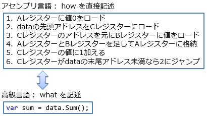

# 基礎的なソフトウェア

## ハードウェアとプログラミング言語の間に
「[回路設計（ゲート、組み合わせ回路、順序回路）](../index.md#basis)」と「[汎用コンピューター](../index.md#general)」で、
汎用コンピューターを構成するハードウェアの話は一通り終わりました。

しかし、Java や C# などのいわゆる高級言語のレベルと、
ハードウェアのレベルの間にはまだ大きな隔たりがあります。
この隔たりを埋めるには、以下のようなものの説明が必要になります。

* オペレーティング・システムやフレームワークと呼ばれるような、 基礎的で汎用的に使える処理を担ってくれるソフトウェア。

* 人間の直感に近い構文でソフトウェアを記述できる言語（＝ 高級言語）を、「[CPU](../general/cpu.md)」で説明したような「[機械語](../general/cpu.md#machine-language)」に変換するソフトウェア（＝ コンパイラー）。

## APIとライブラリ、フレームワーク
（書きかけ）

この章タイトルを「OS」とせず、基礎的なソフトウェア（ページのURLなんかは「essential」、不可欠なもの）にしてるのは：

高級言語の標準ライブラリみたいなものが提供する機能、
多くはOSのAPIの薄いラッパー。

ほんとにライブラリ（単純なプログラム）として提供される機能もあれば、
OSに丸投げなものもあれば、
ランタイム（その言語で書かれたプログラムを実行するのに必要な、実行時（run-time）ライブラリ/フレームワークの総称）層が提供してる機能も。

高級言語っていうレイヤーから見ると、
OSとかフレームワークとかミドルウェアとかライブラリって呼ばれるものの区別はあいまい。

ある機能に対して、
ある構成のコンピューターでは専用のハードウェアを持っててハードウェア実行してるけども、
別の構成ではソフトウェア的にエミュレートしてるなんてこともあるのでなおさら。

高級言語レベルのある文法が、
単なるシンタックス・シュガーなこともあるし、
大部分をライブラリに頼った機能なこともあるし、
OS の助けが必要なこともあるし、
場合によってはハードウェア的な補助が必要なこともある。

## 高級言語
「[CPU の命令の種類](../general/cpu.md#instruction-set)」で説明したように、
原理的には、演算、データの移動、および、実行制御の3種類がそれっていればソフトウェアを作成できます。
CPUの機械語とほぼ直接に対応関係のあるアセンブリ言語は、この3種類に相当する機能を持っていることになります。

しかしながら、実際の開発ではアセンブリ言語を直接書くことはまずなくて、
人の直感に近い文法でプログラムを記述できる「高級言語」を用いることになります。
ここでいう「高級」という言葉は、CPUの実際の構造から離れ、人の直感に近づけるという意味になります。
本章から先は、プログラミング言語が進歩し、徐々に高級になる（人の直感に近づく）過程を説明していくことになります。

### how から what へ
アセンブリ言語は「CPUをどう動かすか」（how）を記述するものです。
一方、開発者にとって重要なのは「何をしたいか」（what）なわけですが、
アセンブリ言語を使って開発する場合、このwhatからhowへの変換が非常に大変な作業になります。
例えば、「データ列の和を求めたい」という目的（what）があったとして、
これを「データ列の先頭アドレスをロードして、間接参照して、加算して、ポインターを1進めて…」といった具合に、
手順（how）に起こしていく必要があります。

これに対して、可能な限り「何をしたいか」（what）をそのまま記述するだけでプログラムを動かしたいと思うのは自然な流れです。
例えば先ほどの例でいうと、「データ列の和を求めよ」という記述をするだけでプログラムが動いて欲しいということです。
このように、howからwhatに近づけて、人間の直感に近い自然な言葉でプログラムを作れることを目指すものを高級言語（high-level language）と呼びます。
逆に、「CPUをどう動かすか」（すなわちアセンブリ言語）に近いほど低級（low-level）だといいます。
（高級/低級というのは、あくまで人の直感に近いかCPUの挙動に近いかということを表す語で、値段の高低や技術的な難易度を表すものではありません。）

実際には、「データ列の和を求めよ」よりはもう少し機械的に解釈しやすい文法が必要ですし、
今主流となっている高級言語の多くが英語ベースの文法になっているので、
あくまで一例ですが、dataという変数にデータ列が格納されているものとして、以下のような記述になります。

<pre class="source" title="what: 和を求めよ" lang="">
<code>var sum = data.Sum();
</code></pre>

このhowとwhatの違いを図1に並べてみましょう。

<figure>
	
	<figcaption>アセンブリ言語と高級言語、how と what</figcaption>
</figure>

もちろん、高級と低級という概念は2値的なものではなく、プログラミング言語の進化の歴史は、
徐々に高級になっていく（徐々に人の直感に近づいていく）歴史だと言えます。
詳しくは 「[C# によるプログラミング入門](../../csharp/index.md)」 など説明していくことになりますが、例えば以下のような要望が少しずつ実装されてきました。

* 2×3＋4×5というように、数学でよく使う記法通りに（もしくはそれに似た）計算式を書きたい
    * 多くの高級言語では、キーボードから打てる文字だけを使って、2 * 3 + 4 * 5というように書きます

    * 括弧を付けなくても、加算より乗算を先に計算します

* データをひとまとめにしたい
    * 例えば、住所録を作る際に、名前と住所をセットにした「個人」を表す「型」を作りたい

* 自作した型を、数値などの組み込みの型と同列に扱いたい
    * 数値の場合には+などの演算子を使えるのだから、自作の型でも同様に演算子を使いたい
