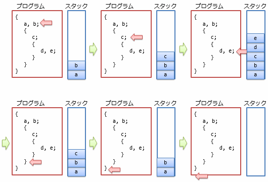
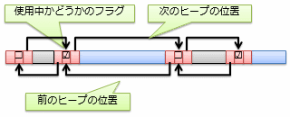
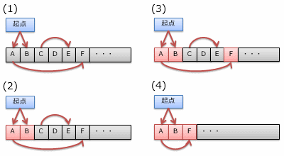
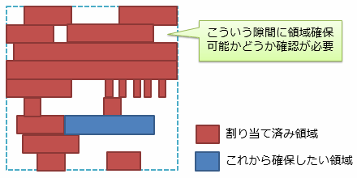
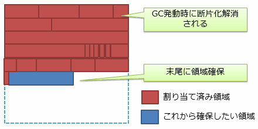
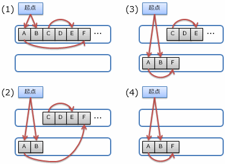
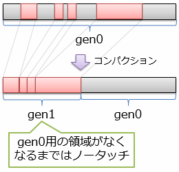

# メモリ管理

##  概要

「[仮想メモリ](operatingsystem.md#virtual-memory)」があるからと言って、場当たり的にメモリ領域を使っていいわけではありません。
メモリ上の空き領域を効率的に管理するのもオペレーティング・システムやフレームワークの仕事です。
メモリ領域の管理手法には大きく分けて、スタックとヒープという2種類のものがあります。

##  スタック

<strong id="stack" class="keyword">スタック</strong>（stack）とは、「積み上げる」、「堆積物」というような意味ですが、
その言葉通り、データ領域を積み上げていくような形で管理する方式です。
すなわち、最後に確保した領域を最初に開放します（上に積んで、上から降ろす）。

スタックによるメモリ管理の模式図を図1に示します。
プログラムで使うデータの多くは、あらかじめ決まっている短い範囲でのみ利用されます。
データの利用される範囲のことをスコープ（scope）と呼びます。
図中に示すように、一般に、スコープは入れ子になっていて、内側のスコープで使うデータ領域は後から確保して、先に開放されることになります。

<figure>
	
	<figcaption>スタック方式によるメモリ管理の例</figcaption>
</figure>

スタックを用いる場合、現在のスコープでどれだけ領域を確保したかを記憶しておくだけでメモリの管理ができるため、非常に効率がよいという利点があります。

しかし、あらかじめスコープが明確に分かっているデータに対してしか利用できないという欠点もあります。
また、スタックに使うためのメモリ領域はそれほど大きく取らないのが一般的で、大きなデータ領域を一気に確保したい場合にもスタックは向いていません。
このような種類のデータに対しては、次節で説明する「ヒープ」を用います。

##  ヒープ

<strong id="heap" class="keyword">ヒープ</strong>（heap： 塊、山積み）は、任意サイズのデータ領域を、任意の順序で確保/解放する方式です
（スタックが整然と積み上げていくイメージなのに対して、ヒープは乱雑に山積みされているイメージです）。
ヒープは以下のような場合に利用します。

* データを必要とするスコープがはっきりしない場合
    * 例えば、データがさまざまな箇所から参照されている場合

* 実行時にしかサイズが確定しない場合
    * 例えば、利用者からの入力に応じてサイズを変える必要がある場合

* 必要サイズがかなり大規模な場合

図2にヒープ管理の例を示します。一般に、ヒープの管理は、使用中かどうかを表すフラグと、前後のヒープの位置を記録することで行います。
新たにデータ領域を確保したい場合、必要な幅のある未使用ヒープを探し、使用中に切り替えます。
逆に、領域の解放はフラグを未使用に切り替えます。
この際、未使用領域が並んだ場合は、領域を1つにまとめる処理なども行います。

<figure>
	
	<figcaption>ヒープの管理方法の例</figcaption>
</figure>

ヒープは、スタックのような制限がない反面、メモリ上のどこからどこまで確保したかを全て管理する必要がありますし、
新たにデータ領域を確保したい場合には空き領域を探す手間がかかります。
したがって、スタックの制限内で特に問題のないデータに対しては可能な限りスタックを利用すべきです。

また、領域の確保と解放を繰り返すことで、使用中のヒープがメモリ上に散在する状態ができる「断片化」（fragmentation）という問題があります。
断片化が起きていると、空き領域を探す手間が増えますし、
データの「[参照の局所性](../general/advancedcpu.md#locality)」が失われることでキャッシュのヒット率低下が起こり、処理性能が悪化します。

##  ガベージ・コレクション

ヒープを利用する際、用済みになったデータ領域の解放を忘れて、メモリ上に「ごみ」（いつまでたっても解放されない領域）が残ってしまうことがあります。
このような問題をメモリ・リーク（memory leak: 回収「漏れ」という意味）と呼びます。
逆に、すでに解放済みの領域を間違って再度解放しようとして問題を起こすこともあり、こちらは二重解放と呼ばれています。

プログラマーが自前でメモリの解放を行う場合、プログラムが複雑になるにつれ、メモリ・リークや二重解放の発見や修正は非常に難しくなります。
一方で、プログラムで「やりたいこと」はヒープの管理ではなく、もっと別の目的があるはずです。目的外のことに多大な手間をかけてはいけません。

そこで、ヒープの管理を自動化する手法が色々と考えられています。
よく使われる手法に<strong id="garbage-collection" class="keyword">ガベージ・コレクション</strong>（garbage collection: ごみ集め、略してGC）というものがあります。
ガベージ・コレクションでは、定期的に「ごみ」になっている領域がないかどうかを調べて、見つけた「ごみ」を解放して回る処理を行います。

###  ガベージ・コレクションの方法

メモリ領域が「ごみ」になっているということは、有効な領域から一切参照されていないということです。
そこで、スタック領域のように確実に有効であることが分かっている場所を起点として、参照をたどることでガベージ・コレクションを行います
（これが最も基本的なガベージ・コレクションの方法で、<strong id="mark-sweep" class="keyword">マーク＆スイープ</strong>（mark &amp; sweep: 印付けと清掃）方式と呼ばれています）。

すなわち、有効であることが分かっている場所から参照されている（有効なポインター変数に指し示されている）ならそこも有効とみなすという作業を繰り返し行います。
最終的には、どこからも参照されていない場所が判明するので、そこを解放してやります。

具体例を図3に示します。まず、(1)のように、全ての領域を未到達の状態（黒色）にリセットします。
そして、起点（スタック領域など）から参照を1段階たどると(2)、2段階たどると(3)のような状態になります
（図中の赤色の部分が到達できた（有効であることが確認された）領域です）。
最後に、無効な（最後まで到達できなかった）領域を解放します。
(4)に示すように、                解放と同時に使用領域を一か所に集めるコンパクションという処理を行うこともあります。
コンパクションについては後程改めて説明します。

<figure>
	
	<figcaption>ガベージ・コレクションの例</figcaption>
</figure>

###  ガベージ・コレクションの性能向上

ガベージ・コレクションを利用する上で気になるのはやはり性能面です。
メモリ管理の大変さから解放されるからといって、自動管理のために性能を大幅に犠牲にしてしまうと実用に耐えられるものではなくなってしまいます。
幸いなことに、性能向上のための手法がいろいろと考えられていて、最近のガベージ・コレクションはかなり性能がよくなっています。

ガベージ・コレクションの性能向上手法のうち、主要なものをいくつか紹介しておきましょう。

####  コンパクション

前節で示した例（図3）の(4)では、無効な領域の解放と同時に、<strong id="compaction" class="keyword">コンパクション</strong>（compaction: 圧縮、小型化）という処理を行っています。
この処理では、ヒープ領域の断片化を解消するため、有効な領域を移動させて隙間をなくしてしまいます。

前節で説明したとおり、メモリの断片化は性能の劣化を招きます。
例えば、図4は断片化を放置している状態のヒープです。
ヒープの空き領域はとびとびになっていて、この隙間の中から、新たにメモリを確保できる場所を探す必要があります。

<figure>
	
	<figcaption>断面化したヒープ</figcaption>
</figure>

これが、コンパクションを行うことで、図5のような状態になります。
新たにメモリを確保したいときには、現在使用中のヒープの末尾を見ればよく、ヒープの管理が楽になります。

<figure>
	
	<figcaption>コンパクションで断片化を解消したヒープ</figcaption>
</figure>

したがって、コピーにかかるコストよりも、断片化の解消による性能向上の方が上回る場合が多く、コンパクションは性能改善につながります。

####  コピー方式ガベージ・コレクション

図6に示すように、ヒープ領域を2つ持って、一方から他方にコピーしながらガベージ・コレクションを行う方式があり、
これを<strong id="copying" class="keyword">コピー方式ガベージ・コレクション</strong>（copying garbage collection）と呼びます。
このような方式を取ることで、ガベージ・コレクションとコンパクションを同時に行えたり、
不要領域の解放処理が楽になったりするため、性能の向上が見込めます。

ただし、常にヒープ領域の半分が未使用になってしまうので、メイン・メモリが多めに必要になるという欠点があります。
したがって、コピー方式のガベージ・コレクションは、メイン・メモリに余裕のある環境で使われます。

<figure>
	
	<figcaption>コピー方式ガベージ・コレクションの動作例</figcaption>
</figure>

####  世代別ガベージ・コレクション

統計的に、メモリ領域の寿命（利用されている期間）に関して、短命なものほど多く、長命なものほど少ないということが知られています。
そこで、短命なデータ向けと長命なデータ向けのヒープを分けて処理を行う<strong id="generational" class="keyword">世代別ガベージ・コレクション</strong>（generational garbage collection）と呼ばれる方式があります。
世代別ガベージ・コレクションでは、以下のような処理を行います。

* ヒープ領域を複数の世代（generation）に分けます（ここでは、第1世代と第2世代の2段階に分ける仮定で説明します）

* プログラマーがヒープを確保する際には、まず第1世代に領域を確保します

* 第1世代をガベージ・コレクションする際、残ったデータは第2世代の領域に移動します

* 第2世代が満杯になるまでは、第1世代だけをガベージ・コレクションします

世代の管理の方法はいろいろありますが、例えば、図7に示すように、ある世代（図中ではgen0）をコンパクションした結果の領域を次世代（同、gen1）扱いするといった方法があります。

<figure>
	
	<figcaption></figcaption>
</figure>

また、第1世代と第2世代で、領域サイズやガベージ・コレクションの方式などを別々に調整することができます。
例えば、第1世代では、小さめの領域でコピー方式ガベージ・コレクションを頻繁に行うことで、メモリ領域を大き目に必要とするというコピー方式の欠点を緩和できます。

####  大きなデータ

領域サイズの小さなデータほど短命で、大きなデータほど長命だということも統計的に知られています。
そこで、大きなデータは最初から後世代のヒープ領域（あまり頻繁にガベージ・コレクションを行わない領域）に確保することで性能向上が見込めます。

###  ガベージ・コレクションの効率

性能向上手法の効果もあり、用途次第では、手動でメモリ管理するよりも、ガベージ・コレクションに任せてしまった方が高い性能が得られる場合もあります。
というよりも、ヒープ領域に関連する性能は、通常、ガベージ・コレクションを利用する方が、手動管理するよりも高性能です
（解放処理を一斉に行ったり、コンパクションを行ったりすることにより、データの局所性が高いため）。

ガベージ・コレクションを使えない言語では、極力ヒープの利用を避ける（スタックだけで済むようにプログラムを作る）ことで性能向上を考えます。
高頻度のヒープ利用が避けられない場合は素直にガベージ・コレクションに頼った方がいいでしょう。
ただし

ただし、全体としてはヒープの性能が向上する（スループット（through-put）が向上すると言います）といっても、
ガベージ・コレクションを利用する場合、負荷が1か所に集まってしまう（ある時点の遅延（latency）が大きくなると言います）という問題があります。
また、ガベージ・コレクションが動作するタイミングがいつになるのかわからないため、急なタイミングで一時的に性能が落ちることもあります。
このような性質から、ガベージ・コレクションは厳格なリアルタイム処理が必要な環境には向きません
（ただし、これも、最近のマルチコアCPUでは、メインの処理と並行して別のCPUでガベージ・コレクションを行う（バックグラウンド方式）などという処理によって、一時的な性能劣化もあまり感じられなくなっています）。

###  ガベージ・コレクションの限界

ガベージ・コレクションによってメモリ管理を自動化すれば絶対にメモリ・リークが起きないかというとそうでもありません。
「有効な領域から参照されていない」という情報を元にゴミの判定を行うため、
必要もないのに参照し続けた場合にはゴミと判定されず、いつまでたっても解放されなくなります。

「必要もない参照」というのは、例えば、寿命の長い（ずっと使い続ける）メモリ領域から、寿命の短いメモリ領域を参照するということです。
このような場合、本来すぐに解放していいはずの短命な領域が、寿命の長い側に合わせていつまでも解放されずに残ります。
