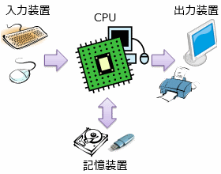
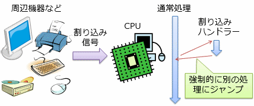
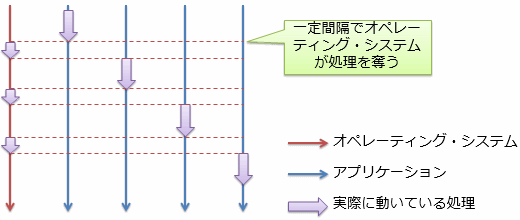
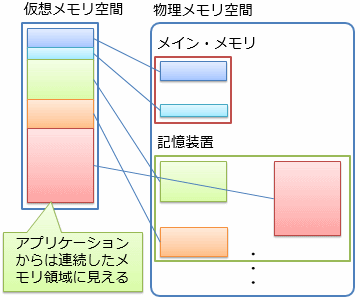

# オペレーティング・システム

##  概要

コンピューターを動作させるために必要になる基礎的な機能を集めたソフトウェアをオペレーティング・システム（operating system: 略してOSと呼ばれます）と呼びます。オペレーティング・システムは以下のような機能を提供します。

* 低級な処理の隠ぺい: ハードウェア制御のための細かい手順は内部的に隠ぺいして、「記憶装置にファイルを書き込む」というような、意図に即したレベルのAPIを提供します。

* ハードウェアの差の吸収: 例えば同じ記憶装置であっても、メーカーによって仕様が異なります。 ハードウェア制御用のソフトウェア（ドライバー（driver）と呼びます）の仕様を定めることで、異なるハードウェアを同じAPIで制御できるようにします。

* 安全で効率的な資源管理: 複数のアプリケーションが安全で効率的に動作できるように、CPUやメイン・メモリなどの計算資源を一元管理します。 あるアプリケーションが不具合で止まってしまってもコンピューター自体が止まらないようにしたり、 他のアプリケーションのデータを破壊しないようにしたりします。

##  ハードウェア管理

一般的に、コンピューターは、CPUやメイン・メモリだけでなく、周辺機器などのさまざまなハードウェアを持っています。
このようなハードウェアは、主として、入力装置、出力装置、および、記憶装置に分類できます（図1）。

* 入力装置: キーボードやマウスなど、ユーザーからの入力を受け取るハードウェア

* 出力装置: ディスプレイやプリンターなど、ユーザーに見える出力を行うハードウェア

* 記憶装置: ハードディスクやフラッシュ・メモリなど、永続的（電源を切っても消えない）にデータを記憶しておくハードウェア

<figure>
	
	<figcaption>CPUと周辺機器</figcaption>
</figure>

前述の通り、これらのハードウェア制御がオペレーティング・システムの役割の1つです。
ちなみに、このような周辺機器からの入力、周辺機器への出力のことを、input/outputを略して<strong id="io" class="keyword">I/O処理</strong>と呼びます。

###  ハードウェア割り込み

CPUからハードウェアを制御するためには、ハードウェアとCPUとの間でデータのやり取りが必要になります。
ハードウェアとのデータのやり取りの方法には大まかに言うと、以下のような2通りの方法があります。

* <strong id="polling" class="keyword">ポーリング</strong>（polling: 開票、世論調査）: CPU側から定期的にハードウェアの状態を確認する処理を行います。

* <strong id="interrpt" class="keyword">割り込み</strong>（interrupt）: 一般的なCPUには、割り込み信号（interrupt signal）という特別な信号を受け取る端子があり、 この信号を受け取ると現在実行中の処理を一時中断して割り込みハンドラー（interrupt handler）と呼ばれる特殊な処理を実行する仕組みが備わっています。 図2に示すように、この仕組みを利用して、ハードウェアからのデータを受け取ることができます。

<figure>
	
	<figcaption>ハードウェアによるの割り込み</figcaption>
</figure>

ハードウェアの状態が更新される頻度が低い場合、ポーリングは無駄な処理を定期的に行うことになり、非効率です。
多くの場合、CPUの動作速度と比べるとハードウェアの状態更新頻度はあまり高くなく、割り込みによる制御の方が高効率で、こちらの方式が多用されます。

##  マルチタスク

コンピューターの中でも、パソコンのように多機能なものの場合、1つのコンピューター内で様々なプログラムが同時に動いています。
「同時に」といっても、複数の処理が必ずしも並列に実行されているのではなく、
図3に示すように、一定間隔で処理を切り替えることによって、見かけ上の同時実行を実現しています。
このような動作をマルチタスク（multitasking）と呼びます。

<figure>
	
	<figcaption>ハードウェアによるの割り込み</figcaption>
</figure>

マルチタスクの実現には以下のような2通りの手法があります。

* <strong id="cooperative" class="keyword">協調的マルチタスク</strong>（cooperative）: アプリケーション側が一定間隔で処理を中断し、実行権をオペレーティング・システムに返す方式。

* <strong id="preemptive" class="keyword">プリエンプティブ・マルチタスク</strong>（preemptive: 先売権、横取り）: タイマー（一定間隔で割り込み信号を発生させるハードウェア）からの割り込みを使って、 オペレーティング・システムが強制的に実行権を奪う方式。

協調的マルチタスクは、オーバーヘッドが少なくて、実行効率は高いですが、
もし何らかの不具合でアプリケーションが止まってしまった場合、コンピューター全体が止まることになります。
一方、プリエンプティブ・マルチタスクは、多少オーバーヘッドがあるものの、このような危険性はありません。
最近のパソコンのように、高性能なCPUを搭載しているものは、一般的に、プリエンプティブ・マルチタスク方式を取っています。

##  仮想メモリ

ハードディスクなどの記憶装置は、メイン・メモリと比べて数ケタ低速で、数ケタ大容量です。
このため、「[キャッシュ・メモリ](../general/advancedcpu.md#cache-memory)」では、
キャッシュ・メモリという高速/小容量のメモリを使って高速な動作を実現する方法を紹介しました。
これとは逆に、低速/大容量の記憶装置を使って、見かけ上のメモリ容量を増やすことが考えられます。
このような仕組みを<strong id="virtual-memory" class="keyword">仮想メモリ</strong>（virtual memory）と呼びます。

このような仕組みはオペレーティング・システムのレベルで提供されていて、
アプリケーションからは実際のデータがメイン・メモリ上にあるか、記憶装置に書き出されているかは見えません。
図4に示すように、アプリケーションから見えるメモリを仮想メモリ空間、メイン・メモリや記憶装置上に確保される物理的な領域を物理メモリ空間と呼びます。

<figure>
	
	<figcaption>仮想メモリ空間と物理メモリ空間</figcaption>
</figure>

この図のように、仮想メモリは、断片的に確保された物理領域を、アプリケーションからは連続的に見えるようにする効果もあります。

ちなみに、メイン・メモリ上に収まりきらないデータを記憶装置に移すことを<strong id="swap" class="keyword">スワップ</strong>（swap: 交換、取り換え）と呼びます。
メイン・メモリと記憶装置の速度差は下手をすると数千倍はあり、スワップが起きると体感でわかるくらい動作が遅くなります。
