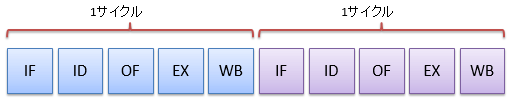
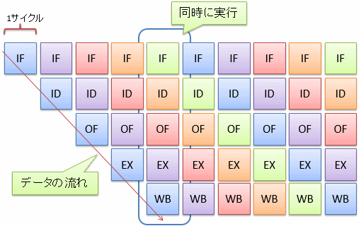
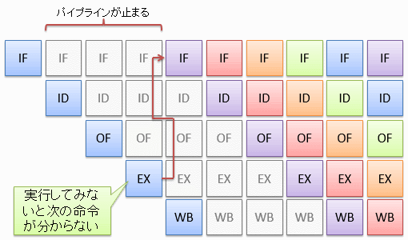
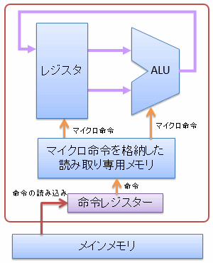
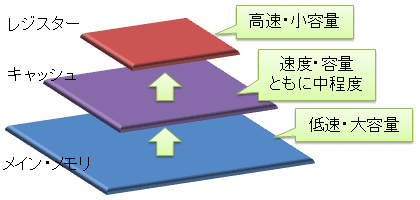
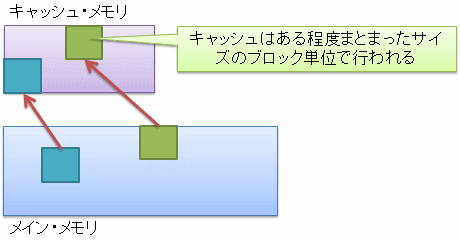

# CPU の高速化

##  概要

「[CPU](cpu.md)」では、初歩的な構成のCPUの作り方や制御の仕方について説明しました。
ここで説明したことは、CPUを動作させるための最低限の知識になります。

一方で、現在のCPUは、性能向上のための発展的なさまざまな工夫が取り入れられています。
本節では、発展的な工夫のいくつかを簡単に紹介していきましょう。

##  パイプライン

「[パイプライン処理](../basis/sequentialcircuit.md#pipeline)」で少し話を出しましたが、
ディジタル回路のクロック周波数を上げるために、組み合わせ回路を複数の段階に分割し、
間にレジスターを挟んで複数サイクルかけて処理を行う<strong id="pipeline" class="keyword">パイプライン方式</strong>と呼ばれる回路設計方法があります。

CPUでもパイプライン構成によって動作の高速化が期待できます。
CPUの回路は、例えば、以下のような段階に分割されます。

* 命令フェッチ（IF: instruction fetch）: 命令をメイン・メモリから読み込みます。

* 命令デコード（ID: instruction decode）: 命令を、CPU内の各ハードウェアの制御信号に変換します。

* オペランド・フェッチ（OF: operand fetch）: 演算対象のデータ（オペランド）をメイン・メモリからレジスターに読み込みます。

* 実行（EX: execution）: ALUなどのハードウェアを駆動させて実際に計算を行います。

* 書き戻し（WB: write back）: 計算結果をレジスターに書き戻します。

図1および図2に、それぞれパイプライン構成を取らないCPUと取るCPUの実行の様子を示します。
このように、パイプライン構成を取るCPUでは、1サイクルの時間を短くする（クロック周波数を上げる）ことが可能で、処理速度が速くなります。

<figure>

<figcaption>パイプライン構成を取らないCPU</figcaption>
</figure>

<figure>

<figcaption>パイプライン構成のCPU</figcaption>
</figure>

図1と図2を比べてみるとわかる通り、
1つの命令の実行を開始してから終了するまでにかかる時間（遅延（delay）と呼びます）はあまり変わりません
（むしろ、レジスターを挟んでいる分、遅くなるはずです）。
しかし、同じサイクル内で複数の命令が並列に動くことで、単位時間あたりに処理可能な命令数（スループット（throughput）と呼びます）が増えます。

CPUによってはもっと細かく段階を分ける場合もあり、パイプラインの段数はCPUごとに異なります。

###  条件分岐とパイプライン・ストール

一般に、パイプライン構成を取るCPUは条件分岐が苦手という問題があります。
もし、直前の命令の実行結果を基に条件分岐をしようとすると、
図3に示すように、実行段階（EX）が終わるまで次の命令を開始できず、数サイクルの間パイプラインが止まってしまいます。
このような現象をパイプライン・ストール（pipeline stall: パイプライン詰まり）と呼びます。

<figure>

<figcaption>条件分岐命令実行時のパイプライン・ストール</figcaption>
</figure>

もちろん、条件となる命令と分岐命令の間に挟める命令があれば、ストールは避けられます。
このため、コンパイラーによっては、高級言語で記述したのと異なる順序で機械語を並べる場合があります
（というか、いまどきのコンパイラーはまず並べ変えをします）。

##### 注1

パイプライン・ストールは、条件分岐以外にも、直前の命令の実行結果を使いたい場合などにも起こります
（直前の命令のWBステージが終わるまで、現在の命令のOFステージが実行できない）。
この問題は、EXステージの結果を次の命令のEXステージの入力に直結渡せるような回路を作ることで回避可能です。

##### 注2

条件分岐の際には、「とりあえず分岐しない」として続きの命令を実行しておくことで、
「分岐しない」という予想が当たった時にはパイプライン・ストールを回避できます（ただし、予想が外れた場合にその分の命令を取り消す仕組みが必要）。
もちろん、逆に、「とりあえず分岐する」として、分岐先の命令を実行しておくこともできます。

より高度なCPUでは、分岐するかしないかの予測を立てて、パイプライン・ストールの発生を可能な限り避けるなどの工夫も行っています。

##  マイクロ命令

単純な構成のCPUの場合には、各命令がそのままハードウェアの制御用の信号になっていましたが、
このような方法では、ハードウェアが複雑になるにつれて、命令に必要なデータ長が肥大化してしまいます。
そこで、図4に示すように、CPUの内部に複雑な制御を行うための小さな命令列（マイクロ命令）を格納した読み取り専用メモリを持って、
このマイクロ命令を使ってCPUを駆動します。

<figure>

<figcaption>マイクロ命令</figcaption>
</figure>

##  キャッシュ・メモリ

「[容量と速度](memory.md#tradeoff)」で説明したように、記憶素子を作る場合、容量と動作速度には必ずトレードオフが発生します。

そこで、レジスターとメイン・メモリを使い分けているわけですが、たった2段階では不十分（レジスターとメイン・メモリの速度差が激しすぎる）なため、
図5に示すように、間に容量・速度ともに中間くらいの記憶素子を挟むという手法がよく使われます。

<figure>

<figcaption>キャッシュ・メモリ</figcaption>
</figure>

この中間層にあたる記憶素子を<strong id="cache-memory" class="keyword">キャッシュ・メモリ</strong>（cache memory）と呼びます。
キャッシュ・メモリも1層だけではなく、何層か挟む場合があります
（この場合、レジスターに近い側から順に、1次キャッシュ（first cache）、2次キャッシュ（second cache）、3次キャッシュ（third cache）、…と呼びます）。

###  局所性

メイン・メモリからキャッシュ・メモリへのデータの読み込みは、図6に示すように、ある程度まとまったサイズのブロック単位で行われます。

<figure>

<figcaption>キャッシュ・メモリへのデータの読み込み</figcaption>
</figure>

また、メイン・メモリとキャッシュ・メモリでは容量が違うわけで、当然、メイン・メモリ上の全てのデータはキャッシュ・メモリに移せません。
そのため、キャッシュ・メモリ上のデータは、いずれ上書きされて消えることになります
（多くの場合、最も長期間データの読み書きがなかったブロックから消されます）。

このことから、メモリの読み書きの性質として以下のようなことが言えます。

* あるデータと、メモリ上で近い位置にあるデータはすでにキャッシュされている可能性が高い。

* 同じデータを短時間に連続して読み書きする場合、そのデータがキャッシュされている可能性は高い。

実際、普通にプログラムを作ると、メモリ上近いデータを読み書きすることが多く、1度読んだデータは近いうちに再び読み書きされることが多いです。
このような性質を<strong id="locality" class="keyword">参照の局所性</strong>（locality of reference）と呼びます。

逆に、意識して局所性が高くなるようなコードの書き方をする（同時に使うデータはメモリ上の近い場所に配置されるように工夫する）ことで、
データがすでにキャッシュ・メモリ上に乗っている確率（キャッシュ・ヒット率）を上げることができ、プログラムの性能向上が期待できます。

##  その他の工夫

その他、以下のような工夫も採られています。

* マルチコア化： 動作クロック周波数を高めることによる性能向上に限界が見えてきたため、同じCPUを複数同時に使うことで性能向上を図る必要が出てきています。 近年、多くのCPUが、1つのチップ内に複数のCPUコアを形成することで、ハードウェア・コストに対する計算効率を向上させています。

* 部分的な高クロック化:「[記憶素子の構成例](../basis/sequentialcircuit.md#memory-element)」で説明したように、ディジタル回路には伝播遅延があり、複雑な回路ほどその遅延時間は大きくなります。 ハードウェア全体を単一のクロック周波数で駆動させると、ハードウェア中で最も遅延時間の大きな部分に合わせてクロック周波数を決める必要があります。 これに対して、伝播遅延の小さい部分だけ高クロック化することで、処理できるデータ量を増やす手法があります。 例えば、ALUの内部だけ2倍のクロック周波数で動いているCPUもあります。

* 同時マルチ・スレッディング（Simultaneous Multi-threading）：「[演算](cpu.md#arithmetic-instruction)」で説明したように、CPUは、命令の種類によってALU中の演算回路のどれかを選択して計算を行います。 逆に言うと、選択されなかった演算回路は暇を持て余していることになります。 そこで、加算と乗算など、別の演算回路を使う命令を並列に実行して、演算回路を余らせないように動かし、ハードウェアの稼働率を上げるという手法があり、 同時マルチ・スレッディングと呼ばれています。

* ベクトル演算（vector operation）： プログラムには頻出する計算式があります。例えば、ax + by + cz + dwというような積和計算の頻度は非常に高いです。 一般に、この積和計算のように、複数のデータに対して同じ計算を行うという機会は多いです。 そこで、複数のデータに対する計算を1命令で実行できるCPUが増えています。 このような、複数のデータに対する演算をベクトル演算（vector operation）と呼びます。
