# CPU

##  概要

「[組み合わせ回路](../basis/combinationalcircuit.md)」や「[順序回路](../basis/sequentialcircuit.md)」では、
ディジタル液晶表示回路やカウンター回路など、簡単な機能をディジタル回路化する方法について説明しました。
しかしながら、これらの機能はかなり簡素な部類に入ります。
現実にはもっと複雑で多用な機能が必要となりますが、複雑な機能をすべてハードウェア的に実装すると、ハードウェア規模が肥大化してしまいます。

そこで、図1に示すように、
外部からある種の「命令」（instruction）を与えることでさまざまな処理を行うことができる汎用的なハードウェアを作って、
「命令」の与え方の工夫で複雑な処理を行うことを考えます。
現在、いわゆる「コンピューター」（computer: 計算機）と呼ばれるものの多くはこういう汎用的な作りになっていて、
汎用コンピューター（general computer）と呼ばれます。

汎用コンピューターを構成するハードウェアのうち、特に重要なのはその「命令」を解釈して実行する部分で、
<strong id="cpu" class="keyword">CPU</strong>（Central Processing Unit：中央演算処理装置）と呼ばれます。
そして、このCPUに与える命令がいわゆる<strong id="software" class="keyword">ソフトウェア</strong>というものになります。

<figure>

[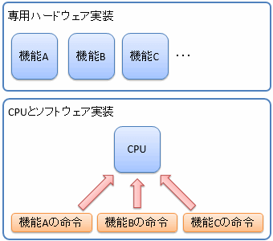](../../../../assets/media/ufcpp2000/computer/fig/General/CPU.png)

<figcaption>CPU</figcaption>
</figure>

本稿では、CPUというハードウェアがどのようにして作られているかや、CPUへの命令の与え方について説明します。

##  汎用コンピューターの構造

現在の主流な汎用コンピューターの中枢部分は、図2に示すように、メイン・メモリ（main memory: 主記憶）とCPUと呼ばれる部分から構成されています。

<figure>

[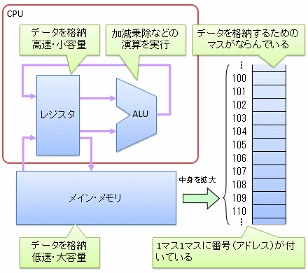](../../../../assets/media/ufcpp2000/computer/fig/General/ComputerStructure.png)

<figcaption>汎用コンピューターの構造： CPUとメイン・メモリ</figcaption>
</figure>

メイン・メモリは、プログラム自体や、プログラムで使うデータを格納しておく大容量の記憶素子です。
一方、CPUは、中央演算処理装置という名前の通り、汎用コンピューターの処理の中心となる部分です。

メイン・メモリに関しては次項「[メイン・メモリ](memory.md)」で説明します。
本項では、CPUに関して、より詳細に見ていきましょう。CPUの概念的な内部構造を図3に示します。

<figure>

[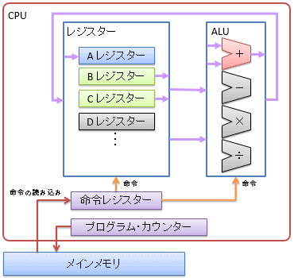](../../../../assets/media/ufcpp2000/computer/fig/General/CpuStructure.png)

<figcaption>CPUの概念的な内部構造</figcaption>
</figure>

CPUの内部には、<strong id="alu" class="keyword">ALU</strong>（Arithmetic Logic Unit： 算術論理演算処理部）と呼ばれる部分と<strong id="register" class="keyword">レジスター</strong>（register）と呼ばれる部分が存在します。

ALUの中には加算器や乗算器など、基礎的な演算を行うディジタル回路が入っていて、命令によってどの回路を動かすかを選択し、さまざまな演算を実行します。

一方、レジスターという言葉には少し注意が必要です。
「[順序回路](../basis/sequentialcircuit.md)」では、記憶素子全般を指してレジスターと呼びましたが、
汎用コンピューターの話をする場合には、CPU内部に持っている小容量で高速な記憶素子のことをレジスターと呼びます。
実行したいプログラムや、プログラムで使うデータは大容量で低速なメイン・メモリに置かれますが、データの読み書きが実行速度のネックにならないように、
いったんレジスターに読み込んでからALUに渡します。
CPU内部にある複数のレジスターをまとめた全体の呼称として、レジスター・ファイル（register file）と呼ぶこともあります。

レジスターの中には特殊な用途に使うものがあり、その代表がプログラム・カウンターと命令レジスターです。
プログラムは複数の命令で構成されるわけですが、命令の実行位置を管理する(命令を実行するたびに、次に実行すべきメモリー番地に上書かれる)のがプログラム・カウンターで、
ちょうど実行中の命令を記憶しておくのが命令レジスターです。

###  余談: ワード

よく、「32ビットCPU」とか「64ビットCPU」という呼び名を聞くと思いますが、
この32とか64とかのビット数は、レジスターに記録し、ALUで演算できるデータのサイズのことを指します。
例えば、32ビットCPUなら、32ビット単位でのデータの読み書きや演算が基本となります。
32ビットCPUでは、8ビットや16ビットの演算をする場合でも1度32ビットのデータを取ってきてから不要な部分を捨てることになります。
逆に、32ビットCPUで64ビット演算をする場合には、複数サイクルかけて演算を行うことになります。

この、読み書きや演算の基本単位（32ビットCPUなら32ビット、64ビットCPUなら64ビット）のことをワード（word: 単語）と呼びます。
あるいは、メイン・メモリとCPUなど、ハードウェア間をつなぐ信号線のことをバス（bus: 交通手段のバスと同じ単語。CPU と周辺機器をつなぐ通り道という意味合い）と呼びますが、
ここに流れるデータもワード単位になりますので、ワードのことをバス幅（bus width）と呼ぶこともあります。

##  CPUの制御

前節で説明したとおり、CPUは外部から命令（すなわち、ソフトウェア）を与えて初めて動作します。
ここでは、CPUへの命令の与え方について説明します。簡単に言うと、CPUというのは以下のようなハードウェアです。

* 加算器や乗算器など、複数の演算回路を持っている。

* レジスターと呼ばれる記憶素子を複数持っている。

* どのレジスターからデータを読み出し、どの演算回路を通し、どのレジスターにデータを書き戻すかを、外部から与えた命令で選択する。

すなわち、CPUへの命令というのは、データや演算回路の選択信号をひとまとめにしたものになります。
ちなみに、あるCPUが解釈可能な命令の一覧を命令セット（instruction set）と呼びます。
もちろん、この命令の与え方はCPUの構造に依存するので、CPUの種類の数だけ命令セットができることになります。
（もちろん、シリーズもののCPUの場合は命令セットが今までと同じか、「命令の追加」にとどまります。
また、あるCPUと同じ命令セットを受け付けるような「互換CPU」というものも作られています。）

###  機械語とアセンブリ言語

CPUへの命令も、コンピューターの内部ではすべて0, 1の羅列で表現されています。
この0, 1の羅列のままの命令列を<strong id="machine-language" class="keyword">機械語</strong>（machine language）と呼びます。
もちろん、表記上、2進数の代わりに16進数を使って表現することもありますが、それでも0～9, A～Fの16進数字の羅列になります。

当然、機械語のままでは人が理解するのが非常に大変なので、機械語とほぼ1対1に対応する人が読みやすい形式の言語を別途用意して使います。
このような言語を<strong id="assembly-language" class="keyword">アセンブリ言語</strong>（assembly language: assembly は組み立て部品）と呼びます。

図4にアセンブリ言語と機械語の例を挙げます。
アセンブリ言語では、加算ならADD、乗算ならMULというような、
ある程度人が見てわかりやすい記号（通常は、英単語、もしくは、その略記）を使って命令を表現します。
命令の後ろに続くBXやCXという記号は「どのレジスターから値を読み出すか」などを指定するものです。

アセンブリ言語から機械語への変換には、「ADD命令なら000」というような一定のルールがあり、
やろうと思えば対応表を見ながら手動で機械語化することもできます
（通常は、アセンブラー（Assembler）と呼ばれるプログラムを使って自動的に変換します）。

<figure>

[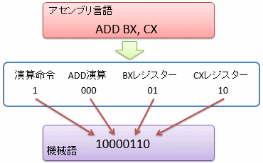](../../../../assets/media/ufcpp2000/computer/fig/General/AssemblyLanguage.png)

<figcaption>アセンブリ言語と機械語</figcaption>
</figure>

こうして得られた機械語（すなわち、CPUに与える命令）は、図5に例示するような形でCPUに解釈されます。

<figure>

[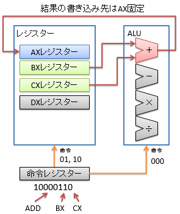](../../../../assets/media/ufcpp2000/computer/fig/General/Interpretation.png)

<figcaption>アセンブリ言語と機械語</figcaption>
</figure>

この例のように、演算結果の書き込み先が特定のレジスターに固定されている場合もあります。
これは命令やハードウェア構成を単純化するためです。
実際、書き込み先を固定化して省略することで、命令長が8ビットに収まっています。
（汎用コンピューターが作られた初期の頃には、このような省略によるハードウェアの単純化が多くみられました。
例えば、Intel 8086 プロセッサーがまさにこういう命令セットでした。）

##  CPU の命令の種類

命令には、大きく分けて以下のような種類があります。

* データの移動

* 演算

* 実行制御

###  データの移動

レジスターとメイン・メモリの間や、レジスター同士の間でデータをコピーしたり、定数値をレジスターに書き込んだりします。
多くのCPUでは、以下のような命令を持っています。

* Load： メイン・メモリからレジスターに値を読み込みます（図6）。

* Store： レジスターからメイン・メモリに値を書き込みます（図7）

* Move： レジスター間で値をコピーします（図8）

* Load Immediate： 命令中に埋め込んだ定数（即値（immediate value）と呼びます）をレジスターに代入します（図9）。

<figure>

[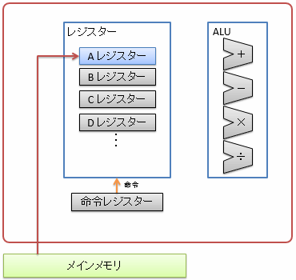](../../../../assets/media/ufcpp2000/computer/fig/General/Load.png)

<figcaption>メイン・メモリから値を読み込み（Load）</figcaption>
</figure>

<figure>

[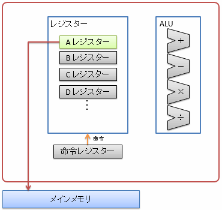](../../../../assets/media/ufcpp2000/computer/fig/General/Store.png)

<figcaption>メイン・メモリに値を書き込み（Store）</figcaption>
</figure>

<figure>

[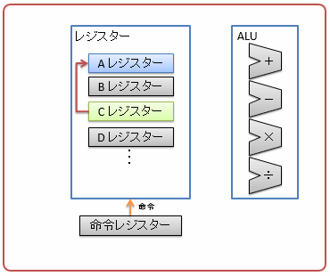](../../../../assets/media/ufcpp2000/computer/fig/General/Move.png)

<figcaption>レジスター間での値のコピー（Move）</figcaption>
</figure>

<figure>

[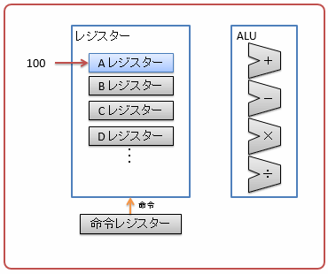](../../../../assets/media/ufcpp2000/computer/fig/General/Immediate.png)

<figcaption>レジスターへの即値代入（Load Immediate）</figcaption>
</figure>

###  演算

加減乗除などの算術演算や、AND/ORなどの論理演算など、さまざまな演算を行います。
図10に演算命令の例として、加算命令を示します。
通常、演算に使うオペランド（operand: 被演算子、演算対象）はレジスターから読み、演算結果もレジスターに書き込みます。
CPUによっては、オペランドを命令に埋め込んだり（即値命令）、メイン・メモリから直接オペランドを読み込んだり（間接参照命令）が可能なものもあります。

<figure>

[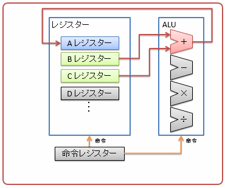](../../../../assets/media/ufcpp2000/computer/fig/General/Add.png)

<figcaption>演算命令の例（ADD）</figcaption>
</figure>

加算器などの具体的なハードウェアの作り方については別途「[汎用コンピューターの作り方](generalcomputercircuit.md)」にて説明します。

###  実行制御

命令の実行フローはプログラム・カウンターと呼ばれる特別なレジスターで管理されています。
プログラム・カウンターには、今、メイン・メモリのどこに格納された命令を実行中かを指し示すアドレス値（詳細は次節で説明）が格納されています。
通常の実行フローでは、実行した命令長分ずつプログラム・カウンターの値が増加し、
メイン・メモリ中に格納された命令を前から順に逐次実行することになります。

これに対して、プログラム・カウンターの値を意図的に書き換えることで、実行順（flow）を制御（control）するための命令がいくつかあります。
実行制御には条件の有無という観点と、アドレス指定の仕方で以下のように分類することができます。

* 条件の有無
    * ジャンプ（jump）： 無条件に指定したアドレスに実行フローを移します。

    * 分岐（branch）： 特定の条件下でのみ（直前の命令の結果が0だったとか、負の数になっていたとか）、指定したアドレスに実行フローを移します。

* アドレス指定の仕方
    * 相対アドレス指定： 図11に示すように、現在のプログラム・カウンターの値を基準にして、相対的に次の実行アドレスを決定します。

    * 絶対アドレス指定： 図12に示すように、指定した値でプログラム・カウンターの値を上書きし、絶対的に次の実行アドレスを決定します。

<figure>

[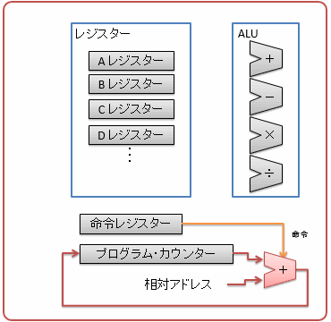](../../../../assets/media/ufcpp2000/computer/fig/General/RelativeJump.png)

<figcaption>相対アドレス指定</figcaption>
</figure>

<figure>

[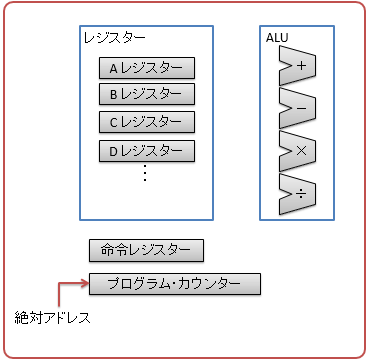](../../../../assets/media/ufcpp2000/computer/fig/General/AbsoluteJump.png)

<figcaption>絶対アドレス指定</figcaption>
</figure>
