# 汎用コンピューターの作り方

## 概要
「[CPU](cpu.md)」で説明したようなCPUの動作を実現するためには、以下のようなハードウェアが必要です。

* 演算回路: ALUの内部で使う、加算や乗算を行うための回路。

* 選択回路（セレクター）: 命令の種類に応じて、どの演算器を動作させるかや、読み書きするレジスターを選択するための回路。

* 記憶素子
    * レジスター: 高速・小容量な記憶素子。

    * メイン・メモリ: 低速な代わりに大容量な記憶素子。

ここでは、これらのハードウェアの構築方法を、
「[組み合わせ回路](../basis/combinationalcircuit.md)」や「[順序回路](../basis/sequentialcircuit.md)」で紹介した回路設計手法に基づいて説明していきましょう。

本項では、例として2進数4桁の回路を示します。
（桁が増えても、単純に並べる回路の数が増えるだけです。）

## 演算回路
前述のとおり、ALUには加算回路や乗算回路をはじめとして、さまざまな演算回路が入っています。

### ビットごとの論理演算
ALU中の演算回路の中で最も簡単なものは、ビットごとの論理演算回路です。
ビットごとの論理演算回路は、名前通りビットごとにそれぞれAND演算回路などを通すものです。
例えばビットごとのAND演算なら図1に示すようになります。

<figure>
	[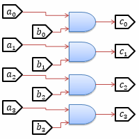](../../../../assets/media/ufcpp2000/computer/fig/General/BitLogic.png)
	<figcaption>ビットごとのAND演算回路</figcaption>
</figure>

同様に、OR演算やXOR演算などでもビットごとの演算回路を作れます。

ビットごとの論理演算は非常に単純な作り（各ビットは完全に独立していて、いずれも1段のゲートを通るのみ）なので、
ほとんどのCPUでは、もっとも高速に実行できる演算です。
「4で割った余りを求める変わりに、3（2進数で0011）とのANDを取る」というようなことをするのはこのためです。
（いまどきはコンパイラーが自動で置き換えてくれたりするので、開発者が気にする必要性は低くなっています。）

### 加算
加算に関しては、まず、1桁だけの場合から考えてみましょう。
入力を a, b、出力を cs = a + b
（c, s はそれぞれ、桁上がり（carry out）と和（sum）を意味します）とすると、
表1に示すような真理値表で加算を実現できます。

<table summary="1桁の加算回路">
	<caption>
		1桁の加算回路
	</caption>
	<tr>
		<td markdown="1">a</td>
		<td markdown="1">b</td>
		<td markdown="1"></td>
		<td markdown="1">c</td>
		<td markdown="1">s</td>
		<td markdown="1"></td>
		<td markdown="1">意味</td>
	</tr>
	<tr>
		<td markdown="1">0</td>
		<td markdown="1">0</td>
		<td markdown="1"></td>
		<td markdown="1">0</td>
		<td markdown="1">0</td>
		<td markdown="1"></td>
		<td markdown="1">0 = 0 + 0</td>
	</tr>
	<tr>
		<td markdown="1">0</td>
		<td markdown="1">1</td>
		<td markdown="1"></td>
		<td markdown="1">0</td>
		<td markdown="1">1</td>
		<td markdown="1"></td>
		<td markdown="1">1 = 0 + 1</td>
	</tr>
	<tr>
		<td markdown="1">1</td>
		<td markdown="1">0</td>
		<td markdown="1"></td>
		<td markdown="1">0</td>
		<td markdown="1">1</td>
		<td markdown="1"></td>
		<td markdown="1">1 = 1 + 0</td>
	</tr>
	<tr>
		<td markdown="1">1</td>
		<td markdown="1">1</td>
		<td markdown="1"></td>
		<td markdown="1">1</td>
		<td markdown="1">0</td>
		<td markdown="1"></td>
		<td markdown="1">10 = 1 + 1</td>
	</tr>
</table>

これを論理式で表すと以下のようになります（すなわち、s はXOR（排他的論理和）、c はAND（論理積）になります）。

                s = a ⊕ b
            

                c = ab
            

ただし、この場合、下位桁からの桁上がりが考慮に入っていません。
したがって、複数桁の加算を行うには不十分なため、半加算器（half adder）などと呼ばれます。

下位桁からの桁上がり ci を考慮すると、
表2のような心理値表になります（上位桁への桁上がりは co で表します）。

<table summary="桁上がりを考慮した1桁の加算回路">
	<caption>
		桁上がりを考慮した1桁の加算回路
	</caption>
	<tr>
		<td markdown="1">a</td>
		<td markdown="1">b</td>
		<td markdown="1">ci</td>
		<td markdown="1"></td>
		<td markdown="1">co</td>
		<td markdown="1">s</td>
		<td markdown="1"></td>
		<td markdown="1">意味</td>
	</tr>
	<tr>
		<td markdown="1">0</td>
		<td markdown="1">0</td>
		<td markdown="1">0</td>
		<td markdown="1"></td>
		<td markdown="1">0</td>
		<td markdown="1">0</td>
		<td markdown="1"></td>
		<td markdown="1">0 = 0 + 0 + 0</td>
	</tr>
	<tr>
		<td markdown="1">0</td>
		<td markdown="1">0</td>
		<td markdown="1">1</td>
		<td markdown="1"></td>
		<td markdown="1">0</td>
		<td markdown="1">1</td>
		<td markdown="1"></td>
		<td markdown="1">1 = 0 + 0 + 1</td>
	</tr>
	<tr>
		<td markdown="1">0</td>
		<td markdown="1">1</td>
		<td markdown="1">0</td>
		<td markdown="1"></td>
		<td markdown="1">0</td>
		<td markdown="1">1</td>
		<td markdown="1"></td>
		<td markdown="1">1 = 0 + 1 + 0</td>
	</tr>
	<tr>
		<td markdown="1">0</td>
		<td markdown="1">1</td>
		<td markdown="1">1</td>
		<td markdown="1"></td>
		<td markdown="1">1</td>
		<td markdown="1">0</td>
		<td markdown="1"></td>
		<td markdown="1">10 = 0 + 1 + 1</td>
	</tr>
	<tr>
		<td markdown="1">1</td>
		<td markdown="1">0</td>
		<td markdown="1">0</td>
		<td markdown="1"></td>
		<td markdown="1">0</td>
		<td markdown="1">1</td>
		<td markdown="1"></td>
		<td markdown="1">1 = 1 + 0 + 0</td>
	</tr>
	<tr>
		<td markdown="1">1</td>
		<td markdown="1">0</td>
		<td markdown="1">1</td>
		<td markdown="1"></td>
		<td markdown="1">1</td>
		<td markdown="1">0</td>
		<td markdown="1"></td>
		<td markdown="1">10 = 1 + 0 + 1</td>
	</tr>
	<tr>
		<td markdown="1">1</td>
		<td markdown="1">1</td>
		<td markdown="1">0</td>
		<td markdown="1"></td>
		<td markdown="1">1</td>
		<td markdown="1">0</td>
		<td markdown="1"></td>
		<td markdown="1">10 = 1 + 1 + 0</td>
	</tr>
	<tr>
		<td markdown="1">1</td>
		<td markdown="1">1</td>
		<td markdown="1">1</td>
		<td markdown="1"></td>
		<td markdown="1">1</td>
		<td markdown="1">1</td>
		<td markdown="1"></td>
		<td markdown="1">11 = 1 + 1 + 1</td>
	</tr>
</table>

これを論理式で表すと以下のようになり、こちらは<strong id="full-adder" class="keyword">全加算器</strong>（full adder）と呼ばれます。

                s = a ⊕ b ⊕ ci
            

                co = ab + bci + aci
            

そして、複数桁の加算を行う場合には、図2に示すように、全加算器を多段に並べます。

<figure>
	[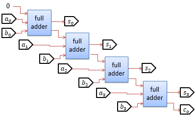](../../../../assets/media/ufcpp2000/computer/fig/General/FullAdder.png)
	<figcaption>4桁の加算回路</figcaption>
</figure>

このような構成の加算器は桁上げ伝播加算器（ripple carry adder）と呼ばれるもので、
単純ですが、桁数が多くなると信号の伝播遅延が大きくなるという問題があります。

この問題を回避するための工夫として、全加算器とは別に、数桁先の桁上がりを並行して計算することで伝播遅延を減らす、
桁上げ先見加算器（carry look-ahead adder）という方式もあります（本稿では詳細は割愛します）。

ちなみに、1桁目は半加算器を使っても構わない（その方が回路規模が少し小さくできる）のですが、わざとそうしないことも多いです。
（次項で説明しますが、1桁目も全加算器にすることで、減算と回路を共通化することができます）。

### 2の補数（負の数の表現）
負の数を表現するためには、符号1ビットと絶対値を持つというような方法も考えられますが、
通常は、これから説明するような<strong id="two-complement" class="keyword">2の補数</strong>（two’s complement）と呼ばれる表現を用います。
2の補数表現のいいところは、加算や乗算が正の数の場合とまったく同じ回路で計算可能なことです
（減算は「負の数を加える」ことでできるので、結果として、加算と減算は同じ回路で行えます）。

2の補数の原理としては、
最上位桁の桁上がりを無視することで、（4桁の2進数の場合）10000と0の区別がつかないことを利用します（4桁分しか回路がない場合、5桁目は捨てられる）。
すなわち、a の（加法に関する）逆元 −a というと、通常は、

                a + (−a) = 0
            

となる数のことをさしますが、2の補数表現では、これを、

                a + b = 10000
            

となる数 b で代用します。
2進数で下4桁だけを見る（5桁目の桁上がりを無視する）と、 b = −a となります。
このような数  b を、a の「2の補数」と呼び、負の数の表現に用います。
2の補数は、表3に示すように、「ビットごとの論理否定に1加える」という方法で作ることができます
（ちなみに、単に「補数」（complement）もしくは「1の補数」（one’s complement）というと、ビットごとの論理否定を取ったもののことをさします）。

<table summary="2の補数表現（4桁の場合）">
	<caption>
		2の補数表現（4桁の場合）
	</caption>
	<tr>
		<td markdown="1">a</td>
		<td markdown="1">¬a※1</td>
		<td markdown="1">b※2</td>
		<td markdown="1">注釈</td>
	</tr>
	<tr>
		<td markdown="1">0000</td>
		<td markdown="1">1111</td>
		<td markdown="1">0000</td>
		<td markdown="1">0 = -0</td>
	</tr>
	<tr>
		<td markdown="1">0001</td>
		<td markdown="1">1110</td>
		<td markdown="1">1111</td>
		<td markdown="1">-1</td>
	</tr>
	<tr>
		<td markdown="1">0010</td>
		<td markdown="1">1101</td>
		<td markdown="1">1110</td>
		<td markdown="1">-2</td>
	</tr>
	<tr>
		<td markdown="1">0011</td>
		<td markdown="1">1100</td>
		<td markdown="1">1101</td>
		<td markdown="1">-3</td>
	</tr>
	<tr>
		<td markdown="1" colspan="4">中略</td>
	</tr>
	<tr>
		<td markdown="1">0111</td>
		<td markdown="1">1000</td>
		<td markdown="1">1001</td>
		<td markdown="1">-7</td>
	</tr>
	<tr>
		<td markdown="1">1000</td>
		<td markdown="1">0111</td>
		<td markdown="1">1000</td>
		<td markdown="1">4桁の2の補数表現の場合、-8  の逆は -8  になってしまう（正の8を作れない）ので注意が必要。</td>
	</tr>
	<tr>
		<td markdown="1">1001</td>
		<td markdown="1">0110</td>
		<td markdown="1">0111</td>
		<td markdown="1">負の数の2の補数を作ると、正の数にできる（2の補数の2の補数は元の数に戻る）。a = −(−a)。</td>
	</tr>
</table>

※1 ¬a は a のビットごとの論理否定。

※2 b、すなわち、a の2の補数は、¬a に1加えたものになります。

改めてまとめなおすと、2の補数には以下のような特徴があります。

* （正の数の）加算回路をそのまま使える。
    * 後述する乗算回路も同様。

* 「2の補数の2の補数」は元の数に戻る（a=-(-a)という式と矛盾しない）。

* 0の2の補数は0（0=-0 という式と矛盾しない）。

* 最上位ビットが0のときは正（または0）、1のときは負になり、正負の判定が簡単。

* 絶対値のもっとも大きな数（4桁の場合は-8）は負の数しか作れない。
    * 2の補数を取っても-8は-8のままになる。

### 減算
2の補数がわかれば、減算回路を作るのは簡単です。
a − b = a + (−b) なので、
b の2の補数を加算回路に与えるだけで減算を実現できます。
2の補数の作り方は、ビットごとに論理否定したものに1を加えるだけなので、
（4桁の）減算回路は図3に示すようになります。

<figure>
	[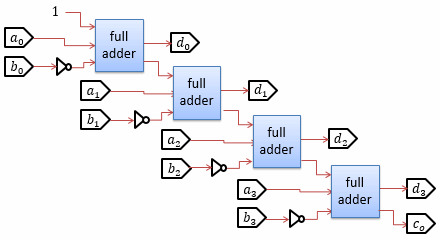](../../../../assets/media/ufcpp2000/computer/fig/General/Subtracter.png)
	<figcaption>4桁の減算回路</figcaption>
</figure>

図2と比べてみるとわかるとおり、加算器とほとんど同じ構成になっています
（b に対して論理否定が付いたのと、最下位桁の桁上げ入力が1になっているだけです）。
実際、通常は、加算器と減算器の回路を共通化して、CPUの回路面積を削減します。

### 乗算
2進数での乗算を考える前に、10進数の乗算を振り返ってみましょう。
小学校などで始めて2桁以上の掛け算を習う際、図4に例を示すような図を使って手順を教わると思います。

<figure>
	[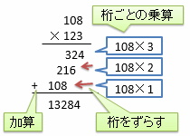](../../../../assets/media/ufcpp2000/computer/fig/General/Mul10.png)
	<figcaption>10進数の乗算の手順の例</figcaption>
</figure>

桁ごとの乗算、桁をずらす操作（つまり、シフト演算）、そして加算という3つの操作から成り立っています。
これと同じことを2進数でやってみましょう。図5に示すような手順になります。

<figure>
	[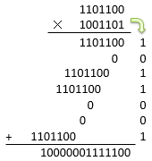](../../../../assets/media/ufcpp2000/computer/fig/General/Mul2.png)
	<figcaption>2進数の乗算の手順の例</figcaption>
</figure>

2進数の場合、各桁に現れる数字は0か1しかないので、桁ごとの掛け算が不要です。
要するに、桁数分だけ加算を繰り返せば乗算を行えます。回路構成としては、以下のような2種類の作り方が考えられます。

* 1サイクル計算: 桁数分だけ加算回路を並べた組み合わせ回路を作る方式。

* マルチサイクル計算: 1サイクルに1桁ずつ、加算とシフトを繰り返すような順序回路を作る方式。

除算回路も乗算と同様に、筆算的な手順を並べた組み合わせ回路か、繰り返す順序回路によって構成します。

ちなみに、ここでは割愛しますが、
乗算や除算の回路を高速化するための手法もいくつかあります。
例えば有名どころだと、ブース法（ブースは人名。Booth）と呼ばれる乗算高速化の手法があります。
興味があれば調べてみてください。

### シフト
図6に示すように、入力されたビット列をずらす操作をシフト（shift）演算と呼びます。
文字に起こしたときに左右どちらに向かってずれるかによって、左シフトと右シフトの2種類のシフト演算があり、
例えば、0110という2進数（10進数で6）を左シフトすると0011（10進数で3）に、右シフトすると1100（10進数で12）になります。

<figure>
	[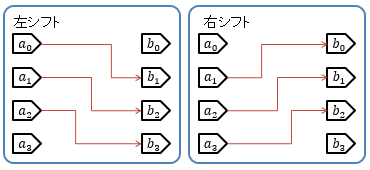](../../../../assets/media/ufcpp2000/computer/fig/General/Shift.png)
	<figcaption>シフト演算</figcaption>
</figure>

入出力を整数値として考えた場合、1ビット左にシフトすると値が2倍に、右にシフトすると2分の1（小数点以下切り捨て）になります。
同様に、2ビットのシフトなら、左シフトは4倍、右シフトは4分の1になります。

左シフトに関しては、「2の補数」表現を使った場合、負の数でも値を2倍にできます。
例えば、4ビット整数で考えてみると、10進数の -2 は1110で表されますが、これを1ビット左にシフトすると1100となり、10進数の -4 になります。

2の補数に対する右シフトは、図7に示すように、最上位のビットを残すことで、負の数でも値が2分の1になります。
例えば、同様に1110（10進数で -2）を考えてみると、1ビット右に算術シフトすると1111となり、10進数の -1になります。

<figure>
	[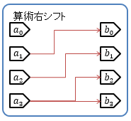](../../../../assets/media/ufcpp2000/computer/fig/General/ArithmeticShift.png)
	<figcaption>算術右シフト演算</figcaption>
</figure>

ビットごとの論理演算同様、シフト演算も伝播遅延が小さく、多くのCPUで非常に高速にできる演算の1つです。
2倍、4倍、8倍… の代わりに左シフト演算を使ったりするのはそのためです。
（論理演算同様、コンパイラーが自動で置き換えてくれたりもします。）

また、シフト演算には、図8に示すような、はみ出した最下位ビット/最上位ビットを逆側の端に移動させる亜種があり、
こちらはローテート（rotate: 巡回）演算と呼びます。

<figure>
	[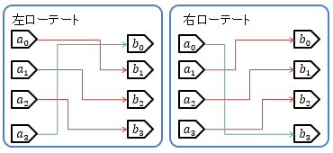](../../../../assets/media/ufcpp2000/computer/fig/General/Rotate.png)
	<figcaption>ローテート演算</figcaption>
</figure>

ちなみに、シフト演算やローテート演算は、1ビットのシフトだけを考える場合には非常に単純ですが、
任意のビット数シフト可能な回路を作ろうとすると、次節で説明する選択回路のような仕組みが必要で、
演算内容の単純さの割には回路が大きめになったりします。

演算回路の説明の最後に、演算にかかる時間について少し触れておきましょう。

一般論として、回路が複雑なほど、演算に時間がかかります。
本章で説明した範囲で大まかに言うと、ビットごとの論理演算 → シフト演算 → 加減算 → 乗除算 の順で遅くなっていきます。
その結果、例えば、「2倍するには乗算器を使うよりもシフト演算器を使う方が高速」とか、
「大小比較（減算が必要）より等値比較（XOR相当の演算）の方が高速」とかいうようなことが言えます。

## 選択回路
CPUを作るためには、ALU内のどの演算回路を動かすかや、
どのレジスターからデータを読み出して、どのレジスターへデータ書き込むかなどを選択する回路（selector）が必要です。
図9に4つのレジスターがある場合の選択回路の例を示します。

<figure>
	[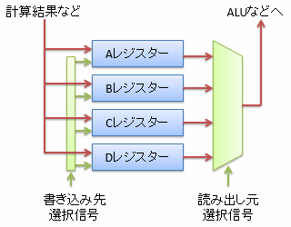](../../../../assets/media/ufcpp2000/computer/fig/General/Selector.png)
	<figcaption>レジスターの選択回路</figcaption>
</figure>

選択回路には、読み出し側と書き込み側でそれぞれ1種類ずつ、マルチプレクサーとデマルチプレクサーという2種類の選択回路があります。

### マルチプレクサー
読み出し側では、複数の入力のうち1つを選んで出力するような回路が必要で、これを<strong id="multiplexer" class="keyword">マルチプレクサー</strong>（multiplexer: 多重化するもの）と呼びます。
例えば、入力が4つの場合には、選択信号は2ビットで表され、図10に示すような挙動をする回路になります。

<figure>
	[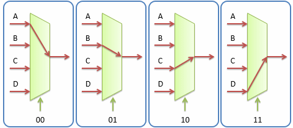](../../../../assets/media/ufcpp2000/computer/fig/General/Multiplexer.png)
	<figcaption>4入力のマルチプレクサー</figcaption>
</figure>

この例で、2ビットの選択信号を S1, S2 で、
出力を X 表すとすると、X は以下のような論理式であらわされます。

                X =
                S1
                S2
                A
                +
                S1
                S2
                B
                +
                S1
                S2
                C
                +
                S1
                S2
                D
            

同様に、選択信号を3ビットにすれば最大で8入力まで、4ビットにすれば16入力まで選択できるマルチプレクサーが作れます。
通常、入力が多いほどマルチプレクサーの回路規模も大きくなり、組み合わせ回路の伝播遅延も大きくなります。

### デマルチプレクサー
逆に、書き込み側では、複数の出力のうち1つだけを1にする（レジスターの書き込み制御信号として使う）回路が必要で、
これを<strong id="multiplexer" class="keyword">デマルチプレクサー</strong>（demultiplexer）と呼びます。
出力が4つの場合には、図11に示すような回路になります。

<figure>
	[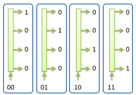](../../../../assets/media/ufcpp2000/computer/fig/General/Demultiplexer.png)
	<figcaption>4出力のデマルチプレクサー</figcaption>
</figure>

この例でも、2ビットの選択信号を S1, S2 で表し、
4つの出力をそれぞれ A, B, C, D で表すとすると、論理式は以下のようになります。

                A =
                S1
                S2
            

                B =
                S1
                S2
            

                C =
                S1
                S2
            

                D =
                S1
                S2
            

こちらも、出力が多いほどデマルチプレクサーの回路規模が大きくなり、組み合わせ回路の伝播遅延も大きくなります。
容量の大きな記憶素子ほど低速になる理由の1つです。
