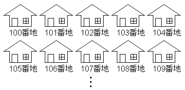
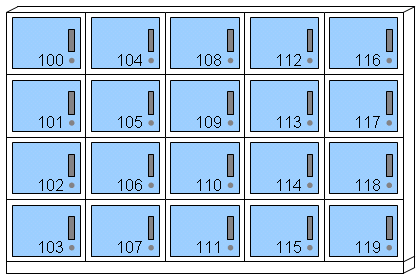
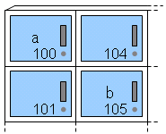
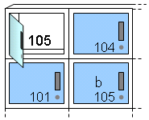
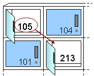

# メイン・メモリ

## 概要
前項「[CPU](cpu.md)」に引き続き、汎用コンピューターの構成要素の1つである<strong id="main-memory" class="keyword">メイン・メモリ</strong>について説明していきます。

C 言語のポインターや、C#・Java の参照型・参照渡しといった仕組みは、
ここで説明するようなメモリの「アドレス」と密接に関係しています。

## メモリとアドレス
前項からの再掲となりますが、汎用コンピューター内の記憶領域には、図1に示すのように、
高速な代わりに小容量なレジスターと、低速な代わりに大容量なメイン・メモリがあります。

<figure>
	
	<figcaption>汎用コンピューターの構造： CPUとメイン・メモリ</figcaption>
</figure>

CPU内のレジスターはデータの読み書きが高速な代わりに小容量であるため、プログラム中で利用するすべてのデータをレジスターに保存しておくことはできません。
長期的に利用するデータや大きなデータは大容量なメイン・メモリに格納され、必要に応じてレジスターに読み込んで使います。
以後、特に断りのない限り、
単に「<strong id="memory" class="keyword">メモリ</strong>（memory）」というとメインメモリのことをさします。

メモリは、データを入れておく箱が並んでいるような構造になっていて、
箱の1つ1つには「<strong id="address" class="keyword">アドレス</strong>（address）」と呼ばれる番号が付いています。

「アドレス」という言葉は、
下図のように、メモリ中のデータの入れ物1つ1つを住宅に例えて、
家の所在を表す番号＝住所（address）という意味です。
図2のように、新興住宅地のごとく、同じ形の家が大量に並んでいるような感じです。

<figure>
	
	<figcaption>メモリを住宅地に例えてみる</figcaption>
</figure>

メモリを住宅に例えるのが大げさだと思うなら、
例えば、図3のように、コインロッカーのようなものをイメージすると良いと思います。

<figure>
	
	<figcaption>メモリをコインロッカーに例えてみる</figcaption>
</figure>

### メモリの作り方
メモリというものは、「たくさんのマスがあって、各マスにアドレスが振られている」と説明しました。
ということは、マス（記憶素子: memory element）とアドレスに応じたマスを選ぶもの（セレクター: selector）があればメモリを作れることになります。

記憶素子の方は、「[記憶素子の構成例](../basis/sequentialcircuit.md#memory-element)」で説明したような回路を使えば実現できます。
（ここで説明しているような素子（フリップ・フロップ）は、
レジスターや、SRAMと呼ばれるようなメモリに使われます。
DRAMはまた別の構成。）

セレクターについては別途「[汎用コンピューターの作り方](generalcomputercircuit.md)」にて説明します。

### 容量と速度
大容量で低速なメイン・メモリと、小容量で高速なレジスターというように、容量と速度にはトレードオフがあります。このトレードオフには以下のような2つの要因があります

* 素子自体の違い: 省面積な代わりに低速な素子があります。
    * レジスターには「[記憶素子の構成例](../basis/sequentialcircuit.md#memory-element)」で説明したフリップ・フロップと呼ばれる素子が使われるのに対して、 メイン・メモリにはDRAMと呼ばれる素子が使われる場合が多いです。

    * また、同じ原理の素子を使うなら、高速に動作するように作る方が難しく、製造費用が割高になります。

* セレクターの規模の差: 記憶素子を大容量化するためには、セレクターの回路を大規模化する必要があります。
    * 回路の大規模化はそれだけで伝播遅延を大きくし、高速動作の妨げとなります。

## ポインター
通常、メイン・メモリのアドレスは連番の数値で（物理的な故障で部分的に使えない領域ができている場合などは除いて）、
あるアドレスxの隣はx+1というアドレスで読み書きできます。

ここで、このメモリのアドレス（数値としてそのまま）扱うことを<strong id="pointer" class="keyword">ポインター</strong>（pointer: アドレスを“指し示す”もの）と呼びます。

本項ではここから先、例としてC言語の記法を使って説明をしていきます。
C言語では、変数（値を格納しておくための入れ物。詳細は8章で説明）の前に <code>*</code> 記号を付けることで、ポインター変数を作ることができます。
（ちなみに、// 記号よりも後ろは、コメントといって、プログラム関係なく自由に文字を書ける部分です。自然言語で注釈を入れるために使います。）

<pre class="source" title="C 言語のポインター変数" lang="">
<code>int *a; // 整数型のポインター
int b;
</code></pre>

この例では、
整数（<code>int</code>）型のポインター変数 <code>a</code> と、
整数型の値を保持する変数 <code>b</code> が宣言されています。
図4に示すように、ポインター変数も通常の変数もメモリ上に値が記憶されることには変わりありません。
（実際にどのアドレスに値が置かれるかは環境次第ですが、今回は仮に、aがアドレス100の位置に、bがアドレス105の位置に格納される物として話を進めます。 ）

<figure>
	
	<figcaption>普通の値もポインターもどちらもメイン・メモリ上に記憶される</figcaption>
</figure>

また、変数の前に <code>&amp;</code> を付けると、変数のアドレスを取得することが出来ます。
（アドレスを取得することを「参照（reference）を得る」とも言います。）

<pre class="source" title="アドレスをポインターに代入" lang="">
<code>a = &amp;b; // 変数 b のアドレスを a に代入。
</code></pre>

このようなコードを書くと、ポインター変数 <code>a</code> に変数 <code>b</code> の（値の格納先の）アドレスが記憶されます。
イメージ的には図6ようになります。

<figure>
	
	<figcaption>アドレスをポインター変数に格納</figcaption>
</figure>

一方、ポインター変数の前に <code>*</code> を付けると、
ポインター変数の指し示すアドレスの先を読み書きすることが出来ます。

<pre class="source" title="ポインターの指す先の値を変更" lang="">
<code>*a = 213; // ポインター a の指し示す先の値を変更。
</code></pre>

このようなコードを書くと、図7に示すように、
変数 <code>a</code> の中身ではなく、
<code>a</code> の指し示す先（この例では <code>b</code>）の中身が書き換わります。

<figure>
	
	<figcaption>ポインター変数 a の指し示す先</figcaption>
</figure>

このような操作を間接参照（indirect reference）あるいは参照剥がし（dereference： 単語の意味的には「脱参照」の方が近いと思いますが、「逆参照」と訳されることもあります）と呼びます。
