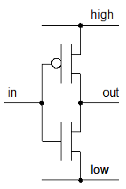
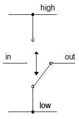

# n 進数

##  概要

コンピュータの中では、数値は全て2進数になっているので、
まずはその2進数の説明。

##  n 進数

まずは n 進数（n-adic number）というものをおさらい。

そもそも、
数字の表し方なんてのは、別に何を使ったってかまわないわけです。
0, 1, 2, 3, … 9 なんて10個の文字を必ずしも使う必要はない。

極端な話、
利便性を度外視すれば、
1, + の2つの記号だけあればどんな自然数でも表せます。
1, 1+1, 1+1+1, … とすればいいわけで。
0 と - もあれば整数も大丈夫。

利便性を考えて、0～9 という記号を用意して、
9 の次は「桁上げ」というものを使って、10 と書く。
これだって、0～9 の代わりに「あかさたなはまやらわ」を使って、
1,980 とかを「か、わらあ」と書いたって構わない。
まあ、あんまり変なことを書くと混乱すると思うので、
この話はこれくらいにして、
とにかく、
何の文字を使うかとか、どこで桁上げするかとはいくらでも自由があるわけです。

そんな中、10進数（decimal number）というものが普及している理由は、
まあ、人間の指の本数が左右合わせて10本だからでしょう。
片手じゃなくて両手なのは、
片手の5だとちょっと少なすぎて不満があるのかもしれません。
人間が瞬時に認識できる・短期的にぱっと暗記できる物の個数が大体 7±2 個なんて言われてて、
5よりは多いですから。

あと、よく考えてみたら、現代人は「もう1つの n 進数」を使っています。
算用数字で 1, 10, 100, 1000, 10000 と書いてる分には10進数しか使っていませんが、
一、十、百、千、万・・・ 読み上げてみれば、
もう1つ、万進数というのを使っていることが分かります。
一～千までは10倍ずつですが、
万以降は、万、億、兆、京、垓・・・と、1万倍ずつになります。
英語では千進数ですね。
thousand, million, billion, trillion・・・が1千倍ずつです。
補助単位の kilo, mega, giga ・・・なんかも同様に1千倍ずつ。

余談ですけど、昔は、千倍ずつじゃなくて、
thousand×thousand＝million、
million×million＝billion、
billion×billion＝trillion という流儀もありました。
複雑なので今では千倍ずつの方に統一されているはず。
同様に、中国なんかだと、
万×万＝億、
億×億＝兆・・・なんて流儀もいまだ少し残っているとか。

まあ、本題に戻すなら、
「10 を桁上げの単位として、
3か4桁区切りで数字を読み上げる」というのが現在の主流なわけです。

##  2進数

人間が10進数を好んで使うのに対して、
コンピュータの内部では2進数（binary number）が使われます。
要は、電圧の高低を 0, 1 に読み替えて計算しているからなんですが。
使える記号が 0 と 1 の2個しかないんだから必然的に、0, 1, 10, 11, 100 ・・・と2進数になる。

ここで、「電圧の高低」と書きましたが、
じゃあ、「電圧の高中低」で3進法でいいんじゃない？
という疑問があっても不思議ではないでしょう。
まあ、実際、3進法でもいいんですけど。
ただ、まあ、やっぱり高低の2値の方が電子回路が作りやすいんですね。

例えば、よく使われている電子回路の構造に MOSFETってのがあって、
MOSFET を使った NOT 回路の模式図を書くなら図1みたいになるんですが、
難しいことは抜きに概要だけ言うと、
この構造は図2のスイッチのような動作をします。
入力の電圧が high のときは下側に、
low のとき上側にスイッチが入ります。
（結果として、入力と出力で low / high が反転する。）

<figure>

<figcaption>MOSFET による NOT 回路の模式図</figcaption>
</figure>

<figure>

<figcaption>NOT 回路の動作概要</figcaption>
</figure>

電圧が高低の2値の場合、これらの図に見て取れる通り、2次元的に描けるわけですが、
3値（高中低）になったとたんに描きづらくなります。
そういう類推から、
3値（とかそれ以上）よりも、
高低2値の電圧でコンピュータを作る方が楽そうだということが分かってもらえるんじゃないかと。

まあ、3値回路の研究なんかをしている人もいるんですけども、
たいていの人はそんな面倒なことは避けて、2値回路でコンピュータを作っています。

##  8進数、16進数

というわけで、コンピュータの内部では数値は 0, 1 で表現されています。
でも、10進数の 200 が2進数だと 11001000 になるとか、
流石に桁が多くなりすぎるので、
3桁区切りや4桁区切りをして8進数（octal）や16進数（hexadecimal）を使います。
まあ、10進と千進・万進の併用みたいなものです。

まず、3桁区切りの方が8進数です。
0～7 の8個の数字を使って、8を基数として桁あがりします。
2進数の3桁分に対応していて、
左を2進、右を8進とすると、表1のようになります。

<table summary="2進・8進対応表">
	<caption>
		2進・8進対応表
	</caption>
	<tr>
		<th>2進数</th>
		<th>8進数</th>
	</tr>
	<tr>
		<td markdown="1">000</td>
		<td markdown="1">0</td>
	</tr>
	<tr>
		<td markdown="1">001</td>
		<td markdown="1">1</td>
	</tr>
	<tr>
		<td markdown="1">010</td>
		<td markdown="1">2</td>
	</tr>
	<tr>
		<td markdown="1">011</td>
		<td markdown="1">3</td>
	</tr>
	<tr>
		<td markdown="1">100</td>
		<td markdown="1">4</td>
	</tr>
	<tr>
		<td markdown="1">101</td>
		<td markdown="1">5</td>
	</tr>
	<tr>
		<td markdown="1">110</td>
		<td markdown="1">6</td>
	</tr>
	<tr>
		<td markdown="1">111</td>
		<td markdown="1">7</td>
	</tr>
</table>

8進数の利点は、人間が慣れ親しんでいる10進数に一番近いということでしょうか。
2のべき（
        2
        k
      ）で一番10に近い数字は8ですから。
また、10未満なので、10進数で使う数字記号をそのまま使えるというのも利点です。

一方で、8というのは値として少し小さすぎるんですね。
8進数2桁だと、0～63 までの64個の値を表現できるわけですが、
これだと少々心もとない数です。
例えば、64個だと、パソコンのキーボード上にあるアルファベット大文字、小文字＋記号を全部表現することができません。

で、実際よく使われるのは4桁区切りの16進数の方になります。
16進数2桁あれば256個の値が表現できて、
ローマンアルファベット圏の文字を表すのに十分な数になりますし。

ただ、16進数の場合、1桁の数字を表すのに16個の記号が必要で、0～9では足りません。
そこで、a～f の記号を加えて、表2のようになります。

<table summary="2進・16進・10進対応表">
	<caption>
		2進・16進・10進対応表
	</caption>
	<tr>
		<th>2進数</th>
		<th>16進数</th>
		<th>10進数</th>
	</tr>
	<tr>
		<td markdown="1">0000</td>
		<td markdown="1">0</td>
		<td markdown="1">0</td>
	</tr>
	<tr>
		<td markdown="1">0001</td>
		<td markdown="1">1</td>
		<td markdown="1">1</td>
	</tr>
	<tr>
		<td markdown="1">0010</td>
		<td markdown="1">2</td>
		<td markdown="1">2</td>
	</tr>
	<tr>
		<td markdown="1">0011</td>
		<td markdown="1">3</td>
		<td markdown="1">3</td>
	</tr>
	<tr>
		<td markdown="1">0100</td>
		<td markdown="1">4</td>
		<td markdown="1">4</td>
	</tr>
	<tr>
		<td markdown="1">0101</td>
		<td markdown="1">5</td>
		<td markdown="1">5</td>
	</tr>
	<tr>
		<td markdown="1">0110</td>
		<td markdown="1">6</td>
		<td markdown="1">6</td>
	</tr>
	<tr>
		<td markdown="1">0111</td>
		<td markdown="1">7</td>
		<td markdown="1">7</td>
	</tr>
	<tr>
		<td markdown="1">1000</td>
		<td markdown="1">8</td>
		<td markdown="1">8</td>
	</tr>
	<tr>
		<td markdown="1">1001</td>
		<td markdown="1">9</td>
		<td markdown="1">9</td>
	</tr>
	<tr>
		<td markdown="1">1010</td>
		<td markdown="1">a</td>
		<td markdown="1">10</td>
	</tr>
	<tr>
		<td markdown="1">1011</td>
		<td markdown="1">b</td>
		<td markdown="1">11</td>
	</tr>
	<tr>
		<td markdown="1">1100</td>
		<td markdown="1">c</td>
		<td markdown="1">12</td>
	</tr>
	<tr>
		<td markdown="1">1101</td>
		<td markdown="1">d</td>
		<td markdown="1">13</td>
	</tr>
	<tr>
		<td markdown="1">1110</td>
		<td markdown="1">e</td>
		<td markdown="1">14</td>
	</tr>
	<tr>
		<td markdown="1">1111</td>
		<td markdown="1">f</td>
		<td markdown="1">15</td>
	</tr>
</table>

まあ、ちょっと余談ですけど、
最近は、10進⇔2進、10進⇔16進の変換なんて、コンピュータが勝手にやってくれたりしますけど、
昔は結構手計算してたみたいで。
年配の方には時々、10進⇔16進の変換が即座にできるのはもちろんのこと、
16進数の九九（FF なんていう人も）を覚えてる人がいたりします。
2×8が10、2×9が12、2×aが14・・・みたいな感じで。

##  1ビット、1バイト

コンピュータの中では2進数になっているわけですが、
その2進数の1桁の情報を1ビット（1 bit）といいます。
要するに、1 bit ＝ 0 か 1 か。
bit の語源は Binary digit の短縮形だそうで。
あと、英単語の bit（部分、かけら）からの連想もあるのかも。

で、1ビットだと情報量の単位としては小さすぎて使いづらいので、
通常は8ビットを1まとめにして1バイト（1 byte）といいます。
英単語の bite（1噛みの意味）をもじったとか。
bit との混乱を避けるためスペルを変えて byte。

8ビットを1まとめにする理由は、
8 という数字が2のべきになっていてきりがいいとか、
16進数2桁で書けてきりがいいとか、
ローマンアルファベット大文字・小文字＋いくつかの記号を表すのに十分な数値を表現できるからとか、
いろいろあるようです。

ちなみに、
省略して書くときは、bit の方を 1b、byte の方を 1B と、
大文字小文字を変えて表すことが多いです。
