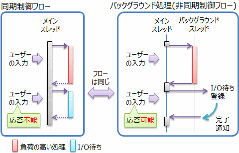
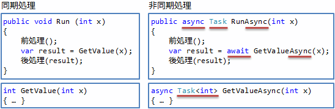
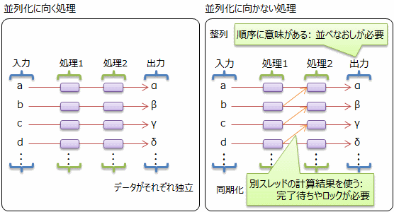
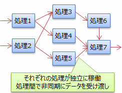
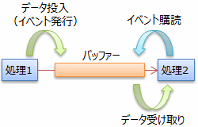

# 非同期処理の種類

## <a id="sec-generated-title-1"></a> <a id="abstract"></a>概要

「非同期処理」と言っても、いくつかのタイプの用途があって、それぞれ書き方や使うクラス ライブラリが異なります。
大まかに言うと、以下のような用途があります。

* バックグラウンド処理: 負荷の高い計算や、I/O待ちなどによって、CPUやスレッド資源を保持し続けないために、別スレッドでの計算やI/O待ちを行います。

* 並列計算: マルチコアCPUの性能を最大限引き出すために、同じ計算を複数のコアで同時に実行します。
    * データ並列: 同じ処理を異なるデータに対して繰り返し行います。

    * タスク並列: 異なる処理が独立して動いていて、その間で非同期にデータのやり取り（非同期データフロー）を行います。


C# 5.0 で導入された非同期メソッド（「[非同期処理](sp5_async.md)」参照）は、前者のバックグラウンド処理を簡単化するものです。
一方、データ並列には.NET Framework 4 で導入された <code>Parallel</code> クラス（<code>System.Threading.Tasks</code> 名前空間）や <code>ParallelEnumerable</code> クラス（<code>System.Linq</code>名前空間。通称「並列 LINQ」） を、
タスク並列には [TPL Dataflow ライブラリ](https://www.nuget.org/packages/Microsoft.Tpl.Dataflow)を利用するといいでしょう。
また、これらはいずれも、内部的には .NET Framework 4 で導入された <code>Task</code> クラス（<code>System.Threading.Tasks</code> 名前空間）を利用しています。

本稿では、これらのクラス ライブラリについて簡単に説明していきます。


##### <a id="sec-generated-title-2"></a>※

本稿の内容は[プログラミングの魔導書 Vol. 3](http://longgate.co.jp/books/grimoire-vol3.html)に寄稿したものがベースとなっています（分割、体裁の変更のみ）。
また、このページ中の内容（＝ 魔導書への寄稿の一部分）は、
@IT に書いた記事「[フリーズしないアプリケーションの作り方](http://www.atmarkit.co.jp/ait/articles/1109/30/news126.html)」を短くまとめたものになります。


## <a id="sec-generated-title-3"></a> <a id="background"></a>バックグラウンド処理（非同期メソッド）

負荷の高い計算や、I/O 待ちをする場合、
メイン スレッドとは別のスレッドを使いたい場合がある。
例えば、GUI アプリの場合、
メイン スレッドで時間がかかる処理をするとアプリがフリーズしてしまい、
アプリのユーザーに与える印象が非常に悪くなってしまう。
このような、メイン スレッド以外で行う処理のことをバックグラウンド処理処理という。

バックグラウンド処理では、バックグラウンドで行った処理結果の値を受け取って、メイン スレッドで続きの処理を行いたい場合が多いです。
この際、図1に示すように、処理手順、いわゆる制御フローは、同期の場合と変わりません。
フローチャートに書き起こすなら同じ構造のチャートになります。

<figure>

[](../../../../assets/media/ufcpp2000/csharp/fig/AsyncVariation1.png)

<figcaption>同期の場合と非同期の場合の制御フロー</figcaption>
</figure>


処理を非同期にすることで、以下のような利点が得られます。

* GUIの応答性改善: 時間のかかる処理を行っている間、 UIスレッド（GUIにおいて、エンドユーザーからの入力を受け付けるためのスレッド）をブロックせず、フリーズを回避できます。

* スレッド資源の節約: I/O待ち時にしている間、スレッドを解放することで、 メモリ（スレッド用のスタックなど）やCPU（コンテキストスイッチなど）の負担を減らせます。


非同期処理のこれらの利点は非常にありがたいものですが、問題はコードの書きにくくなることです。
たとえば、同期処理で書くなら以下のようなコードがあったとします。

```csharp {title="同期処理の例"}
前処理();
var result = obj.GetValue(x);
後処理(result);
```


これを非同期化しようとしたとき、以前（.NET Framework 4/C# 4.0まで）なら、以下のような書き方になっていました。

```csharp {title="C# 4.0 までの非同期処理の例"}
var sync = System.Threading.SynchronizationContext.Current;

obj.BeginGetValue(x, a =>
{
    var result = obj.EndGetValue(a);

    sync.Post(arg =>
    {
        後処理((int)arg);
    },
    result);
});
```


図1のところで説明したように、制御フロー的には同期の場合とまったく同じなわけですが、実装上の都合でこんなコードになっています。
これでも、非同期処理を1つだけ、例外処理は無視して考えているのでだいぶマシな方です。
一般には、例外処理が必要で、複雑化します。
例外処理を考えなくても、単純に複数の非同期処理を直列につなぐ（たとえば、ウェブ認証プロトコルのように、サーバーとのやり取りが何往復か必要になるような）処理を書くのもかなり大変です。
一本道な処理ならともかく、条件分岐や反復が必要になってくると、コードが絶望的なほど複雑化することもあります。
（参考: 「[[雑記] 非同期制御フロー](misc_asyncflow.md)」）

意図が同じならば、できればコードも同じ構造で書きたいものです。
それを叶えるのが、C# 5.0 で導入される非同期メソッドです。
非同期メソッドの中では、以下のように、await 演算子を使うことで、同期処理っぽい書き方で非同期処理が書けます。

```csharp {title="同期処理の例"}
前処理();
var result = await obj.GetValueAsync(x);
後処理(result);
```


同期処理の場合と、改めて対比してみましょう。
図2に、同期処理版と非同期処理版を並べて示します。

<figure>

[](../../../../assets/media/ufcpp2000/csharp/fig/AsyncVariation2.png)

<figcaption>await 演算子を使った非同期処理</figcaption>
</figure>


まず、await 演算子を使うためには、メソッド自体に async 修飾子を付ける必要があります。
（この、async 修飾子が付いたメソッドのことを非同期メソッド（asynchronous method）と呼びます。）

ちなみに、async 修飾子を付けるのは、破壊的変更を避けるためです。
C# 4.0 以前の C# コード中で、await という単語を変数などの名前に使っているかもしれません。
async 修飾子のついていない通常のメソッド内では、await をキーワード扱いしない（変数などの識別子として利用可能）ことで、互換性を保っています。

async修飾子を付けたメソッドの戻り値は、対応する同期メソッドが void ならば Task 型、ある型Tの値ならば Task&lt;T&gt; 型にする必要があります。

一方、await 演算子の引数として渡す部分は、
“Awaitableパターン”（「[Awaitable パターン](sp5_awaitable.md#awaiter)」 参照）というパターンを満たすクラスなら、何でも“待つ”ことができます。
.NET Framework 4.5のTaskクラス（非同期処理の中心的役割を担うクラス）は Awaitableパターンを満たしていて、
await 演算子の引数として渡せます。

内部的にどう動いているかについては、詳細は別途（「[Awaitable パターン](sp5_awaitable.md#awaiter)」）説明するとして、ポイントだけまとめておきましょう。

* 条件分岐、反復、例外処理含め、全て同期処理の場合と同じ書き方ができる

* イテレーター構文（yield）と同じような、中断と再開のためのコードをコンパイラーが生成している

* <code>Task</code>クラスの<code>ContinueWith</code>メソッドと同様の、継続タスク実行の仕組みを使う

* 実行コンテキストを保つ（呼び出し元のスレッドに戻って継続タスク実行する必要がある場合、内部で自動的に戻してくれます）


## <a id="sec-generated-title-4"></a> <a id="data-parallel"></a>データ並列（Parallel クラスと並列 LINQ）

並列処理も非同期処理の一種になります。
（単一のコンピューター上で）並列処理を行いたい主な同期は、
マルチコア CPU の性能を最大限引き出すことです。
マルチコア CPU の性能引き出す一番シンプルな方法は、同じ処理を、異なるデータに対して、複数のコアで同時に実行することです。
このような並列処理の仕方を、データ並列（data parallelism）と呼びます。

.NET 4から導入された <code>Parallel</code> クラスと <code>ParallelEnumerable</code> クラス（並列 LINQ）は、
データ並列処理を簡単に行うためライブラリです。

まずは <code>Parallel</code> クラスから見ていきましょう。
<code>Parallel</code> クラスには、
それぞれfor、foreachステートメントの並列版に相当する <code>For</code>、<code>ForEach</code> メソッドが定義されています。
たとえば、for ステートメントと <code>For</code> メソッドを比較すると以下のようになります。

```csharp {title="for ステートメントと Parallel.For メソッド"}
// 単一スレッド実行
for (var i = 0; i < source.Length; i++)
{
    result[i] = selector(source[i]);
}

// 並列実行
Parallel.For(0, source.Length, i =>
{
    result[i] = selector(source[i]);
});
```


一方、並列LINQは、LINQ（Language Integrated Query）によるデータ処理を並列化するものです。
以下のように、<code>AsParallel</code> 拡張メソッドを1つ追加するだけで、データ処理が並列に行われるようになります。

```csharp {title="LINQ とその並列版"}
// 単一スレッド実行
var result = source.Select(selector);

// 並列実行（AsParallel 拡張メソッドは ParallelQuery クラスを返す）
var result = source.AsParallel().Select(selector);
```


いずれも、プログラミング言語構文的には、匿名関数（「[匿名関数](../functional/sp_delegate.md#anonymous)」参照））を持つ言語ならば簡単に書けるものです。
その他には特に複雑な構文を必要とせず、単純にライブラリだけでデータ並列処理を実現しています。

ただし、見た目は簡単でも、注意すべき点はあります
図 3に示すように、データ処理には、並列化に向くものと向かないものがあり、不向きなものを並列化してもかえって性能を落とす場合が多いです。

<figure>

[](../../../../assets/media/ufcpp2000/csharp/fig/AsyncVariation3.png)

<figcaption>並列化に向く処理と向かない処理</figcaption>
</figure>


並列化が難しくなる理由として挙げられるのは、スレッド間でのデータの受け渡しのコストが高いのことや、並列実行では処理順序の保証ができないことなどです。
そのため、データ処理を並列化する際には、データが独立している（ようなアルゴリズムを考える）ことが重要になります。


## <a id="sec-generated-title-5"></a> <a id="dataflow"></a>タスク並列/非同期データフロー（TPL Dataflowライブラリ）

並列処理を行うもう1つの方法としては、
図4に示すように、異なる処理（タスク）を独立して動かして、その間で非同期にデータのやり取りする方法があります。
異なるタスクを並列に動かすという意味ではタスク並列（task parallelism）、
非同期なデータの受け渡しという意味では非同期データフロー（asynchronous dataflow）と呼ばれます。

<figure>

[](../../../../assets/media/ufcpp2000/csharp/fig/AsyncVariation4.png)

<figcaption>非同期データフローによる並列処理</figcaption>
</figure>


（元締めとなる何者かが）「タスクを動かす」というよりは、
（それぞれが主体になって）「独立して動いているものがある」という見方をして、
各タスクをアクター（actor：動作主体、当事者）やエージェント（agent: （裁量を持って動く）職員、代理人）と呼ぶこともあります。

非同期データフローを実現するためのライブラリが TPL Dataflow （TPL は Task Pallalel Library の略で、Task クラスや Parallel クラスの総称）です。
TPL Dataflow は、.NET Framework 本体とは独立したリリース サイクルで提供されていて、
[NuGet](https://www.nuget.org/) を通して使うことができます（[NuGet ギャラリーの TPL Dataflow ページ](https://www.nuget.org/packages/Microsoft.Tpl.Dataflow/)）。

ソフトウェア技術的にいうと、
非同期データフローを実現するために必要なのは、図5に示すような、データ受け渡しを仲介してデータをイベント駆動的に受け取れるバッファーです。

<figure>

[](../../../../assets/media/ufcpp2000/csharp/fig/AsyncVariation5.png)

<figcaption>非同期にデータ受け渡しするためのバッファー</figcaption>
</figure>


TPL DataFlow が提供しているのはまさにこのようなバッファーを持った動作主体（DataFlowライブラリの場合、ブロックと呼んでいます）です。
表1に、TPL DataFlow が提供する主要なクラスとインターフェイスを示します。

<table summary="TPL DataFlow が提供するクラスとインターフェイス">
	<caption>
		TPL DataFlow が提供するクラスとインターフェイス
	</caption>
	<tr>
		<th>インターフェイス</th>
		<th>説明</th>
	</tr>
	<tr>
		<td markdown="1"><code>ISourceBlock</code></td>
		<td markdown="1">データを送ってくる元のブロックを表す</td>
	</tr>
	<tr>
		<td markdown="1"><code>ITargetBlock</code></td>
		<td markdown="1">データを送る先のブロックを表す</td>
	</tr>
	<tr>
		<th>インターフェイス</th>
		<th>説明</th>
	</tr>
	<tr>
		<td markdown="1"><code>BufferBlock</code></td>
		<td markdown="1">データをバッファリングして素通しするだけのブロック</td>
	</tr>
	<tr>
		<td markdown="1"><code>TransformBlock</code></td>
		<td markdown="1">データに対して何らかの変換処理を通す</td>
	</tr>
	<tr>
		<td markdown="1"><code>BroadcastBlock</code></td>
		<td markdown="1">複数のブロックに対して、同じ値（のコピー）をブロードキャストする</td>
	</tr>
	<tr>
		<td markdown="1"><code>JoinBlock</code></td>
		<td markdown="1">複数のブロックから来た値を1つにまとめる</td>
	</tr>
</table>
