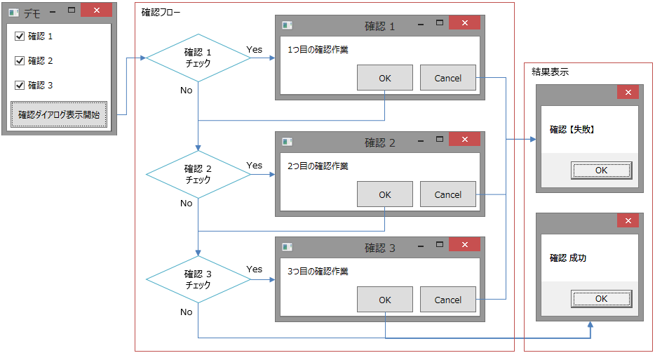

# \[雑記\] 非同期制御フロー

## <a id="sec-generated-title-1"></a> <a id="abst"></a>概要

C# 5.0のasync/awaitがなかったころ、少し複雑目な非同期制御フローをどうやって実現していたかという話。

C# 5.0を使えない状況下で非同期処理を書くことになった場合の参考としてや、async/awaitがどうやって実現されているかを知るきっかけになると思います。

* 
[サンプル コード（ZIP 形式。proj/sln 含め一式。）](../../../../assets/media/ufcpp2000/csharp/source/ShowDialogAsyncSample.zip)


##### <a id="sec-generated-title-2"></a>ポイント

* C# 5.0（await演算子）便利だなー

* await演算子が内部的にやっていることは、イテレーターに近い

* なので、昔はイテレーターを使って非同期処理をすることが結構あった


## <a id="sec-generated-title-3"></a> <a id="requirement"></a>サンプルの要件

今回の例として使うのは、Figure 1に示すような、確認ダイアログ表示のフロー。

<figure>
	[](../../../../assets/media/ufcpp2000/csharp/fig/asyncflow1.png)
	<figcaption>確認ダイアログを表示する例</figcaption>
</figure>


要は、何かを実行するにあたって、特定条件下では確認ダイアログの表示が必要で、すべてのダイアログで「OK」を押したときにだけ実行に移るという仕組みです。

たとえばゲームでも想像してもらって、「このアイテムはレアですが、本当に合成素材にしますか？」みたいなの。

* レアですよ？

* 合成して強化したアイテムですよ？

* これ以上合成しても上限に達してて変化しませんよ？


など、確認すべき項目がいくつかあります。


## <a id="sec-generated-title-4"></a> <a id="control-flow"></a>制御フロー

ダイアログ表示のコードを同期的に書ける場合、特に問題もなく書けると思います。

たとえばWPFだと、Windowクラス（System.Windows名前空間）のShowDialogメソッドで同期的にダイアログ表示できるので、それほど困りません（ダイアログを表示している間、呼び出し元のウィンドウは止まってしまいますが）。

以下のように書けます。

```csharp
private bool CheckBlocking()
{
    if (this.Check1.IsChecked ?? false)
    {
        var result = Dialog.ShowDialog("確認 1", "1つ目の確認作業");
        if (!result) return false;
    }

    if (this.Check2.IsChecked ?? false)
    {
        var result = Dialog.ShowDialog("確認 2", "2つ目の確認作業");
        if (!result) return false;
    }

    if (this.Check3.IsChecked ?? false)
    {
        var result = Dialog.ShowDialog("確認 3", "3つ目の確認作業");
        if (!result) return false;
    }

    return true;
}
```


問題は、非同期に書かざるを得ない場合です。Silverlightなんかはそうですし、最近実際に困ったのは[Unity](http://unity3d.com/)での話。

その「実際の話」では、ダイアログを表示するためのAPIが、引数にコールバック用のデリゲートを渡すタイプのAPIでした。

```csharp
/// <summary>
/// コールバック型の非同期ダイアログ表示。
/// </summary>
/// <param name="title">ダイアログのタイトル文字列。</param>
/// <param name="message">ダイアログの本文。</param>
/// <param name="onClose">コールバック（OK が押されたら true、Cancel が押されたら false を渡す）。</param>
public static void BeginShowDialog(string title, string message, Action<bool> onClose)
```


で、これを使ってダイアログを表示する部分ですが、チーム開発の「後から継ぎ足し」の結果、気が付けば、以下のようなコードが出来上がっていました。

<span class="expand-button" title="展開/折畳">（クリックしてソースコードを表示（割と見るに堪えないので初期状態を非表示に））</span>
<div class="expand-panel" markdown="1" title="（クリックしてソースコードを表示（割と見るに堪えないので初期状態を非表示に））">
    
```csharp
private void BeginCheck(Action<bool> onComplete)
{
    if (this.Check1.IsChecked ?? false)
    {
        Dialog.BeginShowDialog("確認 1", "1つ目の確認作業", result =>
        {
            if (!result)
            {
                onComplete(false);
                return;
            }

            if (this.Check2.IsChecked ?? false)
            {
                Dialog.BeginShowDialog("確認 2", "2つ目の確認作業", result2 =>
                {
                    if (!result2)
                    {
                        onComplete(false);
                        return;
                    }

                    if (this.Check3.IsChecked ?? false)
                    {
                        Dialog.BeginShowDialog("確認 3", "3つ目の確認作業", result3 =>
                        {
                            onComplete(result3);
                        });
                    }
                    else
                        onComplete(true);
                });
            }
            else if (this.Check3.IsChecked ?? false)
            {
                Dialog.BeginShowDialog("確認 3", "3つ目の確認作業", result3 =>
                {
                    onComplete(result3);
                });
            }
            else
                onComplete(true);
        });
    }
    else if (this.Check2.IsChecked ?? false)
    {
        Dialog.BeginShowDialog("確認 2", "2つ目の確認作業", result =>
        {
            if (!result)
            {
                onComplete(false);
                return;
            }

            if (this.Check3.IsChecked ?? false)
            {
                Dialog.BeginShowDialog("確認 3", "3つ目の確認作業", result3 =>
                {
                    onComplete(result);
                });
            }
            else
                onComplete(true);
        });
    }
    else if (this.Check3.IsChecked ?? false)
    {
        Dialog.BeginShowDialog("確認 3", "3つ目の確認作業", result3 =>
        {
            onComplete(result3);
        });
    }
    else
        onComplete(true);
}
```


    
</div>

条件分岐や途中で処理を打ち切ったりするのはコールバックで書くのが大変で、コピペ コードが散乱してしまっています。見るからにダメなコードですが、3つ目のダイアログ表示まではかろうじて「書けるには書けた」のでごまかしごまかしここまで来てしまった状態。

そして、仕様追加で4つ目のダイアログが必要になった時点でくじけることに。


## <a id="sec-generated-title-5"></a> <a id="csharp5"></a>C# 5.0

C# 5.0が使えるなら、つまり、Visual Studio 2012で、.NET Framework 4.5が入っていれば、非常に簡単な解決策があります。

Taskクラスを返す非同期APIを用意して、await演算子を使うだけ。


### <a id="sec-generated-title-6"></a> <a id="task-class"></a>Task クラス

コールバックを渡すタイプのAPIだとawait演算子を使えないので、まずはTaskクラス（System.Threading.Tasks名前空間）を返すタイプのAPIに変換します。以下のようになります。

```csharp
public static Task<bool> ShowDialogAsync(string title, string message)
{
    var tcs = new TaskCompletionSource<bool>();
    BeginShowDialog(title, message, result => { tcs.TrySetResult(result); });
    return tcs.Task;
}
```


（単純化のため、例外処理をさぼっています）

Taskクラス自体は.NET Framework 4の頃からあるので、それ以降のバージョンを使えるなら、このタイプのAPIを用意しておくといいでしょう。


### <a id="sec-generated-title-7"></a> <a id="await-op"></a>await 演算子

そして、ダイアログを表示する部分は以下のように書きます。

```csharp
private async Task<bool> CheckAsync()
{
    if (this.Check1.IsChecked ?? false)
    {
        var result = await Dialog.ShowDialogAsync("確認 1", "1つ目の確認作業");
        if (!result) return false;
    }

    if (this.Check2.IsChecked ?? false)
    {
        var result = await Dialog.ShowDialogAsync("確認 2", "2つ目の確認作業");
        if (!result) return false;
    }

    if (this.Check3.IsChecked ?? false)
    {
        var result = await Dialog.ShowDialogAsync("確認 3", "3つ目の確認作業");
        if (!result) return false;
    }

    return true;
}
```


同期呼び出しの場合と比べて、背景色を変えて強調している部分だけが変化しています。
違いは、以下の通りで、残りの部分は全く同じです。

* メソッドに async 修飾子が付く

* 非同期処理を行いたい部分に await 演算子が付く

* 命名規約上、非同期処理を行うメソッドの名前は、語尾に Async を付ける


async修飾子やawait演算子の詳細は「[非同期メソッド](sp5_async.md#async)」 を参照してください。


## <a id="sec-generated-title-8"></a> <a id="iterator"></a>イテレーター非同期

そう、C# 5.0ならね。

ということで、問題は、C# 5.0が使えない場合。

C# 5.0以前、割と常套手段として知られていたのが、イテレーター（詳しくは「[イテレーター](../data/sp2_iterator.md)」を参照）を使った非同期処理手法です。

上記の例を、この手法を使って書き直すと、以下のようになります。

```csharp
private void BeginCheckWithIterator(Action<bool> onComplete)
{
    var e = CheckIterator(onComplete).GetEnumerator();

    Action a = null;

    a = () =>
    {
        if (!e.MoveNext()) return;
        e.Current(a);
    };

    a();
}

private IEnumerable<Action<Action>> CheckIterator(Action<bool> onComplete)
{
    if (this.Check1.IsChecked ?? false)
    {
        bool result = false;
        yield return callback => Dialog.BeginShowDialog("確認 1", "1つ目の確認作業", r => { result = r; callback(); });

        if (!result)
        {
            onComplete(false);
            yield break;
        }
    }

    if (this.Check2.IsChecked ?? false)
    {
        bool result = false;
        yield return callback => Dialog.BeginShowDialog("確認 2", "2つ目の確認作業", r => { result = r; callback(); });

        if (!result)
        {
            onComplete(false);
            yield break;
        }
    }

    if (this.Check3.IsChecked ?? false)
    {
        bool result = false;
        yield return callback => Dialog.BeginShowDialog("確認 3", "3つ目の確認作業", r => { result = r; callback(); });

        if (!result)
        {
            onComplete(false);
            yield break;
        }
    }

    onComplete(true);
}
```


行数は増えてしまっていますが、パターンとして、

* <code>await</code>⇔<code>yield return</code>

* <code>return 戻り値;</code>⇔<code>onComplete(戻り値); yield break;</code>


というような、機械的な置き換えが成り立ちます。一度覚えてしまえば「書けなくはない」でしょう。

非同期処理に必要なのは、要するに「中断と再開」で、実は、イテレーターがやっていることと同じです。なので、この例みたいに、イテレーターを使って非同期制御フローを書けるわけです。

実際、C# 5.0のawait演算子は、イテレーターがやっているのと同様のコード生成によって実現されています。


## <a id="sec-generated-title-9"></a> <a id="conclusion"></a>まとめ

C# 5.0で追加されたawait演算子が内部で行っていることは「中断と再開」で、イテレーターと同系統の技術です。

逆に言うと、イテレーターを使って、await演算子と同じようなことをする方法があります。実際、C# 5.0以前には、この方法で非同期処理を行っている人もいました。

ここでは、そのイテレーターを使った非同期処理の例を挙げました。C# 5.0が使えない環境での助けや、C# 5.0のawait演算子の挙動を知る助けになるかと思います。
