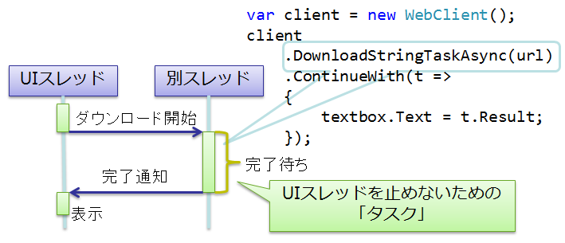
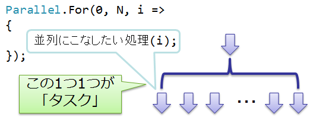
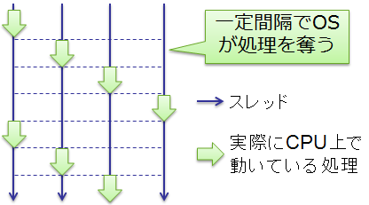
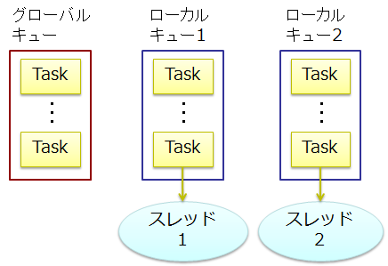

# \[雑記\] スレッド プールとタスク

## <a id="sec-generated-title-1"></a> <a id="abst"></a>概要

<h5 class="version version4">Ver. 4.0</h5>

C# 3.0 で導入されたラムダ式と、
.NET 4 で導入された Task、Parallel、ParallelEnumerable などのクラスを使うことで、
非同期処理や並列処理が簡潔に記述できるようになりました。

また、C# 5.0 では非同期処理用の新構文が追加される予定です。
参考： 「[非同期処理](sp5_async.md)」

このページでは、これら非同期処理の基礎となる Task クラスや、その背後にあるスレッド プールというものについて説明していきます。


##### <a id="sec-generated-title-2"></a>ポイント

* スレッドはそれなりに高コストなので使い回しをしたい → スレッド プール。

* スレッド プールを使った非同期処理を行うには、.NET Framework 4 で導入された Task クラスが便利です。


## <a id="sec-generated-title-3"></a> <a id="task"></a>タスク

スレッドを使った非同期処理を行いたい動機としては、以下の2つが挙げられます。

* 非ブロッキング処理: I/O 待ちとかで UI スレッドをフリーズさせないようにする（図1）

* 並列処理: マルチコアを活かした並列処理でパフォーマンス向上（図2）


<figure>
	[](../../../../assets/media/ufcpp2000/csharp/fig/task1.png)
	<figcaption>UI スレッドを止めないためのタスク</figcaption>
</figure>


<figure>
	[](../../../../assets/media/ufcpp2000/csharp/fig/task2.png)
	<figcaption>並列処理のためのタスク</figcaption>
</figure>


どちらの場合でも、非同期で行いたい処理のほとんどは小さい処理になります。
（1つの処理を長時間し続けるよりは、細々とした処理を大量に扱う場合が多い。）

この細々とした処理の1つ1つのことを<strong id="key_task" class="keyword">タスク</strong>（task）と呼びます。
このページで説明する、.NET 4 の Task クラスもこの「タスク」を表すクラスです。


## <a id="sec-generated-title-4"></a> <a id="thread"></a>スレッド

まず、非同期処理の基本となるスレッドについて説明しておきましょう。

<strong id="key_thread" class="keyword">スレッド</strong>（thread）は、CPU の数を超えて複数の処理を同時に実行するための仕組みです。
例えば、単一 CPU で4つの処理を実行する場合の例を図3に示します。

<figure>
	[](../../../../assets/media/ufcpp2000/csharp/fig/contextswitch.png)
	<figcaption>単一 CPU での複数スレッド実行の例</figcaption>
</figure>


同時に実行するといっても、本当に並列に動いているわけではありません。
一定間隔で OS が処理を奪い、別のスレッドに切り替えることで、見かけ上の同時実行を実現しています。
（ハードウェア割り込みというものを使っていて、例えあるスレッドがフリーズしていても、強制的に OS に処理が移るようになっています。）
（ちなみに、このようなスレッドの切り替えをコンテキスト スイッチ（context switch: 実行文脈の切り替え）と呼びます。）

このような挙動を実現するためには、以下のように、それなりのコストがかかります。

* メモリ確保: スレッドごとに別のスタックを確保する必要があります（Windows の場合、1MB 程度）。 また、CPU のレジスターの内容を退避しておくための領域（1kB 程度）が必要です。

* スレッドの生成/破棄イベント: スレッドの生成時には、上記のメモリ確保に加えて、 新たにスレッドが生成されたという「[イベント](../functional/sp_event.md#event)」がロード済みの DLL に対して通知されます。

* レジスターの退避/復帰: スレッドの切り替え時には、実行中 CPU レジスターの内容を退避や復帰が必要になります。


### <a id="sec-generated-title-5"></a> <a id="preemptive"></a>余談: プリエンプティブ マルチタスクと強調的マルチタスク

タスクのスケジューリング（どうやってタスクの同時実行を行うか、タスク切り替え方の管理方法）には大きく分けて2種類あります。

* プリエンプティブ（preemptive: 専売権、優先権）マルチタスク: スレッドがどんな処理をしていようと、一定間隔で OS が必ず処理を奪い取り、コンテキスト スイッチを行います。 通常、タイマーを使ったハードウェア割り込みを利用していて、 例えスレッドがフリーズしていても強制的にコンテキスト スイッチ可能です。

* 強調的（cooperative）マルチタスク: 各スレッドに自己申告で、一定間隔で OS に処理権を返してもらいます。 あくまで自己申告なので公平性に欠ける（申告しなければずっと同じスレッドが処理をし続ける）上に、 もしスレッドがフリーズした場合に OS 全体がフリーズします。 不便な反面、コンテキスト スイッチによる負荷が少ないという利点があります。


本節で説明したスレッドというものは、前者のプリエンプティブ マルチタスクになります。

また、次節で説明するスレッド プールは、両者の併用になります。
プリエンプティブなスレッドの上に、協調的にスレッドを使いまわすような仕組みを作ることで、
公平性を残しつつ、コンテキスト スイッチの負荷を最小限に抑えます。


## <a id="sec-generated-title-6"></a> <a id="thread_pool"></a>スレッド プール

前述の通り、スレッドは、生成も切り替えも、それなりに（そして、多くの人が思っている以上に）コストがかかります。
スレッドの増加はパフォーマンスへの影響が非常に大きく、スレッドの数は最小限に抑えたいです。

そこで、実際には、スレッドを直接使うのではなく、
1度作ったスレッドを可能な限り使いまわすような仕組みを使います。
このようなスレッドの使い回しの仕組みを<strong id="key_thread_pool" class="keyword">スレッド プール</strong>（thread pool）と呼びます。

スレッド プールとは、以下のような仕組みです。

* 一定数のスレッドを常に立てておく。 （CPU 数と同じ数だけスレッドが動いている状態が理想。）

* タスクを待たせておくためのキューを持つ。

* 現在処理中のタスクが終わり次第、次のタスクをキューから取り出して実行する。


ちなみに、BeginInvoke によるデリゲートの非同期呼び出し（「[非同期呼び出し](../functional/sp_delegate.md#async)」参照）や、
後述する Task クラスは内部的にこのスレッド プールを使っています。
その他、[Timer](http://msdn.microsoft.com/ja-jp/library/system.threading.timer.aspx) クラスによるタイマー処理や、
[WebClient](http://msdn.microsoft.com/ja-jp/library/system.net.webclient.aspx) クラスなどによる I/O 待ちの非同期処理でもスレッド プールが利用されます。


### <a id="sec-generated-title-7"></a> <a id="thread_pool4"></a>.NET Framework 4 のスレッド プール

スレッド プールの仕組みは昔からありましたが、
.NET Framework 4 では性能改善のためにスレッド プールの再設計・実装が行われました。
（具体的には、後述するワーク スティーリングという仕組みで性能改善を図ります。）

.NET Framework 4 のスレッド プールでは、図4に示すように、スレッドごとにローカルなキューを持っています。

<figure>
	[](../../../../assets/media/ufcpp2000/csharp/fig/taskqueue.png)
	<figcaption>スレッドごとにローカル キューを持つ</figcaption>
</figure>


##### <a id="sec-generated-title-8"></a>タスクの追加

タスク実行用のスレッド（ワーカー スレッド（worker thread）と呼びます）から新しいタスクを追加する場合、
タスクはローカル キューに投入されます。
一方、ワーカー スレッド以外からのタスクの追加はグローバル キューに投入されます。


##### <a id="sec-generated-title-9"></a>タスクの取り出し

各スレッドは、現在のタスクが完了すると、まず、ローカル キューを見に行きます。
ローカル キューにタスクがなければ、次に、他のスレッドのキューを見に行き、
もしそちらにタスクがあれば、タスクを奪い取ります。
このような挙動をワーク スティーリング（work stealing: 仕事を奪い取る）と呼びます。

また、全てのスレッドのローカル キューが空ならば、グローバル キューからタスクを取り出して実行します。

ここで、ローカル キューからの取り出しと、他スレッドからのスティーリングとでは、
タスクの取り出しの向きを変えます。
ローカルの場合には FILO（first in last out: 先入れ後出し）、
スティーリングの場合には FIFO（first in first out: 先入れ先出し）になっています。
このことで、以下のような効果が得られます。

* 取り出しの位置を変えることで、「[ロック](sp_thread.md#lock)」を最小限にとどめる。

* ローカルを FILO にすることで、 近い処理が同じスレッド内で実行される可能性が高くなり、 メモリのキャッシュが効きやすくなる。


## <a id="sec-generated-title-10"></a> <a id="task-class"></a>Task クラス

.NET Framework 4 では、スレッド プールをより使いやすくするために、Task（System.Threading.Tasks 名前空間）というクラスが導入されました。
Task クラスは以下のような機能を持っています。


##### <a id="sec-generated-title-11"></a>非同期処理の結果取得

非同期処理の結果を使いたい場合があります。
Task クラスからの結果の受け取り方には2通りの方法があります。

1つは、ContinueWith メソッドを使って、タスク完了時にその先続けて行いたい処理を渡します。

```csharp
var t = Task.Factory.StartNew(() =>
{
    // 何か重たい計算をして、その計算結果を返す。
    return HeavyWork();
});
 
// 計算が完了したら、そのあと続けたい処理を呼び出してもらう。
t.ContinueWith(x => Console.WriteLine(x.Result));
```


もう1つは、タスクの完了を同期的に（完了するまで処理を止めて）待ちます。
Result プロパティを読もうとしたとき、タスクがまだ完了していない場合、
完了するまで待つことになります。

```csharp
var t = Task.Factory.StartNew(() =>
{
    // 何か重たい計算をして、その計算結果を返す。
    return HeavyWork();
});
 
// 同期的に完了を待つ。
Console.WriteLine(t.Result);
```


##### <a id="sec-generated-title-12"></a>統一的なキャンセル

非同期実行中のタスクを途中でキャンセルするための仕組みとして、
CancellationToken 構造体というものが標準で用意されています。

```csharp
var cts = new CancellationTokenSource();
 
var t = Task.Factory.StartNew(() =>
{
    Thread.Sleep(500);
    Console.WriteLine("done");
}, cts.Token);
 
// t をキャンセル
cts.Cancel();
```


##### <a id="sec-generated-title-13"></a>子タスク

タスクの中で別の新しいタスクを作りたい場合があります。
オプションなしの場合、それぞれのタスクは無関係に動くことになります。

```csharp
var t = Task.Factory.StartNew(() =>
    {
        Console.WriteLine("タスク1開始");
        Task.Factory.StartNew(() =>
        {
            Console.WriteLine("タスク2開始");
        });
    });
 
t.Wait(); // 今のままだと、タスク2の完了は待たない
Console.WriteLine("完了");
```


```console
タスク1開始
完了
```


これに対して、オプションを指定することで、タスクに親子関係を作ることができます。
Task.Wait による完了待ちは、子タスクの完了まで含めて待ちます。

```csharp
var t = Task.Factory.StartNew(() =>
    {
        Console.WriteLine("タスク1開始");
        Task.Factory.StartNew(() =>
        {
            Console.WriteLine("タスク2開始");
        }, TaskCreationOptions.AttachedToParent); // 子タスク化
    });
 
t.Wait(); // 子タスクの完了まで待つ
Console.WriteLine("完了");
```


```console
タスク1開始
タスク2開始
完了
```


##### <a id="sec-generated-title-14"></a>柔軟なスケジューリング

Task クラスでは、タスク開始時に TaskScheduler を渡すことで、
タスクの実行方法をある程度柔軟に制御できます。

特に指定しない場合、タスクはスレッド プール上で実行されます。
一方、「[[雑記] GUI と非同期処理](misc_uithread.md)」で説明するように、
ある特定のスレッド上で実行する必要がある処理もあり、
その特定スレッドにタスクを投かんするような仕組みが必要です。
そういう場合に、TaskScheduler を利用します。

```csharp
var t = new Task(() => { /* 中略 */ });

// タスクの実行場所を制御するために明示的に TaskScheduler を指定
t.Start(TaskScheduler.FromCurrentSynchronizationContext());
```


### <a id="sec-generated-title-15"></a> <a id="task_usage"></a>Task クラスの用途

Task クラスは以下のような場面で使われます。


##### <a id="sec-generated-title-16"></a>並列処理

.NET Framework 4で導入された、Parallel クラスや ParallelEnumerable クラス（通称 Parallel LINQ）などの並列処理を用ライブラリは、
Task クラスの上に実装されています。
並列処理の詳細は「[並列処理ライブラリ](../lib/lib_parallel.md)」にて説明します。


##### <a id="sec-generated-title-17"></a>先物と継続

「[[雑記] 継続と先物](misc_continuation.md)」参照。


##### <a id="sec-generated-title-18"></a>データ フロー

（書きかけ）
```text
並列、非ブロッキング処理と、あともう1つ、データ フロー
http://blogs.msdn.com/b/pfxteam/archive/2010/10/28/10081950.aspx

Actor とか Agent って言われるもの
非同期に動き続けてる Agent が何個かいて、データをやり取りしながら各々が自律的にデータ処理
producer/consumer パターン
```
