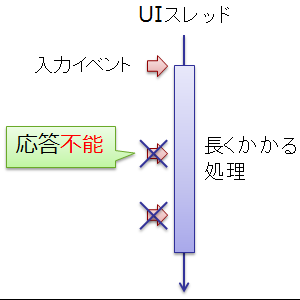
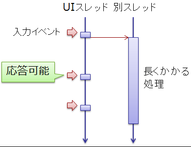

# 非同期メソッド

##  概要

注意： 2010年10月時点での CTP （community technology preview）版を元にした記事になっています。
製品版までに変更の可能性があります。
（async や await というキーワードも変更される可能性あり。）

<h5 class="version version5">Ver. 5.0</h5>

スレッドを使った非同期処理を行いたい動機としては、以下の2つが挙げられます。

* 非ブロッキング処理: I/O 待ちとかで UI スレッドをフリーズさせないようにする

* 並列処理: マルチコアを活かした並列処理でパフォーマンス向上

このうち、並列処理に関しては、Parallel クラスや Parallel LINQ で簡単に対応可能
（ラムダ式や LINQ を使えば、並列じゃない場合とほとんど変わらず書けます。
参考： 「[[雑記] スレッド プールとタスク](misc_task.md)」）。
一方の、非ブロッキング処理は、今までは結構面倒だったものの、
async/await の導入でかなり簡素化されることになります。

##### サンプル

* [C# Async の例](http://code.msdn.microsoft.com/C-Async-3185c2e8)

* [EAPをTAP化するラッパー クラスの自動生成](http://code.msdn.microsoft.com/EAPTAP-bb69ab56)

##  要約 スライド資料

<a href="https://docs.com/iwanaga-nobuyuk/7317/gui" title="GUIと非同期" target="_blank" style="font-family: 'Segoe UI'">GUIと非同期</a>—<a href="https://docs.com/iwanaga-nobuyuk" target="_blank" style="font-family: 'Segoe UI'">Iwanaga Nobuyuki</a>
<iframe src="https://docs.com/d/embed/D25194461-3915-9236-8750-000130209706%7eMd2f0fde0-d68b-9095-2ec5-841305bd4fb1" frameborder="0" scrolling="no" width="352px" height="299px" style="max-width:100%" allowfullscreen="False"></iframe>

##  非ブロッキング処理、旧来的な書き方

URL 指定してダウンロードしてきた文字列をテキストボックスに表示という GUI アプリケーションを考えてみましょう。
同期的に書くなら、ボタンに対して以下のようなイベント ハンドラーを登録します。

<pre class="source" title="同期的に文字列をダウンロード" lang="">
<code>private void Button_Click(object sender, RoutedEventArgs e)
{
    var client = new WebClient();
    var html = client.DownloadString(this.Url.Text);
    this.Output.Text = html;
}
</code></pre>

このように同期でダウンロードを行うと、図1に示すように、ネットワークの通信速度が遅い環境では GUI がフリーズしてしまいます。
そこで、図2に示すように、非同期通信版を使って、UI スレッドをブロッキングしないようにします。

<figure>
	
	<figcaption>同期実行によって UI スレッドがブロックされる</figcaption>
</figure>

<figure>
	
	<figcaption>非同期実行によって UI スレッドがブロックされないようにする</figcaption>
</figure>

しかし、これまで、非同期呼び出しは少し面倒な書き方をする必要がありました。
いくつかのパターンがありますが、例えば、イベント非同期パターン（EAP: Event-based Asynchronous Pattern）と呼ばれるものの場合、以下のようになります。

<pre class="source" title="非同期に文字列をダウンロード" lang="">
<code>private void Button_Click(object sender_, RoutedEventArgs e_)
{
    var client = new WebClient();
    client.DownloadStringCompleted += (sender, e) =&gt;
    {
        this.Output.Text = e.Result;
    };
    client.DownloadStringAsync(new Uri(this.Url.Text));
}
</code></pre>

以下のような面倒事が出てきています。

* 実行順序と、コードの順序が崩れて処理の流れを追いづらい。

* コールバックやディスパッチャー呼び出しで階層が深くなりがち。
    * 参考1：「[コールバック： 非同期処理の終了通知](../functional/misc_delegate.md#callback)」

    * 参考2：「[[雑記] GUI と非同期処理](misc_uithread.md)」

* 別スレッド側で起こった例外を処理しづらい。

ダウンロード先が1個ならまだましで、例えば、複数の URL からダウンロードしてくる場合にはもっと複雑になります。

<pre class="source" title="複数の URL から文字列をダウンロード" lang="">
<code>private void Button_Click(object sender, RoutedEventArgs e)
{
    var client = new WebClient();
    var urlList = this.Url.Text.Split(',');

    int i = -1;
    Action&lt;DownloadStringCompletedEventArgs&gt; a = null;

    client.DownloadStringCompleted += (sender, e) =&gt;
    {
        var continuation = e.UserState as Action&lt;DownloadStringCompletedEventArgs&gt;;
        continuation(e);
    };

    a = e =&gt;
    {
        if (e != null)
        {
            this.Output.Text += e.Result;
        }

        ++i;
        if (i &gt;= urlList.Length)
        {
            return;
        }
        client.DownloadStringAsync(new Uri(urlList[i]), a);
    };

    this.Output.Text = string.Empty;
    a(null);
}
</code></pre>

何番目までダウンロード完了したかを自前で状態管理しています。
やり方を知っていれば同期の場合のコードからこのような非同期コードを機械的な手順で書くこともできますが、
手間はかなりかかりますし、可読性は大きく下がります。

##  非同期メソッド

<h5 class="version version5">Ver. 5.0</h5>

C# 5.0 の新機能で、この手の非ブロッキング処理が簡単になりました。

以下のように、async キーワードや await キーワードを使うことで、
同期っぽい書き方で非同期処理を記述できます。
比較のために、同期版と並べてみましょう。
（背景色を変えて強調表示している部分が同期版との差分です。
この部分を削除すればそのまま同期処理として動きます。）

<pre class="source" title="同期的に文字列をダウンロード" lang="">
<code>private void Button_Click(object sender_, RoutedEventArgs e_)
{
    var client = new WebClient();
    var html = client.DownloadString(this.Url.Text);
    this.Output.Text = html;
}
</code></pre>

<pre class="source" title="非同期に文字列をダウンロード" lang="">
<code>private <em>async</em> void Button_Click(object sender_, RoutedEventArgs e_)
{
    var client = new WebClient();
    var html = <em>await</em> client.DownloadString<em>TaskAsync</em>(this.Url.Text);
    this.Output.Text = html;
}
</code></pre>

複雑な場合でも、ずいぶんと楽に書けるようになります。
前節の最後で書いた、複数の URL からダウンロードしてくる処理は以下のように書けます。

<pre class="source" title="" lang="">
<code>private <em>async</em> void Button_Click(object sender_, RoutedEventArgs e_)
{
    var client = new WebClient();
    var urlList = this.Url.Text.Split(',');

    this.Output.Text = string.Empty;

    foreach (var url in urlList)
    {
        var html = <em>await</em> client.DownloadString<em>TaskAsync</em>(url);
        this.Output.Text += html;
    }
}
</code></pre>

同期処理とほとんど同じ書き方ができます。

##### 同期処理からの変更点

追加されたのは、async/await の2つのキーワードと、末尾に「TaskAsync」と付いた拡張メソッドです。

* async（asynchronous: 非同期 の略）
    * メソッド内で await を使うために、メソッドを async キーワードで装飾します。

    * これ自体は単なる装飾で、コンパイル結果は通常のメソッドと変わりません。 （await という新キーワードが C# 4.0 以前のコードを破壊しないようにという意図のようです。）

    * async 修飾子の付いたメソッド（非同期メソッド）の戻り値の型は、 void、Task、Task&lt;T&gt; 、もしくは、後述する「[一般化非同期戻り値](#task-like)」の条件を満たす型である必要があります。

* await（「待つ」という意味）
    * await のところで、先物と継続（参考：「[[雑記] スレッド プールとタスク](misc_task.md)」）を使って、 いったん別スレッドに制御を移した上で、タスク完了後に続きの処理を再開します。

    * await は「式」が書ける場所ならどこにでも書けます。 （<code>foreach (var item in await task)</code>とかも可能。）

    * await の直後には、Task クラス（もしくは、後述する“awaitable”なクラス）の値を与えます。

* TaskAsync 拡張メソッド
    * await で非同期処理を行うためには、Task クラス（など）の値が必要なため、 WebClient などの既存のクラスに対する拡張メソッドとして、Task クラスを返すバージョンをライブラリ提供しています。

    * （CTP 版での情報。最終版では通常のメソッドとして追加される可能性もあります。）

    * 通例では、Task を返す非同期メソッドの名前は「Async」という語尾にします。 ただ、既存のクラスに関しては、すでに Async と付いたメソッドが存在している場合があるので、 この場合は「TaskAsync」という語尾を付けます。

##### 非同期メソッドの戻り値の型

C# 6まででは、非同期メソッドの戻り値の型は void、Task、もしくは、Task&lt;T&gt; のいずれかである必要があります。

まず、非同期処理を、最終的に Task.Wait メソッドで完了待ちする必要があるかどうかで戻り値の型選びます。
待つ必要があるなら Task もしくは Task&lt;T&gt; に、
必要なければ void にします。

（非同期でない）普通のメソッドから、（戻り値が Task 型の）非同期メソッドの完了を待つには以下のように書きます。

<pre class="source" title="非同期メソッドの完了待ち" lang="">
<code>static void Main(string[] args)
{
    RunAsync().Wait();
}

static async Task RunAsync()
{
    await TaskEx.Delay(1000);
}
</code></pre>

ただし、即座に Wait で完了待ちしてしまうと非同期にした意味があまりないので、
通常は、他の作業を並行して行ってから最後に Wait したり、
複数のタスクを同時実行したりします。

<pre class="source" title="並行して他の作業" lang="">
<code>var task = RunAsync();
// 並行して別の処理
DoSomeTask();
task.Wait();
</code></pre>

<pre class="source" title="複数の非同期処理を同時実行" lang="">
<code>// 複数の処理を並行に実行
TaskEx.WhenAll(
    RunAsync(),
    RunAsync(),
    RunAsync()).Wait();
</code></pre>

完了待ちが必要ない（戻り値が void）場合というのは、
例えば、GUI アプリケーションのイベント ハンドラーなどで利用します。

<pre class="source" title="イベント ハンドラーで非同期処理" lang="">
<code>private async void Button_Click(object sender, RoutedEventArgs e)
{
    var client = new WebClient();
    var html = await client.DownloadStringTaskAsync(this.Url.Text);
    this.Output.Text = html;
}
</code></pre>

###  一般化非同期戻り値(Task-like)

C# 5.0で非同期メソッドが導入された当初、非同期メソッドの戻り値は`Task`、`Task<T>`型である必要がありました。
一方で、C# 7からは、特定の条件を満たす任意の型を非同期メソッドの戻り値として使えるようになりました。
この機能を一般化非同期戻り値(generalized async return types)とよびます。

ここで、この「特定の条件」についてですが、これまでの`Task`クラスと似た条件になります。
`Task`に似た性質を持った型ということで「task-like」(Task風の)と呼んだりもします。

Task-likeであるための条件は以下の通りです。

- `AsyncMethodBuilder`属性(`System.Runtime.CompilerServices`名前空間)が付いている
- `AsyncMethodBuilder`属性で指定した型が所定のメソッドを実装している

最低限の条件を満たす型を書くと以下のようになります。

<pre class="source" title="Task-likeの例">
<code>using System;
using System.Runtime.CompilerServices;

[AsyncMethodBuilder(typeof(AsyncValueTaskMethodBuilder&lt;&gt;))]
struct TaskLike&lt;TResult&gt;
{
}

struct AsyncValueTaskMethodBuilder&lt;TResult&gt;
{
    public static AsyncValueTaskMethodBuilder&lt;TResult&gt; Create() =&gt; default(AsyncValueTaskMethodBuilder&lt;TResult&gt;);
    public void Start&lt;TStateMachine&gt;(ref TStateMachine stateMachine) where TStateMachine : IAsyncStateMachine { }
    public void SetStateMachine(IAsyncStateMachine stateMachine) { }
    public void SetResult(TResult result) { }
    public void SetException(Exception exception) { }
    public TaskLike&lt;TResult&gt; Task { get; }
    public void AwaitOnCompleted&lt;TAwaiter, TStateMachine&gt;(ref TAwaiter awaiter, ref TStateMachine stateMachine)
        where TAwaiter : INotifyCompletion
        where TStateMachine : IAsyncStateMachine
    { }
    public void AwaitUnsafeOnCompleted&lt;TAwaiter, TStateMachine&gt;(ref TAwaiter awaiter, ref TStateMachine stateMachine)
        where TAwaiter : ICriticalNotifyCompletion
        where TStateMachine : IAsyncStateMachine
    { }
}
</code></pre>

ちなみに、`AsyncMethodBuilder`属性は、フルネームさえ一致していればどこに定義されたものであっても構いません。
最終的には標準ライブラリに含まれると思いますが、もし、標準化される前のバージョンで使いたい場合、自前で用意しても大丈夫です
(この場合、`internal`でも構いません)。

<pre class="source" title="AsyncMethodBuilderAttributeの実装例">
<code>namespace System.Runtime.CompilerServices
{
    sealed class AsyncMethodBuilderAttribute : Attribute
    {
        public AsyncMethodBuilderAttribute(Type builderType)
        {
            BuilderType = builderType;
        }

        public Type BuilderType { get; }
    }
}
</code></pre>

####  ValueTask構造体

Task-likeを自作しようと思う場面はほとんどないでしょう。
実質的には、この仕様はあるたった1つの型のために追加された構文です。
その1つの型が`ValueTask<TResult>`構造体です。

`ValueTask<TResult>`は、名前通り、値型(構造体)版の`Task<TResult>`です。
正確にいうと、`ValueTask<TResult>`は、`TResult`の値、もしくは、`Task<TResult>`のどちらかを持っています。

どうしてそういう値の持ち方が必要かというと、
非同期メソッドと言っても、実際に非同期が必要な場面が少なく、大半は同期処理になるといったことがあり得るからです。
ごくごく少数の本当に非同期処理が必要な場面でだけ`Task<TResult>`を作り、
大部分の非同期が必要ない場面では直接`TResult`を作ることで、パフォーマンスの改善が見込めます。
例えば以下のようなコードです。

<pre class="source" title="ValueTaskの使い道">
<code>using System;
using System.Threading.Tasks;

class Program
{
    static async ValueTask&lt;int&gt; XAsync(Random r)
    {
        if (r.NextDouble() &lt; 0.99)
        {
            // 99% ここを通る。
            // この場合、await が1度もなく、非同期処理にならない。
            // 非同期処理じゃないのに Task&lt;int&gt; のインスタンスが作られるのはもったいない
            return 1;
        }

        // こちら側は本当に非同期処理なので、Task&lt;int&gt; が必要。
        await Task.Delay(100);
        return 0;
    }

    static Task&lt;int&gt; _cache;

    // キャッシュしてるものなので、少し時間がたてば、確実に完了済みになる。
    static Task&lt;int&gt; CachedX =&gt; _cache ?? (_cache = Task.Run(() =&gt; 1));

    // 完了済みだと非同期処理にならない。
    // 非同期処理じゃないのに Task&lt;int&gt; のインスタンスが作られるのはもったいない
    static async ValueTask&lt;int&gt; Y() =&gt; await CachedX;
    static async ValueTask&lt;int&gt; Z() =&gt; await Y();
}
</code></pre>

この`ValueTask<TResult>`構造体は、いずれは標準ライブラリに入る予定です。
.NET Framewor 4.6.2/.NET Standard 1.6以下で使いたい場合には、以下のパッケージの参照が必要です。

- [System.Threading.Tasks.Extensions](https://www.nuget.org/packages/System.Threading.Tasks.Extensions)

C# 6までこの仕組みがなかった理由など、背景説明をBuild Indsiderの記事に書いたことがあるので、詳細に興味あればこちらをご覧ください。

- [C# 7、そしてその先へ： 非同期処理（前編） － Task-like](http://www.buildinsider.net/column/iwanaga-nobuyuki/009)

###  余談： 実は必ずしも非同期ではない

async（非同期）や await（待つ）という名前に反して、
実は必ずしも非同期実行にはなりません。
というのも、Task クラスの値を await する際、タスクがすでに完了済み（IsCompleted プロパティが true）の可能性もあります。
この場合には、別にタスクを「待つ」必要はないので、
そのまま同期的に処理が続行します。

また、非同期であっても、必ずしもマルチスレッドで実行されるわけではありません。
async/await が Task クラスの上に成り立っているため、
可能な限り同じスレッドを使いまわそうとします。
（参考： 「[スレッド プール](misc_task.md#thread_pool)」）

###  余談2： 戻り値は Task

（書きかけ）

ITask インターフェイスとかにはしなかった。
Task 的なものの独自実装は結構危険。

<a href="https://docs.com/iwanaga-nobuyuk/6288" title="非同期処理にあたって" target="_blank" style="font-family: 'Segoe UI'">非同期処理にあたって</a>—<a href="https://docs.com/iwanaga-nobuyuk" target="_blank" style="font-family: 'Segoe UI'">Iwanaga Nobuyuki</a>
<iframe src="https://docs.com/d/embed/D25194461-4031-2633-3750-000873959935%7eMd2f0fde0-d68b-9095-2ec5-841305bd4fb1" frameborder="0" scrolling="no" width="352px" height="299px" style="max-width:100%" allowfullscreen="False"></iframe>

↑この資料の9ページ目みたいな問題が。

なので、たぶん、インターフェイスや抽象クラスではなく、具象クラスである Task 固定に。

##  非同期メソッドの制限

`await` 演算を書ける場所には、いくつか制限があります。

まず、以下のような制限があります。

- [unsafeコンテキスト](../interop/sp_unsafe.md)内にawaitは書けない。
- 引数を[ref, out](../resource/sp_ref.md)にはできない。
- [lock](sp_thread.md#lock)ステートメント内に`await`は書けない。
- [ref ローカル変数](../resource/sp_ref.md#ref-returns)を書けない※
- [ref 構造体](../resource/refstruct.md)の変数を書けない※

(※ このうち下の2つは、[C# 13 で書けるように](../cheatsheet/ap_ver13.md#ref-in-async)なりました。)

また、[匿名関数](../functional/sp_delegate.md#anonymous)を非同期にするかどうかは、その非同期メソッドに`async`修飾子がついているかどうかで決まります。非同期メソッドの中で定義した匿名関数でも、その匿名関数自体に`async`修飾子がない場合には、その中で`await`を使えません。

そして、C# 5.0では、catch句、finally句内には`await`を書けませんでした。

<h5 class="version version6">Ver. 6</h5>

C# 6で、catch句、finally句内に`await`を書けるようになりました。

<pre class="source" title="">
<code><reserved>public static async Task XAsync()
{
    try
    {
        await SomeAsyncMethod();
    }
    catch (InvalidOperationException e)
    {
        using (var s = new StreamWriter("error.txt"))
            await s.WriteAsync(e.ToString());
    }
    finally
    {
        using (var s = new StreamWriter("trace.txt"))
            await s.WriteAsync("XAsync done.");
    }
</code></pre>

catch句内では、起きた例外の内容をログに記録する処理を書くことが結構ありますが、ログ記録は往々にして非同期処理になったりします。(例えば、Universal Windows アプリを作る場合、ファイルの読み書きもすべて非同期で行う必要があります。)

また、finally句では主に[リソースの破棄](../resource/oo_dispose.md)を行いますが、破棄処理が非同期になる場面も結構あります。

なので、C# 5.0にかかっていたこの制限は結構嫌な制限でした。C# 6ではその問題がなくなります。

#### 余談: 今後

unsafe コンテキスト内でも、ポインターを使わない限り(fixedステートメント以外では)`await`を書けるようにしようという案はあるようです。

##  進捗報告とキャンセル処理

（書きかけ）

非同期メソッドの引数として、CancellationToke と IProgress を渡す。

##### キャンセル

<pre>
CancellationToken を利用。
</pre>

##### 進捗報告

（参考： [サンプルの ProgressSample プロジェクト](http://code.msdn.microsoft.com/C-Async-3185c2e8/sourcecode?itemId=105652)。）
<pre>
IProgress インターフェイスと EventProgress クラス

BackgroundWorker は、
  1. 非同期処理
  2. 進捗報告
  3. 完了通知
の3つの役目を1つのクラスで負ってて、機能の切り分けがあまりきれいじゃない。

async/await では、
  1. 非同期処理を同期っぽく書ける
  2. 進捗報告は IProgress インターフェイスを通して行う
  3. 完了通知は、同期っぽく、非同期メソッドの最後に書けばそれだけで OK。

</pre>

##  非同期ストリーム

<h5 class="version version8">Ver. 8.0</h5>

C# 8.0 では非同期メソッドが大幅に拡張されました。

- 非同期`foreach`: `await foreach`という書き方で、非同期なデータ列挙ができる([`foreach`ステートメント](../data/sp_foreach.md)の非同期版)
- 非同期`using`: `await using`という書き方で、非同期なリソース破棄ができる([`using`ステートメント](../resource/oo_dispose.md#using)の非同期版)
- 非同期イテレーター: 非同期メソッド内に`yield`を書けるようになる([イテレーター](../data/sp2_iterator.md)の非同期版)

一連のデータ(data stream)を、非同期に生成(イテレーター)して非同期に消費(foreach)する機能なので、これらを合わせて非同期ストリーム(async stream)と呼ばれます。

詳しくは「[非同期ストリーム](asyncstream.md)」で説明します。
