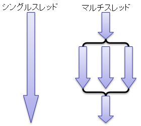
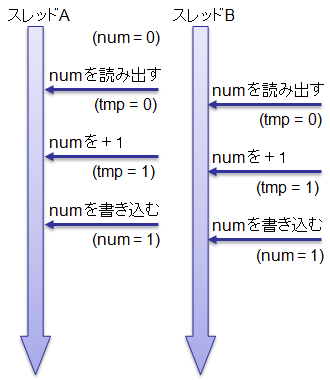
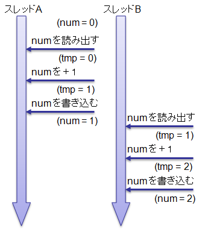

# マルチスレッド

## <a id="sec-generated-title-1"></a> <a id="abst"></a>概要

.NET Framework では、マルチスレッドプログラムを作成するためのクラスライブラリを提供しています。
C# でマルチスレッドプログラムを作成する場合、これらライブラリ中のクラスを用いて行うことになります。
また、C# ではスレッド間の同期を取るために lock 文という構文を用意しています。


##### <a id="sec-generated-title-2"></a>ポイント

* C# なら、Thread クラスとデリゲートで並行処理・並列処理もお手軽。
    * 実際には、スレッドを直接作らず、スレッド プールというものを介して使う。

    * .NET Framework 4 以降なら、Task クラスを利用。


* 排他処理は lock 文で。


## <a id="sec-generated-title-3"></a> <a id="about"></a>マルチスレッドとは

まず、スレッドに関して簡単に説明しておきます。
簡単に言うと、<strong id="thread" class="keyword">スレッド</strong>（thread: 糸、筋道）とは一連の処理の流れのことを言います。
図1 に示すように、
処理の流れが一本道な物を<strong id="single" class="keyword">シングルスレッド</strong>、
複数の処理を平行して行う物を<strong id="multi" class="keyword">マルチスレッド</strong>と呼びます

<figure>
	[](../../../../assets/media/ufcpp2000/csharp/fig/thread.png)
	<figcaption>スレッドの概念図</figcaption>
</figure>


シングルスレッドに関しては特に何も説明する必要はないと思います。
問題のマルチスレッドの方ですが、
例えば、何か非常に計算に時間のかかる処理があったとします。
処理を行っている間、計算に専念してもいいのならマルチスレッドは必要ないのですが、
処理を行っている最中にもユーザーからの入力は受け付けなければならない場合があります。
典型例を挙げるとアクションゲーム等がそうです。
キャラクターの動き計算している間、
ユーザーからの入力を受け付けないようではアクションゲームとして成り立ちません。
このような場合、
ユーザーからの処理を受け付けるスレッドと、
計算に時間のかかる処理を行うスレッドを平行して動かすのが普通です。
要するに、重たい処理を行っている最中でもプログラム全体がフリーズしてしまわないようにするために、
複数の処理を平行して行うのがマルチスレッドプログラムです。


## <a id="sec-generated-title-4"></a> <a id="threading"></a>C# におけるマルチスレッドプログラミング

<span class="expand-button" title="展開/折畳">（古いバージョンの例）</span>
<div class="expand-panel" markdown="1" title="（古いバージョンの例）">
      
C# でマルチスレッドプログラムを作成する場合、
.NET Framework のクラスライブラリが提供している <em>
          <code>System.Threading.Thread</code> クラス
        </em>を使用します。
スレッド作成の手順は以下の通りです。

      
1. スレッドで実行したい処理をメソッドとして記述する。

2. 作成したメソッドを<code>ThreadStart</code>デリゲートとして<code>Thread</code>クラスのコンストラクタに渡す。

3. <code>Thread</code>クラスの<code>Start</code>メソッドを呼び出し、スレッドを開始する。

4. <code>Thread</code>クラスの<code>Join</code>メソッドを呼び出し、スレッドの終了を待つ。


      
以下にスレッド作成の例を示します。

      
```csharp
using System;
using System.Collections;
using System.Threading;

class Counter
{
  int id;

  public Counter(int id){this.id = id;}

  // 1.
  // スレッドの処理内容を記述する。
  // (この例では、ランダムな時間間隔で文字列を出力する。)
  public void Run()
  {
    Random rnd = new Random();

    for(int i=0; i<4; ++i)
    {
      Thread.Sleep(rnd.Next(50, 100)); // ランダムな間隔で処理を一時中断

      Console.Write("{0} (ID: {1})\n", i, id);
    }
  }
}

class TestThread
{
  static void Main()
  {
    const int N = 3;
    Thread[] threads = new Thread[N];

    // スレッド開始
    for(int i=0; i<N; ++i)
    {
      Counter counter = new Counter(i);

      // 2.
      // Thread クラスの構築する
      threads[i] = new Thread(new ThreadStart(counter.Run));

      // 3.
      // Start を使ってスレッドの開始する
      threads[i].Start();
    }

    // スレッド終了待ち
    for(int i=0; i<N; ++i)
    {
      // 4.
      // Join を使ってスレッドの終了を待つ
      threads[i].Join();
    }
  }
}
```


      
実行結果は以下のようになります。
(毎回異なる結果になります。)
3つのスレッドが平行して動いていることが分かると思います。

      
```console
0 (ID: 1)
0 (ID: 2)
0 (ID: 0)
1 (ID: 1)
1 (ID: 2)
1 (ID: 0)
2 (ID: 1)
2 (ID: 2)
2 (ID: 0)
3 (ID: 2)
3 (ID: 0)
3 (ID: 1)
```


    
</div>

<h5 class="version version4">Ver. 4.0</h5>

C# でマルチ スレッド プログラムを作成する際、
多くの場合、スレッドを直接作ることはありません。
（ほとんど出番はないはずですが、もし、直接スレッドを作りたい場合、Thread クラスを使います。）

スレッドの新規作成やスレッド間の処理の切り替えは、結構重たい処理で、最小限に抑えたいものです。
そこで、実際には、スレッドを直接使うのではなく、
1度作ったスレッドを可能な限り使いまわすような仕組み（スレッド プールと呼びます）を使います。

特に、.NET Framework 4 以降では、
スレッド プールを簡単に利用するための Task クラスというものが追加されています。
（Task 以外にも、Parallel クラスや ParallelEnumerable クラスなども便利です。）

```csharp
using System;
using System.Threading.Tasks;
using System.Threading;

namespace ConsoleApplication1
{
    class TaskSample
    {
        static void Main(string[] args)
        {
            const int N = 3;

            Parallel.For(0, N, id => // こう書くだけで、並行して処理が行われる
            {
                Random rnd = new Random();

                for (int i = 0; i < 4; ++i)
                {
                    Thread.Sleep(rnd.Next(50, 100)); // ランダムな間隔で処理を一時中断

                    Console.Write("{0} (ID: {1})\n", i, id);
                }
            });
            // 並行して動かしている処理がすべて終わるまで、自動的に待つ
        }
    }
}
```


実行結果は以下のようになります。
(毎回異なる順序で表示されます。)
3つの処理が平行して動いていることが分かると思います。

```console
0 (ID: 0)
0 (ID: 1)
0 (ID: 2)
1 (ID: 0)
1 (ID: 2)
1 (ID: 1)
2 (ID: 0)
2 (ID: 2)
2 (ID: 1)
3 (ID: 0)
3 (ID: 1)
3 (ID: 2)
```


##### <a id="sec-generated-title-5"></a>サンプル

入力された数値の素因数分解を行うプログラムです。
(値が大きくなると素因数分解は非常に時間がかかります。)
ユーザからの入力を受け付けるスレッドと計算を行うスレッドの2つのスレッドで処理を行います。

```csharp
using System;
using System.Collections;
using System.Threading;

enum State
{
    ready,   // 計算開始前
    running, // 計算真っ最中
    wait,    // 計算一時停止中
}

class TestThread
{
    static long sNum;
    static State sThreadState;

    static void Main()
    {
        Thread thread = null;

        Console.Write(
          "素因数分解を行います。\n" +
          "何か数値を入力してください。\n" +
          "(計算途中で何かキー入力を行うと処理を中断します。)\n" +
          "(q と入力するとプログラムを終了します。)\n");

        sThreadState = State.ready;

        while (true)
        {
            Console.Write("> ");
            string line = Console.ReadLine();

            if (sThreadState == State.running) // 計算中
            {
                sThreadState = State.wait; // 計算中断

                // 計算を中止するかどうか確認する。
                Console.Write(
                  "計算を中断しました。\n" +
                  "  c     : 計算中止\n" +
                  "  q     : プログラム終了\n" +
                  "  その他: 計算続行\n" +
                  "# ");
                line = Console.ReadLine();
                if (line.Length != 0)
                {
                    if (line[0] == 'c' || line[0] == 'C')
                    {
                        sThreadState = State.ready;
                        thread.Join();
                        Console.Write("計算を中止しました。\n");
                        continue;
                    }
                    else if (line[0] == 'q' || line[0] == 'Q')
                    {
                        return;
                    }
                }

                sThreadState = State.running; // 計算再開
            }
            else
            {
                if (line.Length == 0) continue;

                // q が入力されたらプログラム終了。
                if (line[0] == 'q' || line[0] == 'Q') return;

                // 因数分解を開始する。
                try { sNum = Int64.Parse(line); }
                catch (FormatException)
                {
                    Console.Write("不正な文字列が入力されました。\n"); continue;
                }
                catch (OverflowException)
                {
                    Console.Write("値が大きすぎます。\n"); continue;
                }

                sThreadState = State.running;
                thread = new Thread(new ThreadStart(ThreadFunction));
                thread.Start();
            }
        }
    }

    static void ThreadFunction()
    {
        Console.Write("素因数分解開始\n");
        IList factors = Factorization(sNum);
        if (factors != null)
        {
            Console.Write("\n素因数分解終了\n");

            foreach (long i in factors)
            {
                if (sThreadState == State.ready) break;
                if (sThreadState == State.wait) continue;
                Console.Write("{0} ", i);
            }
            Console.Write("\n");
        }
        sThreadState = State.ready;
    }

    /// <summary>
    /// 素因数分解を行う。
    /// (馬鹿でかい数字を素因数分解しようとすると非常に重たい。)
    /// </summary>
    /// <param name="n">素因数分解したい数値</param>
    /// <returns>因数のリスト</returns>
    static IList Factorization(long n)
    {
        ArrayList factors = new ArrayList();

        long sqrtn = (long)Math.Ceiling(Math.Sqrt(n) + 1);
        long i = 2;

        while (i < sqrtn)
        {
            if (sThreadState == State.ready) break;
            if (sThreadState == State.wait) continue;

            if (n % i == 0)
            {
                factors.Add(i);
                n /= i;
                Console.Write("{0}", i);
            }
            else
            {
                ++i;
            }

            Console.Write('.'); // 途中経過を表示
        }

        if (n != 1)
            factors.Add(n);

        return factors;
    }//Factorization
}
```

```console
素因数分解を行います。
何か数値を入力してください。
(計算途中で何かキー入力を行うと処理を中断します。)
(q と入力するとプログラムを終了します。)
>1998
> 素因数分解開始
2..3.3.3...................................37.........
素因数分解終了
2 3 3 3 37
743
> 素因数分解開始
...........................
素因数分解終了
743
256
> 素因数分解開始
2.2.2.2.2.2.2.2................
素因数分解終了
2 2 2 2 2 2 2 2
q
```


## <a id="sec-generated-title-6"></a> <a id="exclusive"></a>排他制御

マルチスレッドプログラムでは、複数のスレッドが1つのデータに対して操作することがあります。
この際に、何も考えず、ただ素直にプログラミングを行うと、
意図しない結果になる場合があります。
例えば、以下の例について考えて見ましょう。

<span class="expand-button" title="展開/折畳">（古いコード（Thread クラスを直接利用））</span>
<div class="expand-panel" markdown="1" title="（古いコード（Thread クラスを直接利用））">
      
```csharp
using System;
using System.Collections;
using System.Threading;

class TestThread
{
  static int num; // 複数のスレッドから同時にアクセスされる。

  const int THREAD_NUM = 20;
  const int ROOP_NUM   = 20;

  /// <summary>
  /// THREAD_NUM 個のスレッドを立てる。
  /// それぞれのスレッドの中で num を ROOP_NUM 回インクリメントする。
  /// </summary>
  static void Main()
  {
    Thread[] threads = new Thread[THREAD_NUM];

    for(int i=0; i<THREAD_NUM; ++i)
    {
      threads[i] = new Thread(new ThreadStart(CountUp));
      threads[i].Start();
    }

    for(int i=0; i<THREAD_NUM; ++i)
    {
      threads[i].Join();
    }

    Console.Write("{0} ({1})\n", num, THREAD_NUM * ROOP_NUM);
    // num と THREAD_NUM * ROOP_NUM は一致するはずなんだけど・・・
  }

  static void CountUp()
  {
    for(int i=0; i<ROOP_NUM; ++i)
    {
      // num をインクリメント。
      // 実行結果が顕著に出るように、途中で Sleep をはさむ。
      int tmp = num;
      Thread.Sleep(1);
      num = tmp + 1;
    }
  }
}
```


    
</div>

```csharp
using System;
using System.Threading;
using System.Threading.Tasks;

class TestThread
{
    /// <summary>
    /// THREAD_NUM 個のスレッドを立てる。
    /// それぞれのスレッドの中で num を ROOP_NUM 回インクリメントする。
    /// </summary>
    static void Main()
    {
        const int ThreadNum = 20;
        const int LoopNum = 20;
        int num = 0; // 複数のスレッドから同時にアクセスされる。

        Parallel.For(0, ThreadNum, i =>
        {
            for (int j = 0; j < LoopNum; j++)
            {
                // num をインクリメント。
                // 実行結果が顕著に出るように、途中で Sleep をはさむ。
                int tmp = num;
                Thread.Sleep(1);
                num = tmp + 1;
            }
        });

        Console.Write("{0} ({1})\n", num, ThreadNum * LoopNum);
        // num と THREAD_NUM * ROOP_NUM は一致するはずなんだけど・・・
    }
}
```


```console
21 (400)
```


この例では、20個のスレッドが同時に1つの変数 <code>num</code> を書き換えています。
各スレッド内で <code>num</code> を20回インクリメントしていますので、
実行結果は20×20で400と表示することが期待されますが、
実際の実行結果では21と表示されています。
しかも、必ずこの結果になるわけではなく、
実行結果は毎回変わります。
(実行環境によってかなり変わります。)

どうしてこのような現象が起きるのかと言うと、
複数のスレッドがどういう順番でどれだけ実行されるかが決まっていないからです。
例えば、上記の <code>num</code> をインクリメントするスレッドが2つある場合、
以下の図2に示すような実行順序や図3に示すような実行順序が考えられます。
このとき、図2に示す実行順序になった場合には <code>num</code> が1しか増えませんが、
図3に示す実行順序になった場合には <code>num</code> がちゃんと2増えます。

<figure>
	[](../../../../assets/media/ufcpp2000/csharp/fig/multithread1.png)
	<figcaption>マルチスレッドの動作1</figcaption>
</figure>


<figure>
	[](../../../../assets/media/ufcpp2000/csharp/fig/multithread2.png)
	<figcaption>マルチスレッドの動作2</figcaption>
</figure>


例に挙げたプログラムでは、実行結果が顕著になるように、
<code>num</code> の読み出し、加算、書き込みを分け、
間に <code>Thread.Sleep</code> (処理の一時休止)を挟んでいます。
しかし、<code>num</code> のインクリメントを <code>++num;</code> と言うように1つの処理にまとめてもこの問題は解決されません。
<code>++num;</code> という処理は、見た目上は1つの処理になっていますが、
これをコンパイルすると読み出し、加算、書き込みという3つの命令になり、
この3つの命令の間でスレッドの切り替わりが起きる可能性もあります。

しかも、<code>Thread.Sleep</code>を挟まない場合、
「滅多に起きないけども、ごくごく稀に値が狂う」という、
デバッグする上では最も困難な現象が起きます。
100万回に1回とか、1千万回に1回とか、それくらいの低頻度で起こる不具合なんて、
デバッグしたくてもなかなかできるものではありません。

このような問題を解決するためには<strong id="exclusive" class="keyword">排他制御</strong>（exclusive operation）というものが必要になります。
例えば、上述の例の場合、あるスレッドが <code>num</code> の読み出し、加算、書き込みという3つの処理を行っている間、他のスレッドが同じ処理を行えないようにする必要があります。
このように、複数のスレッドが同時に行ってはいけない一連の処理が記述された部分のことを<strong id="cs" class="keyword">クリティカルセクション</strong>（critical section）と呼びます。
そして、排他制御とは、複数のスレッドが同時に1つのデータの読み書きを行わないように制御することを言います。


## <a id="sec-generated-title-7"></a> <a id="ex_in_cs"></a>C# における排他制御

C# では排他制御のための専用の構文“lock 文”を持っています。
ここでは lock 文について説明する前に、
lock 文の動作の基となる <em>
        <code>System.Threading.Monitor</code> クラス
      </em>を用いた排他制御について説明します。

スレッドの排他制御を行うためには、同期オブジェクトと排他ロックという概念を用います。
考え方としては、排他制御が必要となる部分、すなわち、クリティカルセクションに入る前に、
あるオブジェクトに鍵をかけます。
鍵がかかっている間、他のスレッドは同じオブジェクトに鍵をかけることは出来ず、
鍵がはずされるまで待たされます。
そして、鍵をかけたスレッドはクリティカルセクションを終えた後にオブジェクトにかかっている鍵をはずします。
このとき、鍵をかける対象となるオブジェクトのことを<em>同期オブジェクト</em>、
鍵をかける操作のことを<em>排他ロック</em>と言います。
また、鍵をかける操作を<em>ロックの取得</em>(またはただ単に<strong id="lock" class="keyword">ロック</strong>(lock))と呼び、
鍵をはずす操作を<em>ロックの解放</em>(または<em>アンロック</em>(unlock))と呼びます。

排他ロックをかけるために使うのは <code>System.Threading.Monitor</code> クラスです。
<code>Monitor</code> クラスにはオブジェクトにロック取得のための <code>Enter</code> メソッド(クリティカルセクションに入ると言う意味)と、ロック解放のための <code>Exit</code> メソッド(クリティカルセクションから出る)という2つの静的メソッドがあり、
これらを用いることで排他ロック制御を行います。

Monitor クラスでは、参照型の任意の変数を同期オブジェクトとして使用できます。
同期オブジェクトを何にするか迷う場合には、
適当なスコープの object 型変数を用意して <code>new object()</code> とでもしておきます。
（ロックがクラス内で完結するなら private 変数にします。
インスタンスメソッド中で使うならメンバー変数に、
静的メソッド中で使うなら静的変数を使います。）

例として、先ほどのプログラムに対して排他制御を施してみましょう。
必要な部分のみ抜き出すと以下のようになります。

<span class="expand-button" title="展開/折畳">（古いコード）</span>
<div class="expand-panel" markdown="1" title="（古いコード）">
    
```csharp
  static readonly object syncObject = new object(); // 同期オブジェクト

  static void CountUp()
  {
    for(int i=0; i<ROOP_NUM; ++i)
    {
      Monitor.Enter(syncObject); // ロック取得
      try
      {
        //↓クリティカルセクション
        int tmp = num;
        Thread.Sleep(1);
        num = tmp + 1;
        //↑クリティカルセクション
      }
      finally
      {
        Monitor.Exit(syncObject); // ロック解放
      }
    }
  }
```


    
</div>

```csharp
var syncObject = new object();

Parallel.For(0, ThreadNum, i =>
{
    for (int j = 0; j < LoopNum; j++)
    {
        bool lockTaken = false;
        try
        {
            Monitor.Enter(syncObject, ref lockTaken); // ロック取得

            //↓クリティカルセクション
            int tmp = num;
            Thread.Sleep(1);
            num = tmp + 1;
            //↑クリティカルセクション
        }
        finally
        {
            if (lockTaken)
                Monitor.Exit(syncObject); // ロック解放
        }
    }
});
```


実行結果は以下のように変わります。

```console
400 (400)
```


この例の場合、try ブロック内がクリティカルセクションになります。
処理の途中で例外が発生しても正しくロックを解放できるように、
<code>Exit</code> メソッドは finally ブロック内に記述します。

一度 <code>Monitor.Enter</code> が呼ばれると、
<code>Exit</code> が呼ばれるまでの間、他のスレッドでは <code>Enter</code> より先に進めなくなります。
その結果、クリティカルセクション（try ブロック内）は、
複数のスレッドから同時に処理されることがなくなります。


## <a id="sec-generated-title-8"></a> <a id="lock"></a>lock 文

排他制御の手順をまとめると以下のようになります。

```csharp
object syncObject = new object();

bool taken = false;
try
{
    Monitor.Enter(syncObject, ref taken);
    クリティカルセクション
}
finally
{
    if (taken) Monitor.Exit(syncObject);
}
```


「[リソースの破棄](../resource/oo_dispose.md)」で説明した using 文や、
「[foreach](../data/sp_foreach.md)」で説明した foreach 文と同様に、
C# には lock 文と言う排他制御のための専用の構文があります。
lock 文は以下のようにして用います。

```csharp
lock(同期オブジェクト)
{
  クリティカルセクション
}
```


lock 文を用いると、コンパイラが自動的に <code>Monitor</code> クラスを用いた排他制御用のコードを生成してくれます。
例として、先ほどの <code>Monitor</code> クラスを用いて書き直したプログラムを、
さらに lock 文を使って書き換えると以下のようになります。

<span class="expand-button" title="展開/折畳">（古いコード）</span>
<div class="expand-panel" markdown="1" title="（古いコード）">
    
```csharp
  static readonly object syncObject = new object();

  static void CountUp()
  {
    for(int i=0; i<ROOP_NUM; ++i)
    {
      lock(syncObject)
      {
        int tmp = num;
        Thread.Sleep(1);
        num = tmp + 1;
      }
    }
  }
```


    
</div>

```csharp
var syncObject = new object();

Parallel.For(0, ThreadNum, i =>
{
    for (int j = 0; j < LoopNum; j++)
    {
        lock (syncObject)
        {
            //↓クリティカルセクション
            int tmp = num;
            Thread.Sleep(1);
            num = tmp + 1;
            //↑クリティカルセクション
        }
    }
});
```

実行結果は先ほどの例と同様に以下のようになります。

```console
400 (400)
```


### <a id="sec-generated-title-9"></a> <a id="dotnet4"></a>余談: .NET Framework 4での実装変更

`lock`文がどう展開されるかは、.NET Framework 4で変更がありました。
これまでの説明で書いてきたパターンは、.NET Framework 4以降のものです。

それ以前は、以下のようなパターンに展開されていました。

```csharp
object syncObject = new object();

Monitor.Enter(syncObject);
try
{
    クリティカルセクション
}
finally
{
    Monitor.Exit(syncObject);
}
```

この書き方だと、`Monitor.Enter` と `try` ブロックに入るまでのわずかな隙間で例外が発生する可能性があり（スレッドが `Abort` されたときとか）、
実はごくまれに `finally` ブロックでの `Monitor.Exit` が呼ばれない問題がありました。

そこで、.NET Framework 4で以下のように実装が変更されたそうです。

```csharp
object syncObject = new object();

bool taken = false;
try
{
    Monitor.Enter(syncObject, ref taken);
    クリティカルセクション
}
finally
{
    if (taken) Monitor.Exit(syncObject);
}
```

じゃあ、.NET Framework 3.5以前はバグっていて動作が不安定だったかというと、頑張って特殊対応して問題を回避しています。
上記コードで、どんな最適化を掛けようとも、どんな実行の仕方をしようとも、`Monitor.Enter`と`try`の隙間に絶対に何の命令も挟まらなくする特殊対応を入れて、この隙間でスレッドの`Abort`が発生しないようにしていたそうです。
ただ、特殊対応過ぎて、新しいプラットフォームに対応するたびにバグが発生するリスクがありました。
実際、x86向けの実装は問題なかったんですが、x64向けの.NET Frameworkを実装したときにこの問題が起きて、
リリース後しばらくは危なかったそうです(気付いてすぐに修正)。
そこで、特殊対応が要らない現在の実装方法への変更が掛かりました。

ちなみに、コード生成の結果は、ターゲットとする環境によって切り替わります。
コンパイル オプションでC#のバージョンを3.0にしても、ターゲットが.NET Framework 4以降であれば`Enter(object, ref bool)`が使われます。
逆に、C# 7でコンパイルしても、ターゲットが.NET Framework 3.5以前であれば`Enter(object)`が使われます。

## <a id="sec-generated-title-10"></a> <a id="volatile"></a>volatile

コンパイラは、コードの最適化の過程で、不要な部分を丸々削除してしまう場合があります。
通常は、不要な部分は削除してもらった方がありがたいのですが、
マルチスレッドプログラミングにおいては、
一見不要に見えても実は必要な部分が生じる可能性があります。

例えば、1つのスレッド内では値を読むだけで、
書き込みをせず、他のスレッドから値を書き込むという場合を考えてみてください。
コンパイラは他のスレッドのことまでは知ることができないので、
コンパイラからすると、値を書き換えもしないのに何度も読み出してる無駄なコードに見えます。

こういう状況を想定して、
一見無駄に見えても、他のスレッドで値が更新されている可能性のある変数には
volatile（ヴォラタイル: 揮発性、変わりやすい）という修飾子をつけます。
volatile 修飾子の付いた変数への値の読み書きは、
コンパイラの最適化によって削除されることはありません。

## <a id="sec-generated-title-11"></a> <a id="lock-class">Lock クラス</a>

<h5 class="version version13">Ver. 13</h5>

C# の `lock` ステートメントは任意の `object` (参照型のインスタンス)に対して使えて、
これまでだと内部実装には `Monitor` クラス(`System.Threading` 名前空間)の `Enter` メソッドを使っていました。

ただ、.NET 9 で `Lock` クラス(`System.Threading` 名前空間)という、自前の排他制御を持っているクラスが追加されます。
`Monitor.Enter` と全く同じ処理をちょっと効率よくやるためのクラスになります。
目的が目的なので、 `lock (obj)` と書いて `Monitor.Enter(obj, out var taken)` に展開されると困ります。

そこで .NET 9 と同世代の C# 13 では、`Lock` クラスのインスタンスに対して `lock` ステートメントを使う `Lock.EnterScope` メソッドを直接呼ぶように展開されるようにしました。

例えば前述のコードを `Lock` クラスを使ったものに書き換えたとします。

```csharp
const int ThreadNum = 20;
const int LoopNum = 20;

int num = 0;
var syncObject = new Lock(); // この行を new object() から new Lock() に変更。

Parallel.For(0, ThreadNum, i =>
{
    for (int j = 0; j < LoopNum; j++)
    {
        lock (syncObject)
        {
            int tmp = num;
            Thread.Sleep(1);
            num = tmp + 1;
        }
    }
});

Console.WriteLine($"{num} ({ThreadNum *  LoopNum})");
```

この時、 `lock (syncObject) { }` の部分は以下のように展開されます。

```csharp
Lock.Scope scope = syncObject.EnterScope();

try
{
    int tmp = num;
    Thread.Sleep(1);
    num = tmp + 1;
}
finally
{
    scope.Dispose();
}
```

ちなみに、これは以下のコードと全く同じ展開結果です。

```csharp
using (syncObject.EnterScope())
{
    int tmp = num;
    Thread.Sleep(1);
    num = tmp + 1;
}
```

ちなみに、旧来の `lock` (任意の `object` に対する `lock` / `Monitor.Enter`)が遅い理由は以前ブログに書いているのでそちらを参照ください:

* [Lock クラス](../../../blog/2024/4/lock-class/index.md)

簡単に言うと、`lock` みたいな利用頻度が低いもの専用の機構を持つのはもったいないので、`GetHashCode` とデータの記録場所を共用しています。
「他と共用、かつ、利用頻度が低い」というのが条件が悪くてパフォーマンスを損ねています。

あと、C# 13 時点ではこれは `Lock` クラス専用です。
同じパターンでメソッドを実装しても他の型では動作しません。
単純に「特に需要がない」という理由です。
