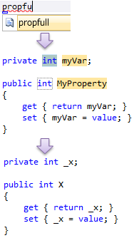

# 使わなくなった機能・新しい機能

##  概要

C# も .NET Framework （のライブラリ）も、ずいぶんと進歩してきました。
その結果、一部の構文やライブラリは、別のもので置き換えられる/置き換えた方がいいものも出てきています。

##  過去の遺物

いくつかの構文は、もう完全に過去のものです
（互換性のためだけに残されています）。

###  非ジェネリック コレクション

ポイント: 非ジェネリック版のコレクションは使ってはいけない。

C# 2.0 で 「[ジェネリック](../oop/sp2_generics.md#generics)」 が導入されると同時に、ジェネリック版のコレクションが導入されました。
それ以前の、<em>非ジェネリック版のコレクションを使うメリットは一切ない</em>ので、使わないようにしましょう。

非ジェネリック版からジェネリック版で、名称が変わっているものもあるので気を付けましょう。
「ジェネリック版に、<code>ArrayList</code> 相当のものがない」という誤解もあったりしますが、<code>List&lt;T&gt;</code> がこれに相当します。

対比表を表1に示します。
非ジェネリック版は <code>System.Collections</code> 名前空間、
ジェネリック版は <code>System.Collections.Generics</code> 名前空間で定義されています。

<table summary="コレクションの非ジェネリック版とジェネリック版の対比">
	<caption>
		コレクションの非ジェネリック版とジェネリック版の対比
	</caption>
	<tr>
		<th>非ジェネリック版</th>
		<th>ジェネリック版</th>
		<th>概要</th>
	</tr>
	<tr>
		<td markdown="1"><code>ArrayList</code></td>
		<td markdown="1"><code>List&lt;T&gt;</code></td>
		<td markdown="1">要素を配列で持っておいて、配列の長さが足りなくなったら配列を作りなおすリスト※1。</td>
	</tr>
	<tr>
		<td markdown="1">なし</td>
		<td markdown="1"><code>LinkedList&lt;T&gt;</code></td>
		<td markdown="1">双方向連結リスト。</td>
	</tr>
	<tr>
		<td markdown="1"><code>Stack</code></td>
		<td markdown="1"><code>Stack&lt;T&gt;</code></td>
		<td markdown="1">後入れ先出し（LIFO: Last In First Out）コレクション。</td>
	</tr>
	<tr>
		<td markdown="1"><code>Queue</code></td>
		<td markdown="1"><code>Queue&lt;T&gt;</code></td>
		<td markdown="1">先入れ先出し（FIFO: First In First Out）コレクション。</td>
	</tr>
	<tr>
		<td markdown="1"><code>Hashtable</code></td>
		<td markdown="1"><code>Dictionary&lt;TKey, TValue&gt;</code></td>
		<td markdown="1">ハッシュテーブル方式で要素を管理する辞書※2。</td>
	</tr>
	<tr>
		<td markdown="1">なし</td>
		<td markdown="1"><code>SortedDictionary&lt;TKey, TValue&gt;</code></td>
		<td markdown="1">二分探索木方式で要素を管理する辞書。</td>
	</tr>
	<tr>
		<td markdown="1"><code>SortedList</code></td>
		<td markdown="1"><code>SortedList&lt;TKey, TValue&gt;</code></td>
		<td markdown="1">整列済み配列で要素を管理する辞書。</td>
	</tr>
	<tr>
		<td markdown="1">なし</td>
		<td markdown="1"><code>HashSet&lt;T&gt;</code></td>
		<td markdown="1">（.NET 4 以降） ハッシュテーブル方式で要素を管理するセット※3。</td>
	</tr>
	<tr>
		<td markdown="1">なし</td>
		<td markdown="1"><code>SortedSet&lt;T&gt;</code></td>
		<td markdown="1">（.NET 4 以降） 二分探索木方式で要素を管理するセット。</td>
	</tr>
</table>

* ※1リスト: 要素の順序を保つコレクション。

* ※2辞書: キーで値を検索可能なコレクション

* ※3セット: 要素を含むか含まないかだけを管理するコレクション

<code>System.Collections</code> 名前空間にあるもので、いまだに使えるのは、<code>BitArray</code> クラスくらいでしょう。

実際、Silverlight など、後発のフレームワークの場合、<code>BitArray</code> 以外の非ジェネリック版のコレクションは削除されています。

###  匿名関数

ポイント: 匿名メソッド式にメリットはない。

C# では、いわゆる匿名関数を作るための構文として、2種類のものを持っています。

<pre class="source" title="" lang="">
<code>// 匿名メソッド式（C# 2.0～）
Func&lt;int, int&gt; f1 = delegate(int x) { return x * x; };

// ラムダ式（C# 3.0～）
Func&lt;int, int&gt; f2 = x =&gt; x * x;
</code></pre>

匿名メソッド式でできることは、全てラムダ式でもできます。
逆に、ラムダ式の方が高機能で、匿名メソッド式ではできないこともできます。
しかも、ラムダ式の方が記法が簡素で使いやすいので、今となっては、<em>匿名メソッド式を使うメリットは全くありません</em>。
（参考:  「[匿名関数](../functional/sp_delegate.md#anonymous)」 ）

実際、もしもラムダ式の方を先に導入していたら、匿名メソッド式という構文は不要でした。
匿名メソッド式は、過去との互換性のためだけに残されています。

<!-- original-page-break -->

##  簡単に書けるようになったもの

新しい構文やライブラリが導入されたことで、
「こう書いた方がいいのはわかっているけども、書くのが面倒だから断念」というような妥協が減りました。

###  非同期処理

ポイント: Task クラスを使いましょう。

時間がかかる処理は、非同期処理にすべきです。
特に、ネットワーク I/O など、ただ待つだけの時間が長いものには非同期処理が必須です。

##### 過去の書き方

ただ、非同期処理は、かなり面倒でした。

例えば、C# 1.0 の頃からある非同期処理の書き方として、
APM（Asynchronous Programming Model）というものがあります。
APM は、IAsyncResult を返す/受け取る、Begin/End メソッドのペアを使います。

例えば、WebRequest クラス（System.Net 名前空間）は、APM 型の非同期 API を持っています。

<pre class="source" title="APM 型の API の利用例" lang="">
<code>var req = WebRequest.Create("http://ufcpp.net/study/csharp/");
req.BeginGetResponse(ar =&gt;
{
    var res = (ar.AsyncState as WebRequest).EndGetResponse(ar);

    string result = null;
    using(var reader = new StreamReader(res.GetResponseStream()))
    {
        result = reader.ReadToEnd();
    }
    Console.WriteLine(result);
}, req);
</code></pre>

また、C# 2.0 の頃には、EAP（Event-based Asynchronous Pattern）という書き方が流行りました。
EAP は、結果をイベントで返してもらうものです。
語尾が Async のメソッドと、語尾が Completed のイベントのペアを使います。

例えば、WebClient クラス（System.Net 名前空間）が、EAP 型の非同期 API を持っています。

<pre class="source" title="EAP 型の API の利用例" lang="">
<code>var c = new WebClient { Encoding = Encoding.UTF8 };

c.DownloadStringCompleted += (sender, args) =&gt;
{
    var result = args.Result;
    Console.WriteLine(result);
};

c.DownloadStringAsync(new Uri("http://ufcpp.net/study/csharp/"));

</code></pre>

##### これからの書き方

APM や EAP では、複数の非同期処理をつないで、1つの非同期 API にするような作業が面倒でした。
そのため、性能的に良くないのはわかっていても、ついつい同期処理で書くことが多かったです。

.NET Framework 4 で導入された Task クラスでは、複数の非同期処理をつなぐのがいくらか簡単になっています。
そこで、非同期 API も、Task クラスを返すメソッドを1つだけ用意する、TAP（Task-based Asynchronous Pattern）という書き方が今後の主流になります。
.NET Framework 4.5 では、標準ライブラリ中の非同期 API に、軒並み TAP 版が用意されます。

例えば、WebRequest クラスのメソッドにも、TAP 版が用意されます。

<pre class="source" title="TAP 型 API の利用例" lang="">
<code>var req = WebRequest.Create("http://ufcpp.net/study/csharp/");
req.GetResponseAsync()
    .ContinueWith(t =&gt;
    {
        var res = t.Result;

        string result = null;
        using (var reader = new StreamReader(res.GetResponseStream()))
        {
            result = reader.ReadToEnd();
        }
        Console.WriteLine(result);
    });
</code></pre>

C# 5.0 では、さらに、この手の非同期処理を、同期版と同じ構造のままで書ける、async メソッド/await 演算子という機能が追加されます。
上記の例を、async メソッドを使って書き直すと、以下のようになります。

<pre class="source" title="" lang="">
<code>private static async Task AsyncSample()
{
    var req = WebRequest.Create("http://ufcpp.net/study/csharp/");
    var res = await req.GetResponseAsync();

    string result = null;
    using (var reader = new StreamReader(res.GetResponseStream()))
    {
        result = reader.ReadToEnd();
    }
    Console.WriteLine(result);
}
</code></pre>

####  余談: スレッドは直接使わない

ポイント: Thread クラスを直接使うのは控えましょう。大半は、Task クラス（.NET 3.5 以前でも、ThreadPool クラス）を使う方が性能が良くなります。

新しくスレッドを立てるというのは、かなり重たい処理です。
そこで、Task クラスなどの内部では、すでにあるスレッドを可能な限り使いまわすような処理を行っています。
必要がない限り、Thread クラス（スレッドを新しく立てます）を直接使うのは控えましょう。

参考:

* [フリーズしないアプリケーションの作り方](http://www.atmarkit.co.jp/fdotnet/chushin/asyncpatterns_01/asyncpatterns_01_01.html)

* [非同期 I/O 待ち](http://csharptan.wordpress.com/2011/12/10/%e9%9d%9e%e5%90%8c%e6%9c%9fio%e5%be%85%e3%81%a1/)

###  LINQ

ポイント: LINQ を使えば、不要な一時リストを作る必要はありません。

データを入力、加工後、集計して表示したいとします。

例えば、コンソールから数値を読み込んで、二乗の計算して、コンソールに出力するプログラムを、一気にかくと以下のようになります。

<pre class="source" title="コンソールから数値を読み込んで、二乗の計算して、コンソールに出力" lang="">
<code>using System;

class Program
{
    static void Main()
    {
        while (true)
        {
            var line = Console.ReadLine();

            if (string.IsNullOrWhiteSpace(line))
                break;

            int x;
            if (!int.TryParse(line, out x))
                break;

            int y = x * x;
            Console.WriteLine("入力の二乗: {0}", y);
        }
    }
}
</code></pre>

この処理を、ある程度分割したいとします。
というか、入力、加工、出力と、債務がはっきり分かれているので、分割すべきでしょう。
この例のように、処理が短いうちは構いませんが、複雑化してくると、分割しないと見づらくなります。

##### 過去の書き方

C# 1.0 の頃は、「[イテレーター](../data/sp2_iterator.md#iterator)」構文も 「[LINQ](../data/sp3_linq.md#linq)」 もなく、以下のように書きがちでした。

<pre class="source" title="" lang="">
<code>using System;
using System.Collections.Generic;

class Program
{
    static void Main()
    {
        var inputs = ReadIntFromConsole();
        var mapped = Square(inputs);

        foreach (var y in mapped)
        {
            Console.WriteLine("入力の二乗: {0}", y);
        }
    }

    static IEnumerable&lt;int&gt; ReadIntFromConsole()
    {
        var list = new List&lt;int&gt;();
        while (true)
        {
            var line = Console.ReadLine();

            if (string.IsNullOrWhiteSpace(line))
                break;

            int x;
            if (!int.TryParse(line, out x))
                break;

            list.Add(x);
        }
        return list;
    }

    static IEnumerable&lt;int&gt; Square(IEnumerable&lt;int&gt; source)
    {
        var list = new List&lt;int&gt;();
        foreach (var x in source)
        {
            list.Add(x * x);
        }
        return list;
    }
}
</code></pre>

余計な List を作っています。データの量が多くなってくると、無駄に多くのメモリを使うことになります。

##### 今の書き方

イテレーター構文と LINQ を使うことで、余計な一時リストをなくせます。

<pre class="source" title="" lang="">
<code>using System;
using System.Collections.Generic;
using System.Linq;

class Program
{
    static void Main()
    {
        var inputs = ReadIntFromConsole();
        var mapped = inputs.Select(x =&gt; x * x); // LINQ

        foreach (var y in mapped)
        {
            Console.WriteLine("入力の二乗: {0}", y);
        }
    }

    static IEnumerable&lt;int&gt; ReadIntFromConsole()
    {
        while (true)
        {
            var line = Console.ReadLine();

            if (string.IsNullOrWhiteSpace(line))
                break;

            int x;
            if (!int.TryParse(line, out x))
                break;

            yield return x; // イテレーター構文
        }
    }
}
</code></pre>

参考:

* [C#で解説する「データ処理の直交化と汎用化」 ](http://www.atmarkit.co.jp/fdotnet/chushin/roadtolinq_01/roadtolinq_01_01.html)

* [C#／Scala／Python／Ruby／F#でデータ処理はどう違うのか？ ](http://www.atmarkit.co.jp/fdotnet/chushin/comparedataproc_01/comparedataproc_01_01.html)

####  余談: IEnumerable を使いましょう

ポイント: メソッドの引数や戻り値、プロパティの型には IEnumerable&lt;T&gt; を使いましょう。

データ列に対して、前から順に1要素ずつ読む操作だけしかしないことが多いです。
そういう場合、List&lt;T&gt; クラスや配列ではなく、IEnumerable&lt;T&gt; インターフェイスを使うようにしましょう。

<pre class="source" title="悪い例" lang="">
<code>// 【×】これだと、中身を書き換えられる
static readonly int[] SampleData = new[] { 1, 2, 3, 4, 5, };

// 【×】メソッド中で読み取りにしか使っていないのに int[] で受け取っている
static void Output(int[] data)
{
    foreach (var x in data)
    {
        Console.WriteLine(x);
    }
}
</code></pre>

<pre class="source" title="良い例" lang="">
<code>// 【○】読み取りのみなら、IEnumerable に
static readonly IEnumerable&lt;int&gt; SampleData = new[] { 1, 2, 3, 4, 5, };

// 【○】同上、IEnumerable に
static void Output(IEnumerable&lt;int&gt; data)
{
    foreach (var x in data)
    {
        Console.WriteLine(x);
    }
}

</code></pre>

###  XML

ポイント: XDocument クラス（System.Xml.Linq 名前空間）を使いましょう。

C# 3.0/.NET 3.5 で 「[LINQ](../data/sp3_linq.md#linq)」 が導入されたことで、データ処理において IEnumerable&lt;T&gt; インターフェイスが特別な意味を持つようになりました。

それに合わせて、XML の読み書きのためにも、IEnumerable で XML 要素一覧を読み出せるようなクラスが新たに追加されました。

##### 過去の書き方

.NET 3.0 以前では、XmlDocument クラス（System.Xml 名前空間）を使っていました。

##### 今の書き方

.NET 3.5 で、XDocument クラスが追加されました。
IEnumerable&lt;XElement&gt; で要素一覧を読み出せるので、LINQ to Objects が使えます。

<pre class="source" title="" lang="">
<code>var doc = XDocument.Load(filename);
var ns = doc.Root.Name.Namespace;

var titles =
    from x in doc.Root.Elements(ns + "section")
    select x.Attribute("title").Value;

foreach (var title in titles)
{
    Console.WriteLine(title);
}
</code></pre>

###  自動実装プロパティ

ポイント: フィールドを public にしてはいけません。
自動実装プロパティを使えば手間もかからないので、フィールドよりもプロパティを使いましょう。

後からの変更に備えて、ただフィールドを読み書きするだけのプロパティを作ることがあります。

<pre class="source" title="フィールドを読み書きするだけのプロパティ" lang="">
<code>private int _x;

public int X
{
    get { return _x; }
    set { _x = value; }
}
</code></pre>

こうしておけば、後から処理を足すことになって中身を修正しても、
クラスの利用側の再コンパイルは不要です。

ただ、問題は、書くのが面倒だということです。
（もっとも、図1のように、コード スニペットがあるので、そこまで面倒ではないですが。）

<figure>
	
	<figcaption>プロパティ生成用のコード スニペット。</figcaption>
</figure>

この面倒を解消するために、C# 3.0 で、自動実装プロパティというものが導入されました。
以下のように、get; set; とだけ書くと、上記のような、フィールドと、フィールド読み書きするだけのプロパティが自動生成されます。

<pre class="source" title="自動実装プロパティ" lang="">
<code>public int X { get; set; }
</code></pre>

また、外部からは読み取り専用なプロパティを作るのにも重宝します。

<pre class="source" title="読み取り専用の自動実装プロパティ" lang="">
<code>public int X { get; private set; }
</code></pre>

##  使い分けも必要な機能

いくつかの新機能は、状況に応じた利用が必要です。

###  var（型推論）

ポイント: だいたい var 使ってれば OK。

C# 3.0 で導入された 「[var](../start/st_variable.md#var)」 は、型推論（右辺値の型に合わせて、静的な型を決定する）なので、C# の型安全性は崩れません。

ソースコードの見た目的に、型が明示されなくなるわけですが、
それでソースコードが読みづらくなるのなら、
多分、何か var 以前の問題（1つのメソッドが長すぎるとか、変数名が良くないとか）があると思います。

##### 問題: 紙に印刷すると見づらい

var の利用は、Visual Studio の補助が前提な面もあります。
Visual Studio 上では、図2のように、型推論の結果がすぐに見えるので、多少読みにくいコードであっても、変数の型がわからなくなることはありません。

<figure>
	
	<figcaption>Visual Studio 上での、var の型推論結果の表示。</figcaption>
</figure>

なので、HTML ドキュメント中や、書籍中でのサンプル コードの場合、
var が使われないことも多いです。

##### 例外: あえて右辺と違う型で変数を作りたい場合

C# ではあまりないですが、例えば、具体的な型ではなく、インターフェイスの変数を作りたい場合があります。

<pre class="source" title="明示的にインターフェイスを使う" lang="">
<code>IEnumerable&lt;int&gt; data = new[] { 1, 2, 3, 4, 5 };
</code></pre>

###  引数の既定値

ポイント: 引数の既定値は、一度設定したら変更しちゃダメ。変更の可能性があるなら、オーバーロードを使う。

C# 4.0 で、引数に既定値を設定できるようになりました。

<pre class="source" title="引数の既定値" lang="">
<code>static void Main()
{
    X(); // X(0, 0) と同じ意味。
    X(x: 1); // X(1, 0) と同じ意味。
    X(y: 1); // X(0, 1) と同じ意味。
}

static void X(int x = 0, int y = 0)
{
    Console.WriteLine("{0}, {1}", x, y);
}
</code></pre>

##### 問題: バージョニング

引数の既定値にはバージョニングの問題（変更したら、利用側も再コンパイルしてもらわないと変更が反映されず、バージョンを変えた時に値が狂う可能性がある）があります。
（参考: 「[余談： なんでいまさら？](../structured/sp4_optional.md#fyi)」）

もちろん、絶対に値を変えないと言い切れそうなら、問題になりません。
（たとえば、既定値にとりあえず null を与えるような場合、後から null 以外の値に変えることはあまりないと思います。）
便利な機能なので使いこなしましょう。

もし、値を変える可能性があるなら、既定値は与えず、メソッドのオーバーロードで対処します。

<pre class="source" title="引数の既定値相当のことを、オーバーロードで実現" lang="">
<code>static void X()
{
    X(0, 0); // これなら、バージョニングの問題を起こさず、値を変えれる
}

static void X(int x, int y)
{
    Console.WriteLine("{0}, {1}", x, y);
}
</code></pre>

また、問題が起きるのはメソッド定義側と利用側が異なるアセンブリの場合なので、
private メソッドならば問題は起こりません。

##  破壊的変更

C# を見ていると、「こんなに機能を追加してしまって、過去のコードを壊さないのか」という疑問が出てくるかもしれません。

確かに、破壊的変更も 0 ではないんですが、
現実的な範囲では問題になっていません。
ちなみに、C# 5.0までの破壊的変更は以下のページにまとまっています。

* [Visual C# 2008 Breaking Changes](http://msdn.microsoft.com/en-us/library/cc713578.aspx)

* [Visual C# 2010 Breaking Changes](http://msdn.microsoft.com/en-us/library/vstudio/ee855831.aspx)

* [Visual C# Breaking Changes in Visual Studio 2012](http://msdn.microsoft.com/en-us/library/hh678682(v=vs.110).aspx)

C# は、これでも新機能の追加に慎重で、既存コードとの互換性を壊さないか、かなり大量のコードを使ってテストしているようです。
上記リンクで紹介した破壊的変更も、これで既存コードが動かなくなって困ったという話は著者の見聞きしている範囲では皆無ですし、めったなことでは引っかからないと思います。

###  文脈キーワード（破壊的変更を避けるために）

C# の多くのキーワードは文脈依存（特定の状況でだけキーワードとみなされて、その他の状況では変数名などに使える）になっています。

* var は、変数宣言ステートメントでだけキーワード扱いされます。

* yield は、return か break が続くときにだけキーワード扱いされます。

* partial は、後ろに class が続くときにだけキーワード扱いされます。

* await は、async 修飾子が付いたメソッド内でだけキーワード扱いされます。

このおかげで、後からキーワードを追加したにもかかわらず、めったなことでは、既存のコードのコンパイルで問題が起きません。
既存のコードで var や yield という名前の変数名を使っていても、新しいバージョンの C# でコンパイルできます。

詳しくは、「[互換性の維持](../misc/ap_compatibility.md)」をご覧ください。
