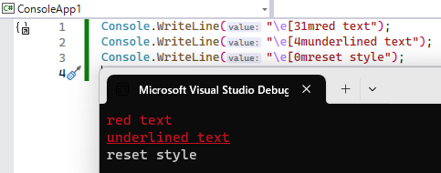

# C# 13.0 の新機能

<div class="version version13">Ver. 13.0</div>

<table>
<tr>
<th>リリース時期</th>
<td>2024/11</td>
</tr>
<tr>
<th>同世代技術</th>
<td>
<ul>
<li>.NET 9.0</li>
<li>Visual Studio 2022 17.12</li>
</td>
</tr>
</table>

執筆予定: [C# 13.0 トラッキング issue](https://github.com/ufcpp/UfcppSample/issues/462)

## <a id="sec-generated-title-1"></a> <a id="params-collections">params コレクション</a>

[コレクション式](../datatype/collection-expression.md)で使える型であれば何でも `params` にできるようになりました。

```csharp
static void M1(params List<int> x) { }
static void M2(params IEnumerable<int> x) { }
static void M3(params Span<int> x) { }
static void M4(params ReadOnlySpan<int> x) { }

M1(1, 2);
M2(1, 2);
M3(1, 2);
M4(1, 2);
```

需要が高いのは `ReadOnlySpan` で、
`params T[]` を `params ReadOnlySpan<T>` に変更すればそれだけでパフォーマンスの改善が見込めます。

実際、 .NET 9 では、`string.Join` や `Task.WhenAll` などのメソッドに
`params ReadOnlySpan<T>` なオーバーロードが増えています。

```csharp
// .NET 8 以前なら Join(string, string[])
// .NET 9 以降なら Join(string, ReadOnlySpan<string>)
var joiend = string.Join(",", "a", "b", "c");
```

このため、自分で `params` を使わない場合でも、
「.NET 9 にアップグレードして再コンパイルするだけでアプリのパフォーマンスがちょっと改善する」という間接的なメリットがあります。

詳しくは「[`params` コレクション](../structured/sp_params.md#params-collections)」で説明しています。

## <a id="sec-generated-title-2"></a> <a id="partial-property">部分プロパティ</a>

プロパティとインデクサーも `partial` にできるようになりました。

例えば、C# 13 と同世代の .NET 9 では、[`GeneratedRegex`](https://learn.microsoft.com/ja-jp/dotnet/api/system.text.regularexpressions.generatedregexattribute) をプロパティにできるようになりました。

```csharp
using System.Text.RegularExpressions;

partial class MyPatterns
{
    [GeneratedRegex(@"\d{4}")]
    public static partial Regex FourDigits { get; } // プロパティになった。
}
```

詳しくは「[部分プロパティ](../misc/partial-type.md#partial_property)」で説明します。

## <a id="sec-generated-title-3"></a> <a id="ref-struct-interface">ref 構造体のインターフェイス実装</a>

ref 構造体にインターフェイスを実装できるようになりました。
また、このインターフェイスのメンバーを呼び出すために、
ジェネリック型引数に ref 構造体を渡せるようにする仕組みとして `allows ref struct` アンチ制約が追加されました。

```csharp
S x = new(); // S は IFormattable を実装してる。

// これはボックス化を起こすから C# 13 でもエラーになる。
IFormattable f = x;
f.ToString("X", null);

// allows ref struct なジェネリックメソッドを介して、
static void M<T>(T f) where T : IFormattable, allows ref struct
    => f.ToString("X", null);

// こうやって IFormattable.ToString を呼べば大丈夫になった。
M(x);

ref struct S : IFormattable
{
    public string ToString(string? format, IFormatProvider? formatProvider) => "";
}
```

詳しくは「[ref 構造体のインターフェイス実装](../resource/refstruct.md#ref-struct-interface)」で説明します。
また、「アンチ制約」という言葉については「[アンチ制約](../oop/sp2_generics.md#anti-constraint)」で説明しています。

## <a id="sec-generated-title-4"></a> <a id="overload-resolution-priority">OverloadResolutionPriority</a>

C# 13 で、オーバーロードの解決優先度を属性を付けて明示できる機能が入りました。

```csharp
using System.Runtime.CompilerServices;

// IEnumerable<char> の方が選ばれる。
C.M1("");
C.M2("");

class C
{
    // 通常、インターフェイスよりも具体的な型の方が優先。
    public static void M1(string _) { }

    // 属性を付けて優先度を上げる。
    [OverloadResolutionPriority(1)]
    public static void M1(IEnumerable<char> _) { }

    // 属性を付けて優先度を下げる。
    [OverloadResolutionPriority(-1)]
    public static void M2(string _) { }

    public static void M2(IEnumerable<char> _) { }
}
```

詳しくは「[オーバーロード解決](../structured/miscoverloadresolution.md#overload-resolution-priority)」で説明します。

トラッキングissue: [#478](https://github.com/ufcpp/UfcppSample/issues/478)

## <a id="sec-generated-title-5"></a> <a id="lock-class">Lock クラスに対する lock</a>

.NET 9 で `Lock` クラス(`System.Threading` 名前空間)という新しい lock 用の型が追加されたことに伴って、
`lock` ステートメントでこの `Lock` クラスを特別扱いするようになりました。
既存の `lock` (`Monitor.Enter` に展開される)と異なり、以下のようなコードに展開されます。

```csharp
var syncObject = new Lock();

// lock (syncObject)
using (syncObject.EnterScope())
{
}
```

詳しくは「[Lock クラス](../async/sp_thread.md#lock-class)」で説明しています。

## <a id="sec-generated-title-6"></a> <a id="ref-in-async">ref/unsafe をイテレーター/非同期メソッド中に書けるように</a>

[ref ローカル変数](../resource/sp_ref.md#ref-returns)、
[ref 構造体](../resource/refstruct.md)の変数、
[unsafe](../interop/sp_unsafe.md#unsafe) ブロックを、
[イテレーター](../data/sp2_iterator.md)と[非同期メソッド](../async/sp5_async.md)内で使えるようになりました。

イテレーターと非同期メソッドは内部の仕組み的に非常に似ているにも関わらず、
この2者で微妙に制限のかかり方が違ったんですが、
それも C# 13 でそろいました。

以下のコードで、行末コメントで ⭕ を付けている部分が C# 13 で新たにコンパイルできるようになったコードです。

```csharp
IEnumerable<object?> Enumerate()
{
    unsafe { } // ⭕

    yield return null;

    Span<byte> data = [];

    yield return null;

    int x = 123;
    ref int r = ref x; // ⭕
}

async Task GetAsync()
{
    unsafe { }

    await Task.Yield();

    Span<byte> data = []; // ⭕

    await Task.Yield();

    int x = 123;
    ref int r = ref x; // ⭕
}

async IAsyncEnumerable<object?> EnumerateAsync()
{
    unsafe { } // ⭕

    await Task.Yield(); yield return null;

    Span<byte> data = []; // ⭕

    await Task.Yield(); yield return null;

    int x = 123;
    ref int r = ref x; // ⭕
}
```

元々、原理的にはこう書いても問題ないことはわかっていたんですが、
正しく判定するのにコストがかかる割に、需要は低いだろうということでエラーにしていました。
C# 13 で書けるようになったのは、前述の[`Lock` クラスに対する `lock`](#lock-class) のついでだそうです。
(`Lock` クラスの `EnterScope` が ref 構造体を使っています。)

ただし、これは `yield` や `await` をまたがない場合に限って許されます。
例えば以下のコードは C# 13 でもコンパイル エラーを起こします。

```csharp
IEnumerable<object?> Enumerate()
{
    int x = 123;
    ref int r = ref x;
    yield return null;
    r = 456;
}

async Task GetAsync()
{
    int x = 123;
    ref int r = ref x;
    await Task.Yield();
    r = 456;
}
```

## <a id="sec-generated-title-7"></a> <a id="escape-escape">\e (エスケープ文字のエスケープ シーケンス)</a>

文字・文字列リテラル中の[エスケープ シーケンス](../start/st_embeddedtype.md#escape-sequence)に `\e` (U+001B、エスケープ文字)が追加されました。

例えば、コンソール アプリで以下のように書くことで、文字列の色を変えたり装飾したりできます。

```csharp
Console.WriteLine("\e[31mred text");
Console.WriteLine("\e[4munderlined text");
Console.WriteLine("\e[0mreset style");
```



機能追加の背景などについてはブログ記事「[\e (エスケープ文字のエスケープ シーケンス)](../../../blog/2023/12/escape-escape/index.md)」で説明しています。


## <a id="sec-generated-title-8"></a> <a id="interceptor">インターセプター</a>

(書きかけ。予定地。)

トラッキングissue: [#456](https://github.com/ufcpp/UfcppSample/issues/456)

## <a id="sec-generated-title-9"></a> <a id="other">その他</a>

その他、ほぼバグ修正レベルの機能がいくつかあります。

### <a id="sec-generated-title-10"></a> <a id="index-in-object-initializer">オブジェクト初期化子中の ^ 演算子</a>

以下のように、オブジェクト初期化子中の `[]` の中で[インデックスの `^` 演算子](../data/dataranges.md)を使えるようになりました。

```csharp
// これが C# 12 以前はコンパイル エラーを起こしてた。
var c = new C { [^1] = 1 };

// これなら昔からコンパイルできる。
// (オブジェクト初期化子はこれと同じコードに展開されるはずなのに。)
c[^1] = 1;

class C
{
    // インデクサーと Length さえ持っていれば c[^i] と書けるようになる。
    // c[c.Length - i] 扱い。
    public int Length => 1;
    public int this[int i] { get => i; set { } }
}
```

### <a id="sec-generated-title-11"></a> <a id="method-group-natrural-type">デリゲートの自然な型の改善</a>

[デリゲートの自然な型](../functional/sp_delegate.md#natural-type)の決定の際、
メソッド グループに対する型決定がちょっと賢くなったそうです。
同名のインスタンス メソッドと拡張メソッドがあるとき、インスタンス メソッドを優先的に見るようになりました。

例えば以下のようなクラスがあったとします。

```csharp
public class C
{
    public void M() { } // インスタンス メソッド M と、
}

public static class E
{
    public static void M(this C c, object o) { } // 同名の拡張メソッド。
}
```

この `C` 型のインスタンス `x` に対して `x.M` と書いたとき、
C# 12 までは自然な型を決定できなかったのに対して、
C# 13 ではインスタンスメソッドを優先的に見ます。

```csharp
var x = new C();

// オーバーロード解決ではインスタンスメソッド優先。
x.M();      // C.M()
x.M(""); // E.M(C, object)

// 型の明示があると昔から大丈夫だった。
Action a = x.M;         // C.M()
Action<object> b = x.M; // E.M(C, object)

// var を使う。
// これが C# 13 から行けるように。
// インスタンス メソッド優先で、Action 型になる。
var z = x.M;
```

### <a id="sec-generated-title-12"></a> <a id="collection-expression13">コレクション式の改善</a>

[コレクション式](ap_ver12.md#collection-expression)にも微妙な修正が2つ入っています。

1つは、`Add` メソッドが拡張メソッドでも大丈夫になりました。
(こちらは最新のコンパイラーにすると `LangVersion` 12 にしても元の挙動(= コンパイル エラー)にはなりません。)

```csharp
using System.Collections;

C c = ['a'];

class C : IEnumerable
{
    public IEnumerator GetEnumerator() => throw new NotImplementedException();
}

static class Extensions
{
    // C# 12 の頃はこの拡張メソッドを見てくれずエラーになっていた。
    public static void Add(this C a, char _) { }
}
```

もう1つは、[params コレクション](#params-collections)との兼ね合いで、オーバーロード解決ルールが変わっています。
以下のように、要素の型違いのオーバーロードがあるとき、要素の[自然な型](../../../blog/2022/12/stackalloc-natural-type/index.md)を見るようになりました。
(この変更は言語バージョンを見て分岐しているようで、
最新のコンパイラーでも [`LangVersion`](langversionoption.md#langversion) を12以前に戻すと古い挙動になります。)

```csharp
// C# 12 では以下の2つとも解決不能(コンパイル エラー)になってた。

// C# 13 では int の方になる。
C.M([1]);

// C# 13 では string の方になる。
C.M([$""]);

class C
{
    public static void M(List<int> _) { }
    public static void M(List<byte> _) { }

    public static void M(List<string> _) { }
    public static void M(List<IFormattable> _) { }
}
```

ただ、この結果、ちょっとした破壊的変更も起きています。
C# 12 から C# 13 にアップデートすると、以下のような場合にオーバーロード解決先が変わります。

```csharp
C.M([1, 2]);

class C
{
    // C# 12 だとこっちが呼ばれる。
    // (ReadOnlySpan 優先。)
    public static void M(ReadOnlySpan<byte> data) => Console.WriteLine("ReadOnlySpan<byte>");

    // C# 13 だとこっちが呼ばれる。
    // (中身の自然な型(整数リテラルは int になる)優先。)
    public static void M(Span<int> data) => Console.WriteLine("Span<int>");
}
```
