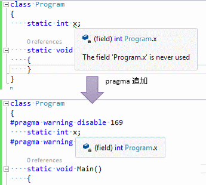
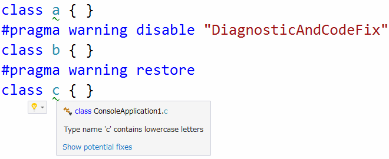

# C# 6 の新機能

## <a id="sec-generated-title-1"></a> <a id="ver6"></a>C# 6

<div class="version version6">Ver. 6</div>

<table>
<tr>
<th>リリース時期</th>
<td>2015/7</td>
</tr>
<tr>
<th>同世代技術</th>
<td>
<ul>
<li>Visual Studio 2015</li>
<li>.NET Framework 4.6</li>
<li>Visual Basic 14<sup>※</sup></li>
</td>
</tr>
<tr>
<th>要約・目玉機能</ht>
<td>
<ul>
<li>C#コンパイラーのC#実装化</li>
<li>オープンソース化</li>
</ul>
</td>
</tr>
</table>

「[C# 5.0](ap_ver5.md#ver5)」正式リリースの後、「[.NET Compiler Platform](../misc/misc_roslyn.md#compiler-platform)」の開発が始まり、
当初は既存の C# コンパイラーとの互換性を保つことが優先されていて、しばらく C# の新機能実装が止まっていました。
これまでだと、C# 4.0の正式版がリリースされた瞬間に C# 5.0 のプレビュー版が提供されたりといったように、ほぼ切れ目なく新機能の発表がありましたが、
今回、C# 6 は、 5.0 から2年ほどの空きができました。

しかし、「[.NET Compiler Platform](../misc/misc_roslyn.md#compiler-platform)」が完成したことで、
かかるコストの割には効果が薄いということでこれまで実装されてこなかったような、ちょっとした便利機能が実装されやすくなりました。
結果として、C# 6 では(C# 5.0 の時の非同期メソッドのような)大きな機能はない代わりに、
(C# 3.0 の時にも似たような)細々とした便利な機能がたくさん追加されそうです。

C# に関わるもう1つの大きな変化としては、C# コンパイラーの開発がオープンになりました([https://github.com/dotnet/roslyn](https://github.com/dotnet/roslyn/))。
その結果、仕様が固まりきる前の状態が一般の開発者の目に見えるようになりました。

<sup>※</sup> Visual Basicのバージョンは、C# 5.0と同世代のVB 11から一気に14に飛んでいます。
これに関しては、本項の最後に補足。

##### <a id="sec-generated-title-2"></a>サンプル

[https://github.com/ufcpp/UfcppSample/tree/master/Demo/Csharp6](https://github.com/ufcpp/UfcppSample/tree/master/Demo/Csharp6)


## <a id="sec-generated-title-3"></a> <a id="auto-property"></a>自動プロパティの拡張

プロパティの自動実装(自動プロパティ、auto-property などと呼びます)自体は C# 3.0 で入った機能です。

<table summary="">

	<tr>
		<th>C# 2.0 以前</th>
		<th>C# 3.0 以降</th>
	</tr>
	<tr>
		<td markdown="1">
<pre class="source" title="" lang=""><code class="language-csharp">class Point
{
    private int _x;

    public int X
    {
        get { return _x; }
        set { _x = value; }
    }
    
    // Y とか Z も同様に実装
}</code></pre>

</td>
		<td markdown="1">
<pre class="source" title="" lang=""><code class="language-csharp">class Point
{
    public int X { get; set; }
    public int Y { get; set; }
}</code></pre>

</td>
	</tr>
</table>


しかし、この自動プロパティではいくつか不便な点がありました。それが、C# 6 で改善されています。


### <a id="sec-generated-title-4"></a> <a id="auto-property-initializer"></a>初期化子

C# 6 では、自動プロパティに初期化子(プロパティの後ろに = 値; )を与えて、初期値指定ができるようになりました。
後述する getter のみの自動プロパティとの組み合わせが特に便利です。

<table summary="">

	<tr>
		<th>C# 5.0 以前</th>
		<th>C# 6 以降</th>
	</tr>
	<tr>
		<td markdown="1">
<pre class="source" title="" lang=""><code class="language-csharp">class Point
{
    // ↓この初期値を設定するためだけに自動実装をやめることに
    private int _x = 10;

    public int X
    {
        get { return _x; }
        set { _x = value; }
    }

    // Y も同様に実装
}</code></pre>

</td>
		<td markdown="1" rowspan="2">
<pre class="source" title="" lang=""><code class="language-csharp">class Point
{
    public int X { get; set; } = 10;
    public int Y { get; set; } = 20;
}</code></pre>

</td>
	</tr>
	<tr>
		<td markdown="1">
<pre class="source" title="" lang=""><code class="language-csharp">class Point
{
    public int X { get; set; }
    public int Y { get; set; }

    public Point()
    {
        // ↓この初期値を設定するためだけにコンストラクターが必要
        X = 10;
        Y = 20;
    }
}</code></pre>

</td>
	</tr>
</table>


### <a id="sec-generated-title-5"></a> <a id="getter-only"></a>getter のみの自動プロパティ

初期化子での初期値指定ができるようになったことで、「[getter](../oop/oo_property.md#getter)」 のみの自動プロパティが作れるようになりました。

<table summary="">

	<tr>
		<th>C# 5.0 以前</th>
		<th>C# 6 以降</th>
	</tr>
	<tr>
		<td markdown="1">
<pre class="source" title="" lang=""><code class="language-csharp">class Point
{
    // ↓getのみの自動実装はできないので仕方なくフィールドを用意
    private readonly int _x = 10;
    public int X { get { return _x; } }

    private readonly int _y = 20;
    public int Y { get { return _y; } }
}</code></pre>

</td>
		<td markdown="1" rowspan="2">
<pre class="source" title="" lang=""><code class="language-csharp">class Point
{
    // ↓ set; を消すだけ
    public int X { get; } = 10;
    public int Y { get; } = 20;
}</code></pre>

</td>
	</tr>
	<tr>
		<td markdown="1">
<pre class="source" title="" lang=""><code class="language-csharp">class Point
{
    // ↓setをprivateにすることで外からは書き替えれないように
    public int X { get; private set; } 
    public int Y { get; private set; }

    public Point()
    {
        X = 10;
        Y = 20;
    }
}</code></pre>

</td>
	</tr>
</table>


getだけ書いたプロパティは、readonlyフィールドと同じような扱いになります(というか、実際、コンパイラーによってreadonlyフィールドが生成されます)。
つまり、コンストラクター中でだけ値を設定できて、以降はgetしかできません。

<table summary="">

	<tr>
		<th>get のみの自動プロパティ</th>
		<th>展開結果</th>
	</tr>
	<tr>
		<td markdown="1">
<pre class="source" title="" lang=""><code class="language-csharp">public class Point
{
    public int X { get; }
    public int Y { get; }

    public Point(int x, int y)
    {
        // コンストラクター内でだけ set 可能。
        // 以降は書き換え不可(readonly)
        X = x;
        Y = y;
    }
}</code></pre>

</td>
		<td markdown="1">
<pre class="source" title="" lang=""><code class="language-csharp">public class Point
{
    private readonly int _x;
    public int X =&gt; _x;

    private readonly int _y;
    public int Y =&gt; _y;

    public Point(int x, int y)
    {
        _x = x;
        _y = y;
    }
}</code></pre>

</td>
	</tr>
</table>


## <a id="sec-generated-title-6"></a> <a id="sec-expression-bodied"></a>expression-bodied な関数メンバー

<h5 class="version version6">Ver. 6</h5>
C# 6 では、関数メンバーの関数本体の部分が1つの式だけからなる場合に =&gt; を使った簡易文法で関数定義できるようになりました。
{ get } や { return } などの記述で間延びしがちな関数メンバー定義が楽になります。
これを、expression-bodied (本体が式の)関数メンバー(expression-bodied function member)と呼びます。 

まず、メソッドと演算子オーバーロード(method-like な関数メンバー)では、{ return } を =&gt; で置き換えて、以下のように書けます。

<table summary="" style="table-layout:fixed; width:100%;">

	<tr>
		<th>C# 5.0 以前</th>
		<th>C# 6 以降</th>
	</tr>
	<tr>
		<td markdown="1">
<pre class="source" title="" lang=""><code class="language-csharp">public class Point
{
    public int X { get; set; }
    public int Y { get; set; }
    public Point(int x = 0, int y = 0) { X = x; Y = y; }

    public int InnerProduct(Point p)
    {
        return X * p.X + Y * p.Y;
    }
    public static Point operator -(Point p)
    {
        return new Point(-p.X, -p.Y);
    }
}</code></pre>

</td>
		<td markdown="1">
<pre class="source" title="" lang=""><code class="language-csharp">public class Point
{
    public int X { get; set; }
    public int Y { get; set; }
    public Point(int x = 0, int y = 0) { X = x; Y = y; }

    public int InnerProduct(Point p) =&gt; X * p.X + Y * p.Y;
    public static Point operator -(Point p) =&gt; new Point(-p.X, -p.Y);
}</code></pre>

</td>
	</tr>
</table>


また、プロパティとインデクサーの場合は、get-only なものに限って、{ get { return } } を、以下のように置き換えれます。
(一方、get/set 両方持つものに対する省略記法はありません。今まで通りの書き方が必要です。)

<table summary="">

	<tr>
		<th>C# 5.0 以前</th>
		<th>C# 6 以降</th>
	</tr>
	<tr>
		<td markdown="1">
<pre class="source" title="" lang=""><code class="language-csharp">public class Polygon
{
    private Point[] _vertexes;

    public int Count
    {
        get
        {
            return _vertexes.Length;
        }
    }
    public Point this[int i]
    {
        get
        {
            return _vertexes[i];
        }
    }
}</code></pre>

</td>
		<td markdown="1">
<pre class="source" title="" lang=""><code class="language-csharp">public class Polygon
{
    private Point[] _vertexes;

    public int Count =&gt; _vertexes.Length;
    public Point this[int i] =&gt; _vertexes[i];
}</code></pre>

</td>
	</tr>
</table>


## <a id="sec-generated-title-7"></a> <a id="null-conditional"></a>null 条件演算子

詳しくは「[null の使い方](../resource/rm_nullusage.md)」で説明します(予定)が、「引数が有効な値の時だけメソッドやプロパティを参照して、null だったら何も呼ばずに null を返す」というような処理を書きたいことが結構あります。
このような処理を、?. という1つの演算子で簡単に書けるようになりました。
これを <strong id="key-null-conditional" class="keyword">null 条件演算子</strong>(null conditional operator)といいます。

<table summary="">

	<tr>
		<th>C# 5.0 以前</th>
		<th>C# 6 以降</th>
	</tr>
	<tr>
		<td markdown="1">
<pre class="source" title="" lang=""><code class="language-csharp">public class Sample
{
    public string Name { get; set; }

    public static int? X(Sample s)
    {
        if (s == null) return null;
        var name = s.Name;
        if (name == null) return null;
        return name.Length;
    }
}</code></pre>

</td>
		<td markdown="1">
<pre class="source" title="" lang=""><code class="language-csharp">public class Sample
{
    public string Name { get; set; }

    public static int? X(Sample s) =&gt; s?.Name?.Length;
}</code></pre>

</td>
	</tr>
</table>


「[インデクサー](../oop/oo_indexer.md#indexer)」に対しても、?[] という形で、null 条件付きの値の取得ができます。

```csharp
static char? X(string s, int i) => s?[i];
```


一方で、デリゲートに対して ?() で呼び出しはできません。条件演算子 ? : との区別などで、文法上の問題があるからです。
ただし、この場合でも、 ?.Invoke() という形で null 条件付きの呼び出しができます。

```csharp
static T Y<T>(Func<T> f)
    where T : class
    => f?.Invoke();
```


## <a id="sec-generated-title-8"></a> <a id="string-interpolation"></a>文字列挿入

文字列の整形用の構文が追加されました。

<table summary="">

	<tr>
		<th>C# 5.0 以前</th>
		<th>C# 6 以降</th>
	</tr>
	<tr>
		<td markdown="1">
<pre class="source" title="" lang=""><code class="language-csharp">var formatted = string.Format(&quot;({0}, {1})&quot;, x, y);</code></pre>

</td>
		<td markdown="1">
<pre class="source" title="" lang=""><code class="language-csharp">var formatted = $&quot;({x}, {y})&quot;;</code></pre>

</td>
	</tr>
</table>


詳しくは「[文字列挿入](../start/st_string.md#string-interpolation)」 で説明します。


## <a id="sec-generated-title-9"></a> <a id="nameof-operator"></a>nameof 演算子

<strong id="key-nameof" class="keyword">nameof 演算子</strong>(nameof operator)というものが追加され、変数や、クラス、メソッド、プロパティなどの名前(識別子)を文字列リテラルとして取得できるようになりました。

<table summary="" style="table-layout:fixed; width:100%;">

	<tr>
		<th>C# 5.0 以前</th>
		<th>C# 6 以降</th>
	</tr>
	<tr>
		<td markdown="1">
<pre class="source" title="" lang=""><code class="language-csharp">using System;

class MyClass
{
    public int MyProperty { get { return myField; } }
    private int myField = 10;

    public void MyMethod()
    {
        var myLocal = 10;
        Console.WriteLine(&quot;MyClass&quot;);
        Console.WriteLine(&quot;MyProperty = &quot; + MyProperty);
        Console.WriteLine(&quot;myField = &quot; + myField);
        Console.WriteLine(&quot;MyMethod&quot;);
        Console.WriteLine(&quot;myLocal = &quot; + myLocal);
    }
}</code></pre>

</td>
		<td markdown="1">
<pre class="source" title="nameof 演算子の例" lang=""><code class="language-csharp">using System;

class MyClass
{
    public int MyProperty =&gt; myField;
    private int myField = 10;

    public void MyMethod()
    {
        var myLocal = 10;
        Console.WriteLine(nameof(MyClass));
        Console.WriteLine(nameof(MyProperty) + &quot; = &quot; + MyProperty);
        Console.WriteLine(nameof(myField) + &quot; = &quot; + myField);
        Console.WriteLine(nameof(MyMethod));
        Console.WriteLine(nameof(myLocal) + &quot; = &quot; + myLocal);
    }
}</code></pre>

</td>
	</tr>
</table>


詳しくは「[nameof 演算子](../start/st_string.md#nameof-operator)」 で説明しますが、
普通の文字列リテラルと比べた時の nameof 演算子の利点は、ソースコード解析の対象にできることです。


## <a id="sec-generated-title-10"></a> <a id="using-static"></a>using static

これまで必ず「クラス名.メンバー名」の形で参照する必要があった静的メンバーを、using ディレクティブでクラス指定することで、メンバー名だけで参照できるようになりました。

<table summary="">

	<tr>
		<th>C# 5.0 以前</th>
		<th>C# 6 以降</th>
	</tr>
	<tr>
		<td markdown="1">
<pre class="source" title="" lang=""><code class="language-csharp">using System;

class Program
{
    static void Main()
    {
        var pi = 2 * Math.Asin(1);
        Console.WriteLine(Math.PI == pi);
    }
}</code></pre>

</td>
		<td markdown="1">
<pre class="source" title="" lang=""><code class="language-csharp">using System;
using static System.Math;

class Program
{
    static void Main()
    {
        var pi = 2 * Asin(1);
        Console.WriteLine(PI == pi);
    }
}</code></pre>

</td>
	</tr>
</table>


Math クラス(System 名前空間)など、純粋な関数のみを持ったクラスに対して特に有効でしょう。

詳しくは「[静的メンバー](../oop/oo_static.md#using-static)」で説明しています。

## <a id="sec-generated-title-11"></a> <a id="index-initializer"></a>インデックス初期化子

オブジェクト初期化子(参考: 「[初期化子](../functional/sp3_lambda.md#init)」 )を書く際に、インデクサーを混ぜれるようになりました。
これを<strong id="key-index-initializer" class="keyword">インデックス初期化子</strong>(index initializer)といいます。

<table summary="">

	<tr>
		<th>C# 5.0 以前</th>
		<th>C# 6 以降</th>
	</tr>
	<tr>
		<td markdown="1">
<pre class="source" title="" lang=""><code class="language-csharp">var dic = new Dictionary&lt;string, int&gt;();
dic[&quot;one&quot;] = 1;
dic[&quot;two&quot;] = 2;</code></pre>

</td>
		<td markdown="1">
<pre class="source" title="" lang=""><code class="language-csharp">var dic = new Dictionary&lt;string, int&gt;
{
    [&quot;one&quot;] = 1,
    [&quot;two&quot;] = 2,
};</code></pre>

</td>
	</tr>
</table>


インデックス初期化子を使う利点は、式しか書けない場面(フィールド初期化子や、expression-bodied な関数定義など)で書けることです。

```csharp
using System.Collections.Generic;

class Sample
{
    Dictionary<string, int> dic = new Dictionary<string, int>
    {
        ["one"] = 1,
        ["two"] = 2,
    };

    Dictionary<string, int> GetDic(int x, int y) => new Dictionary<string, int>
    {
        ["x"] = x,
        ["y"] = y,
    };
}
```


プロパティへの代入と、インデクサーへの代入を混在させることもできます。

```csharp
class Sample
{
    public string Name { get; set; }

    public int this[string key]
    {
        get { return 0; }
        set { }
    }
}

class Program
{
    static void Main()
    {
        var s = new Sample
        {
            Name = "sample",
            ["X"] = 1,
            ["Y"] = 2,
        };
    }
}
```


## <a id="sec-generated-title-12"></a> <a id="exception-filter"></a>例外フィルター

catch 句に追加の条件を付けれるようになりました。

```csharp
using System;

class Program
{
    static void Main()
    {
        try
        {
            SomeMethod(1, 2);
        }
        catch (ArgumentException e) when (e.ParamName == "x")
        {
            // パラメーター名が x の時だけはエラー無視
        }
        catch (ArgumentException e) when (e.ParamName == "y")
        {
            // パラメーター名が y の時もエラー無視
        }
        catch (ArgumentException e)
        {
            // その他の時
            throw;
        }
    }

    private static void SomeMethod(int x, int y)
    {
        if (x < 0) throw new ArgumentException(nameof(x));
        if (y < 0) throw new ArgumentException(nameof(y));
    }
}
```


(.NET の実行エンジン的には最初から持っていた機能で、これまでは C# が対応してなかっただけのものです。)

例えば、二種類の例外に対して同じ処理を掛けたい場合や、catchした例外自体ではなくInnerExceptionを見て分岐したい場合などに使えます。


## <a id="sec-generated-title-13"></a> <a id="await-in-catch"></a>catch/finally 句内での await 演算子

C# 5.0 で導入された await 演算子ですが、5.0では、catch 句と finally 句内には書けないという制限がありました。C# 6 でこの制限がなくなります。

```csharp
public static async Task XAsync()
{
    try
    {
        await SomeAsyncMethod();
    }
    catch (InvalidOperationException e)
    {
        using (var s = new StreamWriter("error.txt"))
            await s.WriteAsync(e.ToString());
    }
    finally
    {
        using (var s = new StreamWriter("trace.txt"))
            await s.WriteAsync("XAsync done.");
    }
}
```


catch 句や finally 句での await は、一度全ての例外を拾ってから、非同期処理した後、再 throw するような、結構複雑なコードが生成されます。
C# 5.0 の頃に制限がかかっていた理由は、複雑なコード生成を避けた(最初から難しいことをしてトラブるのを避けた)結果でしょう。


## <a id="sec-generated-title-14"></a> <a id="add-extensions"></a>拡張メソッドでコレクション初期化子

C# 3.0 で「[コレクション初期化子](../functional/sp3_lambda.md#collectioninit)」が追加されましたが、これは、Add メソッドの呼び出しに展開されるものです。

```csharp
var x1 = new List<int> { 1, 2, 3 };
// ↑と↓は同じ意味
var x2 = new List<int>();
x2.Add(1);
x2.Add(2);
x2.Add(3);
```


これまでは、Add は通常のメソッドでないといけませんでした。
これが、C# 6 で、拡張メソッドでもよくなりました。

```csharp
using System.Collections.Generic;

class Point
{
    public int X { get; set; }
    public int Y { get; set; }
}

static class PointExtensions
{
    public static void Add(this List<Point> list, int x, int y)
        => list.Add(new Point { X = x, Y = y });
}

class Program
{
    static void Main()
    {
        var points = new List<Point>
        {
            // PointExtensions.Add が呼ばれる
            { 1, 2 },
            { 4, 6 },
            { 0, 3 },
        };
    }
}
```


## <a id="sec-generated-title-15"></a> <a id="add-extensions"></a>ユーザー定義コード解析に対する #pragma warning

「[.NET Compiler Platform](../misc/misc_roslyn.md#compiler-platform)」 によって誰でもコード解析を追加できるようになりました。
コード解析の追加できるということは、C#に特定用途専用の警告やエラー(と、それに対する修正方法)を追加できるということです。

ところで、C#には、特定の警告を無視するようなプリプロセス命令(参考: 「[プラグマ](../misc/sp_preprocess.md#pragma)」)があります。
標準の警告には警告番号が付いていて、この番号を指定することで特定の警告を無視します。

<figure>
	[](../../../../assets/media/ufcpp2000/csharp/fig/pragma-warning.png)
	<figcaption>#pragma warning で警告を無視する。</figcaption>
</figure>


.NET Compiler Platform を使うと、誰でもコンパイラー警告を増やせます(ユーザー定義の警告)。
例えば、組織内の標準規約などを決めてある場合、その規約に反するコードには警告を出すということもできます。
これに対して、ユーザー定義の警告を無視できるように、#pragma warning プリプロセス命令も拡張されています。

<figure>
	[](../../../../assets/media/ufcpp2000/csharp/fig/pragma-custom-warning.png)
	<figcaption>.NET Compiler Platform で作ったユーザー定義の警告を無視する。</figcaption>
</figure>


<!-- original-page-break -->

## <a id="sec-generated-title-16"></a> <a id="misc"></a>その他、細かい変更

C# 6はコンパイラーを1から作りなおしたのもあって、「計画して」というわけでなく、「ついでに」といった感じの細かい改善がちらほらあります。
それほど大きなインパクトもなく、あまり宣伝はされず、作業履歴的なドキュメントにだけこそっと残っていたりします。

改善の内容は、
「ちょっと手間をかけて調べればバグだとわかるコード」に対する解析能力が上がっていたり、
ちょっとした使い勝手の向上だったりです。

### <a id="sec-generated-title-17"></a> <a id="struct-property-init"></a>構造体のプロパティ初期化

```csharp
struct Point
{
    public int X { get; private set; }

    public Point(int x)
    {
        // C# 5.0まではエラーに。
        X = x;
    }
}
```

C#の構造体のコンストラクターには、「すべてのフィールドを初期化するまで、関数メンバーを呼んではいけない」という制限がかかっています。
C# 5.0までは、上記のコードはこの制限にプロパティ アクセスが引っかかって、コンパイル エラーになっていました。

C# 6では、自動実装プロパティのsetは、対応する[バックフィールド](../oop/oo_property.md#auto)の初期化と同じ扱いをするようになりました。これにより、プロパティへのsetが制限に引っかからなくなりました。

### <a id="sec-generated-title-18"></a> <a id="cyclic-ctor"></a>コンストラクターの循環参照

```csharp
class C
{
    public C(int x) : this() { }
    public C() : this(0) { } // C# 6ではコンパイル エラーに
}
```

このコードは、C# 5.0まではコンパイルできていました。コンストラクターが循環的に呼び出されているので、このクラスを`new`すると永久ループになって、スタック オーバーフローを起こします。

一方で、C# 6では、このコードは最初からコンパイル エラーになります。

### <a id="sec-generated-title-19"></a> <a id="definite-assignment"></a>「確実な初期化」の判定改善

```csharp
static void Main()
{
    int x;
    if (false && x == 3) // C# 5.0まではエラーに
    {
        x = x + 1; // ここはC# 5.0まででもOK
    }
}
```

C#は、[未初期化領域](../resource/rm_default.md)の問題を避けるため、「変数は確実に初期化してからでないと値を読み出せない」という仕様になっています。この「確実な初期化」(definite assignment)がされたかどうかの判定は、ある程度コードの流れを追って判定してくれます。例えば`if`や`switch`で分岐がある場合でも、すべての分岐先で初期化してあれば「確実な初期化」済みと見なされます。

また、絶対に通らない場所は判定外です。
例えば、`if (false) { }`の中(絶対にこの中は通らない)では、未初期化変数を読みだしていてもエラーにはなりません(どうせ通らないので問題ない)。

上記のコードは`&&`の性質(左側が偽だったら右側は評価しない)上、「絶対に通らない場所なので判定外」としてもいいはずですが、C# 5.0まではエラーになっていました。C# 6ではエラーになりません。

### <a id="sec-generated-title-20"></a> <a id="enum-base-type"></a>列挙型の基底型

```csharp
enum X : System.Int32 // C# 5.0まではエラーに
{
    A, B, C,
}
```

[列挙型](../structured/st_enum.md)には基底型を指定できます(C#の列挙型は、内部的には単なる整数で、その整数の型を指定できます)。

ただ、C# 5.0までは、この基底型の指定は「`sbyte`、
`byte`、
`short`、
`ushort`、
`int`、
`uint`、
`long`、
`ulong`、
`char`
のいずれか」
という仕様になっていました。
つまり、同じ`int`を指しているはずの、`System.Int32`という書き方は受け付けられませんでした。

これが、C# 6では受け付けられるようになりました。

### <a id="sec-generated-title-21"></a> <a id="invaliant-meaning"></a>変数の「意味不変」ルール

```csharp
class InvariantMeaningInBlock
{
    double x;

    void F(bool b)
    {
        x = 1.0;
        if (b)
        {
            int x; // C# 5.0まではエラーに
            x = 1;
        }
    }

    void F1(bool b)
    {
        if (b)
        {
            int x; // ちなみに、これはC# 6でもエラー
            x = 1;
        }
        double x = 1.0;
    }
}
```

C#は、「同じブロック内で変数の意味が変わってはいけない」という方針を持っています。
上記コードの後半のように、`if`ステートメントとその外、入れ子になっている場所で、同じ名前の別変数を定義するというような書き方を認めていません。

C# 5.0まではこの方針を徹底していて、上記コードの前半のように、`if`の外ではフィールド`x`を使っていて、`if`の中では同名の変数`x`を定義して使うということすらエラーにしていました。

ところが、C# 6では、この前半のような判定は、大変な割にメリットが少ないということで、判定しない(エラーにならない)よう変更されました。

### <a id="sec-generated-title-22"></a> <a id="overload-resolution"></a>オーバーロード解決の改善

```csharp
static void Main()
{
    X(() => () => 10); // C# 5.0まではエラーに
    Y(() => () => 10); // C# 5.0まではエラーに
}

private static int X(Func<Func<int>> f) { return f()(); }
private static int X(Func<Func<int?>> f) { return f()() ?? 0; }

private static int Y(Func<Func<int>> f) { return f()(); }
private static double Y(Func<Func<double>> f) { return f()(); }
```

C#では、同名・引数違いのメソッドを定義([オーバーロード](../structured/st_function.md#overload))できます。
どのオーバーロードが呼ばれるかは、「実引数と仮引数の型が最も一致しているものを呼ぶ(暗黙的な型変換がないもの、少ないもの優先)」というルール(betternessルールと呼ばれます)に基いて決めます。

しかし、どちらを呼ぶべきか紛らわしい場合があります。物によってはコンパイラーによる自動判定が無理で、[キャスト](../start/st_cast.md#cast)などで明示的に型を指定する必要があります。

C# 6では、このbetternessルールの判定が少し賢くなりました。上記のコードは、C# 6以降でだけオーバーロード解決がうまくいく一例です。C# 5.0までは、`X((Func<Func<int>>)(() => ()=> 10));`というような、型の明示が必要でした。
(C# 6では`int`版が呼ばれます。`Y(() => () =>10.0)`とか書けば、`double`版が呼ばれます。)

C# 5.0までは、`Func<Func<int>>`というような、入れ子になったジェネリックに対する判定ルールが仕様書レベルで欠けていて、1段階のジェネリックは「仕様外動作」としてたまたまうまくオーバーロード解決できていたものの、多段に入れ子になったものは解決できなかったそうです。C# 6では、仕様自体に訂正が入って、こういう場合に対応できるようにしました。

### <a id="sec-generated-title-23"></a> <a id="optimazation"></a>内部的な最適化

コンパイラーを作り直して整理したことによって、最適化のかかり方がよくなったようです。

- [公式ドキュメント](https://github.com/dotnet/roslyn/blob/main/docs/compilers/CSharp/CodeGen%20Differences.md) (英語のみ)

例えば、`yield return` や `await` をまたがないローカル変数の扱いが変わりました。

`yield return` ([イテレーター](../data/sp2_iterator.md))や `await` ([非同期メソッド](../async/sp5_async.md))を使うと、ローカル変数がフィールドの「格上げ」されたりします。
内部的な実装としては、これらの機能は匿名関数を作っているようなものなので、ローカル変数がフィールドに格上げされる理由については「[[雑記] 匿名デリゲートのコンパイル結果](../functional/sp2_anonymousmethod.md)」辺りを参照してください。

以下のようなコードを書いた場合、C# 5.0までは x, y も無条件にフィールドに格上げされていました。
それが、C# 6で、かつ、リリースビルドにすると、`yield return` や `await` をまたいだ場合にだけフィールド格上げされます(この例の場合、y はローカル変数のままで、x はフィールド格上げされる)。

```csharp
public static IEnumerable<int> GetXItems()
{
    var x = 10;
    yield return x;

    var y = x * x;  // x は yield を超えて使っている
    yield return y; // y は yield を超えない

    yield return x;
}

public static async Task XAsync()
{
    var x = 10;
    await Task.Delay(x);

    var y = x * x;       // x は await を超えて使っている
    await Task.Delay(y); // y は await を超えない

    await Task.Delay(x);
}
```

リリースビルドとデバッグビルドで生成コードが少し変わるというのも、C# 6が初めてです。


<!-- original-page-break -->


## <a id="sec-generated-title-24"></a>おまけ: Visual Basic 11から一気に14に

Visual Basicは、VB6時代からの習慣で、プログラミング言語と開発ツールをあまり分けて考えません。
結果的に、Visual Studioの内部バージョン番号が、その世代でのVBのバージョンとして使われます。
Visual Studioの内部バージョンは以下の通りです。

- Visual Studio .NET 2002 → 7
- Visual Studio .NET 2003 → 7.1
- Visual Studio 2005 → 8
- Visual Studio 2008 → 9
- Visual Studio 2010 → 10
- Visual Studio 2012 → 11
- Visual Studio 2013 → 12 (このとき、C#やVBの言語仕様は一切変化なし)
- Visual Studio 2015 → 14 (キリスト教的に縁起の悪い13は避けたらしい)

つまり、VBのバージョンとしては、

- 12: 何の更新もないバージョンが1つ存在している
- 13: 忌み数を避けた

ということになります。

ちなみに、「Visual Studio 2013世代のVisual Basic」を指してVB 12ということもあるようです。
このときの新機能というと、例えば「Windows 8アプリをVBで開発できる」というような、開発ツール的な更新しかないんですが、
これを指してVB 12と表記されることがたまにあります。

また、正式には、「Visual Basic 2015」とか、「Visual Studio 2015におけるVisual Basic」みたいな表記をするようです。
内部バージョンを使って「VB 14」というような書き方は、Visual Studioの正式名称が決まるまでの便宜上の名称で、
それがそのまま通称として定着しているということになります。
