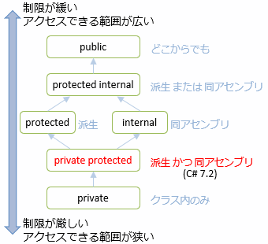

# C# 7.2 の新機能

## <a id="sec-generated-title-1"></a> <a id="ver7_2"></a>C# 7.2

<div class="version version7_1">Ver. 7.2</div>

<table>
<tr>
<th>リリース時期</th>
<td>2017/12</td>
</tr>
<tr>
<th>同世代技術</th>
<td>
<ul>
<li>Visual Studio 2017 15.5</li>
</td>
</tr>
<tr>
<th>要約・目玉機能</ht>
<td>
<ul>
<li>構造体と参照の活用</li>
</ul>
</td>
</tr>
</table>

C# 7.2で追加された機能の多くは「構造体と参照の活用によってパフォーマンス改善」と言った感じのものです。
パフォーマンスが求められるようなライブラリの作者にとっては重要になりますが、
多くのC#開発者にとっては直接利用する機能ではないかもしれません。
ただし、そういった開発者にとっても、
「知らないうちに使っていた」とか「使っているライブラリがなんだか速くなった」というような、
間接的な恩恵が受けられるものです。

また、C# 7.1に引き続いての小さな更新がいくつかあります。

※C# 7.2 は、リリース時点ではバグが多く、その後の更新で修正されたものが結構な数あります。
バグが多いのは主に[参照がらみの機能](#ref)の辺りです。
(具体的なバグについては[昔書いたブログ](../../../blog/2017/12/バグ報告祭り/index.md)があるのでそちらを参照。)
本サイト内で説明している機能がうまく動かなかったときには、一度コンパイラーやVisual Studioのバージョンを挙げてみてください。

## <a id="sec-generated-title-2"></a> <a id="leading-separator"></a>先頭区切り文字

`0b`、`0x`の直後に区切り文字の `_` を入れることができるようになりました。

```csharp
// C# 7.0 から書ける
var b1 = 0b1111_0000;
var x1 = 0x0001_F408;

// C# 7.2 から書ける
// b, x の直後に _ 入れてもOKに
var b2 = 0b_1111_0000;
var x2 = 0x_0001_F408;
```

区切り文字に関しては「[数字区切り文字](../start/stnumber.md#digit-separator)」を参照してください。


## <a id="sec-generated-title-3"></a> <a id="non-trailing-named"></a>非末尾名前付き引数

<h5 class="version version7_1">Ver. 7.2</h5>

前の方の引数を名前付きにできるようになりました。
例えば、以下のような書き方が許されるようになりました。

```csharp {title="1つ目の引数だけを名前付きにする"}
// C# 7.2
// 末尾以外でも名前を書けるように
Sum(x: 1, 2, 3);
```

詳しくは「[オプション引数・名前付き引数](../structured/sp4_optional.md#non-trailing-named)」で説明します。


## <a id="sec-generated-title-4"></a> <a id="private-protected"></a>private protected

`private protected`というキーワード(語順は自由)で、「`protected`かつ`internal`」なアクセシビリティを指定できるようになりました。



詳しくは「[実装の隠蔽](../oop/oo_conceal.md#protected-internal)」で説明します。

## <a id="sec-generated-title-5"></a> <a id="ref"></a>参照の活用

ここから先が、C# 7.2 の大部分を占める「参照の活用」になります。
小さな機能の組み合わせになっているのでそれぞれについて説明します。

### <a id="sec-generated-title-6"></a> <a id="conditional-ref"></a>条件演算子での ref 利用

[条件演算子](../start/st_operator.md#condition)の2項目、3項目を参照にできるようになりました。
以下のような書き方ができます。

```csharp {title="条件演算子の中で ref を利用"}
x > y ? ref x : ref y
```

詳しくは「[条件演算子での ref 利用](../resource/sp_ref.md#conditional-ref)」で説明します。

### <a id="sec-generated-title-7"></a> <a id="ref-readonly"></a>ref readonly

「参照渡しだけども読み取り専用」というような渡し方ができるようになりました。
読み取り専用参照(ref readonly)と呼ばれています。

引数の場合には`in`修飾子を使って以下のように書きます。

```csharp {title="in 引数でコピーを避ける" highlight-ranges="sha256:4dae60902d739b1b95068ce16bd61304953faaf8ed501c2118cd915245e085ed;9:41-9:43,9:58-9:60"}
public struct Quaternion
{
    public double W;
    public double X;
    public double Y;
    public double Z;
    public Quaternion(double w, double x, double y, double z) => (W, X, Y, Z) = (w, x, y, z);

    public static Quaternion operator *(in Quaternion a, in Quaternion b)
        => new Quaternion(
            a.W * b.W - a.X * b.X - a.Y * b.Y - a.Z * b.Z,
            a.W * b.X + a.X * b.W + a.Y * b.Z - a.Z * b.Y,
            a.W * b.Y + a.Y * b.W + a.Z * b.X - a.X * b.Z,
            a.W * b.Z + a.Z * b.W + a.X * b.Y - a.Y * b.X);
}
```

`ref`引数や`out`引数とは異なり、`in`引数は以下のような呼び出し方ができます。

- `F(x)` というように、修飾なしで呼ぶ
- `F(10)` というように、リテラルを引数として渡す
- `F(x + y)` というように、右辺値(式の計算結果)を引数として渡す

また、ローカル変数と戻り値の場合は`ref readonly`修飾子を使います。

```csharp {title="ref readonly な戻り値、ローカル変数"}
static ref readonly int Max(in int x, in int y)
{
    ref readonly var t = ref x;
    ref readonly var u = ref y;

    if (t < u) return ref u;
    else return ref t;
}
```

詳しくは「[入力参照引数 (in 引数)](../resource/sp_ref.md#in)」、「[ref readonly](../resource/sp_ref.md#ref-readonly)」で説明します。

#### <a id="sec-generated-title-8"></a> <a id="in-operator"></a>演算子のin引数

これまで、[演算子オーバーロード](../oop/oo_operator.md)の引数は値渡しである必要がありました。
C# 7.2では、`in`引数も演算子の引数にできるようになりました。

```csharp {title="演算子の in 引数" highlight-ranges="sha256:b73f9a2a7bd21eed3ad73392e58bb225f838b0120cd6723965321adee23fdbc6;16:38-16:40,16:52-16:54" error-ranges="sha256:b73f9a2a7bd21eed3ad73392e58bb225f838b0120cd6723965321adee23fdbc6;12:36-12:37"}
struct Complex
{
    public double X;
    public double Y;
    public Complex(double x, double y) => (X, Y) = (x, y);

    // これは OK
    public static Complex operator +(Complex a, Complex b)
        => new Complex(a.X + b.X, a.Y + b.Y);

    // これはコンパイル エラーになる
    public static Complex operator +(ref Complex a, ref Complex b)
        => new Complex(a.X + b.X, a.Y + b.Y);

    // これなら OK
    public static Complex operator +(in Complex a, in Complex b)
        => new Complex(a.X + b.X, a.Y + b.Y);
}
```

### <a id="sec-generated-title-9"></a> <a id="ref-extensions"></a>参照渡しの拡張メソッド

拡張メソッドの第1引数(`this`が付いている引数)を参照渡し([`ref`](../resource/sp_ref.md#sec-byref)もしくは[`in`](../resource/sp_ref.md#in))で渡せるようになりました。

```csharp {title="参照渡しの拡張メソッドの例" highlight-ranges="sha256:dd10b8979f2495beabbf37738a5783cec18383130f84bc5d9e55215fffadf486;4:34-4:42,14:37-14:44"}
public static class QuaternionExtensions
{
    // 構造体の書き換えを拡張メソッドでやりたい場合に ref 引数が使える
    public static void Conjugate(ref this Quaternion q)
    {
        var norm = q.W * q.W + q.X * q.X + q.Y * q.Y + q.Z * q.Z;
        q.W = q.W / norm;
        q.X = -q.X / norm;
        q.Y = -q.Y / norm;
        q.Z = -q.Z / norm;
    }

    // コピーを避けたい場合に in 引数が使える
    public static Quaternion Rotate(in this Quaternion p, in Quaternion q)
    {
        var qc = q;
        qc.Conjugate();
        return q * p * qc;
    }
}
```

詳しくは「[参照渡しの拡張メソッド](../functional/sp3_extension.md#ref-extensions)」で説明します。

### <a id="sec-generated-title-10"></a> <a id="readonly-struct"></a>readonly struct

構造体に `readonly` 修飾子を付けることで、以下のような制約を掛けれるようになりました。

- すべてのフィールドに`readonly`を付けることが必須
- `this`参照も`readonly`扱いされて、構造体の書き換えが完全にできなくなる

```csharp {title="readonly struct の例" highlight-ranges="sha256:8f1f7745881bc6cfa077176420f98037659ca5129c89f30d64f3731234153ae7;2:1-2:9"}
// 構造体自体に readonly を付ける
readonly struct Point
{
    // フィールドには readonly が必須
    public readonly int X;
    public readonly int Y;

    public Point(int x, int y) => (X, Y) = (x, y);

    // readonly を付けない場合と違って、以下のような this 書き換えも不可
    //public void Set(int x, int y) => this = new Point(x, y);
}
```

詳細は「[readonly struct](../resource/readonlyness.md#readonly-struct)」で説明します。

「参照」とは直接は関係ないですが、[in 引数](../resource/sp_ref.md#in)や、ref safety rule (今後追加予定)と関連して必要になった機能です。

### <a id="sec-generated-title-11"></a> <a id="safe-stackalloc"></a>安全な stackalloc

`Span<T>`構造体と併用することで、unsafe なしで [`stackalloc`](../interop/sp_unsafe.md#stackalloc) を使えるようになりました。

```csharp {title="ファイル読み込みの一時バッファーに stackalloc を使う例" highlight-text="Span&lt;byte&gt; buffer = stackalloc byte[BufferSize];"}
const int BufferSize = 128;

using (var f = File.OpenRead("test.data"))
{
    var rest = (int)f.Length;
    // Span<byte> で受け取ることで、new (配列)を stackalloc (スタック確保)に変更できる
    Span<byte> buffer = stackalloc byte[BufferSize];

    while (true)
    {
        // Read(Span<byte>) が追加された
        var read = f.Read(buffer);
        rest -= read;
        if (rest == 0) break;

        // buffer に対して何か処理する
    }
}
```

`stackalloc`を使っていますがポインターは不要で、ちゃんと範囲チェックも掛かって安全に扱えます。

詳しくは「[`Span<T>`構造体](../resource/span.md#safe-stackalloc)」で説明します。

### <a id="sec-generated-title-12"></a> <a id="span-safety"></a>ref 構造体

C# 7.2 と深く関連する型に[`Span<T>`](../resource/span.md)という構造体があります。
この `Span<T>` は、C#7.2 の主たる目的の「構造体と参照の活用によってパフォーマンス改善」の主役となる構造体です。

この型を安全に使うためにはいくつが制限が必要で、そのために`ref`構造体という構文と、それに対するフロー解析が実装されました。

```csharp {title="ref構造体を持てるのはref構造体だけ"}
// Span<T> は ref 構造体になっている
public readonly ref struct Span<T> { ... }

まず、`Span<T>`を持てるのは`ref`修飾子がついた構造体(`ref`構造体)だけです。

// ref 構造体を持てるのは ref 構造体だけ
ref struct RefStruct
{
    private Span<int> _span; //OK
}
```

`ref`構造体には参照ローカル変数・参照戻りと同じ制限がかかります。


```csharp {title="戻り値に返せるかどうか" error-ranges="sha256:704a81f1b4ea26fe4ae486554ce7621d50bc979f595ecf40b80a06b822035436;8:12-8:13"}
// 引数で受け取ったものは戻り値で返せる
private static Span<int> Success(Span<int> x) => x;

// ローカルで確保したもの変数はダメ
private static Span<int> Error()
{
    Span<int> x = stackalloc int[1];
    return x;
}
```

その他、`ref`構造体には「スタック上になければならない(stack-only)」という制限があり、
その結果、例えば以下のような制限がかかります(一部抜粋)。

```csharp {title="ref構造体は stack-only" error-ranges="sha256:468cc2bc4e600899f98b49ce5b92247d500878df808fbb50efa0330bf4159b9a;5:24-5:35,10:39-10:40,13:9-13:18,21:30-21:35,22:20-22:25,25:14-25:23"}
using System;
using System.Threading.Tasks;

//❌ インターフェイス実装
ref struct RefStruct : IDisposable { public void Dispose() { } }

class Program
{
    //❌ 非同期メソッドの引数
    static async Task Async(Span<int> x)
    {
        //❌ 非同期メソッドのローカル変数
        Span<int> local = stackalloc int[10];
    }

    static void Main()
    {
        Span<int> local = stackalloc int[1];

        //❌ クロージャ
        Func<int> a1 = () => local[0];
        int F() => local[0];

        //❌ 型引数にも渡せない
        List<Span<int>> list;
    }
}
```

詳しくは「[ref構造体](../resource/refstruct.md)」で説明します。

## <a id="sec-generated-title-13"></a> <a id="minor-change"></a>マイナーな更新

C# の[コンパイラー](https://www.nuget.org/packages/Microsoft.Net.Compilers/)のバージョン 2.7 や、Visual Studio 15.6 というバージョン(2018/3リリース)で、
C# にちょっとした修正が入っています。
かなりマイナーな更新なので、「C# 7.3」とはせず「C# 7.2 fix」(バグ修正扱い、あるいは、バグ修正とまとめてリリースして差し支えない程度の更新)としています。

修正されたのは以下の2点です。

- 参照渡しの拡張メソッド
  - 2.6 時点: `ref this`、`in this` の語順でないとダメ
  - 2.7 から: `this ref`、`this in` の語順でも OK
- `in`引数のメソッド呼び出し/値渡しのメソッドとの呼び分け
  - `void M(T x)`と`void M(in T x)`の両方のメソッドがあるとき
  - 2.6 時点: `M(x)` という呼び出しはエラーになる
  - 2.7 から: `M(x)` だと`void M(T x)`の方が、`M(in x)` だと `void M(in T x)`の方が呼ばれる

あくまで「C# 7.2に対する修正」としてリリースされているので、
新しい(2.7以降の)コンパイラーで、昔の(2.6以前の)挙動にすることはできません。
「できてしかるべきことができていなかったのを、できるようにしただけなので問題は起きないはず」という判断です。
