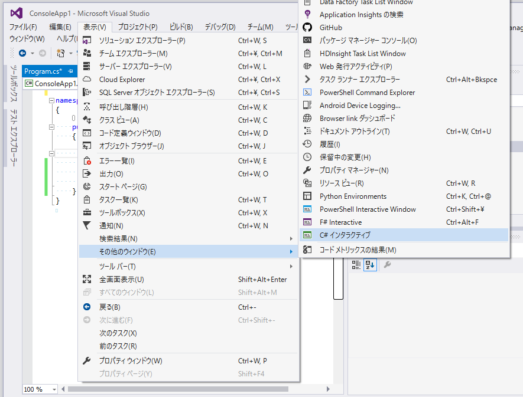
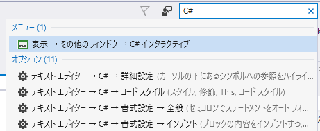
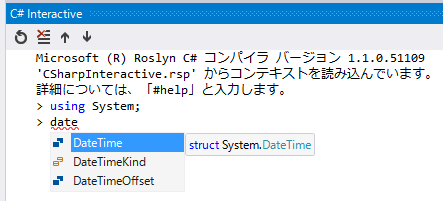
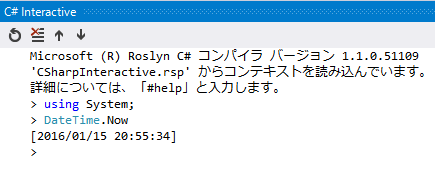
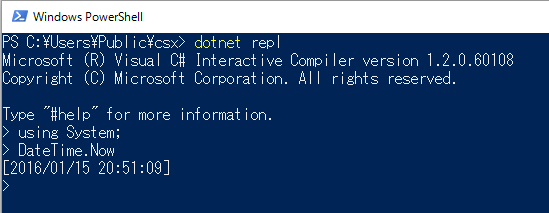
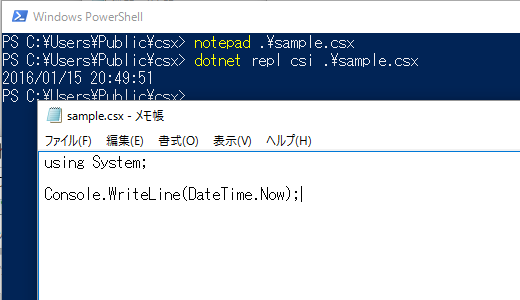

# C#スクリプト実行

##  概要

2015年末頃、ついにC#をスクリプト言語的に実行したり、インタラクティブに実行したりできるようになりました。すなわち、以下のようなことができるようになりました。

- アプリへの組み込み
  - アプリに組み込んで、そのアプリ用のマクロ言語としてC#を使う
  - アプリを実行したままC#スクリプトを読み直して、動的にアプリの挙動を変える
- REPL(Read Eval Print Loop)実行
  - 1行1行、都度(インタラクティブに)結果を見ながらC#を書く
- スクリプト実行
  - コマンド ライン ツールにC#スクリプト ファイルを渡して実行する
  - `class Program { static void Main() { } }`みたいなノイズなしに、1行目から式やステートメントを書ける

以下、これらを総称して「スクリプト実行」と呼びます。

通常の(コンパイルして使う)C#で書けるものは大体はスクリプト実行できます。また、スクリプト実行時にのみ許される構文や、スクリプト実行時特有の動作がいくつかあります。

##  いくつかの実行形態

概要で一覧を出したように、いくつかの方法でC#スクリプト実行できます。

###  アプリへの組み込み

[Microsoft.CodeAnalysis.CSharp.Scripting](https://www.nuget.org/packages/Microsoft.CodeAnalysis.CSharp.Scripting)ライブラリを参照することで、自作のアプリにC#スクリプトを組み込めます。
例えば、以下のようなコードが書けます。

サンプル コード: [https://github.com/ufcpp/UfcppSample/tree/master/Chapters/Scripting/src/Scripting](https://github.com/ufcpp/UfcppSample/tree/master/Chapters/Scripting/src/Scripting)

<pre class="source" title="C#スクリプト ライブラリの利用例">
<code><reserved>using Microsoft.CodeAnalysis.CSharp.Scripting;
using System;
using System.Threading.Tasks;

public class Program
{
    public static void Main(string[] args)
    {
        MainAsync().Wait();
    }

    private static async Task MainAsync()
    {
        var result = await CSharpScript.EvaluateAsync&lt;int&gt;(@"
var x = 1;
var y = 2;
x + y
");
        Console.WriteLine(result);
    }
}
</code></pre>

####  スクリプトとアプリとのやり取り

アプリに組み込む以上は、アプリに対する命令みたいなものをスクリプトに対して公開する必要があるわけですが、
それはこの`EvaluateAsync`などのメソッドの引数の`globals`に対してオブジェクトを渡すことで実現できます。

例えば、以下のようなクラスを用意します。

<pre class="source" title="globalsに渡す用のコマンド発行クラス">
<code><inactive>/// &lt;summary&gt;
/// コマンド発行クラス。
/// C# スクリプトのglobalsとして渡して、スクリプトからコマンドを発行するのに使う。
/// &lt;/summary&gt;
public class Commander
{
    // 中略

    public void walk(double distance) =&gt; _queue.Enqueue(Command.Walk(distance));
    public void turn(double angle) =&gt; _queue.Enqueue(Command.Turn(angle));
    public void speed(double speedDotPerSecond) =&gt; _queue.Enqueue(Command.Speed(speedDotPerSecond));
    public void clear() =&gt; _queue.Enqueue(Command.Clear());
}
</code></pre>

これを、`EvaluateAsync`や`RunAsync`などのスクリプトAPIの`globals`引数に渡すことで、
C#スクリプト側から、`walk`, `turn`, `speed`, `clear`などのメソッドを呼び出せるようになります。

<pre class="source" title="globalsへのオブジェクトの受け渡し">
<code>_state = await CSharpScript.RunAsync(s, globals: ViewModel.Commander);
</code></pre>

ちなみに、このコードは、C#スクリプトを使ってタートル グラフィックスをやってみるサンプル プログラムの一部です。
コード全体は、GitHubで公開しています。

サンプルコード: [https://github.com/ufcpp/UfcppSample/tree/master/Chapters/Scripting/TurtleGraphics](https://github.com/ufcpp/UfcppSample/tree/master/Chapters/Scripting/TurtleGraphics)

実際に動かしている様子は以下の通りです。

<iframe width="420" height="315" src="https://www.youtube.com/embed/uex74qGWLxE" frameborder="0" allowfullscreen></iframe>

###  C# インタラクティブ ウィンドウ

Visual Studio 2015 Update 1から、C#をREPL実行できる「C# インタラクティブ」というウィンドウが追加されました。

Visual Studioのメニューから下図のようにたどるか、
Visual Studio右上にある「クイック起動」欄に下図のように「C#」と打って検索することでウィンドウを開けます。

C#インタラクティブ ウィンドウ内では、下図のようにコード ハイライトやコード補完が効きます。

REPL(Read Eval Print Loop)なので、1行1行コードを読んで(read)、評価して(eval)、その結果を出力(print)することができます。

###  dotnetコマンド

[dotnetコマンド](../devenv/ab_devenv.md#dotnetcli)の1機能として、REPL実行やスクリプト実行ができます。

下図のように、`dotnet repl`というサブコマンドを使うことでREPLが起動します。

ちなみに、`dotnet repl`は、既定動作がC# REPLの起動というだけで、引数で他の.NET言語も選べます。
(といっても、2016年1月時点ではC#のみに対応。計画としてはVisual BasicとF#への対応も考えている模様。Visual Basicはその作業真っ最中。)

1行1行書けるコードは[C#インタラクティブ ウィンドウ](#interactive-window)と同じです。
ただ、C#インタラクティブ ウィンドウと違って、コード補完などは掛かりません。
Visual Studio 2015 Update 1以降を使えるのであれば、C#インタラクティブ ウィンドウを使う方が便利でしょう。
`dotnet`コマンドはクロスプラットフォームなコマンド ライン ツールなので、GUIのない環境でも使えるという利点はあります。

REPLで1行1行実行する他に、スクリプト ファイルを与えて実行するモードがあります。
下図のように、`dotnet repl`サブコマンドの引数にファイル名を指定します。

ちなみに第1引数はどの言語を使うかを指定します。(前述の通り2016年1月時点ではC#のみ。csiかcsharpを入力。)
そして、第2引数が実行したいC#スクリプトのファイル名です。

この例では、以下のようなC#スクリプトを与えています。

<pre class="source" title="C#スクリプトの例">
<code><reserved>using System;

Console.WriteLine(DateTime.Now);
</code></pre>

見てのとおり、通常の(コンパイルして使う)C#と違って、トップ レベルにステートメントを書いて実行できます。
`class Program`や`static void Main()`などのクラス/メソッドは必ずしも必要ありません。

##  スクリプト実行用の構文

通常の(コンパイルして使う)C#の機能はほぼ全て使えます。
例えば以下のように、通常のC#コードをそのままC#インタラクティブ ウィンドウに張り付けて実行できます。

<pre class="source" title="通常のC#コードをC#インタラクティブに貼り付け">
<code>&gt; using System;
. 
. public class Program
. {
.     public static void Main()
.     {
.         Console.WriteLine("Hello World!");
.     }
. }
. 
&gt; Program.Main()
Hello World!
</code></pre>

一方で、スクリプト実行でだけできる書き方がいくつかあります。

###  結果の出力

式を1つだけ書いて、`;`も入力せずに改行すると、その式の結果を出力します。
例えば、以下のようなコードでは、1行目は普通のC#と同じく代入ステートメント、2行目は`x * x`という式の計算結果の出力になります。

<pre class="source" title="式の計算結果の出力">
<code>&gt; var x = 10;
&gt; x * x
100
</code></pre>

一方で、例えば以下のような書き方はできません。
`;` を付けたことで通常のC#構文として解釈されますが、式 + `;` という構文はC#にはないのでエラーになります。

<pre class="source" title="式の後ろには ; は付けちゃダメ">
<code>&gt; x * x<em>;</em>
(1,1): error CS0201: Only assignment, call, increment, decrement, and new object expressions can be used as a statement
</code></pre>

###  トップ レベル

通常のC#では、トップ レベル(ソースコードの一番上)に書けるものがかなり限られています。

- [プリプロセス ディレクティブ](../misc/sp_preprocess.md)
- [using ディレクティブ](../structured/sp_namespace.md#using)
- [クラス](../oop/oo_class.md)
- [名前空間](../structured/sp_namespace.md#namespace)
- [アセンブリに対する属性](../dynamic/sp_attribute.md#target)

このうち、名前空間とアセンブリに対する属性は、スクリプト実行では使えません。

<pre class="source" title="スクリプト実行で使えない構文">
<code>&gt; namespace Sample { }
(1,1): error CS7021: スクリプト コードで名前空間を宣言することはできません
&gt; [assembly:System.Reflection.AssemblyTitle("test")]
(1,2): error CS7026: アセンブリ属性とモジュール属性は、このコンテキストでは許可されていません。
</code></pre>

一方、スクリプト実行時には、トップ レベルに以下のようなものが書けます。

- ステートメント
- 式(結果の値が出力される)
- クラスのメンバー(メソッド、プロパティなど)

例えば以下のようなコードが書けます。

<pre class="source" title="トップ レベルのステートメントやメンバーの例">
<code>&gt; var x = 10;
&gt; var y = 20;
&gt; int Product =&gt; x * y;
&gt; Product
200
&gt; x = 15;
&gt; y = 25;
&gt; Product
375
</code></pre>

トップ レベルで定義した変数は特殊なスコープを持ちます。
上記の例のように、トップ レベルに書いたメンバー内では参照(この例だと`Product`プロパティ内で、変数`x`, `y`を参照)できますが、
クラスを書くと、その中からは参照できません。

<pre class="source" title="">
<code>&gt; var x = 10;
&gt; int X =&gt; x; // これはOK
&gt; class C { int X =&gt; x; } // クラス内からは x を使えない
(1,20): error CS0120: 静的でないフィールド、メソッド、またはプロパティ 'x' で、オブジェクト参照が必要です
</code></pre>

ちなみに、トップ レベルに拡張メソッドも書けます。

<pre class="source" title="トップ レベルの拡張メソッド">
<code>&gt; static int Square(this int x) =&gt; x * x;
&gt; 10.Square()
100
</code></pre>

また、トップ レベルは、通常のC#でいうところの[非同期メソッド](../async/sp5_async.md)と同じ状態になっていて、常に`await`演算子が使えます。

<pre class="source" title="トップ レベルはawaitを使える">
<code>&gt; #r "System.Net.Http"
&gt; using System.Net.Http;
&gt; var c = new HttpClient();
&gt; var res = await c.GetAsync("http://ufcpp.net");
&gt; var content = await res.Content.ReadAsStringAsync();
&gt; content.Substring(0, 50)
"\r\n&lt;!DOCTYPE html&gt;\r\n&lt;html lang=\"ja\" xmlns=\"http://w"
</code></pre>

###  スクリプト用ディレクティブ

スクリプト実行時にだけ使えるものとして、[プリプロセス ディレクティブ](../misc/sp_preprocess.md)と同じ `#` から始まるいくつかのディレクティブがあります。

現状では以下のようなものがあります。

| ディレクティブ | 説明 |
| --- | --- |
| `#help` | ヘルプを表示します。 |
| `#cls`, `#clear` | ウィンドウ内のテキストをクリアします。 |
| `#reset` | コンテキスト(定義した変数やメンバーなど)をクリアします。 |
| `#r` | アセンブリを読み込みます。 |
| `#load` | スクリプト ファイルを読み込みます。 |

例えば、`a.csx`という名前で以下のようなファイルがあったとします。

<pre class="source" title="a.csx スクリプト ファイル">
<code><reserved>var x = 10;
</code></pre>

この状況下で、以下のようなスクリプトを実行できます。

<pre class="source" title="a.csxをloadするスクリプト">
<code>&gt; #load "a.csx"
&gt; x
10
</code></pre>

ディレクティブは、これからいくつか追加も予定されています。
`#help`と打つことでヘルプが表示されるので詳しくはそれを読んでみてください。
