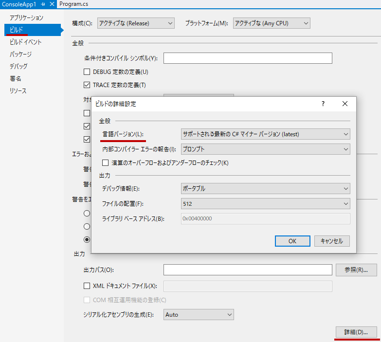

# 言語バージョンの指定

## <a id="sec-generated-title-1"></a> <a id="abstract">概要</a>

ここでは、C# の言語バージョンを明示的に指定する方法について説明します。

## <a id="sec-generated-title-2"></a> <a id="lang-and-compiler">SDK バージョンと言語バージョン</a>

最新の C# の機能を使うためには、コンパイラー自体も最新のものを使う必要があります。
コンパイラーは [.NET SDK](https://dotnet.microsoft.com/) に付属しているので、
最新バージョンの .NET SDK をインストールすると、C# コンパイラーも最新のものになります。
なので、最新の .NET SDK を使えば、C# も最新のものが使えます。

一方で、その逆は話が違って、新しいコンパイラーでもC# の「言語バージョン」をオプション指定することで、古い C# のまま維持することができます

例えば、以下のようなコード([.NET 10 以降でだけ実行できます](file-based-app.md))を書いたとします。

```csharp
#:property LangVersion=11.0

// C# 12 からの機能なので、C# 11 ではエラーになる。
int[] array = [1, 2, 3];
```

.NET 10 だと C# の規定のバージョンは 14 になりますが、
`LangVersion` というものを明示しているので、このコードは C# 11 扱いでコンパイルされます。
このコードはあえて C# 12 の機能を使っているので、当然、エラーになります。

```console
D:\src\app1> dotnet .\app1.cs
D:\src\app1\app1.cs(4,15): error CS9058: 機能 'コレクション式' は C# 11.0 では使用できません。12.0 以上の言語バージョンをお使いください。

ビルドに失敗しました。ビルド エラーを修正して、もう一度実行してください。
```

特に指定がない場合、基本的には「ターゲット フレームワークで指定した .NET と同世代のバージョン」になります
([ターゲット フレームワーク](#targetframework)については後述)。
例えば、 .NET 9 を使うと C# 13 になりますし、 .NET 10 を使うと C# 14 になります。

基本的に C# は破壊的変更を好まない言語<sup>※</sup>なので、古いバージョンを維持するメリットはあまりありません。
ただ、「チーム内で .NET 10 SDK を入れた人と、9 のままの人がいる」みたいな状況では、
言語バージョンを明記しておかないと「ある人は C# 14 が使えて、他のある人は 13 のまま」みたいなことになります。
そのため、チーム内で C# のバージョンをそろえるといった意図で、バージョン明示をすることがあります。

<sup>※</sup> かつての C# は破壊的変更をほとんどしませんでしたし、
基準が緩くなった今でも悪影響よりもメリットが大幅に上回る場合にのみ破壊的変更を認めています。

### <a id="sec-generated-title-3"></a> <a id="targetframework">ターゲット フレームワーク</a>

C# は .NET 上で動く言語です。
C# で書いたプログラムを動かす環境には .NET Runtime をインストールする必要があります。

どのバージョンの .NET Runtime を対象にプログラムを動かすかを指定するのがターゲット フレームワーク(target framework) で、
プロジェクト設定上 `TargetFramework` という項目で指定します。
例えば、`TargetFramework` に `net8.0` を指定すると、.NET 8.0 以降の Runtime で動くプログラムになります。

逆は真ではなく、新機能を使ったプログラムは古い .NET Runtime では動かなくなります。
[互換ライブラリみたいなもの](https://www.nuget.org/packages/Polyfill/)を導入することで過去の .NET Runtime で新機能を動かせる場合もありますが、
[公式](https://github.com/dotnet/runtime)がサポートするものではなく、
あくまで自己責任での導入になります(動かないことに文句を言われても公式は困る)。

また、一部の機能は .NET Runtime の特別なサポートが必要で、
古い環境ではどうやっても動かせないものもあります。
例えば以下のようなものがあります。

- [ジェネリクス](../oop/sp2_generics.md) は .NET Framework 2.0 (2005年リリース)以降が必須
- [インターフェイスのデフォルト実装](../oop/oo_interface.md#dim) は .NET Core 3.0 (2019年リリース)以降が必須

そもそも言語機能に限らず、標準ライブラリとして何が使えるかによってプログラムの書き方は全然変わってきますし、
「どの .NET で動かしたいか」の指定は欠かせません。
これをターゲット フレームワーク(target framework)と言います。

ターゲットフレームワークにはモニカー(moniker: あだ名)と呼ばれる短縮名みたいなものが振られていて、
例えば以下のように書きます。

| .NET のバージョン | モニカー |
| --- | --- |
| .NET Framework 4.8 | `net48` |
| .NET Core 3.0 | `netcoreapp3.0` |
| .NET 9.0 | `net9.0` |

補足: 
.NET Framework は当初 Windows のみで動いた初期の .NET 実行環境です。
.NET Core はマルチプラットフォームで動くように作り直したもので、
バージョン番号を振りなおしたので「.NET Framework 4.8 よりも .NET Core 3.0 の方が新しい」みたいなことになっています。
.NET は単に名称の変更で中身としては .NET Core の系譜で、バージョン番号は .NET Framework 4.8 よりも .NET Core 3.0 よりも新しく見えるよう、5 から開始しています。
負の遺産として、「`net10` は .NET Framework 1.0 を指して、`net10.0` は .NET 10 を指す」みたいなことになっているので注意が必要です。

詳しくは公式ドキュメントである以下のページを参照してください。

- [ターゲット フレームワーク](https://docs.microsoft.com/ja-jp/dotnet/standard/frameworks?WT.mc_id=AI-MVP-123445)

## <a id="sec-generated-title-4"></a> <a id="langversion"></a><a id="option">言語バージョンの指定方法</a>

C# コンパイラーのオプションで、言語バージョンを明示的に指定することができます。
言語バージョンは、Visual Studio 上で行う場合、プロジェクトのプロパティを開いて、以下の場所から設定できます。
(※ ちょっと古いバージョンのスクショになります。最新バージョンでもプロジェクトのプロパティで設定できますが、UI は変わっています。)



プロジェクト ファイル(拡張子が `csproj` のファイル)を直接書き換える場合、`PropertyGroup`の下に`LangVersion`タグを書きます(タグ内に書けるオプションの種類は後述します)。

```xml
<Project Sdk="Microsoft.NET.Sdk">

  <PropertyGroup>
    <OutputType>Exe</OutputType>
    <TargetFrameworks>netcoreapp2.2</TargetFrameworks>
    <LangVersion>11</LangVersion>
  </PropertyGroup>

</Project>
```

.NET 10 以降であれば[ファイル ベース実行](file-based-app.md)という機能を使って C# ファイル中で直接 `LangVersion` 指定することもできます。

```csharp
#:property LangVersion=11.0

Console.WriteLine("C# 11");
```

古くは(.NET Framework の時代では)、`csc` というコマンド名で C# コンパイラーを直接呼び出していました。
この `csc` を直接使う場合には、`-langversion`オプションを指定します
(書けるオプションは上記の `LangVersion` タグと同じ)。

```shell
csc -langversion:11 app1.cs
```

`LangVersion` には以下の2通りのオプション指定ができます。

- `7.0` など、バージョン番号を直接指定
- `preview` など、後述するいくつかの文字列

前者の番号指定では、メジャー バージョンであれば `7` などというように、小数点以下は省略可能です。
(※ マイナー バージョンがあったのは 7 世代の 7.1, 7.2, 7.3 だけでそれ以降はないので、
実質的には整数値で 8, 9, 10, ... などと書くだけで充分です。)

後者は、`preview`、`latest`、`latestMajor`、`default` の4種類があります(大文字・小文字は区別しません)が、
今となっては `preview` 以外の利用はあまり推奨しません。
バージョン番号を明示するか、何も指定しないかのどちらかがおすすめです。

### <a id="sec-generated-title-5"></a> <a id="new-options"></a><a id="default">何も指定しないときの挙動</a>

`LangVersion` を指定しない場合、基本的には「`TargetFramework` に応じて自動選択」になります。
.NET 9 (`net9.0`)なら C# 13、 .NET 10 (`net10.0`)なら C# 14 というように、
同世代の言語バージョンが選ばれます。

公式にサポートされているのはこの「同世代の組み合わせ」なので、
特に理由がない限りには「何も指定しない」をお勧めします。

最近では、「`TargetFramework` と C# 言語バージョンをそろえてアップデートした場合だけ破壊的変更の影響を避けれる」みたいなことを認める方針が取られたりしています。
以下のブログのように、「C# 14 では結構大きな破壊的変更があるものの、同時に .NET 10 にした場合だけエラーにならない」みたいなことがあります。

* [C# 14 の破壊的変更点(First-class Span)](../../../blog/2025/10/first-class-span-breaking-change/index.md)


### <a id="sec-generated-title-6"></a> <a id="explict"></a><a id="explicit">バージョン番号の明示</a>

ある程度分かっている人向けですが、C# の言語バージョンを明示することができます。
主に以下のような場面で使います。

* プログラムを動かす環境には手を入れづらく `TargetFramework` は変えられないが、開発環境は自由にできるので .NET SDK は最新にでき、C# も新しい言語バージョンが使える
* `TargetFramework` を複数指定しているが、それぞれ異なる言語バージョンが選ばれるのは困る

(後述しますが、`latest` よりもバージョン明示の方をお勧めします。)

例えば以下のようなコードをライブラリ配布することを考えます。

```csharp
public class Class1
{
    private static string _rawData = "example data some words with space separation";

    // field キーワードを使いたいから C# 14 にしたい。
    public IEnumerable<KeyValuePair<int, int>> Counts => field ??= GetCounts(_rawData.Split(' '));

    private static IEnumerable<KeyValuePair<int, int>> GetCounts(IEnumerable<string> items)
    {
#if NET9_0_OR_GREATER
        // .NET 9 以降ならこれが速い。
        return items.CountBy(x => x.Length);
#else
        // .NET 8 以前でも動くようにしたいから残すけど、
        // このコードだと長いしだいぶ遅い。
        return items.GroupBy(x => x.Length).Select(g => KeyValuePair.Create(g.Key, g.Count()));
#endif
    }
}
```

このコードには以下のような意図があります。

* 極力多くの人に使ってもらいたいので、極力古い .NET をターゲットにしたい(最低ラインを .NET 5 にする)
* でも、新しい .NET で使う場合には高速になるように最新機能を使いたい(.NET 9 からの新機能を使えるなら使いたい)
* ターゲットによらす、C# の機能は新しいものを使いたい(C# は 14 にしたい)

この意図通りのプロジェクトを書くと以下のようになります。

```xml
<Project Sdk="Microsoft.NET.Sdk">

  <PropertyGroup>
    <TargetFrameworks>net9.0;net5.0</TargetFrameworks>
    <LangVersion>14</LangVersion>
    <ImplicitUsings>enable</ImplicitUsings>
    <Nullable>enable</Nullable>
  </PropertyGroup>

</Project>
```

この時 `LangVersion` を書かないと、
「.NET 5 向けには C# 9、.NET 9 向けには C# 13 でコンパイル」みたいなことになります。
この状態だと、「うっかり C# 13 で書ける気になって書いちゃうけど、実際は C# 9 でないとコンパイルできない」とか、
「C# 9 のときと 13 以降で解釈の違うコードを書いてしまうとどうやってもコンパイルできない」とか、
いろいろな問題を起こす可能性があります。

### <a id="sec-generated-title-7"></a> <a id="preview">プレビュー機能の利用</a>

`LangVersion` に `preview` を指定すると、正式リリース前の C# の最新機能を先行して試すことができます。

2020年(.NET 5, C# 9 の世代)から、.NET は年に1回(毎年11月に)正式リリース版を出しています。
それとは別に、月に1回程度の頻度でプレビュー版を出していて、
C# の最新機能も少しずつ実装されています。
この最新機能を先行して試したい場合に `LangVersion` `preview` を指定します。

後述する `latest` と同じく、使っている .NET SDK のバージョン依存です。
(`TargetFramework` が実行環境(どこでプログラムを動かすか)依存なのに対して、これは開発環境依存です。)
.NET 9 SDK Preview なら C# 13 (に入る予定の当時の新機能)でしたし、
.NET 10 SDK Preview なら C# 14 (予定)でした。

開発環境依存なのは `latest` と同じく問題を起こしえるんですが、
そもそも `preview` で最新の C# 言語機能を試そうという人は「相当詳しい人」のはずなので特に問題視はされません。

### <a id="sec-generated-title-8"></a> <a id="other">その他のバージョン指定</a>

`latest`、`latestMajor`、`default` の3つはおおむね「過去の名残」です。
これから新規プロジェクトを作る場合、あまり利用はお勧めしません。

`latest` は .NET SDK バージョン依存で最新の C# 言語バージョンになります。
.NET SDK バージョン依存 = 開発環境依存なので、例えば以下のような状況で問題を起こします。

* チーム開発していて、うっかり1人だけ .NET SDK のバージョンを上げてしまった
  * 自動的にその1人だけ C# の言語バージョンが変わる
* CI 環境を更新せず、手元の開発環境だけを更新してしまった
  * 手元ではコンパイルできているのに、GitHub などに Push するとチェックが通らない

こういう問題を避けるため、[バージョン未指定](#default)にできない場合でも極力、
[バージョン番号の明示](#explict)にした方が安全です。

`latestMajor` は `latest` に似ているんですが、メジャー バージョンしか選ばれないというものです。
C# 7.1, 7.2, 7.3 時代の遺物で、
この時代は `latest` だと 7.1～7.3、`latestMajor` だと 7.0 になっていました。
当時は .NET Framework から .NET Core への移行期間で、
7.1 や 7. 2 のサポートが間に合っていなかったという開発体制の都合です。
C# 8 以降、マイナー バージョンアップなリリースはないので、今となっては実質 `latest` と差がありません。

`default` は意味通りにとらえるなら「未指定時と同じ」になるはずなんですが、以下のような事情で少し複雑です。

* プロジェクト(csproj ファイル)中
  * 未指定は[前述のとおり](#default) `TargetFramework` に応じた自動選択
  * `<LangVersion>default</LangVersion>` は後述のコンパイラー オプションの `-langversion:default` と同じ意味
      * 結果、`-langversion:latest` と同じ意味
* C# コンパイラーのオプション
  * 未指定 = `-langversion:default` = `-langversion:latest`
  * 開発環境依存の「最新」
  * (ただし、C# 7.1～C# 7.3 の時代に限り、`-langversion:default` = `-langversion:latestMajor`)

C# コンパイラー自体にはプロジェクト ファイル(csproj)を解釈する機能がなく、
`TargetFramework` がわからないのでこういうことになっています。
とりあえず `default` は使わない方が無難でしょう。

(ちなみに、プロジェクト中で1度設定されてしまった `LangVersion` も再度 `<LangVersion>` タグを書くことで上書きできますが、
[バージョン未指定](#default)挙動にしたい場合は `<LangVersion></LangVersion>` というように空タグを書きます。
`<LangVersion>default</LangVersion>` と書いてしまうとここで説明したように `latest` 挙動になります。)
