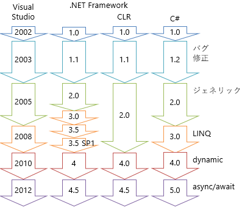

# バージョン

## 概要
<figure>
	
	<figcaption>C#、.NET Framework、Visual Studio のバージョン</figcaption>
</figure>

## C
C\# のバージョンアップに関しては、以下の各ページを参照してください。

<ul>
<li><a href="ap_ver2.md">C# 2.0 の機能</a></li>
<li><a href="ap_ver3.md">C# 3.0 の機能</a></li>
<li><a href="ap_ver4.md">C# 4.0 の機能</a></li>
<li><a href="ap_ver5.md">C# 5.0 の機能</a></li>
<li><a href="ap_ver6.md">C# 6 の機能</a></li>
<li><a href="ap_ver7.md">C# 7 の機能</a></li>
</ul>

正確には C# 1.2 というバージョンもあるんですが、
この C# 1.2 は、「[ドキュメンテーションコメント](../misc/sp_xmldoc.md#doccomment)」に <code>/\** \*/</code> 形式が追加されただけのものです。
ドキュメンテーション コメントはプログラムの実行に関係ない機能ですし、
<code>/\** \*/</code> 形式はそもそも余り使われませんし、
C# 1.2 は標準化も行われていない（標準規格的には 1st Edition の時点で <code>/\** \*/</code> 形式コメントを含んでいる）ので、
存在感がない（1.0 とまとめられることが多い）バージョンです。

ちなみに、Visual Basic も 7.0 （いわゆる .NET 版 VB、VB.NET になってから）以降は C# とほぼ同じ機能追加がされています。
（C# 2.0 ≒ VB 8.0、 C# 3.0 ≒ VB 9.0、…）

## .NET Framework
.NET Framework は頻繁にバージョンアップしているように見えますが、実際のところほとんどはライブラリの追加のみです。

### 実行環境
実行環境としての .NET Framework （図1中の CLR の列）に関して、大きな修正（命令の追加）があったのは 2.0 の時だけです。

* 1.1 … バグ修正のみ

* 2.0 … ジェネリック関連の命令追加

* 4.0 … 性能改善（主にガベージコレクションの）

* 4.5 … 性能改善と、WinRT への対応

* 5 … .NET Native や Cloud Mode など JIT 以外の配布方式、NuGet パッケージ マネージャーによる標準ライブラリ個別配布への対応

2.0 のジェネリック関連の命令追加は、
Java （の JVM/バイトコード）と違って、実行環境レベルでジェネリックに対応したということです。
その結果、.NET Framework のジェネリック型は、型引数の情報をリフレクションで取得できたり、
JIT コンパイル結果の最適化が効いたりします
（利便性や性能上、非常に優秀）。

ちなみに、C# では 4.0 からジェネリックの反変性・共変性（in/out）に対応しましたが、
.NET Framework 上は、2.0 の時点からこの機能用のフラグを持っています（なので、.NET 4 での仕様的な修正はない）。

4.0 や 4.5 での修正は、仕様上の変更はほとんどありません（4.5 で、WinRT 対応のために型情報のフラグが1つ増えただけ）。
あくまで内部的な挙動の改善です。
ただし、世の中には性能を改善しただけで顕在化するようなバグを含んだコードも存在するため、別バージョンとして扱われます。

5 でも、「今までのコードほぼそのままで、ネイティブ配布やソースコード配布にも対応します」というもので、C# 開発者が使える機能としては変わっていません。

### ライブラリ
ということで、.NET Framework 2.0 以降のバージョンアップはほとんどライブラリの追加のみといえます。

* 1.1 … バグ修正のみ

* 2.0 … ジェネリックなコレクション追加

* 3.0 … WPF、WCF、WF 等追加

* 3.5 … LINQ 関連のライブラリ、ASP.NET AJAX 追加

* 3.5 SP1 … ADO.NET Entity Framework 等追加

* 4 … dynamic 関連、並列処理関連の追加

* 4.5 … async/await 関連の追加

3.0 近辺のバージョンアップだけが細かいのは、標準ライブラリの提供形態の変化のためです。
3.0 の頃（2005 ～ 2008年）は、新機能をできるだけ早く提供してほしいという要望に応えるべく頑張っていましたが、
あくまで .NET Framework 自体のバージョンアップと合わせての大型アップデート提供だけでした。

一方、4 （2010 年頃）以降は、[NuGet](http://nuget.org/) パッケージ マネージャーなどの整備ができたこともあり、
.NET Framework 本体とは別に（本体のアップデートタイミングと揃えず）ライブラリ提供するようになりました。
結果として、.NET Framework 4 や 4.5 （特に 4.5 の方）では、それぞれ C# 4.0、5.0 の機能の実現に必要なものが一番のアップデート内容になっています。

5 では、NuGet パッケージ マネージャーによる配布が本格化していて、「.NET 5ならこの機能」というようなライブラリはもはや明確でなくなっています。
