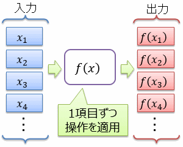
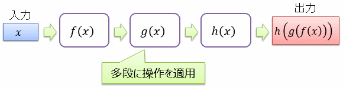
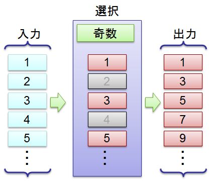
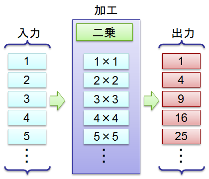
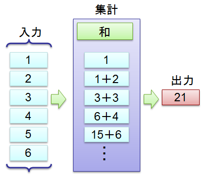
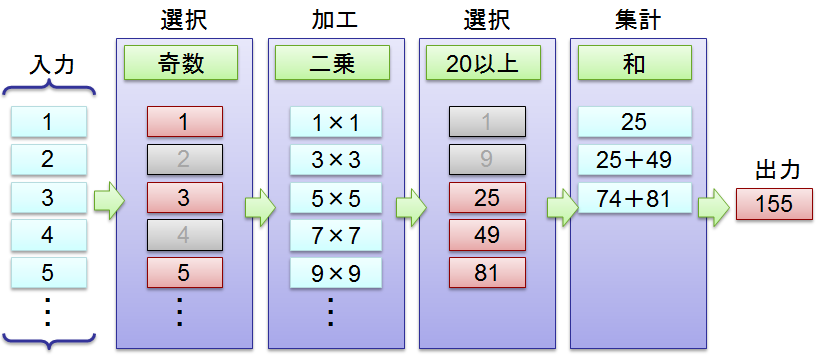

# データ処理

## <a id="sec-generated-title-1"></a> <a id="abstract"></a>概要

アプリケーション開発において、データの分析や集計などの処理は非常に重要な位置を占めます。
例として小売業を挙げると、日々蓄積された売上データを分析して、以下のような知識を得ることができます。

* あまり売れていない商品を洗い出して、在庫を抱えないようにする

* 同時に売れやすい商品を見つけて、近い場所に陳列する

* 過去の売上傾向から将来の予測を立て、過不足なく商品を入荷する


C# 3.0 の新機能の多くは、一言でいってしまえば、この手の「データ処理」のための機能です。


##### <a id="sec-generated-title-2"></a>ポイント

* データ処理の多くはストリーム的でパイプライン的。

* LINQ もその類のデータ処理。


## <a id="sec-generated-title-3"></a> <a id="stream"></a>ストリームとパイプライン

データ処理の多くは、「データ・ストリームに対するパイプライン処理」と捉えることができます。
ここで、ストリームやパイプラインという言葉は以下のような意味合いです。


##### <a id="sec-generated-title-4"></a>ストリーム

データは、前から順に、1項目ずつ処理されていきます。
RDB のテーブルなどに格納されたデータを一気に全部読み出す必要はありません。
このような処理の仕方をストリーム（stream： 流れ、小川）処理と呼びます。

<figure>

[](../../../../assets/media/ufcpp2000/csharp/fig/DataStream.png)

<figcaption>ストリーム処理</figcaption>
</figure>


後述する、「選択」や「射影」（前述の where や select）など、多くの処理はストリーム処理になっています。
ただし、データの整列（order by）など、どうしても一度すべてのデータを読み出してからでないと行えない処理も存在します。

ここでは、ストリーム的に処理できるデータ列を「データ ストリーム」と呼びましょう。


##### <a id="sec-generated-title-5"></a>パイプライン

データストリームの処理結果は、やはりデータストリームになります。
例えば、あるデータストリームに対して「特定の条件を満たす要素だけ残す」という処理をかけたものはやはりデータストリームとして扱えます。

そこで、データストリームに対してパイプライン的に（多段に）処理を掛けていくということも可能になります。
例えば、元データ → [条件選択] → [データの加工] → 出力データ というような感じです。
データストリームに対する処理なので、1段目の条件選択が全要素に対して終わる前に、平行して2段目のデータ加工を進めていくことができます。

<figure>

[](../../../../assets/media/ufcpp2000/csharp/fig/DataPipeline.png)

<figcaption>パイプライン処理</figcaption>
</figure>


## <a id="sec-generated-title-6"></a> <a id="basic_sample"></a>データに対する基本的な操作

基本的な操作としては、以下のようなものがあります。

* 選択（selection）

* 投影（projection）

* グループ化（grouping）

* 集計（aggregation）


リレーショナル データベースはもちろん、
Apache Hadoop や Google MapReduce などの大規模分散データ処理フレームワークでも、
これらの操作を基本としてデータ処理を行っています。


##### <a id="sec-generated-title-7"></a>選択（selection）

SQL でいうなら where、map-reduce でいうなら map の一部分です。
条件を指定して、一部の要素だけを選択します。

<figure>

[](../../../../assets/media/ufcpp2000/csharp/fig/mapreduce1.png)

<figcaption>データの選択処理</figcaption>
</figure>


この例は C# で書くなら <code>inputs.Where(x =&gt; (x % 2) == 1);</code> になります。

LINQ では、以下のような種類があります。

* Where: 条件を満たす要素を選択。

* Take、TakeWhile： 前から N 個とか、条件を満たす最初の要素までとかを選択。

* Skip、SkipWhile： Take とは逆で、前から N 個とか、条件を満たす最初の要素までを飛ばして、その後ろを選択。


##### <a id="sec-generated-title-8"></a>射影（projection）

「要素 x から x の二乗を求める」とか「オブジェクト x のうち、x.Value プロパティと x.Name プロパティだけを取り出す」とかの、
要素の加工を射影と呼びます。
SQL でいうなら select に相当します。

選択と射影を併せたものが map-reduce でいうところの map になります。
科学計算の分野で写（map）や斜（morphism）と呼ばれる概念と同じ考え方です。

<figure>

[](../../../../assets/media/ufcpp2000/csharp/fig/mapreduce2.png)

<figcaption>データの加工</figcaption>
</figure>


この例は C# で書くなら <code>inputs.Select(x =&gt; x * x);</code> となります。


##### <a id="sec-generated-title-9"></a>集計（aggregation）

選択・加工したデータは、そのまま一覧で見る場合もありますが、
集計して合計や平均などを求める場合も多いです。

map-reduce でいうところの reduce に当たります。科学計算分野ではこの手の処理を縮約（reduction）と呼んだりします。

<figure>

[](../../../../assets/media/ufcpp2000/csharp/fig/mapreduce3.png)

<figcaption>データの集計</figcaption>
</figure>


上の例は C# で書くなら <code>inputs.Sum();</code>、
Aggregate で明示的に書くなら、<code>inputs.Aggregate((x, y) =&gt; x + y);</code> となります。

LINQ では、以下のような種類があります。

* Aggregate： 任意の関数を与えて集計します。記述が面倒になりますが、最も汎用的です。

* Count、LongCount、Sum、Min、Max、Average： 個数、総和、最小値、最大値、平均値などを求めます。

* First、FirstOrDefault、Last、LastOrDefault、Single、SingleOrDefault、ElementAt、ElementAtOrDefault、DefaultIfEmpty： 「最初の要素」や「最後の要素」など、データストリームの中から特定の1要素を取り出します。


##### <a id="sec-generated-title-10"></a>パイプライン処理の例

前述のとおり、データストリームに対する処理はパインプライン的につなぐことができます。
例えば、上記の例を3つ繋いでみましょう（＋ もう1条件追加）。

<figure>

[](../../../../assets/media/ufcpp2000/csharp/fig/mapreduce4.png)

<figcaption>パイプライン</figcaption>
</figure>


C# で書くと、
<code>
                inputs.Where(x =&gt; (x % 2) == 1).Select(x =&gt; x * x).Where(x =&gt; x &gt; 20).Aggregate((x, y) =&gt; x + y);
            </code>
となります。


## <a id="sec-generated-title-11"></a> <a id="cs_data"></a>C# でデータ処理を書く上でのポイント

C# 2.0 で追加された「[イテレーター](sp2_iterator.md#iterator)」や C# 3.0 の「[LINQ](sp3_linq.md#linq)」は、
データ列をストリーム的・パイプライン的に処理するための機能です。
（もちろん、これらの機能がなくても、頑張ればストリーム的・パイプライン的に処理を書けますが、結構大変です。）

C# 3.0 以降でデータ処理を書く際には、以下の2点を意識しましょう。

* 1要素ずつ処理する

* 処理の順序通りに書く


### <a id="sec-generated-title-12"></a> <a id="onebyone"></a>1要素ずつ処理する

List や配列を作るのではなく、
IEnumerable インターフェイスとイテレーターブロック（「[イテレーター ブロック](sp2_iterator.md#block)」参照）を使いましょう。

例えば、C# 2.0 までで書きがちだった（IEnumrable の実装が面倒だったため）のは以下のようなコードです。
（データ列に対して、全ての要素を二乗したデータ列を作る。）

```csharp
static List<int> Square(int[] source)
{
    var results = new List<int>();

    foreach (var x in source)
    {
        results.Add(x * x);
    }
    return results;
}
```


C# 3.0 以降では以下のように書きます。

```csharp
static IEnumerable<int> Square(IEnumerable<int> source)
{
    foreach (var x in source)
    {
        yield return x * x;
    }
}
```


前者のコードでは、データ列中のすべての要素を一気に読み出して、同じサイズの List を作ってしまっています。
一方で、後者のイテレーターブロックで書いたものは、必要な分だけ読み出して、必要な分だけ加工して返します。
（この辺りの挙動、詳しくは「[[雑記] LINQ と遅延評価](sp3_lazylist.md)」を参照してください。）

もちろん、実際にはさらに、<code>x * x</code> の部分を外に出してしまって、以下のように書きます。

```csharp
static IEnumerable<int> Select(IEnumerable<int> source, Func<int, int> filter)
{
    foreach (var x in source)
    {
        yield return filter(x);
    }
}
```


### <a id="sec-generated-title-13"></a> <a id="ordered"></a>処理の順序通りに書く

A → B → C という順でデータ処理を掛けたいなら、<code>C(B(A(data)));</code> ではなく、
<code>data.A().B().C();</code> と書ける方が自然です。
C# 3.0 以降では、「[拡張メソッド](../functional/sp3_extension.md#exmethod)」を使うことで、この順で処理を書くことができます。

例えば、前節（「[データに対する基本的な操作](#basic_sample)」）の最後の例を、
拡張メソッドを使わずに書くと、以下のようになります。

```csharp
Enumerable.Aggregate(
    Enumerable.Where(
        Enumerable.Select(
            Enumerable.Where(
                data,
                x => (x % 2) == 1
            ),
            x => x * x
        ),
        x => x > 20
    ),
    (x, y) => x + y
);
```


Enumerable と書かなきゃいけなくなった分うっとおしいというのもありますが、そこはまだ許容するとして、
むしろ問題は、述語（Aggregate や Select などの動詞（メソッド））と補語（<code>(x, y) =&gt; x + y</code> など）の位置が離れてしまっていることでしょう。
上記のコードでは、述語と補語のペアを同じ色で塗り分けしていますが、
階層が深くなるほど述語と補語の距離が離れて行っています。

一方で、拡張メソッドを使えば、以下のように書き換えることができます。

```csharp
data.Where(x => (x % 2) == 1)
    .Select(x => x * x)
    .Where(x => x > 20)
    .Aggregate((x, y) => x + y);
```


前から順に、データストリームをパイプライン的に処理している感が出ていると思います。
述語と補語のペアも、常に近い位置にかけて、対応関係を見失うこともありません。


## <a id="sec-generated-title-14"></a> <a id="sample"></a>少し変わった例

* 
[サンプルコード](../../../../assets/media/ufcpp2000/csharp/source/ContinuousSequence.zip)
（プロジェクト一式、ZIP 圧縮）


某掲示板で出ていた例ですが、以下のような処理を考えてみましょう。

* 元データ
    * 例： { 1, 2, 2, 2, 3, 3, 5, 7, 7, 10, 10, 11, 100, 101, 102, 103 }


* 連続して同じ値になっている部分を取り除く
    * { 1, 2, 3, 5, 7, 10, 11, 100, 101, 102, 103 }


* 連番になっている部分をグループ化：
    * { { 1, 2, 3 }, { 5 }, { 7 }, { 10, 11 }, { 100, 101, 102, 103 } }


* グループの先頭と個数のみに変換：
    * { { First = 1, Count = 3 }, { First = 5, Count = 1 }, { First = 7, Count = 1 }, { First = 10, Count = 2 }, { First = 100, Count = 4 } }


C# なら、「[イテレーター](sp2_iterator.md#iterator)」を使って以下のような感じで書いていきます。

まず始めに、連続した同じ値を1つにまとめる処理：

```csharp
/// <summary>
/// 隣り合ってる同じ値を1つにまとめてしまう。
/// </summary>
/// <typeparam name="T">要素の型</typeparam>
/// <param name="seq">元データ列。</param>
/// <returns>隣り合った重複を削除したデータ列。</returns>
public static IEnumerable<T> DistinctAdjacently<T>(this IEnumerable<T> seq)
    where T : struct
{
    T? prev = null;

    foreach (var x in seq)
    {
        if (prev == null || !prev.Equals(x))
        {
            yield return x;
        }

        prev = x;
    }
}
```


次に、連番になっている部分をグループ化する処理は、2段階に分けて考えましょう。
まずは、階差を求めます。

```csharp
/// <summary>
/// 整数列の階差を作る。
/// </summary>
/// <param name="seq">整数列。</param>
/// <returns>値/階差のペアのデータ列。</returns>
public static IEnumerable<ValueDifferencePair> Differences(this IEnumerable<int> seq)
{
    int prev = seq.First();
    int diff;

    foreach (var x in seq.Skip(1))
    {
        diff = x - prev;

        yield return new ValueDifferencePair(prev, diff);

        prev = x;
    }

    yield return new ValueDifferencePair(prev, 0);
}
```


そして、「特定の条件を満たす場所でデータ列を切る」という処理を考えます。

```csharp
/// <summary>
/// 特定の条件を満たすところでデータ列を分割する。
/// （条件を満たした箇所がサブ データ列の末尾になる。）
/// 
/// 例えば、{ 1, 1, 0, 1, 0, 1 } というデータ列を渡して、
/// 「要素が 0」という条件で分割すると、結果は
/// { { 1, 1, 0 }, { 1, 0 }, { 1 } }
/// となる。
/// </summary>
/// <typeparam name="T">要素の型</typeparam>
/// <param name="seq">元データ列。</param>
/// <param name="splitCondition">分割条件。</param>
/// <returns>分割したサブ データ列群。</returns>
public static IEnumerable<IEnumerable<T>> Split<T>(this IEnumerable<T> seq, Predicate<T> splitCondition)
{
    var sub = new List<T>();

    foreach (var x in seq)
    {
        sub.Add(x);

        if (splitCondition(x))
        {
            yield return sub;
            sub = new List<T>();
        }
    }

    if (sub.Count != 0)
    {
        yield return sub;
    }
}
```


目的の連番のグループ化は、要するに、「階差が1でない場所で切る」ということになります。
（<code>data.Differences().Split(x =&gt; x.Difference != 1)</code> で求まる。）

これらを繋いで、結局、所望の処理は、以下のようになります。（まさに、データストリームに対するパイプライン処理になっています。）

```csharp
/// <summary>
/// 整数列から、連番になっている部分を、{ 初項, 項数 } のペアで抜き出す。
/// </summary>
/// <param name="seq">元整数列。</param>
/// <returns>{ 初項, 項数 } のペアのデータ列。</returns>
public static IEnumerable<ContinuousSequence> GetContinuousSequence(this IEnumerable<int> seq)
{
    return seq
        .DistinctAdjacently()
        .Differences()
        .Split(x => x.Difference != 1)
        .Select(x => new ContinuousSequence(x.First().Value, x.Count()));
}
```


英語なせいでよく分からないかもしれませんが、
じゃあ、日本語になっていたらどうでしょうか。
（C# では、変数名やメソッド名に日本語を利用できます。）

```csharp
seq.連続した同じ値を1つにまとめる()
   .階差を求める()
   .分割(x => x.Difference != 1)
   .加工(x => new 連番(x.初項(), x.項数()));
```


割かし、意図の伝わるソースコードになっているんじゃないでしょうか。


## <a id="sec-generated-title-15"></a> <a id="order"></a>補足1： データの順序

順序に関して、2点ほど留意点があります。


##### <a id="sec-generated-title-16"></a>データストリームの順序

データストリームとして流れてくるデータの順序に意味があるかどうかによって、並列化のしやすさが変わります。

一般に、並列処理を行うと出力として得られるデータの順序が変わってしまいます。
なので、順序に意味がある場合には並列化しづらくなります。
（順序を記憶しておいて、並列処理後に整列しなおすとかの処理が必要。）


##### <a id="sec-generated-title-17"></a>集計関数の性質

Aggregate で集計を掛ける場合、集計関数（Aggregate の引数として渡す関数）が満たす条件によって並列化のしやすさが変わります。

* 結合的かつ可換：
    * 結合的：<code>f(f(x, y), z) == f(x, f(y, z))</code>

    * 可換：<code>f(x, y) == f(y, x)</code>

    * 集計以前の処理がどんな順序で終わろうと関係ないので並列がが非常に簡単。

    * 実数の和とか積なら（精度や誤差の問題を除けば）結合的かつ可換。


* 可換ではないけど結合法則は満たす：
    * 結合的：<code>f(f(x, y), z) == f(x, f(y, z))</code>←こちらだけ満たす。

    * 順序を保ったいくつかの部分データストリームに分けて、それぞれの部分ストリームを集計した後、最後に全体の総計すれば並列化できなくはない。

    * 例えば、行列の積とかがこのタイプ。


* 結合法則も満たさない：
    * 元の順序きっちり保って、前から順に集計しないとダメ。

    * 並列化しにくい。

    * まあ、めったにこの手の集計しない。


## <a id="sec-generated-title-18"></a> <a id="programming_model"></a>補足2： データ処理に関係するプログラミングモデル

##### <a id="sec-generated-title-19"></a>データの不変性

データ処理には関数型プログラミングモデルがいいと言われる由縁の1つは、データの不変性（immutability）の保証。
関連して、以下のような言葉があります。

* 不変性（immutability）： 一度、構築（construct）したオブジェクトはもう書き換わらないこと。 C# の場合、オブジェクトの状態はコンストラクター以外では変更せず、 get だけしか持ってないプロパティを通してメンバーにアクセスすることで実現。

* 参照透過性（referential transparency）： 関数に対して同じ入力を与えたら常に同じ出力が帰ってくること。 「関数自体がどこかの参照握ってても、関数に引数を参照渡しても、参照先が immutalbe ならこの条件満たすよね」って意味。 フィールドにアクセスしない static メソッドの場合は必ずこの条件満たす。 そうでないメソッドの参照透過性の保証は結構難しい課題 （関係する全てのオブジェクトが immutable でないとダメで、それを保証するのが難しい）。


map-reduce 型のデータ処理の場合、データは不変な（immutable： 状態を変化させない）方がいいです。
その方が、プログラマーの人的ミスも減るし、スレッド間のデータ書き込み競合が起きない分、並列化しやすいので。


##### <a id="sec-generated-title-20"></a>不変データを使う場合の情報の記録

そんなモデルにしちゃって、データの更新はどうするの？
→  データをストリーム的に（1次元的に、前から1要素ずつ）読めれば十分で、蓄積しっぱなしでいい（更新不要な）種類のデータも存在する。
この手のデータに対する処理に向いたモデルかも。

フェーズを分けて考えます。

1. 情報を淡々と蓄積するだけのフェーズ

2. 蓄積された情報を解析して有益な知識に変えるバッチ処理フェーズ

3. 参照フェーズ


の3つに分けて考える。
要は、記録しっぱなしでどんどんデータ増やす。
それでも、更新が入って一貫性を気にするよりは、
並列化しやすい分性能よくなるかもという。

データの分析系なら使いやすいかも。
例えば：

1. ユーザーの行動ログを延々ととる

2. データ解析してやめそうなユーザーがいないかとか、どういう商品が売れ筋かとかを調べた結果を記録

3. その結果を参照


こういうモデルなら、immutable でいい（データの新規追加はあっても、更新は別にない）はず。
