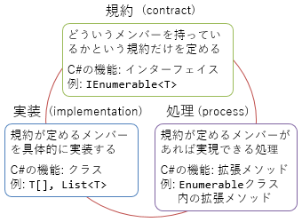

# \[雑記\] 小さな機能の組み合わせ

この記事はソフトウェアデザインに寄稿した内容が元になっています。

> 初出： 技術評論社刊『ソフトウェアデザイン 2016 年 4 月 号 
> 　　　　今すぐ実践できる良いプログラムの書き方 
> 　　　　C#編 言語機能の進化から学ぶ「良いコードの書き方」

##  概要

「[LINQ](sp3_linq.md)」で説明した通り、C#にはLINQ(Language Integrated Queryの略語。リンクと読む)と呼ばれるデータ処理用の機能があります。
LINQは、正確に言うとデータ処理に関連する複数の構文やライブラリの組み合わせを指す言葉です。

「LINQとは何か」については[他のページで](sp3_linq.md)で説明しますが、ここで重要なのは、「組み合わせ」という部分です。小さな機能を組み合わせて大きな目的を実現したり、汎用的な処理を組み合わせて複雑な処理を組み合わせたり、それぞれ別の担当者が書いた小さな部品を組み合わせてシステム全体を構築したり、様々な組み合わせが考えられます。

ここでは、C#でデータ処理を行う上で、「組み合わせ」がどう活きているかという話をしていきましょう。

- [サンプル コード](https://github.com/ufcpp/UfcppSample/tree/master/Demo/2016/GoodCode/src/LinqSample)

##  入力、加工、出力

1つ目は、データ列の入力元と出力先の組み合わせです。少し恣意的な例になりますが、「入力した整数列のうち、奇数のものだけ抜き出して、二乗したものを出力する」という処理を考えましょう。入力元・出力先が固定でいいならそう難しい話ではありません。例えば、コンソールからの入出力で考えると、以下のようになります。

<pre class="source" title="入力から出力までを1つのメソッドで実装する例">
<code><reserved>while (true)
{
    // コンソールから入力
    var line = Console.ReadLine();
    if (string.IsNullOrEmpty(line)) break;
    var x = int.Parse(line);

    // 条件選択
    if ((x % 2) == 1)
    {
        // 値の変換
        var y = x * x;

        // コンソールに出力
        Console.WriteLine(y);
    }
}
</code></pre>

問題は、入力元/出力先はコンソールとは限らないことです。ファイルの読み書きであったり、ネット越しの受け渡しであったり、様々な入出力が考えられます。そのたびに、この例のような類のコードを書くのは非効率で、「奇数のものだけ抜き出して、二乗」という加工する部分だけを切り出して、様々な入出力と組み合わせて使えるようにすべきです。

これは、`IEnumerable<T>`(`System.Collections.Generic`名前空間)を受け取り、`IEnumerable<T>`を返すメソッドを作れば実現できます。[イテレーター](sp2_iterator.md)を使えばそう難しくはありません。以下のような書き方ができます。

<pre class="source" title="入力(Read)、加工(Filter)、出力(Write)の分離">
<code><comment>// コンソールから入力
static IEnumerable&lt;int&gt; Read()
{
    while (true)
    {
        var line = Console.ReadLine();
        if (string.IsNullOrEmpty(line)) break;
        yield return int.Parse(line);
    }
}

// 加工: 条件選択 + 変換
static IEnumerable&lt;int&gt; Filter(IEnumerable&lt;int&gt; source)
{
    foreach (var x in source)
        if ((x % 2) == 1)
            yield return x * x;
}

// コンソールに出力
static void Write(IEnumerable&lt;int&gt; source)
{
    foreach (var x in source)
        Console.WriteLine(x);
}
</code></pre>

これで、下図に示すように、様々な入出力の組み合わせが使えるようになります。

##  汎用処理の組み合わせ

続いては小さな汎用処理の組み合わせで所望の処理を実現することについて考えます。前節の加工処理(サンプル コードの`Filter`メソッド)には、さらに細かく分けると以下の処理が含まれています。

- 条件選択: 奇数だけ取り出す
- 変換: 二乗を計算する

そして、一般に、多くのデータ処理がこの類型に当てはまります。すなわち、何らかの条件を与えて選択を行い、何らかの式に従って変換を行います。

実は、.NETには標準で、条件選択や変換のためのライブラリが含まれています。`Where`メソッドと`Select`メソッド(いずれも`System.Linq`名前空間の`Enumerable`クラスで定義されている[静的メソッド](../oop/oo_static.md))です。

- `Where`: 条件を与えてデータを選択する
- `Select`: 式を与えてデータを変換する

これらの名前は、SQLのキーワードに由来します。この他にも、`Enumerable`クラスには、データ加工用の様々なメソッドが用意されています。

これらを使って前節のコードと同じ処理を書き直すと、(コード中の`Read`, `Write`に対して)以下のような書き方ができます。

<pre class="source" title="汎用処理の組み合わせ">
<code>Write(Read()
    .Where(x =&gt; (x % 2) == 1)
    .Select(x =&gt; x * x)
    );
</code></pre>

ちなみに、`Where`, `Select`は、インスタンス メソッドと同じように`x.Where(...)`というような書き方をしていますが、実際に呼ばれるのは`Enumerable`クラスの`Where`静的メソッドです。これは、[拡張メソッド](../functional/sp3_extension.md)と呼ばれる機能を 使っています。

これで、下図に示すように、汎用処理の組み合わせで所望の処理を実現できます。

##  契約、実装、処理

前節で説明したような`IEnumerable<T>`を中心とした汎用処理には、下図に示すような3つの立場が絡みます。

規約(contract)は、型が持つべきメンバーが何かを定めます。`IEnumerable<T>`の例でいうと、「データ列を得るためには`Current`プロパティや`MoveNext`メソッドが必要」というようなものです。これを定めるのがインターフェイスです。

実装(implementation)は、規約が定めるメンバーをどう実現するかです。同様の例でいうと、「配列やリストなどのクラスは`IEnumerable<T>`を実装しているのでデータ列を列挙できる。列挙の仕方はそれぞれのクラスによって異なる」となります。

そして最後に、この規約に沿えば実現できる処理(process)があります。今回の例でいうと、「`Where`や`Select`など、`IEnumerable<T>`から得られるデータ列を加工して、別の`IEnumerable<T>`を返すメソッドを作る」といったものです。

重要なのは、規約、実装、処理の3つは、それぞれ別の担当者が書く(ということがあるし、そうできるべき)ということです。これに対してありがちなミスは、実装クラス(ここでいう配列やリスト)に処理(ここでいう`Where`や`Select)`を含めてしまうというものです。そうやってしまうと、どんな実装にでも使えそうな汎用的な処理が特定の実装にだけ含まれることになって、組み合わせて使うことができなくなります。組み合わせを増やすために、規約、実装、処理の分離を意識しましょう。

##  文法の組み合わせ

この章の冒頭で「LINQとはデータ処理に関連する複数の構文の組み合わせ」という話をしました。データ処理はプログラミングにおいて重要なテーマの1つですが、それでも、汎用プログラミング言語にデータ処理専用の構文を導入するのはやりすぎでしょう(「汎用」でなくなる)。しかし、それぞれ汎用に使える小さな構文の組み合わせで実現できるなら話は別で、汎用プログラミング言語に導入する価値が高くなります。

詳細はそれぞれのリンク先を見てもらうとして、LINQは以下のような構文の組み合わせで実現されています。これらはすべて、C# 3.0で追加され、データ処理以外のことに対しても有用です。

- [オブジェクト初期化子](../oop/oo_construct.md#member_initializer)
- [ラムダ式](../functional/sp3_lambda.md)
- [拡張メソッド](../functional/sp3_extension.md)
- [変数の型推論(var)](../start/st_variable.md#infer)
- [匿名型](../oop/oo_class.md#anonymous)
